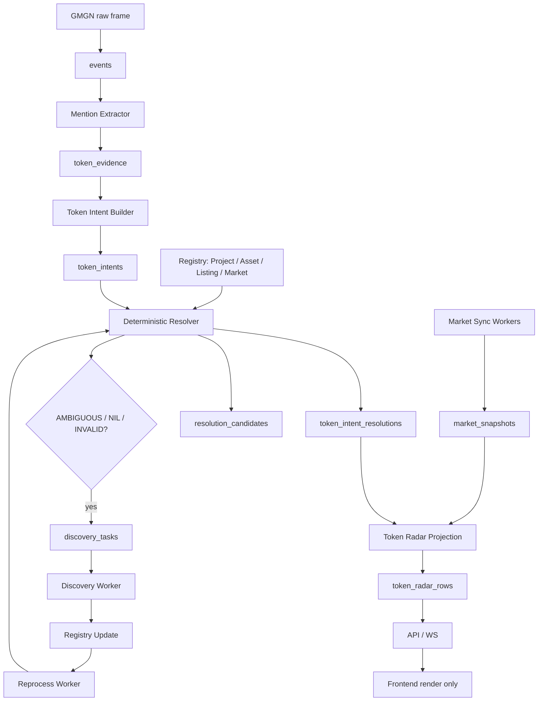

# Token Radar V4: KISS Deterministic Resolver Production Spec

Date: 2026-05-07

Status: hard-cut production spec

Supersedes:

- `docs/2026-05-06-token-identity-resolution-production-spec-cn.md`
- `docs/2026-05-07-token-radar-identity-market-v3-production-spec-cn.md`
- earlier draft of `docs/2026-05-07-token-radar-v4-entity-linking-production-spec-cn.md`

Companion plan:

- `docs/2026-05-07-token-radar-v4-entity-linking-implementation-plan-cn.md`

## Executive Summary

V3 的方向是正确的：Token Radar 的主语已经从 mention-level attribution 切到 event-level token intent，frontend 也不再拥有 decision。但 live 数据仍然暴露出更底层的问题：

- `$MASK`、`$SPACEXAI`、`$PEPE` 这类 symbol-only 文本仍然容易被误当成某个链上资产；
- CEX ticker、DEX token、DEX pool、Project 被混在 `asset + venue` 里；
- `asset_venues` 同时像“可交易 venue”、又像“DEX token contract”、又像“CEX market”，边界太软；
- resolver 还在用候选数量、confidence、alias 表做近似判断；
- price/market snapshot 绑定到 asset/venue，而不是绑定到明确的 Market；
- 解析失败后缺少自动 discovery -> registry update -> reprocess 的闭环。

V4 改成更简单、更可解释的生产架构：

```text
Tweet
-> deterministic mention extraction
-> event token intent
-> deterministic resolver
-> EXACT / UNIQUE_BY_CONTEXT / PROJECT_ONLY / AMBIGUOUS / NIL / INVALID
-> discovery queue for unresolved work
-> registry update
-> re-run resolver
-> market snapshots
-> token_radar_rows
```

核心取舍：

```text
不猜。
能确定就解析。
不能确定就 AMBIGUOUS / NIL。
NIL / AMBIGUOUS 自动进入 discovery 和 reprocess。
```

## What Changes From Earlier V4

Earlier V4 仍然保留了 candidate score 和 threshold 的味道。这个方向容易滑回“流动性最大所以就是它”的错链风险。

本版 V4 改为：

- identity resolution 不使用 ML confidence；
- identity resolution 不用 liquidity 排名强选；
- symbol-only 默认不解析到 Asset；
- 同名 token 只召回候选，不决定 identity；
- market/liquidity 只用于 active filter，不用于在多个合理候选里选一个；
- resolver 输出枚举状态，而不是 0.73/0.86 这种伪精确值；
- discovery/reprocess 是生产闭环的一等模块，不是 ops 补丁。

## Non-Goals

V4 不做这些事：

- 不用 LLM 解析 hot path identity；
- 不做人肉标注闭环；
- 不把多链同 symbol 自动合并成一个 Project；
- 不把 CEX ticker 映射到单一链上 CA；
- 不把 DEX pool 当成 token 本身；
- 不让 frontend 计算或覆盖 Radar decision；
- 不在 API request path 调 provider；
- 不保留 `asset_mentions` / `asset_attributions` / request-time asset-flow 作为 Token Radar runtime；
- 不为了覆盖率强行解析 `$SYMBOL`。

## First Principles

1. Symbol 不是实体，只是召回键。
2. EVM CA 不包含 chain，不能默认 Ethereum。
3. CEX ticker 不是链上 token。
4. DEX pool 是 Market，不是 Asset。
5. DEX token Asset 必须有 `chain + address/mint`。
6. CEX listing 和 CEX market 必须分开。
7. 同名 symbol 只用于候选召回，不用于最终解析。
8. Market/liquidity 可以过滤垃圾候选，不能在多个合理候选里替 resolver 做选择。
9. Resolver 的正确输出包括“不知道”：`PROJECT_ONLY`、`AMBIGUOUS`、`NIL`、`INVALID` 都是正常生产状态。
10. 闭环不是人工标注，而是 discovery + registry update + deterministic reprocess。

## Minimal Domain Model

V4 只保留四类 registry 实体。

| Entity | Meaning | Example |
| --- | --- | --- |
| `Project` | 项目/概念层 | `project:pepe`, `project:wif`, `project:ethereum` |
| `Asset` | 链上资产，必须带 chain + address/mint | `asset:eip155:1:erc20:0x6982...`, `asset:solana:token:<mint>` |
| `Listing` | CEX 上某个 base asset/listing，不指定 quote 或 market type | `listing:cex:binance:PEPE` |
| `Market` | 可交易市场，CEX pair/perp 或 DEX pool | `market:cex:okx:spot:TON-USDT`, `market:dex:eip155:1:uniswap_v3:<pool>` |

### Current Repo Mapping

Current V3 good spine:

- keep `events`;
- keep `event_entities` as span-aware facts;
- keep `token_evidence`;
- keep `token_intents`;
- keep `token_radar_rows`;
- keep `projection_runs/projection_offsets`;
- keep provider adapters under `src/gmgn_twitter_intel/market`.

Current V3 boundaries to replace:

- replace `assets` as catch-all registry with Project/Asset/Listing/Market semantics;
- replace `asset_venues` as production market identity with `markets`;
- replace `asset_market_snapshots` with `market_snapshots` keyed by `market_id`;
- replace `token_intent_resolutions.asset_id + primary_venue_id` as final target with `target_type + target_id`;
- remove `AssetRepository.candidates_for_symbol()` from resolver hot path;
- remove score-based candidate selection from identity resolver.

Migration may read old tables once to backfill V4 registry, but runtime code cannot depend on old tables after the cut.

## ID Design

IDs must encode identity, not display.

```text
Project:
  project:pepe

Asset:
  asset:eip155:1:erc20:0x6982508145454ce325ddbe47a25d4ec3d2311933
  asset:eip155:8453:erc20:0x2cc0db4f8977accadb5b7da59c5923e14328eba3
  asset:solana:token:69PzM2hDa3MCo7cvKPgiPxhr1FdGdMV3S7h6wpRkpump
  asset:ton:jetton:<canonical-ton-address>

Listing:
  listing:cex:binance:PEPE
  listing:cex:okx:TON

Market:
  market:cex:binance:spot:PEPEUSDT
  market:cex:bybit:swap:1000PEPEUSDT
  market:cex:okx:swap:TON-USDT-SWAP
  market:dex:eip155:1:uniswap_v3:<pool_address>
  market:dex:solana:raydium:<pool_address>
```

Rules:

- `project:pepe` does not imply any chain Asset.
- `listing:cex:binance:PEPE` does not imply any chain Asset.
- `market:cex:bybit:swap:1000PEPEUSDT` has a base listing/project and multiplier metadata.
- `market:dex:*:<pool>` has base/quote assets and pool metadata.
- Project merge requires strong evidence, never symbol equality alone.

## Resolution Status

V4 resolver returns one of:

```text
EXACT
UNIQUE_BY_CONTEXT
PROJECT_ONLY
AMBIGUOUS
NIL
INVALID
```

| Status | Meaning | Tradeability |
| --- | --- | --- |
| `EXACT` | 输入含确定 ID：chain+CA, DEX pool URL/address, CEX native market id | tradeable if target is Market or has active Market |
| `UNIQUE_BY_CONTEXT` | 明确上下文过滤后只剩一个候选 | tradeable if target has active Market |
| `PROJECT_ONLY` | 只能确定项目，不能确定链上 asset/listing/market | not tradeable |
| `AMBIGUOUS` | 多个候选都合理，不硬选 | not tradeable |
| `NIL` | 当前 registry 没有命中，需要 discovery | not tradeable |
| `INVALID` | 格式像地址/market，但 parser 或链上校验失败 | not tradeable |

`confidence` 在 identity resolution 中废弃。Radar scoring 可以继续对 heat/quality/propagation/market timing 打分，但 identity status 本身必须是枚举和 reason codes。

## Target Architecture



## Extraction Scope

Extractor remains deterministic. It extracts keys, not identity.

Extract:

- EVM address: `0x[a-fA-F0-9]{40}`, then parser validation;
- Solana mint: base58 candidate, then `solders.Pubkey` validation;
- TON address: maintained TON parser validation;
- cashtag: `$PEPE`, `$WIF`, `$TRUMP`;
- CEX market text: `PEPEUSDT`, `PEPE/USDT`, `TON-USDT-SWAP`, `1000PEPEUSDT`;
- DEX/provider URLs: DexScreener, GeckoTerminal, GMGN, Uniswap, Raydium, Meteora, Pancake, explorer URLs;
- chain hints: `eth`, `ethereum`, `base`, `bsc`, `sol`, `solana`, `arb`, `arbitrum`, `ton`;
- venue hints: `binance`, `bybit`, `okx`, `coinbase`, `uniswap`, `raydium`, `meteora`, `pump`, `pancake`;
- intent hints: `ca`, `contract`, `mint`, `listing`, `listed`, `perp`, `futures`, `pool`, `lp`.

Do not extract:

- suffixes from Solana address text as symbol;
- every uppercase word as ticker;
- stock/crypto identity without registry lookup;
- social hashtags as token identity unless promoted by deterministic rules.

## Deterministic Resolver Priority

Resolver is a fixed decision table.

| Priority | Condition | Output |
| ---: | --- | --- |
| 1 | DEX pool URL / pair address exact match | `Market EXACT` |
| 2 | CEX native market id + exchange | `Market EXACT` |
| 3 | chain hint + valid CA/mint | `Asset EXACT` |
| 4 | CA/mint without chain, valid on exactly one tracked chain | `Asset EXACT` or `UNIQUE_BY_CONTEXT` |
| 5 | CA/mint valid on multiple tracked chains | `AMBIGUOUS` |
| 6 | exchange + base symbol without quote | `Listing UNIQUE_BY_CONTEXT` if one active listing |
| 7 | chain + symbol after active filter | `Asset UNIQUE_BY_CONTEXT` if one active asset |
| 8 | dex + chain + symbol after active filter | `Market` or `Asset UNIQUE_BY_CONTEXT` if one active candidate |
| 9 | symbol maps to exactly one Project | `PROJECT_ONLY` |
| 10 | symbol maps to multiple Projects or active candidates | `AMBIGUOUS` |
| 11 | unknown symbol/address/market id | `NIL` |
| 12 | address/market-shaped text fails validation | `INVALID` |

The resolver must stop at the first applicable priority. It cannot fall through to symbol-only resolution after an exact address or market parse failed validation.

## Active Filter

Active filter removes garbage. It does not rank survivors.

An Asset candidate is active if:

```text
valid chain object
AND valid token interface / mint
AND symbol exact match when resolving symbol
AND status IN ('candidate', 'canonical')
AND not deprecated
AND has market evidence or trusted registry evidence
```

Market evidence can be:

```text
DEX pool exists with liquidity above threshold
OR CEX market/listing exists
OR trusted token registry entry exists
OR sustained transfer/trade activity exists
```

After filter:

```text
0 candidates -> NIL
1 candidate  -> UNIQUE_BY_CONTEXT
>1 candidates -> AMBIGUOUS
```

Forbidden:

```text
pick highest liquidity candidate
pick highest market cap candidate
pick oldest candidate
pick Ethereum by default
pick CEX USDT spot by default
```

## Symbol-Only Rule

Symbol-only never resolves directly to Asset or Market.

Examples:

```text
"$PEPE"
-> PROJECT_ONLY if exactly one Project
-> AMBIGUOUS if multiple Projects
-> NIL if unknown

"new PEPE on Solana"
-> Asset UNIQUE_BY_CONTEXT only if active Solana PEPE candidates filter to one
-> AMBIGUOUS if multiple Solana PEPE candidates survive

"PEPE on Binance"
-> Listing UNIQUE_BY_CONTEXT if Binance PEPE listing exists uniquely
-> NIL if listing unknown

"PEPEUSDT perp on Bybit"
-> Market EXACT if Bybit native market id exists
```

## Project Merge Rules

Project merging is conservative. Two Assets can share a Project only with strong evidence:

- same trusted external canonical ID;
- same official website;
- same official X handle;
- official token list grouping;
- CEX listing deposit networks explicitly map multiple chain assets to one listing;
- provider returns a stable project ID across assets.

Symbol equality is never enough.

## Discovery Queue

Every unresolved or ambiguous resolution creates a discovery task unless an equivalent active task already exists.

Task types:

```text
address_lookup
solana_mint_lookup
ton_jetton_lookup
cex_market_lookup
cex_listing_lookup
dex_pool_lookup
dex_symbol_lookup
project_symbol_lookup
```

Discovery writes registry facts, not final tweet resolutions. Reprocess owns rerunning resolver.

### Unknown EVM Address

For each tracked EVM chain:

```text
check contract exists
check ERC20 interface
read symbol/name/decimals
check transfer activity
check DEX pools and liquidity
write raw/candidate/canonical registry state
enqueue reprocess for affected intents
```

### Unknown Solana Mint

```text
check mint account
check token program
read decimals
read metadata
check pools: Raydium / Orca / Meteora / pump-style venues
check recent trades
write registry state
enqueue reprocess
```

### Unknown CEX Market / Listing

```text
sync exchange instruments
normalize native market ids
detect spot / swap / future
detect base / quote / settle / multiplier
write Listing and Market
enqueue reprocess
```

### Unknown DEX Symbol / Pool

```text
query provider pool registries
search by symbol/address
filter dead or zero-liquidity pools
validate base/quote assets
write Market and Assets
enqueue reprocess
```

## Registry Tiers

V4 uses three logical tiers:

```text
raw
candidate
canonical
```

KISS implementation can store these as `status` / `registry_tier` columns in the same Project/Asset/Listing/Market tables.

Resolver reads only:

```text
candidate + canonical
```

Resolver never reads raw registry rows.

## Market Model

Market snapshots bind to Market, not Asset.

Required market fields:

```text
market_id
market_type          spot | swap | future | pool
venue_type           cex | dex
venue                binance | bybit | okx | uniswap | raydium | ...
chain_id             nullable, required for DEX
pool_address         nullable, DEX pool identity
native_market_id     nullable, CEX native id
base_asset_id
quote_asset_id
base_listing_id
base_project_id
base_symbol
quote_symbol
multiplier
status               raw | candidate | canonical | deprecated
```

Snapshot fields must preserve precision:

```text
price_usd NUMERIC
market_cap_usd NUMERIC
liquidity_usd NUMERIC
volume_24h_usd NUMERIC
open_interest_usd NUMERIC
holders BIGINT
observed_at_ms BIGINT
provider TEXT
```

Market statuses:

```text
ready
stale
pending_refresh
no_market
provider_not_configured
provider_not_found
provider_error
rate_limited
insufficient_history
invalid_identity
```

## Radar Semantics

Radar source remains materialized `token_radar_rows`.

Rows include:

```text
intent
resolution
target
market
attention
score
decision
data_health
source_event_ids
```

Decision caps:

- `EXACT` Market with usable market snapshot can be `driver`;
- `EXACT` Asset with one active Market and usable snapshot can be `driver`;
- `UNIQUE_BY_CONTEXT` target with usable market can be `driver` only if no hard risk;
- `PROJECT_ONLY` is `investigate`;
- `AMBIGUOUS` is `investigate`;
- `NIL` is `investigate`;
- `INVALID` is `discard` or `investigate` by product policy, never `driver`;
- any target without usable market is max `watch`;
- frontend cannot promote a backend decision.

## API And Frontend Contract

Frontend receives backend state and renders it.

Frontend cannot:

- compute identity;
- compute decision;
- convert `PROJECT_ONLY` into tradeable token;
- invent symbol from address suffix;
- collapse market statuses;
- display rounded zero for nonzero micro prices.

Frontend can:

- format values for display;
- sort already-ranked rows inside UI tabs;
- show target type badges: Project, Asset, Listing, Market;
- show reason codes and discovery state.

## Observability

Required diagnostics:

```text
resolution_status_counts by 5m/1h
reason_code_counts
target_type_counts
PROJECT_ONLY rate
AMBIGUOUS rate
NIL rate
INVALID rate
discovery_task_counts
discovery_success_rate
reprocess_success_rate
market_status_counts
address_without_symbol_count
symbol_only_not_tradeable_count
old_runtime_path_import_count
```

Interpretation:

- high `NIL` -> registry/discovery coverage gap;
- high `AMBIGUOUS` -> context extraction gap or real market ambiguity;
- high `PROJECT_ONLY` -> many symbol-only social mentions; do not force tradeability;
- high `INVALID` -> spam or too-wide extractor;
- high `pending_refresh` -> market sync lag;
- high address-only resolved rows -> metadata/provider coverage gap, not UI bug if target has no symbol.

## Required Exit Gates

| Case | Expected |
| --- | --- |
| `$VERSA 0x2cc0db4f8977accadb5b7da59c5923e14328eba3` with Base hint/provider evidence | one intent, `Asset EXACT`, symbol `VERSA`, market state explicit |
| `$MOONCLUB result: 4.1x ... 69Pz...pump Source: SOLANA` | one intent, `Asset EXACT`, Solana mint, display `MOONCLUB` |
| `$PEPE` only | `PROJECT_ONLY` if one Project, else `AMBIGUOUS`; never direct Asset |
| `$MASK` only with stock/crypto collision | `AMBIGUOUS` or stock lane exclusion; never fake crypto Asset |
| `PEPE on Binance` | `Listing UNIQUE_BY_CONTEXT`, not chain Asset |
| `PEPEUSDT perp on Bybit` | `Market EXACT` |
| DEX pool URL | `Market EXACT`, base/quote derived from pool |
| EVM `0x...` no chain, one tracked chain valid | `Asset EXACT` or `UNIQUE_BY_CONTEXT` with reason |
| EVM `0x...` no chain, multiple chains valid | `AMBIGUOUS`, `ADDRESS_EXISTS_ON_MULTIPLE_CHAINS` |
| TON friendly address | parser validated; `Asset EXACT` or `NIL` discovery task |
| Solana address ending `musk` | address stays address; no suffix symbol |
| micro price token | nonzero price preserved through API and UI |
| resolved target without market | max `watch`, never `driver` |
| unresolved hot symbol | `investigate`, discovery task created |
| registry update after discovery | affected intents reprocessed deterministically |

## Definition Of Done

V4 is production-ready when:

- resolver is a deterministic priority table with enum states;
- Project/Asset/Listing/Market are separate runtime concepts;
- `asset_venues` and `asset_market_snapshots` are not used by Token Radar runtime;
- `AssetRepository.candidates_for_symbol()` is not in resolver hot path;
- symbol-only never resolves directly to Asset/Market;
- `discovery_tasks` and reprocess are live and idempotent;
- market snapshots are keyed by `market_id`;
- frontend renders backend decision unchanged;
- 5m live diagnostics can explain every unknown/address-only row by status and reason code;
- all required exit gates have deterministic tests.
