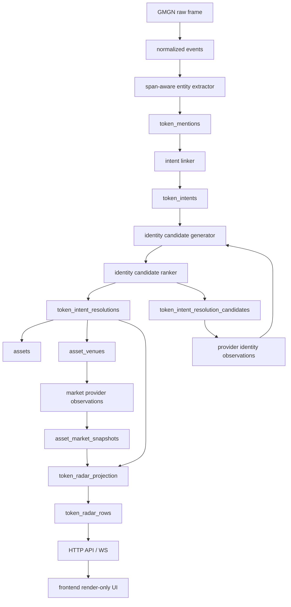

# Token Radar V4: Entity Linking, Venue Mapping, And Market Integrity Production Spec

Date: 2026-05-07

Status: hard-cut production spec

Supersedes:

- `docs/2026-05-06-token-identity-resolution-production-spec-cn.md`
- `docs/2026-05-07-token-radar-identity-market-v3-production-spec-cn.md`

Companion plan:

- `docs/2026-05-07-token-radar-v4-entity-linking-implementation-plan-cn.md`

## Executive Summary

V3 把 Token Radar 的业务主语从 mention/asset attribution 切到了 event-level token intent，这一步方向正确，也已经修掉了前端把 unresolved attention 标成 `driver`、projection 不读 `token_radar_rows`、market snapshot 不入 Radar、地址当 symbol 展示、价格显示粗糙等症状。

但 V3 仍然没有达到生产级 identity linking 标准。最近 5 分钟 live 数据里继续出现 `UNKNOWN ETH`、`$MASK`、`$SPACEXAI`、Solana 地址尾缀被误读、TON 地址缺失、同一 event 里 CA resolved 但 symbol 仍 ambiguous 的残留，本质原因不是某个 if 分支，而是：

- extractor 只产出低阶事实，没有稳定的 mention/linker domain model；
- `token_intent_builder` 把 locality heuristic 和 intent construction 耦在一个模块里；
- symbol-only resolver 仍然直接信任本地 alias 表，缺少 canonical/provider/observed alias 分层；
- exact CA、symbol、多链、stock ticker、TON address、provider observation 没有统一 candidate model；
- market 数据只会展示 snapshot，不会参与 identity candidate audit，也不能解释 provider search 失败；
- asset registry 里真实 asset、provider venue、社交观察 alias 的边界仍然不够硬；
- 投影层只能聚合最终 resolution，无法解释为什么一个候选被选中、被拒绝或保持 ambiguous。

V4 的核心目标是引入成熟的实体链接方法论：

```text
mention detection
-> candidate generation
-> candidate ranking
-> NIL / ambiguous / resolved decision
-> venue market observation
-> Radar read model
```

这不是引入复杂 ML。V4 的生产做法是 KISS：用确定性链地址解析器、provider registry、canonical alias、market/liquidity 辅助排序和可审计阈值，替代“看到 symbol 就强选一个 asset”的半成品路径。

## Non-Goals

V4 不做这些事：

- 不在 hot path 用 LLM 决定 token identity。
- 不把多链同 symbol 合并成一个 asset。
- 不用市值、holder、liquidity 把两个不同合约合并。
- 不让 frontend 计算 Radar decision。
- 不在 HTTP request path 调 provider。
- 不把 unresolved/ambiguous 写成 fake asset。
- 不把股票 cashtag 放进 crypto Token Radar。
- 不继续维护 mention-level attribution compatibility path。

## First Principles

1. Mention 是文本事实，不是交易对象。
2. Intent 是一个 event 中作者表达的 token subject，是 Radar 的最小业务主语。
3. Asset 是链无关或交易所无关的 canonical identity；venue 是可交易实例。
4. DEX token 的可交易实例由 `chain + contract address` 定义。
5. CEX instrument 的可交易实例由 `exchange + inst_type + inst_id` 定义。
6. Symbol 是 alias，不是 identity。
7. 多链同 symbol 默认不是同一个 token。
8. Market/holder/liquidity 是 candidate ranking evidence，不是 identity proof。
9. 股票 ticker 和 crypto cashtag 共享 `$` 表面语法，但不共享 resolver。
10. 系统宁可 `ambiguous` 或 `unresolved`，也不能错误 resolved。

## Target Architecture



V4 的边界变化：

- `entity_extractor.py` 只负责事实发现和 span；
- `token_evidence_builder.py` 只把事实投影成 token mention evidence；
- 新增 `token_intent_linker.py`，专门负责同一 event 内的 mention pairing；
- 新增 `identity_candidate_resolver.py`，统一 exact CA、symbol、provider、stock/crypto 分流；
- `token_intent_resolver.py` 只保存最终 decision，不直接查散乱 alias；
- `asset_repository.py` 只存真实 registry，symbol query 必须按 alias scope 过滤；
- `market_repository.py` 负责 provider observations 和 snapshots；
- `token_radar_projection.py` 只读 intent resolution + venue market snapshot；
- frontend 只渲染 `token_radar_rows` 的 JSON。

## Domain Model

### Token Mention

Token mention 是文本事实的 token 化投影。

Required fields:

```text
mention_id
event_id
surface                       primary | reference | payload
mention_type                  ca | cashtag | provider_url | chain_hint | stock_ticker
raw_value
normalized_symbol
normalized_address
chain_hint
asset_class_hint              crypto | stock | unknown
span_start
span_end
sentence_id
segment_id
source_kind                   entity | gmgn_payload | url | provider_payload
source_id
confidence
created_at_ms
```

Rules:

- EVM、Solana、TON 地址必须在 extractor 阶段通过成熟 parser 校验。
- Solana 地址尾缀如 `pump`、`musk`、`sol` 是地址字符的一部分，不能作为 symbol。
- `0x...` 无链时 `chain_hint=NULL`，不能默认为 ETH。
- `$AAPL`、`$TSLA`、`$MASK` 先进入 cross-asset candidate set，不直接进入 crypto resolved。
- GMGN payload 是强 evidence，`surface=payload`。

### Token Intent

Token intent 是一个 event 里的 token subject。

Required fields:

```text
intent_id
event_id
intent_key
construction_policy
primary_mention_id
display_symbol
display_name
asset_class_hint
chain_hint
address_hint
intent_status                  pending | linked | ambiguous_mentions | invalid
intent_confidence
linking_reasons_json
linking_risks_json
created_at_ms
updated_at_ms
```

Rules:

- 一个 event 里同一个 token subject 只能生成一个 intent。
- 一个 intent 可以有多个 mention evidence，但必须有一个 primary mention。
- 单 symbol + 单 CA 同 surface 必须合并，即使中间有 `4.1x`、`90K -> 371K` 这类标点和指标。
- 多 symbol + 多 CA 只允许 reciprocal nearest pairing；不满足就保持 `ambiguous_mentions`。
- reference tweet 和 primary tweet 默认分开 linking；payload evidence 可覆盖 primary display metadata。

### Identity Candidate

Identity candidate 是 resolver 对一个 intent 的可审计候选。

Required fields:

```text
candidate_id
intent_id
asset_id
venue_id
asset_class                   crypto | stock
candidate_kind                exact_ca | provider_exact_ca | canonical_symbol | provider_symbol | cex_instrument | stock_ticker
candidate_source              local_registry | gmgn | okx | exchange_symbol_directory
score
score_components_json
decision                      selected | rejected | retained
reasons_json
risks_json
raw_observation_id
created_at_ms
```

Rules:

- exact CA with chain 只能产生一个 crypto DEX venue candidate。
- exact CA without chain 先查 local exact address；如果跨链多 venue，保持 ambiguous 并给 `chain_required_for_exact_ca`。
- symbol-only 只能从 canonical/provider alias 生成候选；observed/social alias 只能作为 weak evidence。
- provider exact CA hit 可以创建真实 asset/venue。
- provider symbol search 只能产生 candidate，不能直接写 resolved，除非通过 ranking hard gate。

### Asset And Venue

Asset registry 只保存真实对象。

Required asset properties:

```text
asset_id
asset_type                    crypto_token | cex_instrument_group | stock_instrument
canonical_symbol
display_name
identity_status               resolved
primary_source
confidence
created_at_ms
updated_at_ms
```

Required venue properties:

```text
venue_id
asset_id
venue_type                    dex | cex | stock_exchange
provider
exchange
chain
address
inst_type
inst_id
base_symbol
quote_symbol
is_active
confidence
created_at_ms
updated_at_ms
```

Rules:

- `asset:unresolved:*` 和 `asset:ambiguous:*` 不允许存在于 registry。
- `asset_aliases` 必须有 `alias_scope`：
  - `canonical`: project-owned curated alias；
  - `provider`: provider-confirmed alias；
  - `observed`: social text alias, not resolvable by itself。
- `candidates_for_symbol()` 必须过滤 `alias_scope IN ('canonical', 'provider')`。
- stock asset 不进入 crypto Token Radar lane。

## Mature Entity Linking Algorithm

V4 采用标准 entity linking pipeline，但保持 deterministic。

### Step 1: Mention Detection

Extract:

- EVM CA: `eth_utils.is_address()` + checksum normalization。
- Solana CA: `solders.Pubkey.from_string()`。
- TON CA: maintained TON address parser；friendly/raw address 均归一化。
- Cashtag: `$[A-Z0-9_]{1,20}`，保留 span。
- URL: explorer/provider URLs 提供 chain/address hint。
- Chain hint: explicit local hint only，例如 explorer host、`on base`、`bsc`、`ethereum`、`SOLANA`。
- Stock ticker: only after exchange symbol registry match。

### Step 2: Candidate Generation

Input is one intent, not one mention.

Rules:

- `address_hint + chain_hint`: generate exact venue candidate。
- `address_hint without chain_hint`: local exact address candidates, then provider exact address observations。
- `display_symbol only`: generate canonical/provider crypto aliases and stock ticker candidates separately。
- `gmgn_payload`: generate provider payload candidate with strongest evidence。
- `cex pair text`: generate CEX venue candidate only when text or payload includes exchange/instrument evidence。

### Step 3: Candidate Ranking

Score components are intentionally small and explainable:

```text
score =
  evidence_strength
+ address_specificity
+ chain_specificity
+ canonical_alias_match
+ provider_confidence
+ venue_tradeability
+ market_liquidity_signal
+ social_context_signal
- ambiguity_penalty
- stale_registry_penalty
```

Hard gates:

- `exact_ca + chain` selected with confidence `1.0` if parser validates and venue can be created or found.
- `exact_ca without chain` selected only when local/provider exact result has one active chain venue.
- symbol-only selected only when:
  - top candidate score >= `0.85`;
  - margin over second candidate >= `0.20`;
  - candidate alias scope is `canonical` or `provider`;
  - stock/crypto ambiguity is absent or resolved by explicit context.
- market/liquidity components may add at most `0.12`; they cannot override exact address conflict.
- top candidate below threshold returns `unresolved`.
- top candidate margin below threshold returns `ambiguous`.

### Step 4: NIL / Ambiguous / Resolved Decision

Resolution states:

```text
resolved
ambiguous
unresolved
invalid
```

Resolution reasons must be machine-readable:

```text
exact_ca_with_chain_hint
local_exact_ca_match
provider_exact_ca_match
single_canonical_symbol_candidate
single_provider_symbol_candidate
multiple_local_ca_matches
multiple_symbol_candidates
stock_crypto_symbol_collision
ton_address_parser_rejected
provider_resolution_pending
provider_not_configured
provider_not_found
chain_required_for_exact_ca
```

## Chain And Asset-Class Requirements

### EVM

- `0x...` is EVM address, not ETH identity.
- Chain comes from explorer URL, explicit local hint, GMGN payload, or provider exact lookup.
- If the same address exists on multiple chains locally, no-chain mention is ambiguous.
- Address-only row display must prefer provider/canonical symbol; if missing, UI shows short address with `symbol=null`, never `UNKNOWN ETH` as a fake symbol.

### Solana

- Use `solders.Pubkey` validation.
- Do not strip semantic suffixes from base58 addresses.
- `.pump` style URLs or text may become provider/source hint only when URL parser explicitly recognizes them.
- A Solana CA plus cashtag in the same surface is one intent when single-single or reciprocal nearest rules pass.

### TON

- Use a maintained TON address parser, not regex-only matching.
- Support friendly and raw TON addresses.
- Persist canonical TON address string in venue.
- Market provider lookup must carry `chain=ton`.
- If provider cannot map TON address to market, identity may still be `resolved` while market is `provider_not_found` or `pending_refresh`.

### CEX

- CEX symbols require exchange/instrument evidence.
- `$TON` alone can resolve to OKX spot only if canonical/provider registry has a single high-confidence CEX instrument and crypto DEX candidates do not compete above threshold.
- `TON-USDT` and `TON-USDT-SWAP` are distinct venues under the same or related asset group.

### Stocks

- `$AAPL` is a cashtag but not a crypto token.
- Stock ticker resolution uses exchange symbol directory data, not crypto alias table.
- Stock candidates are persisted separately and excluded from crypto Token Radar output.
- If a symbol exists as both stock and crypto and no context disambiguates, crypto Token Radar shows `ambiguous` or excludes the row by product policy.

## Market Model

Market availability must be diagnosable.

Required statuses:

```text
ready
stale
pending_refresh
no_venue
provider_not_configured
provider_not_found
provider_error
rate_limited
insufficient_history
invalid_identity
```

Rules:

- `no_venue` means identity is not resolved to a tradeable venue.
- `pending_refresh` means venue exists and a market job is due or running.
- `provider_not_found` means provider returned a true miss for a specific venue/request key.
- `provider_error` and `rate_limited` must include provider and error code in observation audit.
- Price and market cap storage must not lose precision. Repository boundaries should accept decimal/string payloads and convert only at API/display boundary.
- Frontend price formatting is presentation logic; backend market numeric integrity is source-of-truth.

## Radar Projection

`token_radar_rows` remains the sole read model for `/api/asset-flow`.

Grouping rules:

- resolved lane groups by `asset_id + primary_venue_id` unless product policy explicitly groups CEX venues under one asset.
- attention lane groups by `intent_id`, not symbol text.
- one event-intent contributes once per window.
- ambiguous symbol rows never merge with resolved CA rows unless the linker created one intent before resolution.

Decision rules:

- unresolved/ambiguous => `investigate`。
- resolved with `no_venue` => `investigate`。
- resolved with `pending_refresh` => max `watch`。
- resolved with `provider_error/rate_limited/provider_not_found` => max `watch` and explicit hard risk。
- only resolved + venue + market `ready/stale` can be `driver`。

## API And Frontend Contract

Frontend receives:

```text
intent
asset
primary_venue
attention
resolution
market
score
decision
data_health
```

Frontend rules:

- No opportunity scoring in `web/src/App.tsx`。
- No decision override.
- `investigate` is a first-class decision.
- `symbol=null` is valid and should render short address plus chain/venue.
- Market price display may format small decimals, but raw `price_usd` must remain available.

## Compatibility Removal

V4 removes these from Token Radar runtime:

- mention-level `asset_mentions`/`asset_attributions` read path；
- fake unresolved/ambiguous assets；
- symbol resolver over observed/social aliases；
- request-time Radar SQL over raw attributions；
- frontend-derived decision；
- old token-only market/outcome path for Radar signals。

Existing tables may remain only as migration archives or debug-only queries. They cannot be imported by API, WS, projection, notification, or outcome code paths serving Token Radar.

## Required Exit Gates

These cases must pass before V4 is considered production-ready:

| Case | Expected outcome |
| --- | --- |
| `$VERSA 0x2cc0db4f8977accadb5b7da59c5923e14328eba3` | one intent, Base venue resolved, display symbol `VERSA`, market status explains venue snapshot state |
| `$MOONCLUB result: 4.1x ... 69Pz...pump Source: SOLANA` | one intent, Solana venue resolved, display symbol `MOONCLUB` |
| `$SPACEXAI` only | ambiguous or unresolved, not driver |
| `$MASK` only | stock/crypto ambiguity or unresolved, not fake crypto resolved |
| `0x...` no chain and multiple local chains | ambiguous with `chain_required_for_exact_ca` |
| `0x...` no chain and one local venue | resolved via `local_exact_ca_match` |
| TON friendly address | extracted as TON CA and routed to TON venue |
| Solana address ending `musk` | address display fallback, no suffix symbol |
| `$AAPL` | stock instrument path, excluded from crypto Token Radar |
| micro price token | API preserves decimal precision; UI does not display `$0` unless true zero |
| market missing for resolved venue | max `watch`; never `driver` |
| unresolved attention heat spike | `investigate`; never `driver` |

## Production Observability

The runtime must expose:

- counts by `identity_status` over 5m/1h；
- counts by resolution reason；
- unresolved/ambiguous top symbols；
- provider observation status counts；
- market snapshot freshness by provider/chain；
- percentage of Radar rows with `symbol=null` but `asset_id` resolved；
- count of stock candidates excluded from crypto lane；
- count of intent linker ambiguous pairings。

These metrics make future failures explainable. The expected debugging question is no longer “why did symbol not show?”, but:

```text
Was there a validated address?
Was there a chain?
Was there a canonical/provider alias?
Were there multiple candidates?
Did provider return a true miss?
Was there a venue snapshot?
Did the UI render backend state without overriding it?
```

## Definition Of Done

V4 is done when:

- all exit gates pass as deterministic tests；
- live 5m data can explain every `UNKNOWN`/address-display row through resolution reasons；
- provider misses and market misses are distinguishable；
- no Token Radar runtime code imports old attribution read path；
- frontend renders backend `decision` unchanged；
- Docker runtime after rebuild reports projection source `token_radar_rows` and version `token-radar-v4`；
- a 5m production pull shows unresolved rows are explainable as true no-candidate, true ambiguity, provider pending, or stock/crypto exclusion。
