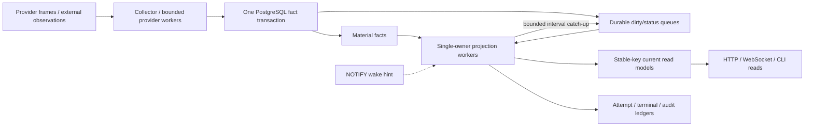

# Parallax 后端 Kappa/CQRS 与 Worker 全链路审计

日期：2026-07-13  
范围：`src/parallax/**/*.py`、后端/worker 配置与组装、PostgreSQL migration、相关架构/单元/集成测试  
逐文件证据：[backend-kappa-cqrs-file-ledger-2026-07-13.md](../generated/backend-kappa-cqrs-file-ledger-2026-07-13.md)

## 结论

本轮不是只做文档审查，而是按 KISS 对当前运行链做了 hard cut。审计覆盖当前树中
641 个后端 Python 文件、145,000+ 行 Python、26 个 worker manifest 和 183 个历史
Alembic migration。修复后，当前主链满足以下结构性约束：

- PostgreSQL material facts 是业务真相；provider frame、运行时间和 worker attempt 不再被用来补造事实。
- 当前 read model 由 manifest 声明的单一 worker 写入，使用稳定产品/窗口身份；不变 payload 零 serving-row 写入。
- dirty/status queue 以持久化 claim、lease、attempt 和 terminal ledger 驱动；`NOTIFY` 只负责唤醒，worker 始终保留有界 interval catch-up。
- API、WebSocket 和 CLI 读取 PostgreSQL 事实/当前投影，不在读路径调用 provider，也不成为第二写者。
- 缺失身份、来源时间、JSON shape、resolver 结果或数据库 rowcount 时 fail closed，不再恢复为空值、运行时间或兼容别名。

在本机可执行的静态、架构和单元门禁已验证；需要真实 PostgreSQL 的 migration/integration
门禁因 `127.0.0.1:55432` 不可达而没有被伪装成通过。迁移 SQL、Alembic 单 head 和生成
schema 已做静态核对，部署前仍必须在 PostgreSQL 环境执行最终 migration/integration gate。

## 审计方法与证据边界

1. 读取项目总架构、worker 生命周期、可靠性、测试和全部领域 `ARCHITECTURE.md`。
2. 从 Git 跟踪文件生成逐文件 ledger：角色、领域依赖、静态 SQL 表、内部入/出依赖、LOC、内容指纹。
3. 从 `worker_manifest.py` 反向核对 runtime factory、Settings、默认配置、operator 配置、事实/缓存/读模型/控制表分类、唯一 writer 和 wake channel。
4. 沿“输入 → 事实事务 → dirty queue → projection → current read model → API/WS/CLI”逐段检查失败、重放、无变化、漏 wake 和 poison-row 行为。
5. 用 import/引用搜索、运行时组装和行为测试共同判定死代码；历史 migration/已完成 SDD 只作为审计历史，不误删为运行时兼容代码。

逐文件 ledger 是机械覆盖证据，不声称 AST import 能识别动态注册或 SQL callback；这些部分由
manifest、factory、repository SQL 和行为测试补足。

## 修复后的主链

状态分类采用四类，避免把所有 PostgreSQL 表都叫“事实”：

| 类别 | 语义 | 典型表 |
|---|---|---|
| Material facts | 可审计业务真相，运行投影不得反写 | `events`, `token_intents`, `token_intent_resolutions`, `market_ticks`, `enriched_events`, `news_items`, `macro_observations` |
| Input/cache state | provider 观察或可刷新缓存，不是业务真相 | `raw_frames`, `news_provider_items`, `asset_profiles`, `token_image_assets` |
| Derived read models | 可从事实重建，稳定键、唯一 writer、无变化零写 | `token_radar_current_rows`, `token_profile_current`, `pulse_candidates`, `news_page_rows`, `notifications` |
| Control/audit state | claim、lease、attempt、publication、side effect 和人工处理账本 | `*_dirty_targets`, `*_jobs`, `projection_runs`, `worker_queue_terminal_events`, `notification_deliveries` |

## 高风险问题与修复

### 1. Token Radar selected resolution 在私有缓存边界丢失

原链路在 `_project_group()` 已得到正式 intent/resolution，但
`token_radar_target_features` 只保存来源 id；rank refresh 随后按 `target_id` 合成
`EXACT/NIL`，把 reason/candidate/lookup 清空，并在来源缺失时用 identity/intent 合成
provenance。这会让 resolver 事实在 serving row 中失真。

修复：

- 私有 target-feature cache 新增必填 `intent_json` 和 `resolution_json`。
- writer 验证 selected intent/event、resolution status 和 resolver list 字段，并要求正式来源事件。
- rank refresh 原样读取 selected payload，验证 intent/event 属于来源列表；删除全部身份、事件、resolution 合成 fallback。
- 删除 `_project_group()` 中从未持久化、含运行时间的瞬态 `row_id`。
- `20260713_0183` 从正式 intent/resolution facts 为现有私有 cache 回填两列后设为
  `JSONB NOT NULL`，不清空 cache、不截断 serving board；再从完整 feature cache 与 current rows
  的身份并集投递 repair dirty targets，让 interval catch-up 重算内容。

### 2. Ingest 原子性存在 orphan registry 风险

registry identity 准备和 event/intent/resolution/fan-out 过去不完全处于同一事务，后段失败可能留下
无法由已提交 event 解释的 registry 状态。现已把 registry preparation、resolution、material facts
和 source-dirty fan-out 放进同一 unit of work；任何后段失败整体回滚。

### 3. Profile/Capture projection 可被单条 poison row 拖累

Token Profile Current 与 Token Capture Tier 原先存在批量 source/admission/upsert 失败导致整批错误，
以及事务回滚后统计仍报告写入的风险。现在：

- claim 先持久提交；正常路径批量读取 persisted sources，若 batch decoder 失败则自动降级为逐 target
  精确读取来隔离坏行；admission、projection 和完成状态仍按 target 独立提交，因此单 target 的
  source 解析失败不会终态化合法 peer。
- 单条 admission、projection、upsert 或 stale completion 只重试/终态化该 claim。
- malformed profile claim 在 source batch 前隔离，不再把合法 peer 一起标错。
- `rows_written`、ready/missing/source/provider 等统计只在事务提交后合并。
- retry/max-attempt 来自正式 worker settings；耗尽时删除 dirty row 并写
  `worker_queue_terminal_events`，不无限热循环。

### 4. Wake 配置存在双重真相

`wakes_on` 曾同时存在于 worker manifest、Settings/default YAML、operator YAML 和 factory fallback。
现已 hard cut 为 `worker_manifest.py` 唯一真相：factory/ops 直接读取 manifest，interval-only worker
不构造 waiter，空 channel 被拒绝。真实 operator 文件 `~/.parallax/workers.yaml` 中五个旧
`wakes_on` 字段也已删除；secret 未输出。

### 5. Queue health 会把坏数据报告成 idle，并混合两种终态计数

聚合 metric 缺失、布尔、负数或非整数现在返回 `adapter_query_failure`，不再被 `or 0` 掩盖。
source table 的 `dead/failed/expired` 能在 terminal ledger 缺失时阻塞健康状态。

同时，source current-state terminal 数和 append-only terminal ledger 数被明确作为两个独立观察：
`source_terminal_count`、`terminal_count`、`unresolved_terminal_count` 分别保留；不再用
`max()` 或 cardinality subtraction 冒充 identity union。没有 queue-specific identity join 时，
健康状态保守叠加 source terminal 与 unresolved ledger 两类 blocking signal，并明确允许观察重叠。

### 6. Pulse outcome 是无运行时读写者的死表

删除未使用的 `upsert_playbook_outcome()` 后，`pulse_playbook_outcomes` 只剩历史 migration/schema
文本，没有运行时 reader/writer。`20260713_0183` 删除该表，并删除 snapshot 中恒为 `pending`、
没有 reader 的 `outcome_status` 列；Pulse run outcome 继续由正式 run audit ledger 承担，playbook
snapshot 只保留当前派生状态需要的字段。

## 各领域链路审计结果

| 领域 | 当前真相/输入 | 唯一投影或副作用 owner | 本轮关键收口 |
|---|---|---|---|
| Ingestion / Evidence | raw frame → event/entity/token facts | collector + ingest transaction | registry/fact/dirty fan-out 原子提交；provider raw 不作事实 |
| Asset Market | market ticks、identity evidence、provider profile cache | market/profile/capture-tier workers | poison 隔离、终态化、提交后统计；profile/cache 正确分类 |
| Token Intel | intents/resolutions/identity current | Token Radar projection | selected resolution/provenance 全程保真；stable key、strict current JSON |
| Pulse Lab | Radar current + evidence packet | Pulse Candidate worker | dirty claim 失败终态化；删除 outcome writer/table；snapshot 零变化零写 |
| Narrative | Radar/source facts | Narrative Admission worker | 删除 digest 兼容 helper；source watermark/维度 fail closed |
| News | provider observations → canonical news facts | fetch/process/brief/page/quality workers | canonical identity 单路径；删除参数别名；reservation/audit 异常不伪装 backpressure |
| Macro | macro observations | sync/view/daily brief workers | 删除隐藏 batch cap；事务内 dirty enqueue；非法状态 fail closed |
| CEX | Binance observations/series | OI Radar worker | finite 数值和正式 symbol/market 身份；删除 multiplier alias；API identity 400 |
| Notifications | upstream facts/current rows | rule worker + delivery state machine | `notifications` 正确归类为 read model；source id/time 严格；DB 错误不吞 |
| Account / Watchlist | persisted account/event facts | backfill/current repository | Account Quality no-op 零写与真实 rowcount；Watchlist JSON/identity/time fail closed |

## KISS 删除清单

删除 12 个无当前运行消费者的 production 文件和 2 个只覆盖已删实现的测试文件，包括：

- 未被任何 projection 使用的通用 `CurrentReadModelPublisher`。
- 未被运行时使用的 market field helper、Catalyst ranking service、CoinGecko search adapter。
- 仅转发类型、没有调用者的 Account/News/Notifications/Watchlist `interfaces.py`。
- 空 package router，以及 Narrative 空 prompt/query package 文件。
- 对应 CoinGecko/Catalyst tests、Pulse outcome tests，以及大量只证明“已删除符号不存在”或重复
  manifest/compatibility 约束的脆弱测试。

保留的测试以可观察行为为准：事务回滚、单 claim poison 隔离、stable payload no-op、terminal
transition、严格 row shape、唯一 writer 和 missed-wake catch-up。历史 migration 与已完成 SDD
仍保留，因为它们是 schema/audit 历史，不是运行时 compatibility branch。

## 兼容性与部署影响

这是有意的 hard cut，不保留旧 runtime 配置或私有 cache shape：

- `wakes_on` 不再接受 worker YAML override；部署配置应通过 `uv run parallax config` 验证。
- CEX `multiplier`、News `raw_payload_json` 等旧别名不再接受。
- Token Radar 0183 migration 会从正式 facts 回填并保留完整私有 target-feature cache，避免分批
  重建期间发布截断榜单；随后把 feature/current identity 并集放入 durable repair queue，worker
  会按正式 batch/interval 有界追赶。
- 若需立即完成全部窗口/范围，可在迁移后按正式运维边界运行
  `uv run parallax ops rebuild-token-radar --window <5m|1h|4h|24h> --scope <all|matched> --limit <N>`；
  这只是加速持久化 queue 的 catch-up，不引入运行时 broad scan。
- `pulse_playbook_outcomes` 被删除；任何外部私有 SQL 消费者必须停止依赖该非产品表。

## 验证记录

最终门禁：

- Alembic：单一 head `20260713_0183`。
- SDD：work index 已重新生成，artifact validator 与 freshness check 通过。
- `make check`：通过；Ruff、Ruff format、mypy（641 个 source files）、前端 typecheck/ESLint/
  architecture/Prettier、Python compileall 全绿。
- Python unit + architecture + contract 组合：`8201 passed, 2 skipped`；其中完整 architecture
  为 `1344 passed`，完整 unit 单跑为 `6845 passed, 1 skipped`，contract 为
  `12 passed, 1 opt-in skipped`。
- 前端 architecture：`179 passed`。
- `uv run parallax config`：成功，运行路径为 `~/.parallax/config.yaml` 与
  `~/.parallax/workers.yaml`；operator `wakes_on` 字段为 0。
- PostgreSQL 关键 integration 尝试：83 项全部在 setup 阶段被同一环境条件阻断——测试端口
  `127.0.0.1:55432` 不可达；没有业务断言失败，也不能算 integration 通过。

## 剩余风险

代码层面不保留已知高风险 blocker。剩余风险是环境验证而非兼容代码：

1. 在真实 PostgreSQL staging 执行 `upgrade head`，核对 0183 的 dirty-target seed、私有 cache 重建、
   Pulse 死表删除和 `docs/generated/db-schema.md`。
2. 运行完整 integration/worker missed-wake/rollback 测试，并同时观察 source-terminal 与 terminal-ledger 指标。
3. 首次部署观察所有 Token Radar window/scope 的 publication ready 状态；在 repair queue 清空前
   不要把 migration 完成误判为投影 catch-up 完成。
