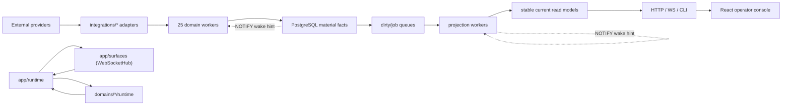
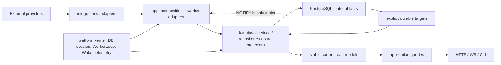

# Parallax 后端 KISS / Kappa / CQRS 深度架构审计

> 审计快照：`main@8f00c551`，2026-07-21。  
> 范围：`src/parallax`、后端测试与架构治理文档、当前 Docker PostgreSQL 和只读运行指标。  
> 本轮只生成审计与方案，不修改业务代码、数据库或真实环境，不运行 E2E。

## 结论先行

当前方向不是错的：以 PostgreSQL material facts 为业务真相、稳定键 current read model、单写者、`NOTIFY` 只作 wake hint、数据库 catch-up 和外部 I/O 离开事务，这些都是正确且值得保留的 Kappa/CQRS 边界。

当前复杂度的主因也不是“领域太多”，而是同一不变量被运行时、配置、manifest、文档和源码字符串测试反复证明；多个没有独立消费者、成本或生命周期的中间投影又被实现成独立 worker、表、队列和状态机。结果是：

- 业务主干被 25 个 worker、79 张表、287 个索引、数套状态控制面包围；
- 配置已经由 Pydantic 校验，worker 和 repository 仍重复做内部类型、正数、事务和 rowcount 防御；
- `worker_manifest.py` 既是运行时注册表，又是架构文档、数据所有权模型和第二套类型系统；
- readiness 把“进程能否服务”和“所有数据产品都完全新鲜”混为一谈；
- append-only 运维账本没有保留上限，`projection_runs` 已达 6,791,437 行、约 3.74 GB；
- News、Macro、Narrative、Account Quality 中存在可以删除或合并而不损失当前业务语义的完整链路。

建议的目标不是重写，也不是再造一个通用框架，而是一次有顺序的 hard cut：

1. 保留 20 个有独立生命周期的核心 worker；默认删除或合并 5 个。
2. 先确认删除 9 张无独立业务真相的表；Account Quality 和 CEX 决策后再删 3～6 张。
3. 删除通用 projection ledger、重复状态控制面和内部兼容防御。
4. 把事务所有权提升到 application service / worker，一处验证，repository 不再支持 `commit=True/False` 双模式。
5. 恢复单向依赖：`platform kernel <- domains <- app composition/surfaces`。
6. 将 30,814 LOC 的架构测试缩成少量语义不变量、AST 边界和行为测试，不再锁死私有写法。

保守目标是在不删除真实业务能力的前提下，减少约 4,500～7,000 LOC 生产 Python、12,000～20,000 LOC 治理/测试代码；若按当前真实环境删除空置的 CEX 产品面，收益还会更高。

完整逐文件静态导航见 [backend-file-architecture-map-2026-07-21.md](backend-file-architecture-map-2026-07-21.md)。

## 1. 审计基线

### 1.1 代码与治理规模

| 范围 | 文件 / 模块 | LOC | 判断 |
|---|---:|---:|---|
| `src/parallax` Python | 580 | 126,424 | 当前认知面过大 |
| 当前运行时代码（排除历史迁移） | 396 | 105,589 | 应作为主要减法范围 |
| `domains` | 272 | 81,639 | News/Macro/Token 占主体 |
| `app` | 71 | 14,549 | runtime/status/CLI 明显偏重 |
| `platform` | 205 | 24,808 | 含 184 个迁移 |
| `integrations` | 29 | 5,418 | 主要是 provider adapter |
| Alembic 历史 | 184 | 20,835 | 是升级历史，不等于当前运行时设计 |
| 全部后端测试 | 369 | 172,742 | 测试代码大于生产代码 |
| `tests/architecture/test_*.py` | 43 | 30,814 | 42 个模块读取源码，818 次 `read_text` |
| 四份核心架构/worker 文档 | 4 | 4,447 | 大量重复同一 worker 不变量 |

架构测试中约有 1,012 次 `source = ...`、611 次 `in source` / `not in source` 检查。最大的三个文件分别约 4,679、4,607、3,856 LOC。它们大量验证私有 helper 名称、错误字符串、调用顺序和具体源码片段，已经从“架构边界”退化为实现冻结器。

### 1.2 当前真实数据库

本轮只读快照：

| 指标 | 当前值 |
|---|---:|
| 数据库总大小 | 73,555,015,359 bytes（PostgreSQL 显示约 69 GB） |
| public 表（含 partition parent/child） | 79 |
| public 索引 | 287 |
| worker | 25 |

最大关系：

| 关系 | 总大小 | `pg_class.reltuples` 估算 | 架构含义 |
|---|---:|---:|---|
| `events` | 约 24 GB | 约 445 万 | 规范化事实内仍重复两份 JSON |
| `market_ticks_default` | 约 15 GB | 约 685 万 | 主要 material market facts，需保留 |
| `raw_frames` | 约 11 GB | 约 782 万 | immutable provider input，需保留 |
| `event_entities` | 约 3.86 GB | 约 428 万 | material entity facts |
| `projection_runs` | 约 3.74 GB | 精确 6,791,437 | 无业务消费者的通用运维账本 |
| `token_intent_resolutions` | 约 2.92 GB | 约 141 万 | material identity resolution facts |
| `token_radar_target_first_seen` | 约 598 MB | 约 18 万 | 可疑索引/更新成本，尚不能直接删除 |
| `news_projection_dirty_targets` | 约 56 MB | 当前 0 行 | 高 churn 后的空队列物理成本 |
| `worker_queue_terminal_events` | 约 440 MB | 约 16.5 万 | 有恢复价值，但必须有 retention |

注意：容器重启后的 `pg_stat_user_tables.n_live_tup` 是当前统计窗口，不是总行数。本报告只把精确 `COUNT(*)` 或 `pg_class.reltuples` 明确标注后使用，不再混淆两种口径。

### 1.3 Signal Pulse 状态

当前非迁移运行时代码已无 Signal Pulse 引用。`20260721_0184_signal_pulse_hard_delete.py` 已删除 12 张 Pulse 表及相关 notification/terminal 状态。

剩余 Pulse 文本只存在于：

- 已部署数据库必须能重放的 Alembic 历史；
- 历史审计/SDD 文档；
- 防止旧产品返回的迁移 tripwire。

不要直接删除 184 份迁移历史。只有先定义最低支持 schema 版本、制作并验证 baseline migration 后，旧链才可以归档；这与保留运行时兼容代码是两件不同的事。

## 2. 第一性判断标准

每一张表、worker、queue、gate、adapter 都必须回答五个问题：

1. 它承载的是 material fact、current read model、控制面、外部副作用账本，还是仅仅是调试历史？
2. 是否有真实消费者，而不是只有测试、文档或 ops 自己消费？
3. 是否拥有独立的成本、失败模式、刷新节奏或事务边界？
4. 删除后能否从 material facts 重建，或直接由现有 current state 表达？
5. 同一约束是否已经在更低成本、更权威的边界验证过？

按这个标准：

- material facts 不因 KISS 被删除；
- current read model 只有在读延迟或 fan-out 证明需要时才持久化；
- durable queue 只有在 missed wake 会丢工作时才存在；
- 外部 LLM/notification side effect 需要幂等 ledger；
- 普通 deterministic projection 不需要每次运行都永久 append 一条 run ledger；
- typed config 已验证的字段，不应在每个 worker 再验证一遍；
- DB schema constraint 能表达的事实，不应靠数十份 Python `required_*` 防御；
- readiness 只回答“是否可接流量”，业务新鲜度属于 status/ops。

## 3. 当前架构全景



上半部分的数据流是正确的。下半部分显示两个结构问题：

- `app/runtime` 与 `app/surfaces` 双向依赖：`bootstrap.py` 从 API 层导入 `PublicWebSocketHub`，surface 又依赖 Runtime。
- `app/runtime` 与 `domains` 双向依赖：runtime 组合 domain worker，29 个 domain 文件又继承或导入 `app.runtime.WorkerBase/WorkerResult`。

当前分层实际是“目录分层”，不是依赖分层。

### 3.1 数据分类

| 类别 | 例子 | 正确生命周期 | 审计判断 |
|---|---|---|---|
| Provider input | `raw_frames`、news provider items | immutable / 有明确 retention | 保留，建立事实关联 |
| Material facts | `events`、intent/resolution、`market_ticks`、news facts、macro observations | append/事实修正，不依赖 read model | 保留 |
| Current read model | market current、token profile/current radar、news page/story brief、macro snapshot | 稳定自然键、单写者、payload no-op | 保留但减少层数 |
| Durable work | dirty target、leased job、delivery | 自然目标键、可重试、可 catch-up | 只保留真实 missed-wake 工作 |
| Side-effect ledger | notification delivery、story LLM run | 对外副作用幂等与审计 | 保留并设置 retention |
| Projection telemetry | `projection_runs/offsets` | 最新状态已在 publication state | 删除 |
| Cache/provider current | asset profile、image asset | 可重建、独立 provider I/O | 保留，避免冒充事实 |

### 3.2 25 个 worker 的去留

| Worker | 当前职责 | 目标 |
|---|---|---|
| `collector` | raw frame -> event/identity/material facts | 保留 |
| `market_tick_stream` | continuous market facts | 保留 |
| `market_tick_poll` | polling market facts | 保留；与 stream 失败模式不同 |
| `market_tick_current_projection` | latest tick current | 保留 |
| `event_anchor_backfill` | missing anchor fact lifecycle | 保留 |
| `token_capture_tier` | streaming/poll target policy | 保留 |
| `live_price_gateway` | in-memory WS fan-out | 保留，继续不写业务表 |
| `resolution_refresh` | unresolved identity fact lifecycle | 保留 |
| `asset_profile_refresh` | provider cache refresh | 保留 |
| `token_image_mirror` | image side effect/cache | 先保留；不要和 DB projection 强行合并 |
| `token_profile_current` | stable current profile | 保留 |
| `token_radar_projection` | source cache/features/rank/publication | 保留主干，删除 generic ledger 和重复 queue |
| `narrative_admission` | Radar 的二次阈值投影 | 删除；并入 Radar current payload |
| `news_fetch` | provider observation/facts | 保留；确定性 4xx 必须 terminal |
| `news_item_process` | canonical/entity/fact lifecycle | 保留 |
| `news_item_brief` | 已退休 item-current LLM lane | 删除 |
| `news_story_brief` | 当前 public story LLM lane | 保留 |
| `news_page_projection` | ready-to-serve page rows | 保留 |
| `news_source_quality_projection` | 3 sources × 2 windows | 删除；source current health 由 fetch 维护 |
| `cex_oi_radar_board` | disabled、三张 current 表为空 | 默认整域删除；产品明确保留时单表化 |
| `macro_sync` | provider -> macro facts | 保留 |
| `macro_view_projection` | series/snapshot current | 保留并直接产出 assets brief |
| `macro_daily_brief_projection` | 读 1 行 snapshot 写 1 行 brief | 删除；合并到 macro view writer |
| `notification_rule` | deterministic candidate -> notification | 保留，改用 typed candidate |
| `notification_delivery` | external side effect claim/retry | 保留 |

默认目标是 20 个 worker；若 CEX 是明确的近期产品能力，则为 21 个。

## 4. 关键发现与 hard-cut 方案

### P0-1：删除通用 projection run/offset 账本

证据：

- `ProjectionRepository` 只服务 Token Radar；
- 两次在线计数查询均约为 679 万行（活跃表在查询间持续增长）：
  - `unchanged` 3,851,169；
  - `ready` 2,940,295；
- 两张表只被 Token Radar 的 start/finish/advance 和 ops diagnostics 使用；
- `token_radar_publication_state` 已按稳定 `(projection_version, window, scope, venue)` 保存 current generation、source frontier、row count、latest attempt status/time/error；
- generic offset 只有 1 行，反而比 48 个 product/window/scope/venue publication state 更粗糙。

结论：

- 删除 `projection_runs`、`projection_offsets`；
- 删除 `projection_repository.py`；
- Token Radar publication transaction 只更新 current rows + publication state；
- stale running 状态由 WorkerBase 当前任务状态表达，不再扫描历史 run rows；
- ops diagnostics 直接读取 publication state 和 worker telemetry。

这是无业务语义损失、同时减少代码、表、索引、写放大和 3.74 GB 数据的最高确定性 hard cut。

### P0-2：修正 readiness 的语义

当前 `/readyz` 每次：

- 检查 DB/migration；
- 查询 News schema；
- 聚合所有 worker；
- 读取多张 queue 表；
- 将任何启用 worker 的 provider/business error 变成 503。

真实环境中 OpenNews 返回 HTTP 402；根路由、`/healthz`、PostgreSQL 和其余 worker 正常，`/readyz` 仍持续 503。两个 source 的连续失败已超过 18,000 次，`news_fetch_runs` 也被持续放大。

目标：

| Endpoint | 回答的问题 | 数据来源 |
|---|---|---|
| `/healthz` | 进程活着吗 | 内存 |
| `/readyz` | 能连接 DB、schema 可用、核心 API 能接流量吗 | 启动时 schema 结果 + 轻量 DB check |
| `/api/status` | 哪个产品/worker/provider degraded | 单一 runtime snapshot |
| authenticated ops diagnostics | queue 明细、provider 错误、历史趋势 | 按需 SQL |

具体 hard cut：

- migration/schema 在启动时验证并缓存，不在每次 probe 重跑；
- queue/provider freshness 不决定 503；
- 只有 DB 不可用、schema 不兼容、核心 composition 未完成才 not-ready；
- 401/402/403 等确定性 provider 错误 terminal/disable source，配置变化后再恢复，不按 60 秒无限重试。

### P0-3：News 通知 recency 必须下推 SQL

`news_repository.py` 的 notification candidate 查询读取约 28 个宽字段，只按 eligible/ready 排序和 LIMIT；`notification_rules.py` 才在 Python 丢弃过期行。

当前 `pg_stat_statements`：

- 2,765 calls；
- 94.3 秒 total；
- 约 1.50M shared blocks read；
- 约 948k rows 返回；
- 每轮约 343 个已过期行被重复读取再丢弃。

目标不是加 cache 或新 gate：

- `since_ms` 变成 repository 必传参数；
- SQL 加 `latest_at_ms >= cutoff`；
- 复用现有 `ix_news_page_rows_alert_ready_latest`；
- repository 返回 typed `NewsNotificationCandidate`，rule engine 只做规则、dedup 和显示快照。

### P0-4：Evidence 只保留一份 raw、一份 normalized fact

当前：

1. `raw_frames.raw_payload_json` 保存 provider frame；
2. `events.raw_json` 再保存 event raw；
3. `events.event_json` 再保存完整 event；
4. `events` 同时已有 30 多个规范化列；
5. decode 从 `event_json` 起步，随后又用列覆盖。

只读 SYSTEM sample（879 行）中：

- `event_json` 平均约 1,380 bytes；
- `raw_json` 平均约 894 bytes；
- `events` TOAST 约 11 GB。

目标：

```text
raw_frames(frame_id, provider payload)
        |
        | raw_frame_id + item ordinal/source locator
        v
events(normalized fact columns only)
```

迁移前置条件：

- 新写入先建立可验证的 `raw_frame_id` / item locator；
- 历史 source edge 必须 100% 可关联，无法无歧义关联的旧 raw JSON 先导出到 immutable archive；
- DTO 只从规范化列构建；
- 达到可回放证据后，一次性删除 hot table 的 `event_json` 和 `raw_json`，不留 runtime fallback。

不要删除 `raw_frames`、`events` 或 provenance，只删除重复载荷。

### P1-1：删除无独立业务生命周期的 worker / 表

#### News item brief

public story-current 已由 `news_story_brief` 提供；item lane：

- 不再由 item processing 自动 enqueue；
- queue 当前为 0；
- 不作为 public story-current fallback；
- 仍保留 1,419 LOC worker、1,148 LOC entity support、input/validation/type/stage、settings、factory、provider、两张表。

hard cut：

1. 将 story 真正复用的 prompt/schema 改名为中性 story contract；
2. 删除 `news_item_brief` worker 和 `brief_input` queue discriminator；
3. 删除 `news_item_agent_runs`、`news_item_agent_briefs`；
4. 删除 item-only provider wiring、配置、测试和文档；
5. 不保留 alias/wrapper。

#### News source quality

当前只有 3 个 sources × 2 个 windows，却拥有独立 341 LOC worker、222 LOC service、read model 和 generic queue 分支。

hard cut：

- `news_sources` 直接维护 last success、last deterministic error、consecutive failures、current status；
- 历史统计从有 retention 的 fetch ledger 离线计算；
- 删除 `news_source_quality_rows`、worker 和 dirty-target 分支。

#### Narrative admission

该 worker 读取 Token Radar current row，再按 rank/score/作者覆盖做二次阈值投影；作者覆盖已经在 Radar feature snapshot 中存在。真实表和 dirty queue 为空，worker 也 disabled，但 UI 字段仍存在。

hard cut：

- 在 Token Radar current payload 中直接产出 `narrative_admission`；
- 删除 `narrative_intel` domain、worker、settings、queue、两张表；
- API/UI 字段可保持同一发布版本内一次性切到 Radar payload，不保留旧表 fallback。

#### Macro daily brief

它每天读取 1 行 macro snapshot，用 240 LOC pure function 生成 1 行 `assets_today`；只有 assets route 消费。

hard cut：

- `macro_view_projection` 发布 snapshot 时在同一事务生成 assets brief section；
- API 从同一 snapshot/read model 读取；
- 删除独立 worker/settings/wake/table。

#### CEX

当前 worker disabled，`cex_oi_radar_publication_state`、`cex_oi_radar_rows`、`cex_detail_snapshots` 均为空，前端 rail 只能显示 missing。

默认 KISS 决策：如果近期没有真实 operator 用例，整域 hard delete，包括 3 表、worker、route、provider/settings 和前端 rail。

若明确保留：

- 只保留 `(exchange, native_market_id)` current row；
- board 是 current rows 上的 ORDER/LIMIT query；
- 删除独立 publication/detail 数据复制；
- 配置缺 period 必须 fail closed，不自动恢复成 5m。

### P1-2：Account Quality 和 Watchlist 不是当前可靠投影

#### Account Quality

问题：

- 三张 current 表由一次性 CLI backfill / directory ops 更新，没有 runtime catch-up；
- 其中陈旧 provider fields 被 join 到实时 Token Radar scoring；
- 前端没有实际 account-quality query consumer，只有生成类型和 query key；
- 业务事实已经有 `events.author_followers/tags/is_watched`；
- account alert fact 本身仍有真实 notification consumer。

hard cut：

- 保留 `account_token_alerts`；
- 将 `AccountAlertService` 移到 notifications/token read boundary；
- 删除 `account_token_call_stats`、`account_quality_snapshots`、backfill、API 和 CLI；
- 从 Radar scoring 移除 ops-maintained account profile 权重；
- `account_profiles` 若没有明确 GMGN directory 产品价值则一并删除；若保留，改为单写者、带 freshness 的 provider current observation，不再叫 Account Quality。

#### Watchlist

`scope=signal` 被验证和暴露给 API/UI，但 SQL 完全不使用 scope；signal metrics 固定为 0，测试反而锁死这个错误。

hard cut：

- 删除 `signal` scope、tabs 和固定 0 metrics；
- raw-event timeline/cluster query 合入 Evidence read service；
- 删除 `watchlist_intel` 伪域边界；
- 将来只有出现真实 signal fact 后才重新建立明确查询，不保留兼容参数。

### P1-3：Token Radar 保留主干，删除控制面

当前 `token_radar_projection.py` 约 3,090 LOC，单个 service 管理：

- source-event dirty queue；
- target dirty queue；
- rank-source cache；
- target feature cache；
- current rows；
- publication state；
- generic projection ledger；
- 多条 downstream enqueue。

目标保留：

- `token_radar_rank_source_events`：先作为 projection-private source cache；
- compact `token_radar_target_features`；
- `token_radar_current_rows`；
- `token_radar_publication_state`；
- 一个 durable target dirty queue；
- stable product/window/scope/venue identity 和 unchanged zero-write。

目标删除/收敛：

- 删除 projection run/offset ledger；
- resolution 已携带 target identity 后，将 source dirty event 合入 target dirty queue；
- 删除 Narrative downstream enqueue；
- publication state 是唯一 projection health/current state；
- `token_radar_target_first_seen` 先验证能否合入 feature/current row；未证明前不直接删；
- first-seen 表索引合计约 507 MiB（二级索引约 472 MiB，主键约 35 MiB）；收集足够长的使用窗口后再决定 reindex/drop，不以一次重启后的 `idx_scan=0` 下结论。

### P1-4：Macro CQRS 当前仍在 request-time 重建

当前链：

```text
macro_observations
  -> macro_observation_series_rows (近 1:1，仍复制 raw payload)
  -> macro_view_snapshots (约 1 MB 单行)
  -> request-time 读取每 concept 最多 800 点
  -> macro_module_views.py (7,733 LOC)
  -> API response
  -> macro_daily_briefs (1 row)
```

实际 SQL：

- series query 57 calls / 18.0s，mean 316.5ms；
- 读取约 1.5M rows，写 134,692 temp blocks；
- snapshot `SELECT *` 2,335 calls / 37.2s。

这不是 ready-to-serve CQRS，而是“缓存了原料，仍在请求时重新做大部分工作”。

目标：

- series row 只保留 concept/date/value/source/unit/quality；raw truth 留在 `macro_observations`；
- module query 只取该 module concepts 和真实 window；
- SQL 用 indexed per-concept bounded query，禁止全组宽排序；
- `macro_view_projection` 产出稳定 `module_id` payload 或 snapshot 中的 module sections；
- daily assets brief 同一 writer 产出；
- `macro_import_runs` / `macro_sync_runs` 只保留一个 attempt ledger，`macro_sync_windows` 继续作为 durable cursor；
- 先删除重复数据和 request-time工作，再按业务算法所有权拆 `macro_module_views.py`；单纯拆成 16 个同样复杂的文件不算 KISS。

### P1-5：运行时治理已经成为第二套系统

#### Worker manifest

`worker_manifest.py` 1,468 LOC；`_validate_worker_manifests` 单函数 618 LOC、约 82 个分支，并在 import 时动态加载全部 worker class。

保留的最小 manifest：

- worker name；
- factory/class；
- start priority；
- wake in/out；
- queue table；
- read model writer + stable identity；
- provider-I/O boolean（若 ops 仍消费）。

删除：

- `input_contract`、`ordering_keys`、`idempotency_evidence` 等文档型字段；
- 对 frozen in-repo dataclass 的空白、tuple 类型、任意 malformed 对象进行运行时验证；
- import-time 全模块 class existence 检查；
- factory 的第二轮同义 ownership 类型检查。

唯一 name、单 writer、stable-key 禁止字段可以在一个小型语义架构测试中验证。

#### 状态控制面

`queue_health.py` 821 LOC、`ops_diagnostics.py` 868 LOC，`worker_status.py` 与 `app.py` 又重组相同状态；status/readiness 会触发 queue SQL，并通过动态 `runtime._queue_health_cache` 缓存。

目标只保留一个 typed `RuntimeSnapshot`：

- 内存 worker 状态；
- provider current state；
- cached startup/schema result；
- product degradation reason。

queue 明细只在 authenticated ops 请求时查询，不进入 readiness 热路径。

#### 配置

`settings.py` 1,957 LOC，worker defaults 同时存在于：

- 25 个 Pydantic settings class；
- worker inventory；
- 55 个 flat alias；
- literal default workers YAML；
- 架构源码断言。

删除无消费者的 `restart_locally`、`workers.defaults`、flat alias；默认 YAML 由 typed model 生成或只保留一份 operator template。

#### 明确死资源

- `DBPoolBundle.tool_pool` 创建最多 3 个连接但无生产消费者；
- Runtime 的 `read_evidence/read_entities/read_signals/read_notifications` 只赋值不读取；
- `providers_wiring.py` 是纯 re-export shim；
- model execution 的 parent reservation/child lanes/scope 等分支只有测试消费者；
- Agent gateway 改写 asyncio semaphore 私有 `_value/_bound_value`，存在 Python 兼容风险。

这些应直接删除，不建立 deprecation wrapper。

### P1-6：事务和 validation gate 重复

静态 AST 统计，仅以下 9 类重复 helper 就有 193 个定义、1,213 LOC：

| helper | 定义数 |
|---|---:|
| `_transaction` / `_transaction_context` | 40 |
| `_run_repository_write` | 22 |
| `_cursor_rowcount` | 31 |
| `_required_positive_int` | 53 |
| `_required_nonnegative_int` | 43 |
| 其他 worker bool/seconds helper | 4 |

同时：

- 35 个文件、172 个函数暴露 `commit` 参数；
- Pydantic `Field(ge=...)` 已验证 worker settings；
- architecture tests 又要求 worker 源码包含相同 helper/error string。

应只保留三类 gate：

| Gate | 保留位置 | 删除位置 |
|---|---|---|
| 外部不可信输入 | API/config/provider adapter | domain 内部对象重复验证 |
| DB schema/domain invariant | NOT NULL/CHECK/FK/unique + typed row mapping | 每层 `required_*` |
| mutation evidence | 有 0/1/CAS 业务语义的 `RETURNING` / shared helper | 每个 repository 自带 rowcount parser |

事务规则：

- application service / worker 唯一拥有事务；
- repository 方法假设 caller-owned session/transaction，不再接受 `commit`；
- 多 SQL 原子写必须显式 Unit of Work；
- 真正单 SQL 的 API command 使用 session transaction，不能靠 repository 隐式 commit；
- DB constraint 先落地并清洗非空数据，再删 Python 防御，顺序不能反。

目标不是增加一个通用 repository framework，而是 2～3 个薄 DB primitive 加明确 transaction owner。

### P2：God module、CLI、测试和文档

#### God modules

| 文件 | LOC | 混合职责 | hard-cut 后处理 |
|---|---:|---|---|
| `macro_module_views.py` | 7,733 | query shaping、算法、中文展示、DTO/gap/regime/news | 先预投影/删 request work，再按真实算法所有权拆 |
| `news_repository.py` | 7,606 | facts、canonical、agent、page、source、diagnostics | 直接拆成 4 个 repository，RepositorySession 绑定，不留 facade |
| `token_radar_projection.py` | 3,090 | source/feature/rank/publication/queues | 删除 ledger/queue 后再拆 projector 与 publisher |
| `settings.py` | 1,957 | model、alias、默认 YAML、inventory | 单一配置来源 |
| CLI `ops.py` | 1,110 | parser、composition、provider、worker、lock、cleanup | CLI 只调用 application service |

#### CLI

`ops worker-status` 会在新进程 bootstrap 新 Runtime，并不是观察正在运行的服务；`ops.py` 还手工构造 provider/worker、反射私有 lock key。

目标：

- 一个正式 `run_worker_once(worker_name, overrides)` application service，复用 composition root；
- status 读取运行中服务的 authenticated ops endpoint；
- CLI 只做 parse/serialize；
- 不通过反射访问 worker 私有状态。

#### Architecture tests

保留：

- AST import boundary；
- single writer + stable read-model key；
- API read path provider-free；
- no external I/O inside DB transaction 的行为/spy 测试；
- nonempty migration safety；
- OpenAPI/public payload contract；
- projection unchanged zero-write 集成测试。

删除：

- 私有 helper、错误字符串、具体调用顺序的源码片段断言；
- 已完成 hard cut 的永久 migration tripwire；
- manifest/settings/docs/YAML 四方手写 lockstep；
- 不可能 malformed frozen manifest 对象测试。

目标：

- architecture test < 10,000 LOC；
- 对私有源码字符串的正向断言为 0；
- hard-cut 防回归由 public behavior / schema absence / import boundary 表达；
- repo completion gate 从一个全量 `make check-all` 拆成按风险 lane，真实 Docker smoke 与 E2E 不再无条件绑在每个 docs/backend 小改动上。

#### 文档

将 `ARCHITECTURE.md`、`WORKER_FLOW.md`、`WORKERS.md`、`RELIABILITY.md` 中重复 worker 规则收敛为：

1. 一份短的 canonical architecture/invariants；
2. 从最小 manifest 生成的 worker/data ownership 表；
3. 一份面向事故处理的 worker runbook；
4. domain map 只描述本域独有事实和投影。

本审计是 dated evidence，不应再变成第五份长期 canonical worker 文档。

## 5. 目标架构



依赖规则：

```text
platform kernel
  <- domain models/services/repositories/projectors
  <- application composition and queries
  <- HTTP / WS / CLI surfaces

integrations implement domain provider ports
app composition wires integrations to domain/application
```

具体移动：

- `WorkerBase/WorkerResult`、wake/repository session protocol 从 `app.runtime` 移到中性的 `platform.runtime`；
- WebSocket publisher 定义为 application port，具体 hub 归 surface adapter；
- domain 不 import `app.*`；
- surface 不 import具体 integrations；
- `app.runtime` 只做 composition、scheduler 和 lifecycle，不承载业务查询/DTO。

不要引入：

- 通用 event bus；
- 通用 projection DSL；
- 所有 domain 共用的 polymorphic queue framework；
- repository facade/compat proxy；
- 新 generation/run identity；
- 为“未来多服务”提前拆微服务。

单 Python service + PostgreSQL 仍是正确部署形态。

## 6. 目标数据流

### Social / Token

```text
provider frame
  -> raw_frames
  -> events + entity/intent/resolution/market facts
  -> one target-dirty queue
  -> compact rank source/features
  -> token_radar_current_rows + publication_state
  -> API/WS
  -> notifications -> delivery ledger
```

移除：重复 event JSON、projection run/offset、source dirty queue、Narrative 二次 projection、陈旧 Account Quality scoring。

### News

```text
provider fetch
  -> provider observation + canonical news facts
  -> item process
  -> story brief side-effect ledger/current
  -> page current rows
  -> typed recent notification candidates
```

移除：item brief lane、source-quality projection、四态 polymorphic queue 分支、确定性 4xx 无限 retry。

### Macro

```text
macro provider
  -> macro observations
  -> sync window + one attempt ledger
  -> bounded series + route-ready module snapshot
  -> API
```

移除：重复 raw payload series、第二份 run ledger、独立 daily brief worker/table、request-time 全量重建。

### Notification

```text
typed candidates
  -> deterministic rules
  -> notifications(dedup_key)
  -> notification_deliveries
  -> network I/O outside transaction
  -> CAS complete/fail
```

该状态机是当前设计中应保留的正确范例；只精简 payload 和重复 validators。

## 7. 数据库 hard-cut 清单

### 确认删除

| 表 | 原因 | 替代 |
|---|---|---|
| `projection_runs` | 679 万次 deterministic projection attempt，无业务消费者 | publication state + telemetry |
| `projection_offsets` | 单行、比 publication state 更粗 | publication state frontier |
| `news_item_agent_runs` | retired item lane | story run ledger |
| `news_item_agent_briefs` | retired item current | story current brief |
| `news_source_quality_rows` | 6 行独立投影 | `news_sources` current health |
| `narrative_admissions` | Radar 二次阈值投影 | Radar current payload |
| `narrative_admission_dirty_targets` | 上述 worker queue | Radar target queue |
| `macro_daily_briefs` | 1 行纯派生 | macro snapshot assets section |
| `macro_import_runs` 或 `macro_sync_runs` 之一 | 同一次 sync 双 ledger | 保留一个 |

### 确认前删除

| 表 | 条件 |
|---|---|
| `account_token_call_stats` | API/backfill hard cut |
| `account_quality_snapshots` | API/backfill hard cut |
| `account_profiles` | 无明确 provider-directory 产品消费者 |
| `cex_oi_radar_publication_state` | CEX 产品删除 |
| `cex_oi_radar_rows` | CEX 产品删除 |
| `cex_detail_snapshots` | CEX 产品删除 |

### 保留但收缩 / retention

| 表 | 动作 |
|---|---|
| `worker_queue_terminal_events` | unresolved 保留；resolved 30 天后清理 |
| `news_fetch_runs` | success 短 retention；failed/terminal 较长 retention |
| `news_story_agent_runs` | 保留 side-effect audit，按产品审计窗口设 retention |
| `macro_observation_series_rows` | 删除 raw payload/重复 hash/投影元数据列 |
| `notifications` | 只存 source ID、dedup basis、展示快照；不复制完整 story payload |
| `news_projection_dirty_targets` | 删除多态分支后重建/reindex；当前空表约 56 MB |
| `token_radar_target_first_seen` | 先验证消费与索引；不得凭短窗口 `idx_scan` 直接删除 |

append-only 不是“永久保存”。material facts 的保留政策与运维 attempt ledger 的保留政策必须分开。

## 8. 分阶段实施方案

### Phase A：立即止损，不改业务语义

1. News notification recency 下推 SQL。
2. readiness/status/ops 三层分离。
3. provider 401/402/403 terminal，不再无限 retry/run 写入。
4. 删除 dead Runtime aliases、`tool_pool`、`restart_locally`、re-export shim。
5. 删除 soft-timeout 状态机，只保留 provider timeout + WorkerBase hard timeout + duration telemetry；前提是确认没有外部告警消费 soft-timeout 字段。

验收：

- provider 402 时 `/readyz` 仍为 200，`/api/status` 明确 degraded；
- readiness 不查询 queue 明细；
- News candidate SQL 在 DB 完成 recency filtering；
- 没有新增表、cache 或 gate。

### Phase B：删除冗余业务链

1. 删除 projection run/offset。
2. 删除 News item brief。
3. 合并并删除 News source quality worker。
4. Narrative 并入 Radar current，删除整域。
5. Macro daily 并入 view writer。
6. 合并 macro 双 ledger。
7. hard cut Account Quality 与虚假 Watchlist signal scope。
8. 产品确认后删除 CEX；默认按当前空置状态删除。

验收：

- worker 25 -> 20（保留 CEX 时 21）；
- 确认删除表至少 9 张；
- current API payload 无 fallback/alias；
- material facts 和 side-effect ledgers不丢失；
- targeted unit/integration + migration on nonempty snapshot；本阶段不以 E2E 作为唯一完成证据。

### Phase C：统一运行时与数据库边界

1. 最小 worker manifest。
2. 单一 `RuntimeSnapshot`。
3. application-owned transactions；删除 repository `commit` 参数。
4. 先加 DB constraint/清洗，再删除内部 `required_*`。
5. Worker kernel 下沉，修复 app/domain/surface import cycles。
6. CLI 变成正式 application service 的薄 adapter。

验收：

- domain -> app import 为 0；
- runtime <-> surfaces cycle 为 0；
- repository public write method `commit` 参数为 0；
- 9 类重复 helper 从 193 个降到 < 10；
- manifest import 不动态导入所有 worker 做自检。

### Phase D：数据物理减负

1. 建立 raw frame -> event source edge，归档/删除重复 event JSON。
2. 删除 projection ledger 后回收表/索引空间。
3. 重建空的 News dirty queue 索引。
4. 为 terminal/fetch/story run ledger执行明确 retention。
5. 收集至少 7～30 天 index usage 和 `pg_stat_statements` 后才 drop 大索引。
6. 精简 macro series payload 和 query。

验收：

- DB 体积有可解释下降，而不是只 VACUUM 后报告；
- macro route 无 temp spill，p95 目标 < 100ms；
- News notification query p95 和 returned rows 与真实 recent candidates 同量级；
- events hot row 不再包含重复完整 JSON。

### Phase E：最后处理 God modules、测试和文档

只有 B～D 已删除职责后才拆文件，避免“把一团复杂度搬成十六团”。

验收：

- `macro_module_views.py`、`news_repository.py` 不再是跨生命周期 God module；
- architecture tests < 10k LOC；
- 私有源码字符串正向断言为 0；
- canonical worker/invariant 文档只维护一份事实来源。

## 9. 必须保留的边界

KISS 不等于删除安全性。以下边界必须保留：

- PostgreSQL material facts 是唯一业务真相；
- provider raw observation 与 normalized fact 分离；
- current read model 单写者、稳定 product/window key；
- unchanged projection 写 0 serving rows；
- durable queue 使用自然 target key、lease/`SKIP LOCKED`、bounded retry；
- `NOTIFY` 只作 wake hint，interval catch-up 保证 missed wake；
- 多事实写入事务原子性；
- 有 0/1/CAS 业务含义的 mutation evidence；
- hard timeout、statement timeout、必要的 advisory lock；
- external auth/rate-limit/reconnect/payload validation；
- notification / LLM 外部副作用的幂等 ledger；
- API auth 与 public payload allowlist；
- 非空数据库 migration 的回放和升级证据。

要删除的是重复证明、死分支、无消费者的投影和运维历史，不是这些不变量。

## 10. 量化完成条件

| 指标 | 当前 | 目标 |
|---|---:|---:|
| Worker | 25 | 20（CEX 保留时 21） |
| public 表 | 79 | <= 70；Account/CEX hard cut 后 <= 64～67 |
| 生产 Python | 126,424 LOC | 至少净减 4,500～7,000 LOC |
| architecture tests | 30,814 LOC | < 10,000 LOC |
| 重复 transaction/validation helper | 193 | < 10 |
| repository `commit` 双模式 | 172 functions | 0 public write methods |
| app/domain/surface 双向依赖 | 存在 | 0 |
| `projection_runs` | 6,791,437 / 3.74 GB | 表删除 |
| provider 402 readiness | 503 | ready 200 + status degraded |
| News recency | Python 后过滤 | SQL 必传 cutoff |
| Macro series query | mean 316.5ms + temp spill | p95 < 100ms，无 temp spill |
| worker canonical truth | manifest/settings/YAML/docs/tests 多份 | 1 typed source + generated view |

这些指标比“拆了多少文件”“加了多少 gate”更能证明维护复杂度真的下降。

## 11. 风险与决策点

需要产品确认但不应无限拖延的只有两项：

1. CEX OI/CoinGlass 是否是近期真实产品能力；当前答案若是否，就整域删除。
2. GMGN account directory 是否有独立于 event author facts 的产品价值；当前答案若是否，就删除 `account_profiles`。

其他 hard cut 已有代码消费者、数据库状态和运行指标证据，不需要再用兼容层延期。

Evidence JSON 删除是唯一必须先完成 provenance 迁移的高数据风险项；在 source edge 达不到 100% 前，不应先删列。

## 12. 最终判断

Parallax 不需要从 Kappa/CQRS 退回简单 CRUD，也不需要拆微服务。合理的最小形态是：

- 一个 Python service；
- 一个 PostgreSQL；
- 20 个拥有真实独立生命周期的 worker；
- material facts + 少量 stable current read models；
- 明确 durable targets；
- 一个轻量 runtime kernel；
- 一个 composition root；
- 按需 ops，而不是把完整 ops 诊断塞进 readiness；
- 数据库约束和少量行为测试证明不变量。

这比继续为每个 hard cut 增加 manifest 字段、源码 tripwire、兼容拒绝和新 read model 更接近 KISS，也更符合第一性、Kappa 和 CQRS。
