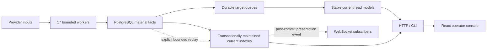

# Parallax 后端 KISS Hard Cut 实施与复核

> 实施基线：`origin/main@1ecf679c`，2026-07-22。
> 前置审计：`backend-kiss-architecture-audit-zh-2026-07-21.md`。
> 范围：后端运行时、Kappa/CQRS 数据流、数据库迁移、HTTP/CLI/React 契约、测试与运维配置。
> 用户明确要求：不运行 build、typecheck、E2E、Docker rebuild/start；本报告不把这些门禁伪装成已完成证据。

## 结论先行

这次不是把原来的 25-worker 框架“重构得更漂亮”，而是删除了没有独立业务真相、失败边界或刷新节奏的控制面。最终运行时收敛为：

- 一个 Python service、一个 PostgreSQL；
- 17 个有真实独立生命周期的 worker；
- material facts、少量 stable current read models、必要的 durable targets；
- 一个最小 manifest、一个 typed `RuntimeSnapshot`、一个 composition root；
- provider/model/DB/subprocess 边界各自负责 timeout；
- HTTP status 热路径零 SQL，队列与领域诊断只在 authenticated ops 中按需查询；
- `market_ticks` 写入时同事务推进 `market_tick_current`，恢复时使用显式 bounded fact replay，不恢复常驻 projection worker；
- 模型执行只有一个直连 gateway、一次受 RPM 约束的 provider call 和一个 artifact identity 算法；
- 无 root settings forwarding aliases，无 repository `commit=True/False` 双模式，无 runtime/domain/surface 反向依赖。

旧审计给出的“20 workers”是删除前的保守目标，不是应被守护的新下限。进一步追踪真实数据流后，Market Current projection、Token Capture Tier 和 Live Price Gateway 都被证明是派生控制面，因此最终 17-worker 形态更接近第一性和 KISS，同时没有删除 material fact、side-effect ledger 或可恢复性。

## 1. 对旧审计的正式 supersession

旧审计保留为 2026-07-21 的证据快照；以下实施决策以本报告为准。

| 旧审计建议 | 最终实施 | 原因 |
|---|---|---|
| worker 25 -> 20 | worker 25 -> 17 | 3 个额外 worker 没有独立真相或失败边界 |
| `NOTIFY` 只作 wake hint | 删除 DB wake bus/waiter | 所有 worker 都有 bounded interval catch-up；低延迟收益不足以覆盖第二套连接/监听/重连状态机 |
| 保留 WorkerBase hard timeout | 删除通用 worker hard/soft timeout 与强制取消 | 多个 iteration 使用 `asyncio.to_thread`；取消 await task 不会终止线程或外部副作用，反而可能让下一轮与旧写入重叠 |
| 保留必要 worker advisory lock | 删除 lifecycle advisory locks | queue claim、CAS、unique key、monotonic upsert 和幂等事实已处理数据竞争；锁住整个 worker 生命周期是重复控制面 |
| Market Current 独立 projection | fact transaction 内推进 current | current 只依赖刚写入的规范化 tick，无需第二次排队 |
| persisted Token Capture Tier | 查询时选择 stream/poll target policy | tier 是调度策略，不是业务事实或产品 read model |
| Live Price Gateway | commit 后直接 WS fan-out，REST 读 DB current | gateway/cache/TTL 形成第二份 current truth |

### 1.1 为什么不恢复通用 hard timeout

保留的 timeout 是：

- provider HTTP/WebSocket connect/read timeout；
- model/agent execution timeout；
- PostgreSQL `statement_timeout` 与 connect timeout；
- subprocess/file/network 边界自己的 timeout。

删除的是 WorkerBase 对整个 `run_once()` 的 generic `wait_for + cancel`。Python task cancellation只取消协程等待，不保证终止 `to_thread`、驱动调用、网络端副作用或数据库端已经发出的工作。通用 hard timeout 因此不能证明“工作停止”，却可能让 scheduler 启动下一轮并制造重复写、重复 side effect 和更难解释的状态。

当前 kernel 保证同一 worker iteration 串行；shutdown 发 stop signal，并等待当前边界受控的 iteration 完成。若某个 provider 违反 bounded-I/O 合同，应在该 provider 边界修复 timeout，而不是用一个不能终止副作用的上层取消状态机掩盖。

### 1.2 删除了哪些锁，保留了哪些并发安全

删除：worker lifecycle advisory lock、lock pool、lock reason/status、acquire/release compatibility shape。

保留：

- `FOR UPDATE SKIP LOCKED` bounded claims；
- stable natural queue keys；
- lease owner + attempt + payload-hash completion identity；
- compare-and-set side-effect completion；
- unique constraints 与 deterministic fact identity；
- monotonic `(observed_at_ms, received_at_ms, tick_id)` current upsert；
- 领域内确有数据竞争含义的事务/锁。

这一区分删除的是“证明 worker 单例”的第二套控制面，不是删除数据库并发正确性。

## 2. 最终数据流



这条流保持 Kappa/CQRS 的关键边界：

1. provider raw frame 只是输入，不是业务事实；
2. PostgreSQL material facts 是唯一业务真相；
3. current read model 使用稳定 product/window key；
4. 每个 persisted read model 只有一个 runtime writer；
5. deterministic projection unchanged 时写 0 serving rows；
6. 外部 I/O 不跨数据库写事务；
7. notification/model side effects 保留 durable ledger；
8. derived current 可以从 material facts 显式、分批恢复。

## 3. 17-worker 最终模型

最终 inventory 由 `worker_manifest.py` 唯一维护：

```text
collector
market_tick_stream
market_tick_poll
event_anchor_backfill
resolution_refresh
asset_profile_refresh
token_radar_projection
macro_sync
token_image_mirror
token_profile_current
news_fetch
news_item_process
news_story_brief
news_page_projection
macro_view_projection
notification_rule
notification_delivery
```

Manifest 只保留 name、start priority、queue tables 和 current read-model identity。它不再动态导入 worker，不再承载 wake graph、timeout、lock、factory、provider 或第二套 settings schema。

`InactiveWorker` 是 disabled、operator-intent 和 unavailable composition 的单一表示实现；语义仍由 typed status 区分，未把“缺 provider”伪装为“用户关闭”。

## 4. Runtime 与 status hard cut

删除：

- DB `WakeBus` / `WakeWaiter` 与专用 wake pool；
- worker soft/hard timeout 状态机；
- lifecycle advisory-lock plane；
- scheduler sequential mode、force-cancel 与 iteration-task registry；
- 多套 Disabled/Unavailable/NotStarted worker 实现；
- readiness queue sampling 与重复 status composer。

保留后的职责：

- `WorkerBase`：串行 `run_once()`、duration telemetry、bounded backoff、interval catch-up；
- `WorkerScheduler`：按静态 priority 启停一次、聚合 typed status；
- `RuntimeSnapshot`：一次捕获 worker/collector/provider/news contract/agent execution 状态；
- `/healthz`：进程活性；
- `/readyz`：轻量 DB liveness + cached startup schema/composition；
- `/api/status`：纯内存 snapshot，零 SQL；
- `/api/ops/diagnostics`：同一 snapshot + authenticated on-demand SQL。

任何 `effective_status=degraded` 的 worker、异常 provider connection state 或 `news_provider_contract.ok=false` 都进入顶层稳定 degradation reason。readiness 不再因一个 provider 402、queue backlog 或业务 freshness 而错误拒绝 HTTP 流量。

### 4.1 Agent Execution 单策略 hard cut

产品当前只有 `news.story_brief` 一个真实模型执行阶段，因此删除了把未来可能性提前实现成运行时架构的 lane/default/global 多层配置：

- `llm` 配置只保留 credential/base URL，删除 provider、trace 与 passthrough config holder；
- 删除 `LLMGateway` 和 `WiredProviders.agent_execution_gateway`，composition root 直接构造唯一 `AgentExecutionGateway`；
- `workers.agent_runtime` 是一份 flat policy：model/provider family、token budget、capacity、RPM、timeout 与 circuit breaker；
- stage spec 固定且严格校验 `news.story_brief`，lane 只作为审计标签；
- gateway 只有一份并发容量、RPM、circuit 和 timeout 状态；
- 容量与 RPM 通过一次原子 `reserve_up_to` 预留，避免两阶段预留失败后泄漏 capacity；
- 一次 execution 只发一次模型请求并做一次 client validation；失败回到 durable worker retry，不再用未计 RPM/usage 的 client re-ask；
- freshness 与 request audit 共用一个 artifact hash，覆盖 model、provider family、request options、output schema、prompt 和 runtime version；
- `/api/status` 只返回 exact active payload、`{status: unavailable, error}` 或 `null`；
- ops 只返回 `{status, policy, counters, status_reason?, error?}`，没有兼容 alias、动态 lane map 或 fixed-null 字段。

这保留了有成本模型调用的审计 ledger 和 timeout，却删除了当前没有第二个消费者的通用调度框架。

## 5. Market path hard cut 与恢复性

### 5.1 正常写入

`MarketTickPersistenceService` 在一个 caller-owned transaction 中完成：

```text
INSERT market_ticks ... ON CONFLICT DO NOTHING RETURNING narrow rows
  -> choose newest inserted row per stable target
  -> monotonic upsert market_tick_current
  -> map product target
  -> enqueue token_radar_dirty_targets for changed current only
commit
  -> optional WebSocket live_market_update
```

被删除的链路：

- `market_tick_current_dirty_targets`；
- `MarketTickCurrentProjectionWorker`；
- `token_capture_tier` 与其 dirty queue/worker；
- `LivePriceGateway`、TTL cache 与 gateway worker；
- current row 的 `raw_payload_json` / `payload_hash` 重复字段。

### 5.2 显式 bounded rebuild

仅靠 forward transaction 不足以满足“derived read model 可重建”：如果 current 行被人工修复/删除，重复 fact 会在 fact insert 的 conflict 上 no-op。最终实现增加一个正式 application operation：

```text
parallax ops rebuild-market-current --execute --limit N
  -> scan distinct (target_type, target_id) after stable cursor
  -> lateral-select latest persisted market tick
  -> use the same MarketTickPersistenceService current primitive
  -> enqueue Radar dirty only for changed rows
  -> return next stable cursor
```

它是显式、分批、可恢复的 ops 操作，不是恢复常驻 worker、run ledger 或 dirty queue。集成测试会清空 current 和 Radar dirty row，再从既有 facts 恢复并验证 cursor exhaustion。

### 5.3 末端数据正确性复核

独立复核又修正了四个会在简化后放大成真实数据错误的边界：

- 只有 `repair=false` 且原因集合为纯 market 时才走 market-only Radar refresh；mixed/repair claim 必须重算 source edges；
- 60 秒 market freshness gate 不再丢弃唯一的新 tick，而是把同一 stable target 写回未来 `due_at_ms`；
- market target -> product target 映射统一调用 Registry 的 strict canonical rule：CEX 只接受 Binance canonical USDT swap，Asset 只接受 candidate/canonical，不再 lower-case 猜测；
- rebuild 从全表 `DISTINCT` 改为 stable recursive seek，每批最多定位 `limit` 个 target，避免修复操作先扫描全部历史 facts。

随后复核补齐了三个更底层的不变量：

- current upsert 在 source tuple 相等但派生 payload 漂移时允许 authoritative fact 修复；older tuple 仍禁止回退，完全相同仍写 0 行；
- identity 统一为 chain-aware exact key：EVM 地址规范化为小写，Solana/非 EVM 地址保留大小写，Registry、Search、poll/stream target 和 Radar join 不再用无条件 `lower()`；
- Radar 同一 `(window, scope)` 的 `all/sol/eth/base/bsc/cex` 六个 venue 只加载一次 cohort，再在内存中独立过滤排名；publication state 和失败事务仍按 venue 隔离。

0186 与运行时使用同一映射、identity 和 equal-key repair 语义，并覆盖已有 social dirty + market backlog 的 mixed 合并场景。

## 6. 领域与产品 hard cut

### News

- 删除 item brief lane、source-quality projection 和对应 worker/table；
- provider deterministic auth/payment/config failure 绑定 `config_payload_hash` terminal，不无限 retry；
- public story brief 只使用正式 nested contract；
- 删除 `agent_brief_status`、computed-time outer alias fallback 等前后端兼容路径；
- story model run ledger 作为有成本外部副作用审计保留并有 retention。

### Macro

- 删除独立 daily-brief worker/table；
- `assets.daily_brief` 只存在于 `module_views_json`；
- 删除双 run ledger、重复 raw series payload 与 request-time rebuild；
- 0186 在删除临时 `assets_brief_json` 前清空旧 snapshot，并强制 requeue current module projection，避免已消费 0185 rebuild 的数据库永久空。

### Notifications

- `notifications.dedup_key` unique constraint 是唯一 semantic dedup authority；
- 删除 JSON scan 与进程内 semantic seen；
- cooldown 仍是跨不同 notification identity 的外部推送策略；
- delivery ledger、network-outside-transaction 和 CAS complete/fail 保留；
- 删除独立 summary endpoint，list response 内嵌 summary。
- list item 后端与前端都使用 exact 23-field contract，不再把通知项退化为任意 JSON object。

### Token Radar / Watchlist / CEX / Narrative

- 删除 generic projection runs/offsets；
- Narrative admission 合入 Radar current payload；
- 删除 Account Quality 空置产品面和虚假 Watchlist signal scope；
- 删除无真实消费者的 CEX OI/detail product tables/API，保留通用 CEX identity/market facts；
- Radar rank source query 改读 compact route fields，避免拉取宽 JSON/current payload；
- read-model key、single writer、unchanged zero-write 与 publication state 保留。

## 7. Config、CLI 与 frontend 契约

### Settings

删除 43 个 root forwarding/compatibility properties。运行时代码直接读取 typed nested models：

```text
storage.postgres
api
llm
gmgn
providers.okx / providers.binance / providers.macrodata
upstream
```

只保留路径解析、SecretStr/env 解析和真正跨字段派生的 10 个属性。operator-owned `~/.parallax/config.yaml` 与 `~/.parallax/workers.yaml` 已按新 schema 验证；旧配置分别备份后 hard cut，不保留 runtime alias loader。当前 redacted `parallax config` 证明运行时读取的就是这两个 operator-owned 路径。

### CLI

CLI 只解析参数、调用 application/runtime operation、渲染结果。重复 News rebuild、重复 Radar audit 和 queue compatibility probes 被删除；Market Current repair 调用正式 application operation，不在 CLI 复制 SQL 或 current-write规则。

### Frontend

删除 fixed-null `raw_payload_hash`、News `agent_brief_status` 和 computed time alias fallback；同步 OpenAPI/types/fixtures。React 不重建后端 rank、brief、notification summary 或 current market truth。

公共 HTTP 成功响应契约同时完成 exact hard cut：Pydantic response schema 全局 `extra=forbid`，Search、Inspect、Token Case、Target Posts、Social Timeline、News、Macro、Watchlist、Notification、Status、Ready、Ops 的成功 payload 都在序列化边界 fail closed；本文不把 FastAPI/HTTP error envelope 误报为同一 exact schema。前端对 Macro、Notification、Ops、Status/Worker、Asset Flow、Watchlist 使用同样的 canonical required shape；Ops worker 删除无消费者的 `details`，status callback 统一只返回 dict；WebSocket notification 只触发失效重取，不再维护第二份 summary truth。

## 8. 数据库迁移安全

已发布 `20260721_0185` 保持 byte-identical；新增 irreversible `20260722_0186` 承担后续 runtime projection hard cut。

0186 在 drop 前执行：

1. 把本次被退休 queue 的 unresolved terminal evidence 标成 `archive/queue_retired_by_0186`；
2. 对账 active market-current dirty targets 与“本次迁移刚归档”的 terminal-only targets；
3. 明确跳过 operator 已 archive/quarantine 的历史 known-bad rows；
4. 对每个 target 用 `(observed_at_ms, received_at_ms, tick_id)` 选最新 fact；
5. 对相等 source tuple 的漂移 current 执行 authoritative repair，并以与生产 Registry 相同的 Asset/CEX route 过滤映射 Radar dirty；
6. 规范化已有 EVM registry/pricefeed address，改用 exact unique index 与 EVM-lowercase check，同时保留非 EVM case；
7. 删除 retired queue/tier tables；
8. reset Macro snapshot 并强制 enqueue module-only rebuild；
9. 删除 current/Macro 重复 columns。

验证场景包含：fresh empty DB、0184 -> head、已部署 0185 的 active backlog、terminal-only backlog、人工 quarantine 不重放、已消费 Macro rebuild 后重新入队。真实 operator PostgreSQL 在本轮不可连接，因此没有声称已完成 live migration、物理空间回收或 p95 改善。

## 9. 量化结果

| 指标 | 旧审计基线 | 实施后 |
|---|---:|---:|
| worker | 25 | 17 |
| schema tables | 79 live snapshot | 60 generated current schema |
| runtime Python（排除迁移） | 105,589 LOC | 80,192 LOC |
| architecture tests | 30,814 LOC | 241 LOC / 12 tests |
| 审计九类重复 helper | 193 | 8 |
| repository public `commit/auto_commit` 参数 | 172 functions 涉及双模式 | 0 |
| domain -> app forbidden imports | 存在 | 0 |
| runtime -> surfaces forbidden imports | 存在 | 0 |
| private source-string positive assertions | 大量 | 0 |
| root settings forwarding aliases | 43 | 0 |

这里的 60 是生成 schema，不是假装读取了不可用的 operator 数据库。自旧审计快照起 runtime 减少 25,397 行；只看本轮 `origin/main@1ecf679c` 到工作树，也从 83,287 降到 80,192 行（-3,095）。最终 staged commit 为 359 files、+22,817/-20,651，净增加 2,166 行；增量主要来自 exact OpenAPI/TypeScript 生成合同、0186、实施审计和新的正向行为测试，生产 runtime 本身仍净删除 3,095 行。

## 10. 验证边界

本轮采用与风险成比例的证据：

- Python 非 integration：3,466 passed / 1 skipped；skip 是显式 opt-in 的 GMGN provider drift，不是被忽略的失败；
- PostgreSQL integration：245 passed + 2 subtests（完整套件 17:55）；
- Worker/status/config/domain targeted unit tests；
- Testcontainers migration 和非空 backlog upgrade；
- current idempotency、transaction atomicity、read-model rebuild integration；
- API status/readiness/ops integration；
- frontend Vitest：105 files / 748 tests passed；
- frontend lint + architecture harness：14 files / 180 tests passed；
- Ruff 与 `git diff --check`；
- generated schema/OpenAPI/CLI docs clean-diff；
- `0185` blob immutable check。

明确未运行：build、frontend typecheck、E2E、Docker rebuild/start。原因是用户直接更改目标并要求不要编译；这四项不能出现在“通过”列表里。

## 11. 仍需真实环境完成的 Phase D

代码 hard cut 已完成，但以下物理数据工作不能靠本地测试伪造：

1. 建立并验证 raw frame -> event provenance coverage 后，才能删除 events 中重复完整 JSON；
2. 在真实数据库收集 7～30 天 index usage，再决定 drop 大索引；
3. 部署 0185/0186 后执行真实 relation-size、dead tuple、reindex/vacuum/reclaim 评估；
4. 用真实 `pg_stat_statements` 验证 Macro 与 News query p95/temp spill；
5. 验证 terminal/fetch/story retention job 在真实行量下的批次成本。

这些不是继续保留兼容代码的理由，而是必须由真实数据库证据驱动的物理治理。尤其 event JSON 在 provenance edge 达到完整覆盖前不能凭 KISS 口号删除。

## 最终判断

当前实现没有退回 CRUD，也没有拆微服务。它保留 Kappa/CQRS 的 material truth、stable read model、单写者、幂等 side-effect 和 replay 能力，同时删除了把这些原则重复实现成 wake、lock、timeout、ledger、cache、alias 和源码 tripwire 的控制面。

最关键的变化不是文件更少，而是每条业务事实现在只有一条可解释路径：

```text
provider input -> material fact -> stable current/dirty target -> public read
```

只有确实具有独立成本或外部副作用的阶段才保留 worker 和 ledger。这个边界比旧审计的保守 20-worker 目标更简单，也更符合第一性、KISS、Kappa 和 CQRS。
