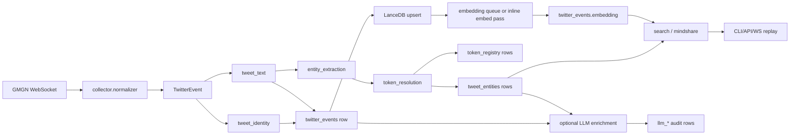

# Token Twitter LanceDB Migration Implementation Plan

> **For agentic workers:** REQUIRED SUB-SKILL: Use superpowers:subagent-driven-development (recommended) or superpowers:executing-plans to implement this plan task-by-task. Steps use checkbox (`- [ ]`) syntax for tracking.

**Goal:** Replace the current SQLite-backed handle alert journal with a LanceDB-backed token-first Twitter intelligence runtime that supports exact CA lookup, symbol/name resolution, hybrid semantic search, token social mindshare, and evidence-bound LLM enrichment.

**Architecture:** Keep the collector's store-first publish contract, but make LanceDB the single runtime store. Treat tweets as evidence rows, token/entity extraction as deterministic derived rows, mindshare as reproducible window aggregation, and LLM output as optional audited enrichment that never owns token identity or primary metrics.

**Tech Stack:** Python 3.13, FastAPI, websockets, LanceDB, PyArrow, pydantic-settings, LiteLLM, optional TweetNLP/Cardiff sentiment, `eth-utils`, `solders`, `ftfy`, `emoji`, `tldextract`, `urlextract`, `wordsegment`.

---

## Product Decision

This project should become a token-centric Twitter intelligence service, not a generic tweet archive. The primary user questions are:

- "Show me everything relevant to this CA."
- "What is the social mindshare around this token right now?"
- "What similar tweets, narratives, accounts, and claims are moving around this symbol?"
- "When a symbol is ambiguous, which token candidates are possible and why?"

The hard cut is intentional:

- SQLite is removed from runtime code.
- LanceDB is the only event, replay, search, and analytics store.
- No compatibility layer is kept for old SQLite tables.
- No dual-write period is introduced.
- A one-off migration command can be added only if historical local SQLite data is worth importing.

## Non-Goals

- Do not promise complete Twitter coverage. The upstream source is GMGN's anonymous public stream.
- Do not make LLM extraction part of token identity.
- Do not use semantic similarity for hard tweet deduplication.
- Do not build a separate service framework before the single-process CLI is stable.
- Do not introduce Kafka, Celery, Postgres, Qdrant, Elasticsearch, or a second database in the first cut.

## Core Principles

1. Tweet rows are evidence, not conclusions.
2. CA identity is strong; symbol identity is weak and must allow ambiguity.
3. Exact token matching beats semantic matching.
4. Retrieval should combine scalar filters, FTS, and vectors.
5. Metrics must be reproducible from persisted tweet/entity rows.
6. LLM rows must cite exact source tweet evidence.
7. Missing token extraction is a normal state, not an error.
8. Ingestion must be bounded: all tweets get cheap deterministic handling, but only selected tweets get provider refresh, embeddings, sentiment, or LLM.
9. Cleaning must be non-destructive: raw text and raw event JSON are immutable; every cleaned field is a derived projection.

## Target Directory Structure

```text
src/gmgn_twitter_intel/
  api/
    app.py                      # FastAPI app, health/readiness, runtime lifecycle
    ws.py                       # Authenticated WebSocket replay/live push

  collector/
    direct_ws.py                # GMGN upstream WebSocket adapter, unchanged unless protocol changes
    normalizer.py               # GMGN frame parsing into TwitterEvent
    service.py                  # Store-first collector orchestration
    subscriptions.py            # Handle normalization and legacy handle matching helpers

  pipeline/
    __init__.py
    processing_policy.py        # Cheap/warm/cold/LLM gating decisions and priorities
    tweet_identity.py           # Canonical event/tweet IDs, URL normalization, logical dedup keys
    tweet_text.py               # Tweet-specific text cleaning and embedding text construction
    entity_extraction.py        # Deterministic CA/cashtag/hashtag/mention/entity candidate extraction
    token_resolution.py         # Resolve candidates to token_registry rows and confidence states
    embedding.py                # Embedding service abstraction, hash backend for tests, real backend for runtime
    social_windows.py           # Build token_social_windows from twitter_events + tweet_entities
    llm_enrichment.py           # Evidence-bound LLM extraction orchestration

  runtime/
    __init__.py
    background_loops.py         # In-process bounded batch loops; no external queue service

  providers/
    __init__.py
    dexscreener.py              # DexScreener token/pair lookup
    coingecko.py                # Optional CoinGecko onchain metadata lookup
    jupiter.py                  # Solana token metadata lookup

  retrieval/
    __init__.py
    query_parser.py             # Parse CA/symbol/handle/natural-language query intent
    search_service.py           # Exact + hybrid search orchestration
    ranking.py                  # Final deterministic ranking policy
    mindshare_service.py        # Read and build social mindshare cards

  storage/
    __init__.py
    lancedb_client.py           # Small LanceDB wrapper copied/adapted from news-intel patterns
    lancedb_schema.py           # Required tables, pyarrow schemas, fixed vector dimensions
    index_maintenance.py        # Scalar/vector/FTS indexes and optimize hooks
    runtime_bootstrap.py        # Read/write storage startup helpers
    tweet_repository.py         # raw_frames + twitter_events + tweet_entities persistence
    token_repository.py         # token_registry persistence and lookup
    social_repository.py        # token_social_windows persistence and lookup
    llm_repository.py           # llm_runs/claims/entities/relations persistence

  models.py                     # Domain dataclasses and new token/search/social models
  settings.py                   # Environment config, LanceDB path, embedding/LLM/provider settings
  cli.py                        # serve, recent, search, mindshare, enrich, service commands
```

Files to delete:

```text
src/gmgn_twitter_intel/store/sqlite.py
src/gmgn_twitter_intel/store/__init__.py
tests/test_event_store.py
```

Tests to replace rather than preserve:

```text
tests/test_lancedb_schema.py
tests/test_tweet_repository.py
tests/test_tweet_text.py
tests/test_tweet_identity.py
tests/test_entity_extraction.py
tests/test_token_resolution.py
tests/test_search_service.py
tests/test_mindshare_service.py
tests/test_collector_service.py
tests/test_api_websocket.py
tests/test_cli.py
```

## Runtime Data Flow



## Current Pipeline Comparison

The current runtime is intentionally small:

```text
GMGN frame
  -> parse_gmgn_frame
  -> normalize_gmgn_payload
  -> TwitterEvent
  -> insert observed_events
  -> handle filter
  -> insert matched_events
  -> publish to /ws
```

Current strengths:

- The collector already has a useful `cp=0/cp=1` snapshot gate, so incomplete GMGN snapshots are held briefly before dispatch.
- Normalization is conservative. It maps GMGN fields into `TwitterEvent` and keeps the original `raw` item.
- SQLite stores both `event_json` and `raw_json`, so most original source evidence is recoverable.
- Store-first publish is already correct and should be preserved.

Current limits:

- Text is not cleaned beyond `str(value)`.
- URLs, hashtags, cashtags, mentions, emoji, and CA strings are not parsed into queryable fields.
- `matched_events` is handle-centric, not token-centric.
- `recent` can only replay matched handle events.
- There is no token identity layer, no semantic retrieval, no mindshare, and no processing budget.

Migration implication:

- Keep the current cheap parse/normalize/store-first shape.
- Replace SQLite rows with LanceDB evidence rows.
- Add deterministic projections and queues after storage.
- Do not make provider calls, embeddings, sentiment, or LLM part of the synchronous frame loop.

## Processing Tiers and Budgets

Tweet volume can be large, so processing must be tiered. "All tweets are stored" does not mean "all tweets receive expensive processing."

### Tier 0: Hot Path, Always Run

Runs synchronously before live publish.

Responsibilities:

- Parse GMGN frame.
- Normalize to `TwitterEvent`.
- Compute `logical_dedup_key`.
- Build non-destructive text projections.
- Extract cheap entities with regex and dictionary rules.
- Store `twitter_events`.
- Store cheap `tweet_entities` candidates.
- Publish only after store succeeds.

Allowed operations:

- String normalization.
- Regex extraction.
- Local dictionary lookup.
- Local token registry exact lookup.
- LanceDB insert/upsert.

Forbidden operations:

- Network provider calls.
- Embedding API calls.
- Sentiment model inference.
- LLM calls.
- Large table scans.

Reason:

- This tier must remain fast and reliable under bursty streams.
- If downstream processing falls behind, ingestion should still preserve evidence.

### Tier 1: Warm Path, Bounded Async Queue

Runs in background loops with explicit batch sizes and backpressure.

Responsibilities:

- Resolve unknown CA/symbol candidates with providers.
- Generate embeddings for selected tweets.
- Refresh token metadata.
- Reprocess `unresolved` and `ambiguous` rows when registry changes.
- Build or refresh recent social windows.

Selection policy:

- Always enqueue tweets with valid CA candidates.
- Always enqueue tweets with cashtags from watched symbols or known registry aliases.
- Enqueue tweets from high-value authors.
- Enqueue tweets matching configured handles.
- Enqueue tokenless tweets only if they pass a narrative/quality gate.

Default limits:

- `ENTITY_RESOLUTION_BATCH_SIZE=64`
- `EMBED_BATCH_SIZE=64`
- `TOKEN_METADATA_BATCH_SIZE=32`
- `SOCIAL_WINDOW_BATCH_SIZE=128`
- `MAX_BACKGROUND_QUEUE_SIZE=10000`

Backpressure:

- If a queue is full, mark the row as pending and let the next scheduled pass pick it up.
- Never block GMGN frame ingestion on warm-path backlog.

### Tier 2: Cold Path, Explicit Commands

Runs only when the user asks or on scheduled maintenance.

Responsibilities:

- Backfill embeddings.
- Rebuild indexes.
- Reprocess entity extraction after rule changes.
- Recompute older mindshare windows.
- Run LLM enrichment for unresolved or high-impact tweets.

Commands:

```bash
uv run gmgn-twitter-intel ops reprocess-entities --since-hours 24
uv run gmgn-twitter-intel ops rebuild-indexes
uv run gmgn-twitter-intel ops backfill-embeddings --since-hours 24 --limit 10000
uv run gmgn-twitter-intel enrich --unresolved --limit 50
```

### Tier 3: LLM Path, Strictly Gated

LLM is never part of default ingestion. It is an evidence enrichment path with a small budget.

LLM candidate gate:

```text
eligible_for_llm =
  has_text
  AND not_duplicate
  AND quote_or_text_length >= minimum
  AND (
    unresolved_token_candidate
    OR ambiguous_high_reach_symbol
    OR valid_ca_high_reach
    OR high_value_author
    OR rapid_velocity_token_window
    OR user_requested_enrichment
  )
  AND not_recently_enriched_same_logical_dedup_key
```

Default LLM limits:

- `LLM_ENRICHMENT_ENABLED=false`
- `LLM_MAX_TWEETS_PER_RUN=50`
- `LLM_MAX_TWEETS_PER_TOKEN_WINDOW=10`
- `LLM_MIN_AUTHOR_FOLLOWERS=10000`
- `LLM_MIN_ENTITY_CONFIDENCE=0.35`
- `LLM_DEDUP_LOOKBACK_HOURS=24`

LLM rejection reasons:

- `no_text`
- `duplicate_logical_tweet`
- `already_enriched`
- `low_author_signal`
- `no_entity_or_narrative_signal`
- `quote_validation_failed`
- `budget_exhausted`

Rationale:

- Most tweets do not deserve LLM.
- LLM should answer "what is this claim and why does it matter?" not "does this tweet exist?"
- The deterministic layer must remain useful with LLM disabled.

## Information Preservation and Cleaning Policy

The cleaning layer must not destroy evidence. It creates derived fields for retrieval and display while keeping raw source material.

### Immutable Inputs

Always preserve:

- `raw_event_json`: full normalized `TwitterEvent.to_dict()`.
- `raw_payload_json`: raw GMGN item where available.
- `text_raw`: original tweet text from GMGN content.
- `reference_json`: quote/reply/repost reference data.
- `media_json`: media URL/type metadata.
- `urls_json`: normalized full URLs and domains.

### Derived Text Fields

Use multiple text projections instead of one destructive cleaned text:

- `text_raw`: source text with minimal type normalization.
- `text_clean`: display-safe text; keep CA, `$SYMBOL`, `#hashtag`, `@mention`, emoji, and readable URLs.
- `search_text`: text optimized for FTS; includes cashtags, hashtags, author handle, URL domains, and reference text.
- `embedding_text`: bounded semantic text; replaces URLs with domains, demojizes emoji, includes short reference context.
- `llm_text`: evidence text for quote validation; close to `text_clean`, with bounded reference context.

### Safe Removals

Allowed removals from derived fields:

- Duplicate whitespace.
- Zero-width characters.
- Tracking query parameters such as `utm_*`, `ref`, `fbclid`, `gclid`.
- Duplicate repeated URLs in the same tweet.
- HTML tags if upstream ever provides HTML.
- Empty media entries.

### Unsafe Removals

Do not remove from `text_clean`, `search_text`, or `llm_text`:

- Contract addresses.
- `$SYMBOL` cashtags.
- `#hashtags`.
- `@mentions`.
- Emoji.
- Numbers, percentages, prices, market caps, time references.
- Negation words such as `not`, `no`, `never`, `without`.
- Reply/quote context when it contains the actual claim.

### Projection-Specific Transformations

URL handling:

- Keep full normalized URL in `urls_json`.
- Keep domain marker in `embedding_text`, for example `[url:dexscreener.com]`.
- Keep visible URL or domain in `text_clean` if it helps the user understand evidence.

Emoji handling:

- Keep original emoji in `text_clean`.
- Add demojized token in `embedding_text`, for example `:rocket:`.
- Do not use emoji alone as sentiment truth.

Hashtag handling:

- Keep raw hashtag.
- Add segmented form only as an additional field when segmentation is confident.
- Never replace the original hashtag with segmented text.

Media handling:

- Store media metadata.
- Do not download images in the first implementation.
- If a tweet has no text but has media, mark `media_only=true`; do not send to LLM unless a later image-capable path exists.

### Quality Flags

Add row-level quality flags to `twitter_events`:

- `is_duplicate`
- `is_tokenless`
- `is_unresolved`
- `is_ambiguous`
- `is_media_only`
- `is_low_text`
- `has_reference_context`
- `has_valid_ca`
- `has_cashtag`
- `has_external_token_url`

These flags drive queues and user-facing caveats.

## Storage Model

### `raw_frames`

Purpose: audit upstream payloads and parse failures without mixing raw transport data into product queries.

Required fields:

- `frame_id`: deterministic hash of raw frame payload and received timestamp bucket.
- `provider`: `gmgn`.
- `transport`: `direct_ws`.
- `source_channel`: GMGN channel.
- `payload_hash`: SHA-256 of raw frame text.
- `raw_payload_json`: original parsed payload JSON when parse succeeds.
- `raw_frame_text`: original frame text when parse fails or raw preservation is enabled.
- `received_at_ms`: collector receive timestamp.
- `parse_status`: `parsed`, `ignored`, `failed`.
- `parse_error`: bounded error text.
- `created_at_ms`: insert timestamp.

Indexes:

- scalar: `frame_id`, `payload_hash`, `source_channel`, `received_at_ms`, `parse_status`.

### `twitter_events`

Purpose: canonical tweet/event evidence table and primary retrieval surface.

Required fields:

- `event_id`: stable GMGN event ID.
- `tweet_id`: Twitter/X tweet ID when available.
- `canonical_url`: canonical tweet URL when available.
- `logical_dedup_key`: `tweet:<tweet_id>`, `url:<canonical_url>`, or `event:<event_id>`.
- `source_channel`: GMGN channel.
- `coverage`: `public_stream`.
- `action`: normalized action.
- `original_action`: GMGN action detail.
- `author_handle`: lower-case handle.
- `author_name`: display name.
- `author_followers`: integer or null.
- `author_tags_json`: JSON array.
- `text_raw`: original normalized content text.
- `text_clean`: display-safe cleaned text.
- `search_text`: FTS-oriented text with preserved entities and URL domains.
- `embedding_text`: text passed to embedding and FTS.
- `llm_text`: bounded evidence text used for LLM quote validation.
- `hashtags_json`: JSON array of hashtags without `#`.
- `cashtags_json`: JSON array of symbols without `$`.
- `mentions_json`: JSON array of handles without `@`.
- `urls_json`: normalized URLs and domains.
- `media_json`: media metadata.
- `reference_json`: quoted/replied/reposted/deleted reference payload.
- `timestamp_ms`: tweet/source timestamp when available.
- `received_at_ms`: collector timestamp.
- `token_resolution_status`: `not_processed`, `resolved`, `ambiguous`, `unresolved`, `no_token`, `invalid_candidate`.
- `token_candidate_count`: number of token-like candidates extracted.
- `resolved_token_count`: number of candidates resolved to token IDs.
- `quality_flags_json`: row-level flags that drive processing and caveats.
- `entity_processed_at_ms`: timestamp for deterministic entity extraction completion.
- `token_resolution_updated_at_ms`: timestamp for latest token resolution pass.
- `processing_priority`: integer priority for warm/cold background passes.
- `embedding_status`: `not_required`, `pending`, `completed`, `failed`, `skipped`.
- `embedding`: fixed-size float vector.
- `embedding_updated_at_ms`: timestamp when embedding was written.
- `embedding_attempts`: retry counter.
- `embedding_last_error`: bounded failure reason.
- `embedding_next_retry_at_ms`: retry-after timestamp.
- `created_at_ms`: first insert.
- `updated_at_ms`: last update.
- `raw_event_json`: full normalized event JSON.

Logical uniqueness:

- Upsert by `event_id`.
- Insert-if-missing by `logical_dedup_key` for replay dedup.
- If a later row has better tweet identity for the same logical tweet, update the existing row.

Indexes:

- scalar: `event_id`, `tweet_id`, `logical_dedup_key`, `canonical_url`, `author_handle`, `received_at_ms`, `timestamp_ms`, `token_resolution_status`.
- FTS: `text_clean`, `embedding_text`, `author_handle`, `cashtags_json`, `hashtags_json`, `urls_json`.
- vector: `embedding` with cosine metric.

### `tweet_entities`

Purpose: deterministic entity evidence for token search and later enrichment.

Required fields:

- `entity_id`: deterministic hash of `event_id`, `entity_type`, normalized surface, span, chain/address/symbol.
- `event_id`: parent event.
- `tweet_id`: parent tweet ID when available.
- `entity_type`: `token`, `address_candidate`, `cashtag`, `hashtag`, `mention`, `url_domain`, `market_theme`.
- `chain`: normalized chain ID when known, for example `solana`, `eth`, `base`, `bsc`.
- `contract_address`: normalized CA when known.
- `symbol`: normalized symbol when known.
- `name`: token or entity name when known.
- `token_id`: canonical token registry ID when resolved.
- `surface`: exact text surface from tweet.
- `span_start`: character start.
- `span_end`: character end.
- `confidence`: deterministic score between 0 and 1.
- `resolution_status`: `resolved`, `ambiguous`, `unresolved`, `invalid`, `not_token`.
- `provenance`: `evm_address_regex`, `solana_pubkey_regex`, `cashtag`, `registry_alias`, `provider_metadata`, `llm_candidate_validated`.
- `evidence_json`: compact evidence details.
- `created_at_ms`: insert timestamp.

Indexes:

- scalar: `entity_id`, `event_id`, `tweet_id`, `entity_type`, `chain`, `contract_address`, `symbol`, `token_id`, `resolution_status`.

### `token_registry`

Purpose: local identity registry for token resolution, aliases, and external metadata cache.

Required fields:

- `token_id`: `chain:<chain>:ca:<contract_address>` for CA tokens; `symbol:<symbol>:unknown` only for unresolved registry seeds.
- `chain`: normalized chain.
- `contract_address`: normalized CA.
- `symbol`: normalized symbol.
- `name`: display name.
- `aliases_json`: symbols, names, common tickers, project aliases.
- `source`: `dexscreener`, `jupiter`, `coingecko`, `manual`, `observed`.
- `source_confidence`: deterministic provider confidence.
- `liquidity_usd`: latest observed liquidity when available.
- `volume_24h_usd`: latest observed volume when available.
- `market_cap_usd`: latest observed market cap when available.
- `fdv_usd`: latest observed FDV when available.
- `image_url`: token icon.
- `websites_json`: official websites when available.
- `socials_json`: official socials when available.
- `first_seen_at_ms`: first local observation.
- `last_refreshed_at_ms`: provider refresh timestamp.
- `metadata_status`: `fresh`, `stale`, `not_found`, `provider_error`.
- `raw_provider_json`: bounded provider payload.

Indexes:

- scalar: `token_id`, `chain`, `contract_address`, `symbol`, `metadata_status`, `last_refreshed_at_ms`.
- FTS: `symbol`, `name`, `aliases_json`, `contract_address`.

### `token_social_windows`

Purpose: reproducible time-window social metrics for token mindshare.

Required fields:

- `window_id`: deterministic `token_id + window_start + window_end + coverage`.
- `token_id`: registry token ID.
- `chain`: token chain.
- `contract_address`: token CA.
- `symbol`: token symbol.
- `coverage`: `gmgn_public_stream`.
- `window`: `5m`, `1h`, `6h`, `24h`.
- `window_start_ms`: inclusive start.
- `window_end_ms`: exclusive end.
- `mention_count`: number of tweet_events with resolved token entity.
- `unique_author_count`: number of unique handles.
- `weighted_reach`: sum of `log1p(author_followers)` across unique author-event pairs.
- `top_authors_json`: top authors by count/reach.
- `top_tweets_json`: top evidence tweets by ranking policy.
- `share_of_voice`: token mentions divided by all resolved token mentions in same window.
- `previous_window_mentions`: previous same-length mention count.
- `mention_velocity`: ratio or delta versus previous same-length window.
- `sentiment_json`: optional sentiment distribution.
- `narratives_json`: optional top narrative terms/topics.
- `quality_flags_json`: low sample size, ambiguous symbol, provider metadata stale, coverage warning.
- `computed_at_ms`: compute timestamp.

Indexes:

- scalar: `window_id`, `token_id`, `chain`, `contract_address`, `symbol`, `window`, `window_start_ms`, `window_end_ms`.

### `llm_runs`, `llm_claims`, `llm_entities`, `llm_relations`

Purpose: audited LLM enrichment. These tables are optional derived data.

Common requirements:

- Every row must include `llm_run_id`, `event_id`, model, prompt version, schema version, confidence.
- Every claim/entity/relation row must include an exact `evidence_quote`.
- The quote must be present in `twitter_events.text_clean` or `embedding_text`.
- LLM output cannot update `token_registry.contract_address`, `twitter_events.logical_dedup_key`, or `token_social_windows` primary metrics.

## Tokenless Tweet Policy

A tweet with no parsed token is still valuable and must not be dropped.

There are five resolution states:

1. `resolved`: at least one token candidate maps to `token_registry`.
2. `ambiguous`: one or more candidates map to multiple plausible tokens.
3. `unresolved`: token-like candidates exist, but no provider/registry identity is confident.
4. `invalid_candidate`: token-like text exists but fails validation, such as malformed CA.
5. `no_token`: no token-like candidate was found.

Behavior when no token is parsed:

- Store the tweet in `twitter_events`.
- Set `token_resolution_status = "no_token"`.
- Set `token_candidate_count = 0`.
- Set `resolved_token_count = 0`.
- Do not create a `tweet_entities` token row.
- Still create non-token entity rows if useful, such as hashtag, mention, URL domain, or market theme.
- Still embed the tweet.
- Keep it searchable by text, author, URL domain, hashtag, and semantic query.
- Exclude it from token-specific mindshare numerator.
- Exclude it from share-of-voice denominator if denominator means "all resolved token mentions".
- Include it in global stream volume, author activity, and market narrative discovery.
- Reprocess it when token registry or extraction rules change.

Behavior when token-like candidates exist but cannot be resolved:

- Store the tweet in `twitter_events`.
- Set `token_resolution_status = "unresolved"` or `"ambiguous"`.
- Store candidate rows in `tweet_entities`.
- Keep candidate evidence so future provider metadata or manual registry additions can resolve it.
- Add it to an unresolved review query surface.
- Do not count it in token mindshare until a token ID is resolved.

Reasoning:

- Dropping tokenless tweets destroys later recall.
- Forcing unknown tweets into a token creates false mindshare.
- Keeping tokenless tweets searchable lets users ask broad questions like "what are whales discussing today?" or "what are people saying about listings?" even without a token.

## Algorithms

### Tweet Identity

Input: `TwitterEvent`.

Rules:

1. If `tweet_id` exists, `logical_dedup_key = "tweet:" + tweet_id`.
2. Else if a Twitter/X status URL exists in content or reference, normalize URL and use `logical_dedup_key = "url:" + canonical_url`.
3. Else use `logical_dedup_key = "event:" + event_id`.

Canonical URL normalization:

- Normalize `x.com` and `twitter.com` status URLs to `https://x.com/<handle>/status/<tweet_id>`.
- Strip query params and fragments.
- Preserve non-Twitter URLs in `urls_json` but do not use them as tweet identity unless they are the only stable URL.

### Tweet Text Canonicalization

Inputs:

- main tweet text.
- reference text for quote/reply/repost context.
- author handle and tags.
- URLs, media, hashtags, cashtags.

Outputs:

- `text_raw`: minimally normalized display text.
- `text_clean`: normalized text for CLI/API display.
- `embedding_text`: retrieval text.

Cleaning rules:

- Normalize Unicode with `ftfy`.
- HTML-unescape if needed.
- Collapse whitespace.
- Keep `$SYMBOL`, `#hashtag`, `@mention`, CA strings, and emoji in `text_clean`.
- In `embedding_text`, convert emoji to text aliases with `emoji.demojize`.
- Replace long URLs with domain-level markers such as `[url:dexscreener.com]`.
- Include quote/reference text after a clear marker only when it adds retrieval value.
- Do not remove hashtags or cashtags.

### Entity Extraction

Extraction order:

1. EVM contract addresses.
2. Solana mint/public key candidates.
3. Cashtags.
4. Hashtags.
5. Mentions.
6. Registry alias/name dictionary matches.
7. URL domains.
8. Optional market theme rules.

EVM CA:

```text
(?<![A-Za-z0-9])0x[a-fA-F0-9]{40}(?![A-Za-z0-9])
```

Validation:

- Use `eth_utils.is_address`.
- Normalize to checksum address when available.
- Infer chain from context only when strong, for example URL domain/path or GMGN channel metadata.
- If chain is unknown, emit candidate with `chain = ""` and resolve across likely EVM chains.

Solana CA:

```text
(?<![1-9A-HJ-NP-Za-km-z])[1-9A-HJ-NP-Za-km-z]{32,44}(?![1-9A-HJ-NP-Za-km-z])
```

Validation:

- Use `solders.pubkey.Pubkey.from_string`.
- Reject values that are common words, URLs, or obviously part of another token.

Cashtag:

```text
(?<![A-Za-z0-9_])\$[A-Za-z][A-Za-z0-9_]{1,15}
```

Dictionary matching:

- Build a token alias dictionary from `token_registry`.
- Prefer exact word-boundary matches.
- Do not match short symbols without crypto context.
- For symbols with length <= 3, require `$SYMBOL`, CA co-occurrence, known author/source context, or URL evidence.

Confidence score:

```text
exact_ca_validated: 0.98
ca_provider_found: 0.95
cashtag_unique_registry_match: 0.85
cashtag_ambiguous_registry_match: 0.55
alias_with_context: 0.65
alias_without_context: 0.35
llm_candidate_validated_by_quote: max 0.60
```

### Token Resolution

Token ID format:

```text
chain:<chain>:ca:<normalized_contract_address>
```

Resolution process:

1. Resolve exact CA against local `token_registry`.
2. If missing, query chain-appropriate providers.
3. Insert provider result into `token_registry`.
4. Resolve cashtag/name candidates against local registry.
5. If one high-confidence match exists, mark `resolved`.
6. If multiple plausible matches exist, mark `ambiguous`.
7. If no match exists, mark `unresolved`.

Provider priority:

- Solana CA: Jupiter, then DexScreener, then CoinGecko if configured.
- EVM CA: DexScreener, then CoinGecko if configured.
- Symbol/name: local registry first, then DexScreener search as a candidate generator.

KISS rule:

- Provider failure must not block ingestion.
- Provider enrichment can be retried later.
- Unknown metadata does not prevent exact CA search if the CA is valid.

### Embedding

Backends:

- `hash`: deterministic test backend.
- `ollama`: local OpenAI/Ollama-compatible embedding endpoint.
- `openai`: optional external embedding provider.

Recommended runtime model:

- `bge-m3` for multilingual short-form crypto text.

Embedding input:

- Use `embedding_text`.
- Include quoted text only after truncating to a bounded length.
- Do not include raw JSON.

Dimension policy:

- LanceDB vector dimension is fixed at database creation.
- Startup must fail if configured embedding dimension differs from existing schema.
- No automatic dimension migration.

### Retrieval

Query parser outputs:

- `ca_query`: exact CA with optional chain.
- `symbol_query`: `$SYMBOL` or symbol/name text.
- `handle_query`: author handle.
- `semantic_query`: natural-language text.
- `mixed_query`: CA/symbol plus natural language.

CA search:

1. Normalize and validate CA.
2. Resolve token ID candidates.
3. Query `tweet_entities` by `chain + contract_address` or `token_id`.
4. Join `twitter_events`.
5. Apply time/author/action filters.
6. Rank exact evidence first, then recency/reach.

Symbol search:

1. Query `token_registry` by symbol/name/aliases.
2. If more than one plausible token exists, return candidates unless user passed `--allow-ambiguous`.
3. Search by selected token IDs.

Semantic search:

1. Embed query.
2. Run LanceDB hybrid search over `twitter_events`.
3. Use scalar filters for time, author, token status, action, source channel.
4. Rerank with deterministic score.

Final ranking:

```text
score =
  exact_entity_boost
  + hybrid_score
  + recency_decay
  + author_reach_weight
  + source_action_weight
  - ambiguity_penalty
```

### Mindshare

Window sizes:

- `5m`
- `1h`
- `6h`
- `24h`

Metrics:

- `mention_count`: number of resolved token mentions.
- `unique_author_count`: unique author handles.
- `weighted_reach`: sum of `log1p(author_followers)`.
- `share_of_voice`: token mentions divided by all resolved token mentions in same coverage/window.
- `mention_velocity`: current window versus previous same-length window.
- `top_authors`: authors sorted by weighted contribution.
- `top_tweets`: tweets sorted by ranking policy.
- `sentiment`: optional distribution when sentiment backend is enabled.
- `quality_flags`: low sample, ambiguous symbol, stale provider metadata, public stream coverage.

Important:

- Tokenless tweets are not counted in token-specific numerator.
- Unresolved/ambiguous candidates are not counted until resolved.
- Global stream volume can include tokenless tweets as a separate contextual metric.

### LLM Enrichment

LLM tasks:

- Extract claims.
- Extract organizations/people/protocols.
- Extract relations.
- Extract counterevidence.
- Suggest token candidates only for unresolved tweets, never final identity.

Rules:

- Use LiteLLM as provider abstraction.
- Use Pydantic validation for schema.
- Every output row must cite `event_id` and exact `evidence_quote`.
- Reject rows whose quote is not present in the tweet text.
- LLM output cannot update primary token metrics.

## Settings

Add:

```env
LANCEDB_PATH=~/.gmgn-twitter-intel/twitter_intel.lancedb
EMBEDDING_BACKEND=ollama
EMBEDDING_BASE_URL=http://127.0.0.1:11434
EMBEDDING_MODEL=bge-m3
EMBEDDING_DIM=1024
EMBEDDING_TIMEOUT_SECONDS=10

LLM_PROVIDER=openai
LLM_BASE_URL=
LLM_MODEL=
LLM_API_KEY=
LLM_TIMEOUT_SECONDS=30

DEXSCREENER_ENABLED=true
COINGECKO_API_KEY=
JUPITER_ENABLED=true

SOCIAL_WINDOW_SIZES=5m,1h,6h,24h
TOKEN_METADATA_TTL_SECONDS=3600

ENTITY_RESOLUTION_BATCH_SIZE=64
EMBED_BATCH_SIZE=64
TOKEN_METADATA_BATCH_SIZE=32
SOCIAL_WINDOW_BATCH_SIZE=128
MAX_BACKGROUND_QUEUE_SIZE=10000

PROCESS_TOKENLESS_EMBEDDINGS=false
PROCESS_MEDIA_ONLY_EMBEDDINGS=false
MIN_EMBEDDING_TEXT_CHARS=12
HIGH_VALUE_AUTHOR_FOLLOWERS=10000

LLM_ENRICHMENT_ENABLED=false
LLM_MAX_TWEETS_PER_RUN=50
LLM_MAX_TWEETS_PER_TOKEN_WINDOW=10
LLM_MIN_AUTHOR_FOLLOWERS=10000
LLM_MIN_ENTITY_CONFIDENCE=0.35
LLM_DEDUP_LOOKBACK_HOURS=24
```

Remove:

```env
OBSERVED_RETENTION_DAYS
MATCHED_RETENTION_DAYS
```

Replace with LanceDB retention only if disk usage becomes a real issue:

```env
TWITTER_EVENT_RETENTION_DAYS=180
RAW_FRAME_RETENTION_DAYS=7
```

## CLI Surface

Keep:

```bash
uv run gmgn-twitter-intel serve
make docker-up / make docker-status / make docker-logs / make docker-down
```

Change:

```bash
uv run gmgn-twitter-intel recent --limit 20
uv run gmgn-twitter-intel recent --handles toly,elonmusk --limit 20
uv run gmgn-twitter-intel recent --ca <contract-address> --chain solana --limit 50
uv run gmgn-twitter-intel recent --symbol TICKER --limit 50
```

Add:

```bash
uv run gmgn-twitter-intel search "natural language query" --limit 20
uv run gmgn-twitter-intel search --ca <contract-address> --chain solana --q "listing whale buy" --limit 20
uv run gmgn-twitter-intel resolve-token --ca <contract-address> --chain solana
uv run gmgn-twitter-intel resolve-token --symbol TICKER
uv run gmgn-twitter-intel mindshare --ca <contract-address> --chain solana --window 1h
uv run gmgn-twitter-intel mindshare --symbol TICKER --window 24h
uv run gmgn-twitter-intel enrich --unresolved --limit 50
uv run gmgn-twitter-intel ops rebuild-indexes
uv run gmgn-twitter-intel ops reprocess-entities --since-hours 24
```

## WebSocket Surface

Existing auth remains:

```json
{"type":"auth","token":"..."}
```

New subscribe message:

```json
{
  "type": "subscribe",
  "handles": ["toly"],
  "tokens": ["chain:solana:ca:..."],
  "cas": [{"chain": "solana", "address": "..."}],
  "symbols": ["SOL"],
  "replay": 100
}
```

Server behavior:

- Authenticate first.
- Normalize filters.
- Resolve CA filters exactly.
- Resolve symbol filters to candidates.
- If symbol is ambiguous, send an `ambiguous_symbol` error with candidates.
- Replay matching stored `twitter_events`.
- Push live events after store-first entity processing.

## Implementation Phases

### Phase 1: LanceDB Runtime Foundation

**Goal:** Make LanceDB the only runtime store while preserving current handle replay behavior.

**Files:**

- Create: `src/gmgn_twitter_intel/storage/lancedb_client.py`
- Create: `src/gmgn_twitter_intel/storage/lancedb_schema.py`
- Create: `src/gmgn_twitter_intel/storage/index_maintenance.py`
- Create: `src/gmgn_twitter_intel/storage/runtime_bootstrap.py`
- Create: `src/gmgn_twitter_intel/storage/tweet_repository.py`
- Create: `src/gmgn_twitter_intel/runtime/background_loops.py`
- Modify: `src/gmgn_twitter_intel/settings.py`
- Modify: `src/gmgn_twitter_intel/api/app.py`
- Modify: `src/gmgn_twitter_intel/api/ws.py`
- Modify: `src/gmgn_twitter_intel/collector/service.py`
- Modify: `src/gmgn_twitter_intel/cli.py`
- Delete: `src/gmgn_twitter_intel/store/sqlite.py`
- Delete: `src/gmgn_twitter_intel/store/__init__.py`

Steps:

- [x] Add LanceDB, PyArrow, filelock dependencies to `pyproject.toml`.
- [x] Add settings for `LANCEDB_PATH` and `EMBEDDING_DIM`; provider/model keys stay out until embedding/LLM phases are active.
- [x] Implement schemas for `raw_frames` and `twitter_events`.
- [x] Implement LanceDB client wrapper with `insert_if_missing`, `upsert`, `query_where`, `query_in`, `hybrid_search`, `create_scalar_index`, `create_fts_index`, `create_vector_index`.
- [x] Implement runtime bootstrap that creates required tables.
- [x] Implement `TweetRepository.insert_event(event: TwitterEvent) -> bool`.
- [x] Implement `TweetRepository.mark_event_matched(event: TwitterEvent) -> bool`.
- [x] Implement `TweetRepository.recent_events(limit, handles)` equivalent for current WebSocket replay.
- [x] Implement a no-op `BackgroundLoopRunner` scaffold that can start/stop cleanly.
- [x] Remove SQLite retention loop from `api/app.py`.
- [x] Replace runtime store construction with LanceDB repository.
- [x] Update tests that currently import `EventStore`.

Validation:

```bash
uv run pytest tests/test_api_health.py tests/test_api_websocket.py tests/test_collector_service.py tests/test_cli.py -q
uv run ruff check .
uv run python -m compileall src tests
```

Exit criteria:

- `serve` starts with an empty LanceDB directory.
- `/readyz` returns LanceDB table counts.
- Existing handle-based replay works from LanceDB.
- No runtime import references `sqlite`.

### Phase 2: Canonical Tweet Evidence Rows

**Goal:** Store product-grade tweet rows with canonical identity, clean text, URL/cashtag/hashtag extraction, and token resolution status.

**Files:**

- Create: `src/gmgn_twitter_intel/pipeline/tweet_identity.py`
- Create: `src/gmgn_twitter_intel/pipeline/tweet_text.py`
- Create: `src/gmgn_twitter_intel/pipeline/processing_policy.py`
- Modify: `src/gmgn_twitter_intel/storage/lancedb_schema.py`
- Modify: `src/gmgn_twitter_intel/storage/tweet_repository.py`
- Modify: `src/gmgn_twitter_intel/collector/service.py`
- Test: `tests/test_tweet_identity.py`
- Test: `tests/test_tweet_text.py`
- Test: `tests/test_tweet_repository.py`

Steps:

- [x] Add `logical_dedup_key`, `canonical_url`, text projection, URL, hashtag, cashtag, mention, quality flag, and processing status fields to `twitter_events`.
- [x] Implement canonical tweet URL normalization.
- [x] Implement `text_raw`, `text_clean`, and `embedding_text` construction.
- [x] Preserve display text while making embedding text retrieval-friendly.
- [x] Set `token_resolution_status` on initial insert from cheap local extraction: `resolved`, `unresolved`, `invalid_candidate`, or `no_token`.
- [x] Set `embedding_status = "pending"` only when `processing_policy` says the tweet deserves embedding; otherwise set `embedding_status = "skipped"`.
- [x] Set `processing_priority` from cheap local token signals.
- [x] Upsert by `event_id` and guard against duplicate logical tweet keys.
- [x] Update CLI `recent` output to include token resolution status and canonical URL.

Validation:

```bash
uv run pytest tests/test_tweet_identity.py tests/test_tweet_text.py tests/test_tweet_repository.py -q
```

Exit criteria:

- Duplicate URL/tweet events do not create duplicate replay rows.
- Emoji, URLs, hashtags, mentions, and cashtags are preserved appropriately.
- Tokenless tweets are stored with `not_processed` until entity extraction runs.

### Phase 3: Deterministic Entity Extraction and Token Resolution

**Goal:** Extract and resolve CA/symbol/token entities without embeddings or LLM.

**Files:**

- Create: `src/gmgn_twitter_intel/pipeline/entity_extraction.py`
- Create: `src/gmgn_twitter_intel/pipeline/token_resolution.py`
- Create: `src/gmgn_twitter_intel/providers/dexscreener.py`
- Create: `src/gmgn_twitter_intel/providers/coingecko.py`
- Create: `src/gmgn_twitter_intel/providers/jupiter.py`
- Create: `src/gmgn_twitter_intel/storage/token_repository.py`
- Modify: `src/gmgn_twitter_intel/storage/tweet_repository.py`
- Modify: `src/gmgn_twitter_intel/storage/lancedb_schema.py`
- Modify: `src/gmgn_twitter_intel/collector/service.py`
- Test: `tests/test_entity_extraction.py`
- Test: `tests/test_token_resolution.py`

Steps:

- [x] Add `tweet_entities` schema and indexes.
- [x] Add `token_registry` schema and indexes.
- [x] Implement EVM CA extraction and `eth-utils` validation.
- [x] Implement Solana CA extraction and `solders` validation.
- [x] Implement cashtag/hashtag/mention extraction.
- [x] Implement registry alias matching for known tokens.
- [x] Implement provider clients with bounded timeout and no ingestion blocking.
- [x] Implement local token resolution statuses: `resolved`, `unresolved`, `invalid_candidate`, `no_token`; `ambiguous` remains for provider-backed registry resolution.
- [x] Update collector so only cheap entity extraction happens after tweet insert and before live publish.
- [x] Add a warm background loop for provider-backed resolution of unresolved CA/symbol candidates.
- [x] Query pending work from LanceDB by status fields instead of introducing an external queue.
- [x] Add CLI `resolve-token`.
- [x] Add CLI `recent --ca`, `recent --chain`, `recent --symbol`.

Validation:

```bash
uv run pytest tests/test_entity_extraction.py tests/test_token_resolution.py tests/test_collector_service.py tests/test_cli.py -q
```

Exit criteria:

- CA search works without embedding.
- Symbol ambiguity returns candidates instead of guessing.
- No-token tweets are persisted, searchable by handle/text later, and excluded from token mindshare.

### Phase 4: Embeddings and Hybrid Search

**Goal:** Add vector and FTS retrieval while preserving exact CA/symbol priority.

**Files:**

- Create: `src/gmgn_twitter_intel/pipeline/embedding.py`
- Create: `src/gmgn_twitter_intel/retrieval/query_parser.py`
- Create: `src/gmgn_twitter_intel/retrieval/search_service.py`
- Create: `src/gmgn_twitter_intel/retrieval/ranking.py`
- Modify: `src/gmgn_twitter_intel/storage/lancedb_schema.py`
- Modify: `src/gmgn_twitter_intel/storage/index_maintenance.py`
- Modify: `src/gmgn_twitter_intel/cli.py`
- Test: `tests/test_search_service.py`

Steps:

- [x] Add `embedding` and `embedding_updated_at_ms` to `twitter_events`.
- [x] Implement hash embedding backend for tests.
- [x] Implement OpenAI/Ollama-compatible HTTP embedding backend.
- [x] Implement embedding processor that processes only `embedding_status = "pending"` rows in priority order.
- [x] Skip empty-text, media-only, and low-signal tokenless tweets; process high-signal tokenless tweets.
- [x] Add vector index helper for `twitter_events.embedding`.
- [x] Add FTS index helper for tweet text/search columns.
- [x] Add scalar index helpers for author, time, token resolution status.
- [x] Implement query parser for CA, symbol, handle, and natural language.
- [x] Implement exact CA search path.
- [x] Implement exact symbol search path.
- [x] Implement hybrid semantic search path with deterministic local ranking.
- [x] Implement deterministic final ranking.
- [x] Add CLI `search` and `embed`.

Validation:

```bash
uv run pytest tests/test_search_service.py tests/test_cli.py -q
```

Exit criteria:

- Exact CA results rank above semantic-only results.
- Semantic search returns tokenless tweets when relevant.
- Startup fails on embedding dimension mismatch.

### Phase 5: Token Social Mindshare

**Goal:** Compute token-level social metrics from resolved entities.

**Files:**

- Create: `src/gmgn_twitter_intel/pipeline/social_windows.py`
- Create: `src/gmgn_twitter_intel/retrieval/mindshare_service.py`
- Create: `src/gmgn_twitter_intel/storage/social_repository.py`
- Modify: `src/gmgn_twitter_intel/storage/lancedb_schema.py`
- Modify: `src/gmgn_twitter_intel/cli.py`
- Test: `tests/test_mindshare_service.py`

Steps:

- [x] Add `token_social_windows` schema.
- [x] Implement window boundary calculation for `5m`, `1h`, `6h`, `24h`.
- [x] Query resolved token entities joined to tweet events.
- [x] Compute mention count, unique authors, weighted reach, top authors, top tweets.
- [x] Compute share of voice using resolved token mentions only.
- [x] Compute velocity against previous same-length window.
- [x] Add quality flags for low sample and public stream coverage; ambiguous symbol returns candidates.
- [x] Add CLI `mindshare`.

Validation:

```bash
uv run pytest tests/test_mindshare_service.py tests/test_cli.py -q
```

Exit criteria:

- Tokenless tweets do not pollute token mindshare.
- Ambiguous symbol requests return candidate choices.
- CA mindshare is deterministic and reproducible.

### Phase 6: Optional Sentiment and Narratives

**Goal:** Add mature social NLP only after deterministic mindshare is stable.

**Files:**

- Modify: `src/gmgn_twitter_intel/pipeline/social_windows.py`
- Modify: `src/gmgn_twitter_intel/settings.py`
- Test: `tests/test_mindshare_service.py`

Steps:

- [x] Add optional sentiment backend setting: `none`, `tweetnlp`, `cardiff`.
- [x] Default to `none`.
- [x] Keep sentiment disabled/non-blocking in the first implementation.
- [x] Persist disabled sentiment status in `token_social_windows.sentiment_json`.
- [x] Add simple narrative terms from top hashtags/cashtags first.
- [x] Do not introduce BERTopic in the hot path.

Validation:

```bash
uv run pytest tests/test_mindshare_service.py -q
```

Exit criteria:

- Mindshare works with sentiment disabled.
- Sentiment failure does not block metrics.

### Phase 7: Evidence-Bound LLM Enrichment

**Goal:** Add explicit LLM enrichment for claims/entities/relations and unresolved token review.

**Files:**

- Create: `src/gmgn_twitter_intel/pipeline/llm_enrichment.py`
- Create: `src/gmgn_twitter_intel/storage/llm_repository.py`
- Modify: `src/gmgn_twitter_intel/storage/lancedb_schema.py`
- Modify: `src/gmgn_twitter_intel/cli.py`
- Test: `tests/test_llm_enrichment.py`

Steps:

- [x] Add `llm_runs`, `llm_claims`, `llm_entities`, `llm_relations` schemas.
- [x] Implement LiteLLM strict JSON client pattern.
- [x] Define Pydantic schemas for claim/entity/relation extraction.
- [x] Require exact quote validation against tweet text.
- [x] Add `enrich --unresolved --limit N` command.
- [x] Add `enrich --ca <address> --chain <chain> --limit N` command.
- [x] Keep LLM enrichment out of collector hot path initially.

Validation:

```bash
uv run pytest tests/test_llm_enrichment.py tests/test_cli.py -q
```

Exit criteria:

- Invalid JSON or missing quote creates failed run audit, not corrupted rows.
- LLM suggestions do not modify token identity.

### Phase 8: WebSocket Token Subscriptions

**Goal:** Support token-aware replay and live push over `/ws`.

**Files:**

- Modify: `src/gmgn_twitter_intel/api/ws.py`
- Modify: `src/gmgn_twitter_intel/retrieval/query_parser.py`
- Modify: `src/gmgn_twitter_intel/retrieval/search_service.py`
- Test: `tests/test_api_websocket.py`

Steps:

- [x] Extend subscribe payload to accept `handles`, `tokens`, `cas`, `symbols`, `replay`.
- [x] Resolve `cas` exactly.
- [x] Resolve `symbols` for replay/live entity matching.
- [x] Replay via LanceDB repository search paths.
- [x] Live push after collector has inserted tweet and entity rows.
- [x] Keep auth protocol unchanged.

Validation:

```bash
uv run pytest tests/test_api_websocket.py -q
```

Exit criteria:

- Handle-only clients still work on the new LanceDB store.
- CA subscribers receive matching live events.
- Ambiguous symbols do not silently subscribe to the wrong token.

### Phase 9: Ops, Docs, and Cleanup

**Goal:** Remove old language and make the new runtime operable.

**Files:**

- Modify: `README.md`
- Modify: `.env.example`
- Docker-only long-running runtime; no systemd or macOS LaunchAgent files.
- Modify: `AGENTS.md` if architecture notes need updating

Steps:

- [x] Remove SQLite references from README and AGENTS.
- [x] Document LanceDB path.
- [x] Document embedding dimension rebuild rule.
- [x] Document tokenless/unresolved resolution states.
- [x] Document public stream coverage caveat in mindshare output.
- [x] Add `ops rebuild-indexes`.
- [x] Add `ops reprocess-entities`.
- [x] Add health output for table counts, unresolved counts, embedding backlog, provider status.

Validation:

```bash
uv run pytest
uv run ruff check .
uv run python -m compileall src tests
```

Exit criteria:

- README describes the new product accurately.
- No user-facing docs say SQLite is the runtime store.
- Health checks reveal ingestion, entity, embedding, and provider health.

## Dependency Decisions

Add immediately:

- `lancedb`
- `pyarrow`
- `filelock`
- `eth-utils`
- `solders`
- `ftfy`
- `emoji`
- `tldextract`
- `urlextract`
- `httpx`

Add only when used:

- `litellm`
- `tweetnlp`
- `transformers`
- `torch`
- `wordsegment`

Do not add in first cut:

- BERTopic
- Qdrant
- Chroma
- Elasticsearch
- Celery
- Kafka
- LangChain

Rationale:

- LanceDB already provides vector, FTS, scalar indexes, and hybrid search.
- `news-intel` has proven the local LanceDB + LiteLLM pattern.
- TweetNLP and BERTopic are useful, but they should not become ingestion blockers.

## Test Matrix

Run for each phase:

```bash
uv run pytest <focused tests> -q
uv run ruff check .
uv run python -m compileall src tests
```

Full gate:

```bash
uv run pytest
uv run ruff check .
uv run python -m compileall src tests
```

Manual smoke:

```bash
uv run gmgn-twitter-intel serve
curl http://127.0.0.1:8765/healthz
curl http://127.0.0.1:8765/readyz
uv run gmgn-twitter-intel recent --limit 5
uv run gmgn-twitter-intel search "listing whale buy" --limit 5
uv run gmgn-twitter-intel resolve-token --symbol SOL
```

## Rollout Strategy

1. Stop the existing service.
2. Move the old SQLite file aside as backup only.
3. Start the LanceDB runtime with an empty database.
4. Verify `/readyz` table counts and collector status.
5. Verify handle replay.
6. Verify CA extraction on live events.
7. Enable embeddings only after exact search is stable.
8. Enable mindshare only after entity rows are stable.
9. Enable LLM enrichment only as explicit CLI command.

Rollback:

- Because there is no compatibility layer, rollback means stopping the new service and running the previous git revision with the old SQLite backup.
- No in-place DB downgrade is supported.

## Acceptance Criteria

The migration is complete when:

- No runtime code imports `sqlite3`.
- No runtime code imports `gmgn_twitter_intel.store.sqlite`.
- `serve` starts from a clean LanceDB path.
- `/ws` auth, replay, and live push work from LanceDB.
- `recent --ca` returns exact CA matches.
- `recent --symbol` handles ambiguity explicitly.
- `search` performs exact + hybrid retrieval.
- `mindshare --ca` returns reproducible metrics and quality flags.
- Tokenless tweets are stored and searchable.
- LLM enrichment is optional, audited, and evidence-bound.
