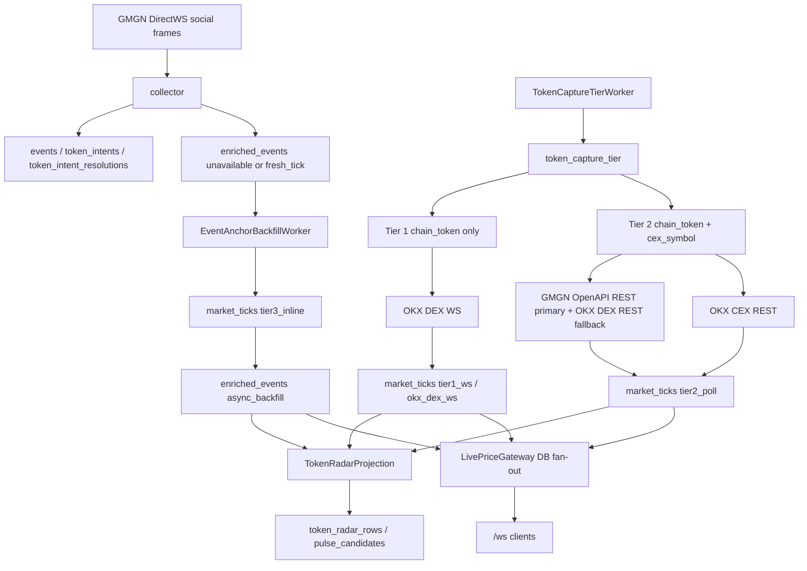

# Price Pipeline Throughput Recovery Implementation Plan

> **For agentic workers:** REQUIRED SUB-SKILL: Use superpowers:subagent-driven-development (recommended) or superpowers:executing-plans to implement this plan task-by-task. Steps use checkbox (`- [ ]`) syntax for tracking.

**Goal:** Restore price pipeline throughput by making capture tiers bounded and provider-true, keeping OKX DEX WS long-lived, moving event-anchor provider calls out of collector ingestion, and reducing downstream projection work.

**Architecture:** The corrected architecture keeps provider roles strict: GMGN DirectWS is ingestion-only, GMGN OpenAPI REST is DEX quote primary, OKX DEX WS is the only Tier 1 DEX price stream, OKX DEX REST is DEX quote fallback, and OKX CEX REST is the CEX quote source. The implementation preserves Kappa/CQRS: `market_ticks` remains append-only; `enriched_events` receives one narrow update path only for `unavailable/pending_backfill -> tier3_inline/async_backfill`; LivePriceGateway fans out DB facts instead of owning upstream price providers.

**Tech Stack:** Python 3, PostgreSQL, Alembic, psycopg, asyncio, pytest, OKX DEX WebSocket, GMGN OpenAPI REST, OKX REST.

---

## Architecture And Data Flow Check

The spec is now directionally clear and fact-aligned after correcting the provider matrix:

- `collector` consumes GMGN DirectWS frames and writes business facts. It must not wait on GMGN OpenAPI or OKX REST for price.
- `token_capture_tier` projects hot targets into bounded capture lanes. Tier 1 is DEX WS only, so it must contain only `chain_token`.
- `market_tick_stream` writes `market_ticks.source_tier='tier1_ws'` from OKX DEX WS only.
- `market_tick_poll` writes `market_ticks.source_tier='tier2_poll'` from GMGN OpenAPI REST primary plus OKX DEX REST fallback for DEX tokens, and OKX CEX REST for CEX symbols.
- `event_anchor_backfill` will write `tier3_inline` ticks asynchronously for events that had no fresh tick at ingestion time.
- `token_radar_projection` consumes `enriched_events + market_ticks`; it should not cause capture-side backpressure.
- `live_price_gateway` reads latest `market_ticks` and fans them out to `/ws`; it does not call OKX DEX WS, GMGN OpenAPI, or OKX CEX REST directly.

Mermaid summary:



KISS decision:

- Do not implement GMGN price WS. The official `GMGNAI/gmgn-skills` repo exposes GMGN OpenAPI REST calls through `fetch` and has no price WebSocket client or endpoint.
- Do not implement OKX CEX WS in this recovery. The current measured problem is DEX WS churn, oversubscribed Tier 1, poll serialism, and collector inline blocking. CEX symbols are lower cardinality, already served by OKX REST, and adding a second WS surface now would expand state management without addressing the main bottleneck.
- Do not keep dual stream APIs. OKX DEX WS has one runtime owner, `market_tick_stream`; `/ws` consumes `market_ticks` instead of opening its own upstream stream.

## File Map

- Modify `src/parallax/domains/asset_market/runtime/token_capture_tier_worker.py`: enforce Tier 1 DEX-only and compute bounded Tier 2.
- Modify `src/parallax/domains/asset_market/repositories/token_capture_tier_repository.py`: add offset support and stale tier demotion.
- Modify `src/parallax/domains/asset_market/runtime/market_tick_stream_worker.py`: reuse one OKX DEX WS connection and apply subscription diffs.
- Modify `src/parallax/domains/asset_market/providers.py`: replace the stream provider protocol with one stateful stream session API.
- Modify `src/parallax/integrations/okx/dex_ws_client.py`: add stateful connect/subscribe/unsubscribe/iterate/close methods and remove the old reconnect-per-call stream API.
- Modify `src/parallax/app/runtime/providers_wiring.py`: map domain stream targets to OKX WS arguments through the stateful adapter only.
- Modify `src/parallax/domains/asset_market/runtime/live_price_gateway.py`: remove upstream provider calls and fan out latest `market_ticks`.
- Modify `src/parallax/domains/asset_market/repositories/market_tick_repository.py`: add a bulk latest-by-target read for LivePriceGateway.
- Modify `src/parallax/domains/asset_market/runtime/market_tick_poll_worker.py`: rotate Tier 2 batches and parallelize bounded REST calls.
- Modify `src/parallax/domains/asset_market/services/event_market_capture.py`: make ingestion capture lookup-only; expose provider quote capture for the async worker.
- Create `src/parallax/domains/asset_market/runtime/event_anchor_backfill_worker.py`: asynchronously backfill pending event anchors.
- Modify `src/parallax/domains/asset_market/repositories/enriched_event_repository.py`: list pending anchors and attach async backfill results.
- Create `src/parallax/platform/db/alembic/versions/20260516_0049_enriched_event_async_backfill.py`: partial index and narrow trigger exception.
- Modify `src/parallax/platform/config/settings.py`: add worker settings and projection cadence settings.
- Modify `src/parallax/app/runtime/bootstrap.py`: wire the new worker.
- Modify `src/parallax/app/runtime/worker_registry.py`: register the new canonical worker and start priority.
- Modify `src/parallax/domains/token_intel/runtime/token_radar_projection_worker.py`: skip cold background windows until stale.
- Modify tests listed per task below.
- Modify docs: `docs/ARCHITECTURE.md`, `docs/WORKERS.md`, and `docs/superpowers/specs/active/2026-05-16-price-pipeline-throughput-recovery-cn.md` if implementation details drift.

---

### Task 1: Tier Projection Boundaries And Demotion

**Files:**
- Modify: `src/parallax/domains/asset_market/runtime/token_capture_tier_worker.py`
- Modify: `src/parallax/domains/asset_market/repositories/token_capture_tier_repository.py`
- Test: `tests/unit/test_token_capture_tier_worker.py`
- Test: `tests/unit/test_token_capture_tier_repository.py`

- [ ] **Step 1: Write failing tests for CEX never entering Tier 1**

Add a worker test shaped like this:

```python
def test_project_once_never_assigns_cex_symbol_to_tier1_ws_even_when_hottest() -> None:
    repos = FakeRepos(
        active_targets=[
            _active_target("cex_symbol", "okx:BTC-USDT", score=999),
            _active_target("chain_token", "solana:So11111111111111111111111111111111111111112", score=500),
        ]
    )
    db = FakePoolBundle(repos)
    worker = TokenCaptureTierWorker(
        name="token_capture_tier",
        settings=_settings(),
        pool_bundle=db,
        telemetry=object(),
        ws_limit=1,
        poll_limit=10,
    )

    result = worker.project_once(now_ms=1_777_800_000_000)

    assert result["tier_counts"] == {1: 1, 2: 1, 3: 0}
    assert repos.token_capture_tiers.upserts == [
        ("chain_token", "solana:So11111111111111111111111111111111111111112", 1, "ws_subscribed"),
        ("cex_symbol", "okx:BTC-USDT", 2, "batch_poll"),
    ]
```

Run:

```bash
uv run pytest tests/unit/test_token_capture_tier_worker.py::test_project_once_never_assigns_cex_symbol_to_tier1_ws_even_when_hottest -q
```

Expected: FAIL because current ranking can put `cex_symbol` in tier 1.

- [ ] **Step 2: Write failing tests for demoting stale Tier 1/Tier 2 rows**

Add a worker test where the fake repository starts with an old Tier 1 row absent from the active target batch:

```python
def test_project_once_demotes_old_hot_rows_absent_from_current_projection() -> None:
    repos = FakeRepos(
        active_targets=[
            _active_target("chain_token", "solana:newhot", score=100),
        ],
        existing_tiers=[
            {"target_type": "chain_token", "target_id": "solana:oldhot", "tier": 1, "reason": "ws_subscribed"},
            {"target_type": "cex_symbol", "target_id": "okx:OLD-USDT", "tier": 2, "reason": "batch_poll"},
        ],
    )
    worker = _worker(repos, ws_limit=1, poll_limit=10)

    worker.project_once(now_ms=1_777_800_000_000)

    assert repos.token_capture_tiers.demotions == [
        ("chain_token", "solana:oldhot", 3, "inline_only"),
        ("cex_symbol", "okx:OLD-USDT", 3, "inline_only"),
    ]
```

Run:

```bash
uv run pytest tests/unit/test_token_capture_tier_worker.py::test_project_once_demotes_old_hot_rows_absent_from_current_projection -q
```

Expected: FAIL because stale rows are never demoted today.

- [ ] **Step 3: Implement tier calculation in worker**

In `token_capture_tier_worker.py`, replace the index-only tier assignment with:

```python
tier1_candidates = [candidate for candidate in candidates if candidate.target_type == "chain_token"]
tier1 = tier1_candidates[: self.ws_limit]
tier1_keys = {(candidate.target_type, candidate.target_id) for candidate in tier1}

tier2_pool = [candidate for candidate in candidates if (candidate.target_type, candidate.target_id) not in tier1_keys]
tier2 = tier2_pool[: self.poll_limit]

projected_rows = [
    _tier_row(candidate, tier=1, reason="ws_subscribed", updated_at_ms=now_ms)
    for candidate in tier1
] + [
    _tier_row(candidate, tier=2, reason="batch_poll", updated_at_ms=now_ms)
    for candidate in tier2
]
```

Keep sorting as `(-score, target_type, target_id)` before this split. Add a small helper returning a dict so the repository receives one normalized shape:

```python
def _tier_row(candidate: _TierCandidate, *, tier: int, reason: str, updated_at_ms: int) -> dict[str, Any]:
    return {
        "target_type": candidate.target_type,
        "target_id": candidate.target_id,
        "tier": tier,
        "reason": reason,
        "score": Decimal(str(candidate.score)),
        "updated_at_ms": int(updated_at_ms),
    }
```

- [ ] **Step 4: Add repository demotion method**

In `token_capture_tier_repository.py`, add:

```python
def demote_absent_hot_rows(self, *, active_keys: list[dict[str, str]], updated_at_ms: int) -> int:
    self._conn.execute(
        """
        WITH active_keys AS (
          SELECT target_type, target_id
          FROM jsonb_to_recordset(%(active_keys)s::jsonb)
            AS x(target_type text, target_id text)
        )
        UPDATE token_capture_tier AS t
        SET tier = 3,
            reason = 'inline_only',
            updated_at_ms = %(updated_at_ms)s
        WHERE t.tier IN (1, 2)
          AND NOT EXISTS (
            SELECT 1
            FROM active_keys k
            WHERE k.target_type = t.target_type
              AND k.target_id = t.target_id
          )
        """,
        {"active_keys": Jsonb(active_keys), "updated_at_ms": int(updated_at_ms)},
    )
    return int(getattr(self._conn, "rowcount", 0) or 0)
```

Import `Jsonb` from `psycopg.types.json`. The worker should call existing `upsert_tier()` for projected rows, then call `demote_absent_hot_rows()` with all currently projected Tier 1/Tier 2 keys.

- [ ] **Step 5: Run task tests**

Run:

```bash
uv run pytest tests/unit/test_token_capture_tier_worker.py tests/unit/test_token_capture_tier_repository.py -q
```

Expected: PASS. Confirm existing assertions that expected CEX Tier 1 now expect CEX Tier 2.

---

### Task 2: Single-Owner OKX DEX WS And DB-Backed Live Gateway

**Files:**
- Modify: `src/parallax/domains/asset_market/providers.py`
- Modify: `src/parallax/app/runtime/providers_wiring.py`
- Modify: `src/parallax/integrations/okx/dex_ws_client.py`
- Modify: `src/parallax/domains/asset_market/runtime/market_tick_stream_worker.py`
- Modify: `src/parallax/domains/asset_market/runtime/live_price_gateway.py`
- Modify: `src/parallax/domains/asset_market/repositories/market_tick_repository.py`
- Test: `tests/unit/test_okx_dex_ws_client.py`
- Test: `tests/unit/test_market_tick_stream_worker.py`
- Test: `tests/unit/test_live_price_gateway.py`
- Test: `tests/unit/test_provider_capabilities.py`
- Test: `tests/unit/test_providers_wiring.py`

- [ ] **Step 1: Write failing provider tests for stateful WS lifecycle**

Add tests asserting one connection survives multiple subscribe changes:

```python
async def test_okx_dex_ws_provider_subscribes_and_unsubscribes_without_reconnecting(monkeypatch) -> None:
    fake_ws = FakeWebSocket(messages=[_login_ok(), _price_message("1", "0xabc", price="1.23")])
    connect_calls = []
    monkeypatch.setattr(dex_ws_client.websockets, "connect", lambda *args, **kwargs: _fake_connect(fake_ws, connect_calls))
    provider = OkxDexWebSocketMarketProvider(
        url="wss://example.test",
        api_key="key",
        secret_key="secret",
        passphrase="pass",
        subscription_limit=100,
    )

    await provider.ensure_connected()
    await provider.replace_subscriptions([{"chainIndex": "1", "tokenContractAddress": "0xabc"}])
    await provider.replace_subscriptions([{"chainIndex": "1", "tokenContractAddress": "0xdef"}])

    assert len(connect_calls) == 1
    assert _sent_ops(fake_ws) == ["login", "subscribe", "unsubscribe", "subscribe"]
```

Run:

```bash
uv run pytest tests/unit/test_okx_dex_ws_client.py::test_okx_dex_ws_provider_subscribes_and_unsubscribes_without_reconnecting -q
```

Expected: FAIL because the provider has no stateful lifecycle methods.

- [ ] **Step 2: Replace the stream protocol with one stateful API**

In `providers.py`, change `DexMarketStreamProvider` to one stateful session shape:

```python
class DexMarketStreamProvider(Protocol):
    async def replace_subscriptions(self, targets: list[DexMarketStreamTarget]) -> None: ...

    def iter_price_info(self) -> AsyncIterator[DexMarketFactUpdate]: ...

    async def aclose(self) -> None: ...
```

Do not keep `stream_price_info()` on the protocol. This is a hard cut inside this codebase, not a runtime compatibility layer.

- [ ] **Step 3: Implement stateful provider methods**

In `OkxDexWebSocketMarketProvider`, add instance state:

```python
self._websocket: Any | None = None
self._subscribed_args: set[tuple[str, str]] = set()
```

Add methods:

```python
async def ensure_connected(self) -> None:
    if self._websocket is not None:
        return
    self._set_connection_state("connecting")
    self._websocket = await websockets.connect(self.url, ping_interval=20, close_timeout=5)
    self._set_connection_state("authenticating")
    await self._websocket.send(json.dumps(_login_payload(self.api_key, self.secret_key, self.passphrase)))
    await _wait_for_login(self._websocket)
    self._set_connection_state("subscribed")

async def replace_subscriptions(self, targets: list[dict[str, str]]) -> None:
    await self.ensure_connected()
    desired_args = _subscription_args(targets, limit=self.subscription_limit)
    desired_keys = {_arg_key(arg) for arg in desired_args}
    to_unsubscribe = [_arg_from_key(key) for key in sorted(self._subscribed_args - desired_keys)]
    to_subscribe = [_arg_from_key(key) for key in sorted(desired_keys - self._subscribed_args)]
    if to_unsubscribe:
        await self._websocket.send(json.dumps({"op": "unsubscribe", "args": to_unsubscribe}))
    if to_subscribe:
        await self._websocket.send(json.dumps({"op": "subscribe", "args": to_subscribe}))
    self._subscribed_args = desired_keys

async def iter_price_info(self) -> AsyncIterator[OkxDexPriceInfoUpdate]:
    await self.ensure_connected()
    while True:
        raw_message = await self._websocket.recv()
        message = json.loads(str(raw_message))
        if isinstance(message, dict) and message.get("event") == "error":
            raise OkxDexWsClientError(_error_message(message))
        for row in _rows_from_message(message):
            update = _price_info_update_from_row(row)
            if update is not None:
                self._set_connection_state("streaming")
                yield update

async def aclose(self) -> None:
    websocket = self._websocket
    self._websocket = None
    self._subscribed_args = set()
    if websocket is not None:
        await websocket.close()
    self._set_connection_state("disconnected")
```

Remove the old `stream_price_info()` method from `OkxDexWebSocketMarketProvider`. Keeping it would preserve the reconnect-per-call API that caused the bug.

- [ ] **Step 4: Update the provider adapter without a legacy branch**

In `providers_wiring.py`, change `OkxDexWebSocketMarketProviderAdapter` to expose the same stateful domain API:

```python
async def replace_subscriptions(self, targets: list[DexMarketStreamTarget]) -> None:
    mapped_targets = [_okx_ws_target(target) for target in targets if okx_chain_index(target.chain_id)]
    await self._provider.replace_subscriptions(mapped_targets)

async def iter_price_info(self) -> AsyncIterator[DexMarketFactUpdate]:
    async for update in self._provider.iter_price_info():
        yield _domain_dex_market_fact_update(update)
```

Also expose a sync `close()` on the adapter that is safe during partial provider wiring cleanup before a connection exists:

```python
def close(self) -> None:
    if getattr(self._provider, "_websocket", None) is not None:
        raise RuntimeError("use aclose() for connected OKX DEX WS provider cleanup")
```

Runtime shutdown already prefers `aclose()` when present, so connected sessions are closed through the async path. Do not add `if hasattr(..., "stream_price_info")` anywhere.

- [ ] **Step 5: Write failing worker test for subscription diffs**

Add a fake stream provider with `replace_subscriptions()` and `iter_price_info()`. Assert two `run_once()` calls do not close and recreate an iterator:

```python
async def test_market_tick_stream_worker_reuses_stateful_provider_and_replaces_subscriptions() -> None:
    provider = FakeStatefulStreamProvider([
        _update("solana", "A", price=1),
        _update("solana", "B", price=2),
    ])
    repos = FakeRepos(tier_rows=[_tier1("solana:A")])
    worker = _worker(repos, stream_dex_market=provider, stream_cycle_seconds=0.01)

    await worker.run_once()
    repos.token_capture_tiers.rows = [_tier1("solana:B")]
    await worker.run_once()

    assert provider.replace_calls == [[("solana", "A")], [("solana", "B")]]
    assert provider.close_count == 0
```

Run:

```bash
uv run pytest tests/unit/test_market_tick_stream_worker.py::test_market_tick_stream_worker_reuses_stateful_provider_and_replaces_subscriptions -q
```

Expected: FAIL because worker only calls `stream_price_info()`.

- [ ] **Step 6: Implement stateful-only path in stream worker**

In `MarketTickStreamWorker._stream_and_persist_ticks()`, use the stateful API unconditionally:

```python
await self.stream_dex_market.replace_subscriptions(targets)
iterator = self.stream_dex_market.iter_price_info().__aiter__()
```

Do not call provider `close()` between normal cycles. Only close it during worker/runtime shutdown.

- [ ] **Step 7: Write failing LivePriceGateway test for DB-only fan-out**

Add a test proving `/ws` fan-out no longer opens an upstream price provider:

```python
async def test_live_price_gateway_uses_market_ticks_without_upstream_price_providers() -> None:
    repos = FakeRepos(
        active_targets=[_live_target("chain_token", "solana:abc")],
        latest_ticks={
            ("chain_token", "solana:abc"): _market_tick_row(
                target_type="chain_token",
                target_id="solana:abc",
                source_provider="okx_dex_ws",
                price_usd="1.23",
            )
        },
    )
    providers = SimpleNamespace(
        stream_dex_market=ExplodingStreamProvider(),
        message_cex_market=ExplodingCexProvider(),
    )
    published = []
    gateway = LivePriceGateway(
        pool_bundle=FakeDB(repos),
        providers=providers,
        interval_seconds=0.01,
        projection_version="token_radar_v7",
        on_live_market_update=published.append,
        clock=lambda: 1_777_800_000_000,
    )

    await gateway.run_once(now_ms=1_777_800_000_000)

    assert published[0]["target_type"] == "chain_token"
    assert published[0]["target_id"] == "solana:abc"
    assert published[0]["provider"] == "okx_dex_ws"
```

Run:

```bash
uv run pytest tests/unit/test_live_price_gateway.py::test_live_price_gateway_uses_market_ticks_without_upstream_price_providers -q
```

Expected: FAIL because LivePriceGateway currently calls `stream_price_info()` and CEX REST directly.

- [ ] **Step 8: Add bulk latest tick read and rewrite LivePriceGateway fan-out**

Add to `MarketTickRepository`:

```python
def latest_for_targets(
    self,
    *,
    targets: list[dict[str, str]],
    max_age_ms: int,
    now_ms: int,
) -> dict[tuple[str, str], dict[str, Any]]:
    if not targets:
        return {}
    values_sql = ",".join(["(%s, %s)"] * len(targets))
    params: list[Any] = []
    for target in targets:
        params.extend([target["target_type"], target["target_id"]])
    rows = self._conn.execute(
        f"""
        WITH requested(target_type, target_id) AS (VALUES {values_sql}),
        ranked AS (
          SELECT mt.*,
                 row_number() OVER (
                   PARTITION BY mt.target_type, mt.target_id
                   ORDER BY mt.observed_at_ms DESC, mt.received_at_ms DESC, mt.tick_id DESC
                 ) AS rn
          FROM requested r
          JOIN market_ticks mt
            ON mt.target_type = r.target_type
           AND mt.target_id = r.target_id
          WHERE mt.received_at_ms >= %s
        )
        SELECT *
        FROM ranked
        WHERE rn = 1
        """,
        [*params, int(now_ms) - int(max_age_ms)],
    ).fetchall()
    return {(str(row["target_type"]), str(row["target_id"])): dict(row) for row in rows}
```

In `LivePriceGateway`, remove `self.stream_provider`, `self.cex_market`, `_stream_dex()`, and `_poll_cex()`. Replace the cycle body with:

```python
latest_by_target = await asyncio.to_thread(
    self._latest_market_ticks,
    targets=targets,
    now_ms=received_at_ms,
)
for target in targets:
    tick = latest_by_target.get((str(target["target_type"]), str(target["target_id"])))
    if tick is None:
        continue
    await self._publish(self._payload_from_tick(tick, target=target, received_at_ms=received_at_ms).payload)
    result["live_market_updates_published"] += 1
```

This makes `/ws` a read-model fan-out. It removes duplicate direct upstream calls and prevents LivePriceGateway from racing `market_tick_stream` over the same OKX DEX WS session.

- [ ] **Step 9: Run task tests**

Run:

```bash
uv run pytest \
  tests/unit/test_okx_dex_ws_client.py \
  tests/unit/test_market_tick_stream_worker.py \
  tests/unit/test_live_price_gateway.py \
  tests/unit/test_provider_capabilities.py \
  tests/unit/test_providers_wiring.py -q
```

Expected: PASS. Existing test `test_market_tick_stream_worker_skips_cex_symbol_tier1_targets` should still pass and becomes a guard against accidental CEX WS use. Add a grep check after tests:

```bash
rg -n "stream_price_info|hasattr\\(.*stream_price_info" src/parallax tests -g '*.py'
```

Expected: no production references. Tests may mention the old name only in this grep command or in one explicit removal regression test.

---

### Task 3: Tier 2 Poll Rotation And Bounded REST Concurrency

**Files:**
- Modify: `src/parallax/domains/asset_market/repositories/token_capture_tier_repository.py`
- Modify: `src/parallax/domains/asset_market/runtime/market_tick_poll_worker.py`
- Modify: `src/parallax/platform/config/settings.py`
- Test: `tests/unit/test_market_tick_poll_worker.py`
- Test: `tests/unit/test_token_capture_tier_repository.py`
- Test: `tests/unit/test_worker_settings.py`

- [ ] **Step 1: Write failing test for rotated Tier 2 listing**

Add repository and worker tests:

```python
def test_market_tick_poll_worker_rotates_tier2_offset_between_runs() -> None:
    repos = FakeRepos(tier_rows=[_tier2(f"okx:SYM{i}-USDT") for i in range(5)])
    worker = _worker(repos, batch_size=2, concurrency=2)

    await worker.run_once()
    await worker.run_once()
    await worker.run_once()

    assert repos.token_capture_tiers.calls == [
        {"tier": 2, "limit": 2, "offset": 0},
        {"tier": 2, "limit": 2, "offset": 2},
        {"tier": 2, "limit": 2, "offset": 4},
    ]
```

Run:

```bash
uv run pytest tests/unit/test_market_tick_poll_worker.py::test_market_tick_poll_worker_rotates_tier2_offset_between_runs -q
```

Expected: FAIL because `list_by_tier()` has no offset and worker always reads the first page.

- [ ] **Step 2: Add optional offset to repository**

Change signature:

```python
def list_by_tier(self, tier: int, limit: int, offset: int = 0) -> list[dict[str, Any]]:
```

Add SQL clause:

```sql
LIMIT %(limit)s
OFFSET %(offset)s
```

Pass `{"tier": tier, "limit": limit, "offset": max(0, int(offset))}`.

- [ ] **Step 3: Implement worker cursor**

In `MarketTickPollWorker.__init__()`:

```python
self.concurrency = max(1, int(getattr(resolved_settings, "concurrency", 4) or 4))
self._tier2_offset = 0
```

In `_list_tier2_rows()`:

```python
with self.db.worker_session(self.name) as repos:
    rows = repos.token_capture_tiers.list_by_tier(2, limit=self.batch_size, offset=self._tier2_offset)
    if not rows and self._tier2_offset:
        self._tier2_offset = 0
        rows = repos.token_capture_tiers.list_by_tier(2, limit=self.batch_size, offset=0)
self._tier2_offset += len(rows)
return [dict(row) for row in rows]
```

- [ ] **Step 4: Write failing test for CEX REST concurrency**

Use a fake CEX provider that records overlapping calls:

```python
async def test_market_tick_poll_worker_polls_cex_targets_with_bounded_concurrency() -> None:
    provider = BlockingCexProvider()
    repos = FakeRepos(tier_rows=[_tier2(f"okx:SYM{i}-USDT") for i in range(4)])
    worker = _worker(repos, message_cex_market=provider, batch_size=4, concurrency=2)

    task = asyncio.create_task(worker.run_once())
    await provider.wait_until_active(2)
    provider.release_all()
    await task

    assert provider.max_active == 2
```

Run:

```bash
uv run pytest tests/unit/test_market_tick_poll_worker.py::test_market_tick_poll_worker_polls_cex_targets_with_bounded_concurrency -q
```

Expected: FAIL because CEX targets are polled serially.

- [ ] **Step 5: Implement async bounded polling**

Change `run_once()` to async orchestration instead of wrapping the whole worker in one `to_thread()`:

```python
async def run_once(self) -> WorkerResult:
    rows = self._list_tier2_rows()
    targets = _poll_targets(rows)
    chain_result, cex_result = await asyncio.gather(
        self._poll_chain_targets_async(targets.chain_targets),
        self._poll_cex_targets_async(targets.cex_targets),
    )
    skipped_reasons = Counter(targets.skipped_reasons)
    skipped_reasons.update(chain_result.skipped_reasons)
    skipped_reasons.update(cex_result.skipped_reasons)
    ticks = [*chain_result.ticks, *cex_result.ticks]
    inserted = self._persist_ticks(ticks)
    return _result(rows=rows, targets=targets, ticks=ticks, inserted=inserted, skipped_reasons=skipped_reasons)
```

Use `asyncio.Semaphore(self.concurrency)` around individual REST calls. Keep the DEX batch call as one `asyncio.to_thread()` call first; only the fallback individual DEX path needs bounded gather. Each async helper should return a small `_PollProviderResult(ticks: list[MarketTick], skipped_reasons: Counter[str])`; do not mutate a shared `Counter` from concurrent branches.

- [ ] **Step 6: Add settings**

In `MarketTickPollWorkerSettings`, add:

```python
concurrency: int = Field(default=4, ge=1)
```

In `default_workers_yaml()`:

```yaml
market_tick_poll:
  enabled: true
  interval_seconds: 15.0
  batch_size: 100
  concurrency: 4
```

- [ ] **Step 7: Run task tests**

Run:

```bash
uv run pytest tests/unit/test_market_tick_poll_worker.py tests/unit/test_token_capture_tier_repository.py tests/unit/test_worker_settings.py -q
```

Expected: PASS. Notes payload should include `targets_selected`, `chain_targets`, `cex_targets`, `ticks_attempted`, `ticks_inserted`, and `skipped_reasons` as before.

---

### Task 4: Async Event Anchor Backfill

**Files:**
- Modify: `src/parallax/domains/asset_market/services/event_market_capture.py`
- Create: `src/parallax/domains/asset_market/runtime/event_anchor_backfill_worker.py`
- Modify: `src/parallax/domains/asset_market/repositories/enriched_event_repository.py`
- Modify: `src/parallax/platform/config/settings.py`
- Modify: `src/parallax/app/runtime/bootstrap.py`
- Modify: `src/parallax/app/runtime/worker_registry.py`
- Create: `src/parallax/platform/db/alembic/versions/20260516_0049_enriched_event_async_backfill.py`
- Test: `tests/unit/test_event_market_capture.py`
- Test: `tests/unit/test_event_anchor_backfill_worker.py`
- Test: `tests/unit/test_bootstrap_worker_runtime_wiring.py`
- Test: `tests/unit/test_worker_settings.py`
- Test: `tests/architecture/test_worker_runtime_contracts.py`
- Test: `tests/integration/test_postgres_schema_runtime.py`

- [ ] **Step 1: Write failing service test: collector capture is lookup-only**

Add:

```python
def test_capture_for_event_does_not_call_provider_when_no_fresh_tick() -> None:
    providers = Providers(dex_quote_market=ExplodingProvider(), message_cex_market=ExplodingProvider())
    service = EventMarketCaptureService(providers=providers, now_ms=lambda: 1_777_800_000_000)

    result = service.capture_for_event(
        event_id="evt",
        intent_id="intent",
        resolution_id="res",
        resolution={"target_type": "chain_token", "target_id": "solana:abc"},
        event_ms=1_777_799_999_000,
        tick_lookup=TickLookup(latest_at_or_before=lambda *_: None),
    )

    assert result.tick is None
    assert result.capture.capture_method == "unavailable"
    assert result.capture.capture_reason == "pending_backfill"
```

Run:

```bash
uv run pytest tests/unit/test_event_market_capture.py::test_capture_for_event_does_not_call_provider_when_no_fresh_tick -q
```

Expected: FAIL because current service calls provider inline.

- [ ] **Step 2: Change capture service behavior**

In `capture_for_event()`, replace provider calls with:

```python
if row is not None:
    return _existing_capture(req, row=row, created_at_ms=self._now_ms())
return _unavailable(req, reason="pending_backfill", created_at_ms=self._now_ms())
```

Expose a separate method for the async worker. Provider selection is deterministic by `target_type`: `chain_token` uses the already-wired `providers.dex_quote_market` stack, which is GMGN OpenAPI primary plus OKX DEX REST fallback; `cex_symbol` uses `providers.message_cex_market`, which is OKX CEX REST. There is no free-form provider choice inside the worker.

```python
def capture_backfill_quote(
    self,
    *,
    event_id: str,
    intent_id: str,
    resolution_id: str,
    resolution: Mapping[str, Any],
    event_ms: int,
) -> CaptureResult:
    target_type = _target_type(resolution.get("target_type"))
    target_id = _clean_str(resolution.get("target_id"))
    if target_type is None or not target_id:
        req = _CaptureRequest(event_id, intent_id, resolution_id, target_type or "chain_token", target_id, event_ms)
        return _unavailable(req, reason="invalid_resolution", created_at_ms=self._now_ms())
    req = _CaptureRequest(event_id, intent_id, resolution_id, target_type, target_id, event_ms)
    if target_type == "chain_token":
        return _capture_chain_token(req, resolution=resolution, providers=self._providers, now_ms=self._now_ms)
    return _capture_cex_symbol(req, resolution=resolution, providers=self._providers, now_ms=self._now_ms)
```

- [ ] **Step 3: Add repository methods for pending anchors**

In `EnrichedEventRepository`, add:

```python
def list_pending_backfill(self, *, limit: int, now_ms: int, min_age_ms: int) -> list[dict[str, Any]]:
    return list(
        self._conn.execute(
            """
            SELECT *
            FROM enriched_events
            WHERE capture_method = 'unavailable'
              AND capture_reason = 'pending_backfill'
              AND created_at_ms <= %(ready_before_ms)s
            ORDER BY created_at_ms ASC, event_id ASC, intent_id ASC
            LIMIT %(limit)s
            """,
            {"ready_before_ms": int(now_ms) - int(min_age_ms), "limit": max(1, int(limit))},
        ).fetchall()
    )
```

And:

```python
def attach_backfill_capture(self, capture: EnrichedEventCapture) -> bool:
    cursor = self._conn.execute(
        """
        UPDATE enriched_events
        SET tick_id = %(tick_id)s,
            tick_lag_ms = %(tick_lag_ms)s,
            capture_method = %(capture_method)s,
            capture_reason = %(capture_reason)s
        WHERE event_id = %(event_id)s
          AND intent_id = %(intent_id)s
          AND capture_method = 'unavailable'
          AND capture_reason = 'pending_backfill'
          AND tick_id IS NULL
        """,
        {
            "event_id": capture.event_id,
            "intent_id": capture.intent_id,
            "tick_id": capture.tick_id,
            "tick_lag_ms": capture.tick_lag_ms,
            "capture_method": capture.capture_method,
            "capture_reason": capture.capture_reason,
        },
    )
    return int(getattr(cursor, "rowcount", 0) or 0) == 1
```

- [ ] **Step 4: Create migration with narrow update allowance**

Create `20260516_0049_enriched_event_async_backfill.py` with `down_revision = "20260516_0048"`. Upgrade should:

```sql
CREATE INDEX IF NOT EXISTS idx_enriched_events_pending_backfill
  ON enriched_events(created_at_ms ASC, event_id ASC, intent_id ASC)
  WHERE capture_method = 'unavailable'
    AND capture_reason = 'pending_backfill'
    AND tick_id IS NULL;
```

Replace `forbid_market_fact_update()` so `market_ticks` stays append-only and `enriched_events` only allows this transition:

```sql
IF TG_TABLE_NAME = 'enriched_events'
   AND OLD.capture_method = 'unavailable'
   AND OLD.capture_reason = 'pending_backfill'
   AND OLD.tick_id IS NULL
   AND NEW.capture_method = 'tier3_inline'
   AND NEW.capture_reason = 'async_backfill'
   AND NEW.tick_id IS NOT NULL
   AND NEW.tick_lag_ms IS NOT NULL
   AND NEW.event_id = OLD.event_id
   AND NEW.intent_id = OLD.intent_id
   AND NEW.resolution_id = OLD.resolution_id
   AND NEW.target_type = OLD.target_type
   AND NEW.target_id = OLD.target_id
   AND NEW.t_event_ms = OLD.t_event_ms
   AND NEW.created_at_ms = OLD.created_at_ms
THEN
  RETURN NEW;
END IF;
RAISE EXCEPTION 'market facts are append-only';
```

- [ ] **Step 5: Create EventAnchorBackfillWorker**

Create `event_anchor_backfill_worker.py` with this flow:

```python
class EventAnchorBackfillWorker(WorkerBase):
    worker_name = "event_anchor_backfill"

    async def run_once(self) -> WorkerResult:
        now_ms = int(self.clock())
        rows = self._list_pending(now_ms=now_ms)
        semaphore = asyncio.Semaphore(self.concurrency)
        results = await asyncio.gather(*(self._capture_one(row, semaphore) for row in rows))
        ticks = [result.tick for result in results if result.tick is not None]
        captures = [result.capture for result in results if result.tick is not None]
        inserted, attached = self._persist(ticks=ticks, captures=captures)
        return WorkerResult(
            processed=attached,
            skipped=len(rows) - attached,
            notes={
                "pending_selected": len(rows),
                "ticks_inserted": inserted,
                "captures_attached": attached,
            },
        )
```

`_capture_one()` should call `EventMarketCaptureService.capture_backfill_quote()` inside `asyncio.to_thread()` and convert successful capture reason to `async_backfill` before persisting. The worker should notify `market_tick_written` for inserted ticks.

- [ ] **Step 6: Add settings and wiring**

In `settings.py`:

```python
class EventAnchorBackfillWorkerSettings(PerWorkerSettings):
    interval_seconds: float = Field(default=1.0, ge=0)
    batch_size: int = Field(default=50, ge=1)
    concurrency: int = Field(default=8, ge=1)
    min_age_ms: int = Field(default=250, ge=0)
```

Add `event_anchor_backfill` to `WorkersSettings` and `default_workers_yaml()`.

In `worker_registry.py`, add:

```python
"event_anchor_backfill": (
    "parallax.domains.asset_market.runtime.event_anchor_backfill_worker.EventAnchorBackfillWorker"
),
```

Start priority should be after `market_tick_poll` and before `live_price_gateway`:

```python
"event_anchor_backfill": 45,
```

In `bootstrap.py`, construct the worker when enabled and at least one quote provider is available.

- [ ] **Step 7: Run task tests**

Run:

```bash
uv run pytest \
  tests/unit/test_event_market_capture.py \
  tests/unit/test_event_anchor_backfill_worker.py \
  tests/unit/test_bootstrap_worker_runtime_wiring.py \
  tests/unit/test_worker_settings.py \
  tests/architecture/test_worker_runtime_contracts.py \
  tests/integration/test_postgres_schema_runtime.py -q
```

Expected: PASS. Integration test must prove `market_ticks` updates still fail while the single `enriched_events` pending-backfill transition succeeds.

---

### Task 5: Token Radar Projection Cold-Window Cadence

**Files:**
- Modify: `src/parallax/domains/token_intel/runtime/token_radar_projection_worker.py`
- Modify: `src/parallax/platform/config/settings.py`
- Test: `tests/unit/test_token_radar_projection_worker.py`
- Test: `tests/unit/test_worker_settings.py`

- [ ] **Step 1: Write failing cadence tests**

Add tests:

```python
def test_projection_worker_skips_background_window_until_cold_interval_elapsed() -> None:
    worker = _worker(
        windows=("5m", "1h"),
        scopes=("all",),
        hot_windows=("5m",),
        cold_interval_seconds=60,
        coverage={
            ("5m", "all"): {"status": "ready", "computed_at_ms": 1_000},
            ("1h", "all"): {"status": "ready", "computed_at_ms": 990},
        },
    )

    result = worker.rebuild_once(now_ms=1_500)

    assert list(result["windows"]) == ["5m:all"]
```

And:

```python
def test_projection_worker_runs_stale_background_window_after_cold_interval() -> None:
    worker = _worker(
        windows=("5m", "1h"),
        scopes=("all",),
        hot_windows=("5m",),
        cold_interval_seconds=60,
        coverage={
            ("5m", "all"): {"status": "ready", "computed_at_ms": 120_000},
            ("1h", "all"): {"status": "ready", "computed_at_ms": 1_000},
        },
    )

    result = worker.rebuild_once(now_ms=122_000)

    assert list(result["windows"]) == ["5m:all", "1h:all"]
```

Run:

```bash
uv run pytest tests/unit/test_token_radar_projection_worker.py::test_projection_worker_skips_background_window_until_cold_interval_elapsed tests/unit/test_token_radar_projection_worker.py::test_projection_worker_runs_stale_background_window_after_cold_interval -q
```

Expected: FAIL because current worker runs a background item every cycle.

- [ ] **Step 2: Add settings**

In `TokenRadarProjectionWorkerSettings`:

```python
cold_interval_seconds: float = Field(default=60.0, ge=0)
```

In `default_workers_yaml()`:

```yaml
token_radar_projection:
  enabled: true
  interval_seconds: 10.0
  batch_size: 100
  statement_timeout_seconds: 120.0
  advisory_lock_key: 2026051501
  wakes_on: ["market_tick_written", "resolution_updated"]
  windows: ["5m", "1h", "4h", "24h"]
  scopes: ["all", "matched"]
  hot_windows: ["5m"]
  cold_interval_seconds: 60.0
```

- [ ] **Step 3: Implement cadence selection**

In `TokenRadarProjectionWorker.__init__()`:

```python
self.cold_interval_ms = int(float(getattr(settings, "cold_interval_seconds", 60.0) or 0) * 1000)
```

Change `_rebuild_once()` to pass coverage and computed time into work item selection:

```python
coverage = self._latest_coverage()
missing_items = self._missing_work_items(coverage)
if missing_items:
    work_items = _dedupe_work_items([*self._hot_work_items(), *missing_items])
    primary_item = missing_items[0]
else:
    work_items, primary_item = self._next_work_items(coverage=coverage, computed_at_ms=computed_at_ms)
```

Change `_next_background_window_scope()` to skip non-stale items:

```python
def _next_background_window_scope(
    self,
    *,
    coverage: dict[tuple[str, str], dict[str, Any]],
    computed_at_ms: int,
) -> tuple[str, str] | None:
    work_items = [
        (window, scope)
        for window in self.windows
        if window not in self.hot_windows
        for scope in self.scopes
    ]
    for _ in range(len(work_items)):
        item = work_items[self._cursor % len(work_items)]
        self._cursor += 1
        latest = coverage.get(item, {}).get("computed_at_ms")
        if latest is None or computed_at_ms - int(latest) >= self.cold_interval_ms:
            return item
    return None
```

Do not parallelize projection rebuilds in this pass. The repository already uses per-window advisory locks, and cadence reduction is the lower-complexity fix for current backpressure.

- [ ] **Step 4: Run task tests**

Run:

```bash
uv run pytest tests/unit/test_token_radar_projection_worker.py tests/unit/test_worker_settings.py -q
```

Expected: PASS.

---

### Task 6: Documentation, Diagnostics, And End-To-End Verification

**Files:**
- Modify: `docs/ARCHITECTURE.md`
- Modify: `docs/WORKERS.md`
- Modify: `docs/superpowers/specs/active/2026-05-16-price-pipeline-throughput-recovery-cn.md`
- Test: `tests/integration/test_api_health.py`
- Test: `tests/integration/test_api_http.py`

- [ ] **Step 1: Update docs provider matrix**

Add this matrix to `docs/ARCHITECTURE.md` or link to it from the active spec:

| Layer | Primary | Fallback | Writes facts | Notes |
|---|---|---|---|---|
| Social ingestion | GMGN DirectWS | none | `events`, intents, resolutions | Not a price source |
| Tier 1 price stream | OKX DEX WS | none | `market_ticks` | `chain_token` only |
| Tier 2 DEX poll | GMGN OpenAPI REST | OKX DEX REST | `market_ticks` | No GMGN price WS in official skills repo |
| Tier 2 CEX poll | OKX CEX REST | none | `market_ticks` | CEX WS intentionally out of this pass |
| Event anchor DEX backfill | GMGN OpenAPI REST | OKX DEX REST | `market_ticks`, narrow `enriched_events` update | Same `dex_quote_market` provider stack as Tier 2 |
| Event anchor CEX backfill | OKX CEX REST | none | `market_ticks`, narrow `enriched_events` update | Same `message_cex_market` provider as Tier 2 |
| Frontend `/ws` | `market_ticks` read model | none | no facts | LivePriceGateway fan-out only, no upstream provider calls |

- [ ] **Step 2: Update worker docs**

In `docs/WORKERS.md`, add `event_anchor_backfill` with:

```markdown
| event_anchor_backfill | `enriched_events` pending rows | `market_ticks`, `enriched_events` async backfill transition | Async quote capture for events whose ingestion path found no fresh tick. |
```

Also document that `market_tick_stream` accepts only Tier 1 `chain_token` rows, `market_tick_poll` owns CEX quotes, and `live_price_gateway` reads latest `market_ticks` instead of calling upstream price providers.

- [ ] **Step 3: Add or update API health expectations**

Update tests that enumerate canonical workers so `event_anchor_backfill` appears in health payloads when enabled:

```python
assert "event_anchor_backfill" in data["workers"]
assert data["workers"]["event_anchor_backfill"]["enabled"] is True
```

Run:

```bash
uv run pytest tests/integration/test_api_health.py tests/integration/test_api_http.py -q
```

Expected: PASS.

- [ ] **Step 4: Run full focused suite**

Run:

```bash
uv run pytest \
  tests/unit/test_token_capture_tier_worker.py \
  tests/unit/test_token_capture_tier_repository.py \
  tests/unit/test_okx_dex_ws_client.py \
  tests/unit/test_market_tick_stream_worker.py \
  tests/unit/test_market_tick_poll_worker.py \
  tests/unit/test_event_market_capture.py \
  tests/unit/test_event_anchor_backfill_worker.py \
  tests/unit/test_token_radar_projection_worker.py \
  tests/unit/test_bootstrap_worker_runtime_wiring.py \
  tests/unit/test_worker_settings.py \
  tests/architecture/test_worker_runtime_contracts.py \
  tests/integration/test_postgres_schema_runtime.py \
  tests/integration/test_api_health.py \
  tests/integration/test_api_http.py -q
```

Expected: PASS.

- [ ] **Step 5: Run live verification SQL after deploy or local worker run**

Run:

```sql
SELECT target_type, tier, count(*)
FROM token_capture_tier
GROUP BY target_type, tier
ORDER BY target_type, tier;
```

Expected:

- `cex_symbol` Tier 1 count is `0`.
- `chain_token` Tier 1 count is `<= workers.market_tick_stream.subscription_limit`.
- Tier 2 total count is `<= workers.token_capture_tier.poll_limit`.

Run:

```sql
SELECT source_tier, source_provider, target_type, count(*) AS rows, count(DISTINCT target_id) AS targets
FROM market_ticks
WHERE received_at_ms >= (extract(epoch from now()) * 1000)::bigint - 3600000
GROUP BY source_tier, source_provider, target_type
ORDER BY rows DESC;
```

Expected:

- `tier1_ws / okx_dex_ws` rows have `target_type='chain_token'`.
- `tier2_poll / okx_cex_rest` rows have `target_type='cex_symbol'`.
- `tier2_poll / gmgn_dex_quote` and `tier2_poll / okx_dex_rest` rows have `target_type='chain_token'`.
- No `gmgn_ws` or `okx_cex_ws` provider appears.

Run:

```sql
SELECT capture_method, capture_reason, count(*)
FROM enriched_events
WHERE created_at_ms >= (extract(epoch from now()) * 1000)::bigint - 3600000
GROUP BY capture_method, capture_reason
ORDER BY count(*) DESC;
```

Expected:

- `pending_backfill` rows do not grow monotonically while workers are healthy.
- `tier3_inline / async_backfill` appears when provider quote succeeds after ingestion.

---

## Self-Review

Spec coverage:

- Provider facts: covered in architecture check and Task 6 docs.
- Tier 1 oversubscription and CEX Tier 1 bug: covered by Task 1.
- OKX DEX WS reconnect churn: covered by Task 2.
- Tier 2 poll starvation and serial CEX calls: covered by Task 3.
- Collector inline provider blocking: covered by Task 4.
- Token radar projection backpressure: covered by Task 5.
- Verification gates: covered by Task 6.

Placeholder scan:

- No placeholder markers or unspecified “write tests” steps remain.
- Each code-changing task has concrete test commands and expected outcomes.

Type consistency:

- New worker name is consistently `event_anchor_backfill`.
- New capture reason is consistently `pending_backfill` before async work and `async_backfill` after successful update.
- Tier 1 remains `chain_token` only; CEX remains `tier2_poll / okx_cex_rest`.
- Stream API is stateful-only; `stream_price_info()` is removed rather than kept as a compatibility branch.
- LivePriceGateway is DB-backed fan-out, so OKX DEX WS has one runtime owner and CEX REST has one polling owner.
- Event backfill provider choice is deterministic by `target_type`, not a multi-source selection heuristic.

## Execution Handoff

Plan complete and saved to `docs/superpowers/plans/active/2026-05-16-price-pipeline-throughput-recovery-plan-cn.md`.

Two execution options:

1. **Subagent-Driven (recommended)** - dispatch a fresh subagent per task, review between tasks, fast iteration.
2. **Inline Execution** - execute tasks in this session using executing-plans, batch execution with checkpoints.
