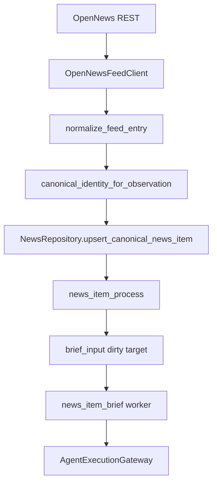

# News Brief Stable Hard Cut Implementation Plan

> **For agentic workers:** REQUIRED SUB-SKILL: Use superpowers:subagent-driven-development (recommended) or superpowers:executing-plans to implement this plan task-by-task. Steps use checkbox (`- [ ]`) syntax for tracking.

**Goal:** 先稳定降低 `news_item_brief` LLM 消耗：阻止历史/旧 OpenNews 高分项进入 brief，修正明显错误的 public URL hard identity，并让确定无效的 validation 输出一次 LLM 后终止。

**Architecture:** 第一阶段不做复杂“同业务事件”合并，不做历史 `news_items` repair，不重挂 observation edges，不改写 agent audit ledger。只做 hard cut：read-only diagnostics、live fetch published cutoff、fresh high-score eligibility gate、trusted public URL identity、validation retry terminalization。

**Tech Stack:** Python 3.13, psycopg/PostgreSQL, existing NewsRepository, existing `news_projection_dirty_targets`, existing `AgentExecutionGateway`, pytest.

---

## Owning Spec

- `docs/superpowers/specs/active/2026-05-31-news-brief-opennews-dedup-cost-hard-cut-cn.md`

## Review Outcome

Three read-only subagent reviews converged on the same change:

- Keep root-cause diagnosis: OpenNews old rows and bad URL identity inflate `news_items`, `brief_input`, and LLM runs.
- Remove complex material event dedup from phase 1.
- Remove repository merge/repair from phase 1.
- Do not keep runtime compatibility or dual identity branches.
- Do not use model downgrade as the main fix; reduce candidate volume first.

## Hard-Cut Rules

- [x] No runtime compatibility code.
- [x] No dual old/new identity branch.
- [x] No `needs_news_item_agent_brief()` compatibility wrapper.
- [x] No `opennews-material:*` key in phase 1.
- [x] No same-title material event merge in phase 1.
- [x] No historical `news_items` merge/delete/rewrite in phase 1.
- [x] No `news_item_agent_runs.news_item_id` rewrite.
- [x] No `news_item_agent_briefs` merge/delete as dedup repair.
- [x] No deletion from material fact tables for cost control.
- [x] `brief_input` cleanup may touch only `news_projection_dirty_targets`.

## Root Cause Summary

The current production problem is not exact duplicate rows:

- `news_items.canonical_item_key` is unique.
- `news_provider_items(source_id, source_item_key)` is unique.
- `news_item_observation_edges(provider_item_id)` is unique.

The expensive behavior comes from two safer-to-fix causes:

1. **Historical high-score OpenNews rows enter live brief.**  
   The recent window had about 65 fetched score-80+ items but only about 12 score-80+ items whose true `published_at` was in the last 8 hours. Brief eligibility currently checks provider score/source only.

2. **Obvious bad URL hard identities create extra canonical items.**  
   Current identity treats any `http(s)` URL as hard canonical identity. This includes preview URLs, generic exchange announcement landing pages, and Twitter/X case variants.

Complex “same business event” grouping is real but deferred. It is hard to do safely without false merges.

## End-To-End Chain



Hard-cut points:

- `B`: OpenNews live client filters old `published_at_ms`.
- `D`: only trusted public URLs become hard identity.
- `F/G`: only fresh high-score provider items enqueue `brief_input`.
- `H`: worker re-checks eligibility before any provider request.
- `H`: terminal validation failures do not retry full LLM.

## File Structure

### Diagnostics

- Modify: `src/parallax/domains/news_intel/repositories/news_repository.py`
  - Extend `news_dedup_diagnostics()` with read-only material-risk counters.
- Modify: `src/parallax/app/surfaces/cli/parser.py`
  - Add `--window-hours` and `--score-threshold` to `ops news-dedup-diagnostics`.
- Modify: `src/parallax/app/surfaces/cli/commands/ops.py`
  - Pass diagnostics args.
- Modify: `tests/integration/domains/news_intel/test_news_repository.py`
  - Cover diagnostics output.

### Trusted URL Identity

- Modify: `src/parallax/domains/news_intel/services/news_url_identity.py`
  - Add trusted hard-identity helper.
  - Canonicalize Twitter/X status IDs.
  - Demote preview, homepage, live, aggregator, generic announcement URLs.
- Modify: `src/parallax/domains/news_intel/services/news_canonical_identity.py`
  - Use trusted URL helper before selecting `canonical-url:*`.
- Modify: `tests/unit/domains/news_intel/test_news_url_identity.py`
- Modify: `tests/unit/domains/news_intel/test_news_canonical_identity.py`

### Brief Eligibility

- Modify: `src/parallax/domains/news_intel/services/news_item_agent_policy.py`
  - Replace score-only boolean API with `news_item_agent_brief_eligibility(...)`.
- Modify: `src/parallax/domains/news_intel/runtime/news_fetch_worker.py`
- Modify: `src/parallax/domains/news_intel/runtime/news_item_process_worker.py`
- Modify: `src/parallax/domains/news_intel/runtime/news_item_brief_worker.py`
- Modify: `src/parallax/app/runtime/projection_dirty_targets.py`
- Modify: `tests/unit/domains/news_intel/test_news_item_agent_policy.py`
- Modify: `tests/unit/domains/news_intel/test_news_item_brief_worker.py`
- Modify: `tests/unit/domains/news_intel/test_news_projection_dirty_targets.py`
- Modify: `tests/architecture/test_runtime_performance_architecture_hard_cut.py`

### OpenNews Live Cutoff

- Modify: `src/parallax/app/runtime/provider_wiring/news.py`
- Modify: `src/parallax/integrations/news_feeds/provider_registry.py`
- Modify: `src/parallax/integrations/news_feeds/opennews_client.py`
- Modify: `tests/unit/integrations/news_feeds/test_opennews_client.py`
- Modify: `tests/unit/domains/news_intel/test_news_workers.py`

### Validation Retry Hard Cut

- Modify: `src/parallax/domains/news_intel/runtime/news_item_brief_worker.py`
- Modify: `src/parallax/domains/news_intel/services/news_item_brief_validation.py`
- Modify: `tests/unit/domains/news_intel/test_news_item_brief_worker.py`
- Modify: `tests/unit/domains/news_intel/test_news_item_brief_validation.py`

## Pre-Flight

- [ ] **Step 1: Stop app before real-data diagnostics**

Run:

```bash
docker compose stop app
docker compose ps
```

Expected: `postgres` is healthy; `app` is stopped.

- [ ] **Step 2: Confirm runtime config paths**

Run:

```bash
uv run parallax config | rg "config_path|workers_config_path"
```

Expected paths:

```text
/Users/qinghuan/.parallax/config.yaml
/Users/qinghuan/.parallax/workers.yaml
```

Do not print or copy secrets.

- [ ] **Step 3: Capture current 8-hour baseline**

Run:

```bash
uv run parallax ops news-dedup-diagnostics
```

Expected: current command runs; it may not yet expose title/url-case/historical high-score counters. Record output before changing diagnostics.

## Task 1: Read-Only Cost And Duplicate Diagnostics

**Files:**

- Modify: `src/parallax/domains/news_intel/repositories/news_repository.py`
- Modify: `src/parallax/app/surfaces/cli/parser.py`
- Modify: `src/parallax/app/surfaces/cli/commands/ops.py`
- Modify: `tests/integration/domains/news_intel/test_news_repository.py`

- [ ] **Step 1: Add failing diagnostics test**

Add to `tests/integration/domains/news_intel/test_news_repository.py`:

```python
def test_news_dedup_diagnostics_reports_material_risk_without_repair_actions(tmp_path) -> None:
    conn = connect_postgres_test(tmp_path / "postgres_test_db", read_only=False)
    try:
        migrate(conn)
        repo = NewsRepository(conn)
        repo.upsert_source(
            source_id="opennews-listing",
            provider_type="opennews",
            feed_url="opennews://listing",
            source_domain="6551.io",
            source_name="OpenNews Listing",
            refresh_interval_seconds=60,
            now_ms=NOW_MS,
        )
        fetch_run_id = repo.start_fetch_run(source_id="opennews-listing", started_at_ms=NOW_MS)

        _insert_news_item(
            repo,
            fetch_run_id=fetch_run_id,
            source_id="opennews-listing",
            source_item_key="2305268",
            canonical_url="https://twitter.com/coinbasemarkets/status/2057891761607889216",
            title="Coinbase Axelar AXL is now available to New York residents",
            content_hash="hash-lower",
            provider_signal={"source": "provider", "status": "ready", "score": 80},
            now_ms=NOW_MS,
        )
        _insert_news_item(
            repo,
            fetch_run_id=fetch_run_id,
            source_id="opennews-listing",
            source_item_key="2305269",
            canonical_url="https://twitter.com/CoinbaseMarkets/status/2057891761607889216",
            title="Coinbase Axelar AXL is now available to New York residents",
            content_hash="hash-upper",
            provider_signal={"source": "provider", "status": "ready", "score": 80},
            now_ms=NOW_MS + 1,
        )

        diagnostics = repo.news_dedup_diagnostics(
            window_ms=8 * 3_600_000,
            score_threshold=80,
            now_ms=NOW_MS + 2,
        )
    finally:
        conn.close()

    assert diagnostics["material_title_duplicate_groups"]["groups"] == 1
    assert diagnostics["case_insensitive_url_duplicate_groups"]["groups"] == 1
    assert diagnostics["case_insensitive_url_duplicate_groups"]["ge_threshold_duplicate_rows"] == 1
    assert "repair_groups" not in diagnostics
    assert "would_merge" not in diagnostics
```

- [ ] **Step 2: Run failing test**

Run:

```bash
uv run python -m pytest tests/integration/domains/news_intel/test_news_repository.py::test_news_dedup_diagnostics_reports_material_risk_without_repair_actions -q
```

Expected: fails because diagnostics does not accept parameters or expose the new fields.

- [ ] **Step 3: Implement read-only diagnostics**

Change signature:

```python
def news_dedup_diagnostics(
    self,
    *,
    window_ms: int = 8 * 3_600_000,
    score_threshold: int = 80,
    now_ms: int | None = None,
) -> dict[str, Any]:
```

Add read-only counters:

- `material_title_duplicate_groups`
- `case_insensitive_url_duplicate_groups`
- `preview_or_generic_url_rows`
- `historical_high_score_items`
- `brief_input_risk`

Each duplicate summary returns:

- `groups`
- `rows`
- `duplicate_rows`
- `ge_threshold_rows`
- `ge_threshold_duplicate_rows`
- `top_groups`

No repair fields. No mutation.

- [ ] **Step 4: Wire CLI args**

Add to parser:

```python
news_dedup_diagnostics.add_argument("--window-hours", type=float, default=8.0)
news_dedup_diagnostics.add_argument("--score-threshold", type=int, default=80)
```

Pass:

```python
repos.news.news_dedup_diagnostics(
    window_ms=int(max(0.25, float(args.window_hours)) * 3_600_000),
    score_threshold=max(0, int(args.score_threshold)),
    now_ms=_now_ms(),
)
```

- [ ] **Step 5: Verify**

Run:

```bash
uv run python -m pytest tests/integration/domains/news_intel/test_news_repository.py::test_news_dedup_diagnostics_reports_material_risk_without_repair_actions -q
uv run parallax ops news-dedup-diagnostics --window-hours 8 --score-threshold 80
```

Expected: test passes; CLI reports material-risk diagnostics and performs no writes.

## Task 2: Trusted Public URL Hard Identity

**Files:**

- Modify: `src/parallax/domains/news_intel/services/news_url_identity.py`
- Modify: `src/parallax/domains/news_intel/services/news_canonical_identity.py`
- Modify: `tests/unit/domains/news_intel/test_news_url_identity.py`
- Modify: `tests/unit/domains/news_intel/test_news_canonical_identity.py`

- [ ] **Step 1: Add failing URL identity tests**

Add to `tests/unit/domains/news_intel/test_news_url_identity.py`:

```python
def test_twitter_status_identity_ignores_handle_case() -> None:
    lower = hard_public_url_identity_key("https://twitter.com/coinbasemarkets/status/2057891761607889216")
    upper = hard_public_url_identity_key("https://twitter.com/CoinbaseMarkets/status/2057891761607889216")

    assert lower == "social-status:twitter:2057891761607889216"
    assert upper == lower


def test_preview_and_generic_urls_are_not_hard_identity() -> None:
    assert hard_public_url_identity_key("https://news.6551.io/preview/abc") == ""
    assert hard_public_url_identity_key("https://www.treeofalpha.com/preview_article?id=123") == ""
    assert hard_public_url_identity_key("https://www.binance.com/en/support/announcement") == ""
    assert hard_public_url_identity_key("https://tass.ru/") == ""


def test_real_article_url_can_be_hard_identity() -> None:
    key = hard_public_url_identity_key(
        "https://www.theblock.co/post/403108/cosmos-based-gravity-bridge-drained"
    )

    assert key == "canonical-url:https://www.theblock.co/post/403108/cosmos-based-gravity-bridge-drained"
```

- [ ] **Step 2: Run failing tests**

Run:

```bash
uv run python -m pytest tests/unit/domains/news_intel/test_news_url_identity.py -q
```

Expected: fails because `hard_public_url_identity_key()` does not exist.

- [ ] **Step 3: Implement trusted URL helper**

Add to `news_url_identity.py`:

```python
def hard_public_url_identity_key(canonical_url: str) -> str:
```

Rules:

- non-http URL returns `""`
- Twitter/X status URL returns `social-status:twitter:<status_id>`
- `news.6551.io/preview/*` returns `""`
- `treeofalpha.com/preview_article` returns `""`
- generic `binance.com/*/support/announcement` returns `""`
- `url_identity_kind(url) != "article"` returns `""`
- article URL returns `canonical-url:<normalized_url>`

- [ ] **Step 4: Use helper in canonical identity**

In `canonical_identity_for_observation()`:

- replace `_is_public_canonical_url(normalized_url)` with `hard_public_url_identity_key(normalized_url)`
- when key exists, use that key as `canonical_item_key`
- when no key exists, fall through to content hash/provider id/weak fallback

Delete `_is_public_canonical_url()` if no longer used.

- [ ] **Step 5: Update canonical identity tests**

Update tests that currently assert homepage/generic URL is hard identity. New expected behavior:

```python
identity = service.canonical_identity_for_observation(
    provider_type="opennews",
    source_id="opennews-news",
    provider_article_id="",
    canonical_url="https://tass.ru/",
    content_hash="hash-same-content",
    title_fingerprint="market update",
    published_at_ms=1_714_004_321_000,
)

assert identity.canonical_item_key == "content-hash:hash-same-content"
assert identity.dedup_key_kind == "content_hash"
```

- [ ] **Step 6: Verify**

Run:

```bash
uv run python -m pytest \
  tests/unit/domains/news_intel/test_news_url_identity.py \
  tests/unit/domains/news_intel/test_news_canonical_identity.py \
  -q
```

Expected: tests pass. No old/new runtime identity branch exists.

## Task 3: Replace Brief Policy With Fresh Eligibility

**Files:**

- Modify: `src/parallax/domains/news_intel/services/news_item_agent_policy.py`
- Modify: `src/parallax/domains/news_intel/runtime/news_fetch_worker.py`
- Modify: `src/parallax/domains/news_intel/runtime/news_item_process_worker.py`
- Modify: `src/parallax/domains/news_intel/runtime/news_item_brief_worker.py`
- Modify: `src/parallax/app/runtime/projection_dirty_targets.py`
- Modify: `tests/unit/domains/news_intel/test_news_item_agent_policy.py`
- Modify: `tests/unit/domains/news_intel/test_news_item_brief_worker.py`
- Modify: `tests/unit/domains/news_intel/test_news_projection_dirty_targets.py`
- Modify: `tests/architecture/test_runtime_performance_architecture_hard_cut.py`

- [ ] **Step 1: Add failing policy tests**

Replace score-only tests with:

```python
def test_agent_brief_eligibility_accepts_fresh_provider_score_80() -> None:
    result = news_item_agent_brief_eligibility(
        {
            "provider_signal_json": {"source": "provider", "score": 80},
            "published_at_ms": 1_000,
        },
        now_ms=1_000 + 60_000,
    )

    assert result.eligible is True
    assert result.reason == "eligible"


def test_agent_brief_eligibility_rejects_old_high_score_item() -> None:
    result = news_item_agent_brief_eligibility(
        {
            "provider_signal_json": {"source": "provider", "score": 95},
            "published_at_ms": 1_000,
        },
        now_ms=1_000 + 9 * 3_600_000,
    )

    assert result.eligible is False
    assert result.reason == "published_too_old"


def test_agent_brief_eligibility_rejects_future_publish_time() -> None:
    result = news_item_agent_brief_eligibility(
        {
            "provider_signal_json": {"source": "provider", "score": 95},
            "published_at_ms": 2_000,
        },
        now_ms=1_000,
    )

    assert result.eligible is False
    assert result.reason == "published_in_future"
```

- [ ] **Step 2: Implement the only policy entrypoint**

In `news_item_agent_policy.py`, expose:

```python
NEWS_ITEM_AGENT_BRIEF_MIN_PROVIDER_SCORE = 80
NEWS_ITEM_AGENT_BRIEF_MAX_PUBLISHED_AGE_MS = 8 * 3_600_000

@dataclass(frozen=True, slots=True)
class NewsItemAgentBriefEligibility:
    eligible: bool
    reason: str

def news_item_agent_brief_eligibility(
    item: Mapping[str, Any],
    *,
    now_ms: int,
    max_published_age_ms: int = NEWS_ITEM_AGENT_BRIEF_MAX_PUBLISHED_AGE_MS,
) -> NewsItemAgentBriefEligibility:
```

Reasons:

- `eligible`
- `source_not_provider_signal`
- `below_score_threshold`
- `published_at_missing`
- `published_in_future`
- `published_too_old`

Remove `needs_news_item_agent_brief()` and replace all callsites. This is a hard cut, not a compatibility wrapper.

- [ ] **Step 3: Replace callsites**

Use `news_item_agent_brief_eligibility(..., now_ms=...)` in:

- `news_fetch_worker.py`
- `news_item_process_worker.py`
- `news_item_brief_worker.py`
- `projection_dirty_targets.py`

Behavior:

- enqueue paths skip `brief_input` when ineligible
- brief worker marks existing ineligible target done before building packet
- no request audit
- no provider call
- notes include the skip reason when practical

- [ ] **Step 4: Update architecture tests**

Update `tests/architecture/test_runtime_performance_architecture_hard_cut.py` so it checks for the new entrypoint and rejects `needs_news_item_agent_brief`.

- [ ] **Step 5: Verify**

Run:

```bash
uv run python -m pytest \
  tests/unit/domains/news_intel/test_news_item_agent_policy.py \
  tests/unit/domains/news_intel/test_news_item_brief_worker.py \
  tests/unit/domains/news_intel/test_news_projection_dirty_targets.py \
  tests/architecture/test_runtime_performance_architecture_hard_cut.py \
  -q
```

Expected: tests pass; no score-only policy callsites remain.

## Task 4: OpenNews Live Published Cutoff

**Files:**

- Modify: `src/parallax/app/runtime/provider_wiring/news.py`
- Modify: `src/parallax/integrations/news_feeds/provider_registry.py`
- Modify: `src/parallax/integrations/news_feeds/opennews_client.py`
- Modify: `tests/unit/integrations/news_feeds/test_opennews_client.py`
- Modify: `tests/unit/domains/news_intel/test_news_workers.py`

- [ ] **Step 1: Add failing OpenNews client test**

Add to `tests/unit/integrations/news_feeds/test_opennews_client.py`:

```python
def test_opennews_fetch_filters_entries_older_than_since_ms() -> None:
    posted_bodies = []

    def post_json(url: str, *, token: str, body: dict[str, object]) -> dict[str, object]:
        posted_bodies.append(dict(body))
        return {
            "data": [
                {"id": "old", "link": "https://example.com/old", "text": "Old", "ts": 1_000},
                {"id": "new", "link": "https://example.com/new", "text": "New", "ts": 20_000},
            ]
        }

    client = OpenNewsFeedClient(token="token", post_json=post_json, now_ms=lambda: 30_000)
    result = client.fetch(
        "opennews://news",
        source={"fetch_policy_json": {"engineTypes": {"news": []}}},
        cursor={},
        limit=100,
        since_ms=10_000,
    )

    assert [entry["id"] for entry in result.entries] == ["new"]
    assert posted_bodies[0]["publishedAfterMs"] == 10_000
```

- [ ] **Step 2: Run failing test**

Run:

```bash
uv run python -m pytest tests/unit/integrations/news_feeds/test_opennews_client.py::test_opennews_fetch_filters_entries_older_than_since_ms -q
```

Expected: fails because `since_ms` is not accepted/passed.

- [ ] **Step 3: Pass `since_ms` through registry**

Modify:

- `RegistryBackedNewsSourceProvider.fetch()` no longer deletes `since_ms`.
- `NewsFeedProviderRegistry.fetch()` accepts `since_ms`.
- `OpenNewsFeedClient.fetch()` accepts `since_ms`.

No fallback branch for older OpenNews signatures.

- [ ] **Step 4: Enforce request and client-side filter**

In `OpenNewsFeedClient`:

- `_rest_search_body()` includes `publishedAfterMs` when `since_ms` is present.
- `_fetch_rest_entries()` drops entries with `published_at_ms < since_ms`.

This client-side filter is required even if the upstream ignores `publishedAfterMs`.

- [ ] **Step 5: Verify**

Run:

```bash
uv run python -m pytest \
  tests/unit/integrations/news_feeds/test_opennews_client.py \
  tests/unit/domains/news_intel/test_news_workers.py \
  -q
```

Expected: tests pass; old OpenNews rows are filtered before repository upsert in live mode.

## Task 5: Terminalize Deterministic Validation Failures

**Files:**

- Modify: `src/parallax/domains/news_intel/runtime/news_item_brief_worker.py`
- Modify: `src/parallax/domains/news_intel/services/news_item_brief_validation.py`
- Modify: `tests/unit/domains/news_intel/test_news_item_brief_worker.py`
- Modify: `tests/unit/domains/news_intel/test_news_item_brief_validation.py`

- [ ] **Step 1: Add worker test for one-call terminal validation**

Add to `tests/unit/domains/news_intel/test_news_item_brief_worker.py`:

```python
def test_forbidden_execution_language_terminalizes_after_one_model_call() -> None:
    asyncio.run(_test_forbidden_execution_language_terminalizes_after_one_model_call())


async def _test_forbidden_execution_language_terminalizes_after_one_model_call() -> None:
    payload = {**_ready_payload(), "summary_zh": "建议做多并使用 5 倍杠杆。"}
    db = FakeDB([_candidate()])
    provider = FakeBriefProvider(payload=payload)
    worker = _worker(db=db, provider=provider, settings=SimpleNamespace(batch_size=1, max_attempts=3))

    result = await worker.run_once()

    assert provider.execution_calls == 1
    assert db.news.runs[0]["status"] == "failed"
    assert db.news.runs[0]["error_class"] == "domain_validation_failed"
    assert db.news.runs[0]["validation_errors_json"][0]["code"] == "forbidden_execution_language"
    assert db.dirty.errors == []
    assert len(db.dirty.terminalized) == 1
    assert db.dirty.terminalized[0]["terminal_attempt_count"] == 1
    assert db.news.briefs[0]["status"] == "failed"
    assert db.news.briefs[0]["brief_json"]["terminal"] is True
    assert result.failed == 1
    assert result.notes["validation_failed"] == 1
```

- [ ] **Step 2: Add validation precision tests**

Add to `tests/unit/domains/news_intel/test_news_item_brief_validation.py` using the existing `_ready_payload` and packet helpers:

```python
def test_validation_allows_factual_exchange_product_language() -> None:
    payload = {**_ready_payload(), "summary_zh": "Binance 添加 Buy Crypto、Convert、VIP Loan 等产品入口。"}
    result = validate_news_item_brief_output(payload=payload, packet=_packet(), audit={})

    assert result.publishable is True


def test_validation_blocks_explicit_trading_instruction() -> None:
    payload = {**_ready_payload(), "summary_zh": "建议做多并使用 5 倍杠杆。"}
    result = validate_news_item_brief_output(payload=payload, packet=_packet(), audit={})

    assert result.publishable is False
    assert any(error["code"] == "forbidden_execution_language" for error in result.errors)
```

- [ ] **Step 3: Add explicit terminal outcome**

Do not use `retry_ms=None` to mean terminal validation failure. Current worker treats `retry_ms=None` as mark-done.

Add a clear field to `_CandidateOutcome`, for example:

```python
force_terminal: bool = False
```

When validation errors contain `forbidden_execution_language`:

- insert failed run
- return outcome with `force_terminal=True`
- terminalize the dirty target with attempt count 1
- upsert terminal failed current brief
- do not enqueue retry

- [ ] **Step 4: Tighten forbidden execution validation**

Keep blocking explicit trading instructions, but do not block factual product names. Avoid matching `buy`, `sell`, or `leverage` as standalone product words without imperative/advice context.

- [ ] **Step 5: Verify**

Run:

```bash
uv run python -m pytest \
  tests/unit/domains/news_intel/test_news_item_brief_worker.py \
  tests/unit/domains/news_intel/test_news_item_brief_validation.py \
  -q
```

Expected: deterministic forbidden execution validation costs one provider call, not three.

## Task 6: Queue Cleanup For Historical Brief Targets Only

**Files:**

- Modify: `src/parallax/app/surfaces/cli/parser.py`
- Modify: `src/parallax/app/surfaces/cli/commands/ops.py`
- Modify: `src/parallax/domains/news_intel/repositories/news_projection_dirty_target_repository.py`
- Modify: `tests/integration/domains/news_intel/test_news_projection_dirty_target_repository.py`

- [ ] **Step 1: Add dry-run command**

Add CLI:

```text
uv run parallax ops cleanup-news-brief-input --window-hours 8 --dry-run
uv run parallax ops cleanup-news-brief-input --window-hours 8 --execute
```

This command may only delete from `news_projection_dirty_targets`.

- [ ] **Step 2: Add repository method**

Add a method that targets only:

- `projection_name = 'brief_input'`
- `target_kind = 'news_item'`
- `window = ''`
- target news item `published_at_ms < now_ms - window_ms` or missing publish time
- no active lease, unless lease expired

Return deleted target ids via `DELETE ... RETURNING`.

- [ ] **Step 3: Test material facts are untouched**

Integration test assertions:

```python
assert conn.execute("select count(*) from news_items").fetchone()[0] == before_news_items
assert conn.execute("select count(*) from news_provider_items").fetchone()[0] == before_provider_items
assert conn.execute("select count(*) from news_item_agent_runs").fetchone()[0] == before_agent_runs
assert conn.execute("select count(*) from news_projection_dirty_targets where projection_name='brief_input'").fetchone()[0] == 0
```

- [ ] **Step 4: Verify**

Run:

```bash
uv run python -m pytest tests/integration/domains/news_intel/test_news_projection_dirty_target_repository.py -q
```

Expected: cleanup affects dirty targets only.

## Task 7: Production Verification

- [ ] **Step 1: Run focused tests**

Run:

```bash
uv run python -m pytest \
  tests/unit/domains/news_intel/test_news_url_identity.py \
  tests/unit/domains/news_intel/test_news_canonical_identity.py \
  tests/unit/domains/news_intel/test_news_item_agent_policy.py \
  tests/unit/domains/news_intel/test_news_item_brief_worker.py \
  tests/unit/domains/news_intel/test_news_item_brief_validation.py \
  tests/unit/integrations/news_feeds/test_opennews_client.py \
  tests/integration/domains/news_intel/test_news_repository.py \
  tests/integration/domains/news_intel/test_news_projection_dirty_target_repository.py \
  tests/architecture/test_runtime_performance_architecture_hard_cut.py \
  -q
```

Expected: all pass.

- [ ] **Step 2: Run diagnostics with app stopped**

Run:

```bash
docker compose stop app
uv run parallax ops news-dedup-diagnostics --window-hours 8 --score-threshold 80
uv run parallax ops cleanup-news-brief-input --window-hours 8 --dry-run
```

Expected:

- diagnostics show historical high-score count and brief-input risk
- cleanup dry-run reports only dirty targets, not material facts

- [ ] **Step 3: Execute queue cleanup if dry-run is correct**

Run:

```bash
uv run parallax ops cleanup-news-brief-input --window-hours 8 --execute
uv run parallax ops news-dedup-diagnostics --window-hours 8 --score-threshold 80
```

Expected:

- stale `brief_input` target count drops
- `news_items`, `news_provider_items`, `news_item_agent_runs` counts do not drop

- [ ] **Step 4: Restart app and monitor**

Run:

```bash
docker compose up -d app
uv run parallax ops worker-status
uv run parallax ops news-dedup-diagnostics --window-hours 8 --score-threshold 80
```

Expected:

- `news_item_brief` does not refill with historical targets
- only fresh score-80+ provider items can execute brief
- validation retry no longer creates three identical full LLM calls

## Deferred Work

These are intentionally not in phase 1:

- OpenNews material event identity.
- Same-title business event merge.
- Historical `news_items` repair.
- Reassigning observation edges.
- Reassigning agent run audit rows.
- Merging current briefs.
- Model downgrade as the primary solution.

## Completion Criteria

- `news-dedup-diagnostics` exposes historical high-score and material-risk counters.
- Bad public URLs no longer become hard canonical identity for new ingest.
- OpenNews live fetch filters rows older than the live cutoff.
- `brief_input` enqueue and execution both require fresh score-80+ provider signal.
- Existing stale `brief_input` rows can be cleaned without touching material facts.
- Deterministic validation failures cost at most one provider call.
- No runtime compatibility wrapper or dual identity path is added.
