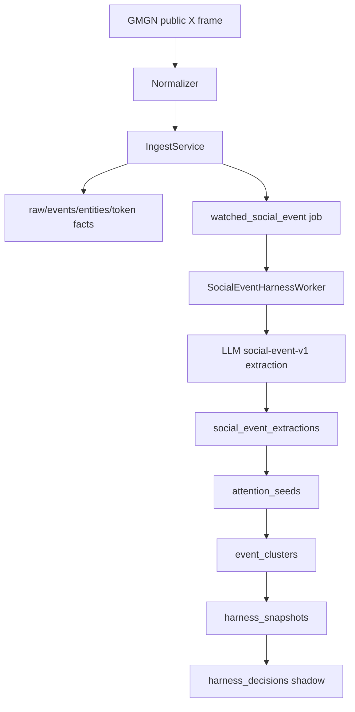

# 闭环 Harness 后端生产架构 Spec

Date: 2026-05-04

## 1. 结论

前端 Harness MVP 已经把产品表面切到：

```text
Social Event
Attention Seed
Harness Snapshot
Outcome
Credit
Health
Evaluation
```

但后端仍停留在旧的 narrative/enrichment 语义：

```text
LLM enrichment -> token_candidates + narratives
narrative_seed -> narrative_token_link
narrative_flow / attention_frontier APIs
```

所以当前真正缺的不是 UI，而是一个能支撑闭环的数据生产系统。

生产级闭环后端应该按这个顺序完成：

```text
P0: 建表 + repository + read APIs，先让前端不再 404
P1: social-event-v1 严格抽取，替换旧 narrative LLM contract
P2: attention seed + deterministic token uptake + frozen shadow snapshot
P3: settlement + abnormal return + credit attribution
P4: report-only weight update + evaluation/config candidate
P5: paper/canary/live，另起风险规格，不进本 MVP
```

第一性原则保持不变：

```text
LLM 只做 evidence-bound event extraction
Harness 做状态、分数、快照、结算、归因、权重和晋级
不接外部新闻源
不保留旧 narrative 兼容语义
```

## 2. 当前真实差距

当前代码已有：

```text
collector/direct_ws.py
collector/normalizer.py
pipeline/ingest_service.py
pipeline/entity_extractor.py
pipeline/token_attribution.py
pipeline/signal_builder.py
pipeline/market_observation_worker.py
storage/evidence_repository.py
storage/entity_repository.py
storage/signal_repository.py
storage/token_repository.py
storage/market_observation_repository.py
api/http.py
api/app.py
```

这些可以保留，因为它们是事实层。

当前代码仍有旧语义：

```text
pipeline/llm_enrichment.py
pipeline/enrichment_worker.py
pipeline/narrative_seed_builder.py
pipeline/narrative_token_linker.py
retrieval/narrative_service.py
retrieval/narrative_link_service.py
storage/enrichment_repository.py
api/http.py narrative endpoints
sqlite_schema.py narrative tables
```

这些不能作为 trader-facing contract 保留。允许复用其中的事实型实现思路，比如 watched job scheduling、model_runs 审计、token uptake 查询，但输出对象必须改成 harness 对象。

前端当前会请求但后端没有：

```text
GET /api/social-events
GET /api/attention-seeds
GET /api/harness-snapshots
GET /api/harness-outcomes
GET /api/harness-credits
GET /api/harness-health
```

因此 P0 的定义是：

```text
这些接口必须先返回真实表查询结果；
没有数据时返回空 items 或 health default；
不能返回 404；
不能用旧 narrative 数据伪造。
```

## 3. 生产后端边界

### 3.1 Bounded Context

后端应该拆成 4 个明确上下文。

```text
Evidence Context
  raw_frames
  events
  event_entities
  event_token_mentions
  event_token_attributions
  token_market_snapshots
  token_market_observations

Social Extraction Context
  watched social event job
  social-event-v1 prompt/schema
  social_event_extractions
  model_runs audit

Harness Context
  attention_seeds
  event_clusters
  harness_snapshots
  harness_decisions
  harness_outcomes
  harness_credits
  harness_weights

Retrieval Context
  harness_service.py
  harness_evaluation_service.py
  /api/harness-*
  CLI reports
```

不要把闭环状态继续塞进 `EnrichmentRepository`。它已经承担旧 LLM/narrative 存储，继续叠加会让生产归因不可读。

### 3.2 Runtime Integration

`api/app.py` 的 `CliRuntime` 应新增：

```python
harness: HarnessRepository
read_harness: HarnessRepository
```

并在 `_build_runtime()` 内和现有 repository 一样创建读写实例：

```python
harness = HarnessRepository(conn)
read_harness = HarnessRepository(read_conn)
```

worker 注入应该变为：

```text
SocialEventHarnessWorker
  evidence
  entities
  signals
  tokens
  market_observations
  harness
  llm_client
  publisher
  write_lock
```

旧 `EnrichmentWorker` 可以被替换或重命名，但不要继续对外发布 `narratives`。

## 4. 写入路径

生产写入路径必须是 store-first。



### 4.1 IngestService

现有 ingest 应保持 deterministic。它只负责：

```text
1. 保存 raw/event/entity/token factual rows
2. watched handle 命中时 enqueue job
3. 不依赖 LLM 是否可用
4. 不计算 harness score
```

job_type 建议：

```text
watched_social_event_extraction
```

为了 KISS，可以复用 `enrichment_jobs` 和 `model_runs` 表作为作业/审计基础，但字段语义要在文档和代码里改成 social-event extraction，不再写旧 `event_enrichments/event_narratives`。

### 4.2 SocialEventHarnessWorker

worker 的单事件事务边界：

```text
claim job
load event + entities
call LLM strict schema
parse/validate SocialEventExtraction
transaction:
  write model_run
  upsert social_event_extraction
  if is_signal_event:
    upsert attention_seed
    upsert event_cluster
    create immutable snapshot per horizon
    record shadow decision
  mark job done
publish websocket update after commit
```

失败策略：

```text
LLM failure:
  job failed/dead, no snapshot

parse failure:
  write model_run failed with parser error
  job failed/dead

non_signal extraction:
  extraction stored
  no seed/snapshot

unknown asset:
  extraction + seed stored
  snapshot only if deterministic token uptake later resolves asset
```

## 5. 核心表设计

### 5.1 social_event_extractions

```sql
CREATE TABLE social_event_extractions (
  extraction_id TEXT PRIMARY KEY,
  event_id TEXT NOT NULL UNIQUE REFERENCES events(event_id) ON DELETE CASCADE,
  run_id TEXT REFERENCES model_runs(run_id),
  author_handle TEXT,
  received_at_ms INTEGER NOT NULL,
  schema_version TEXT NOT NULL,
  model_version TEXT NOT NULL,
  event_type TEXT NOT NULL,
  source_action TEXT NOT NULL,
  subject TEXT NOT NULL,
  direction_hint TEXT NOT NULL,
  attention_mechanism TEXT NOT NULL,
  impact_hint REAL NOT NULL,
  semantic_novelty_hint REAL NOT NULL,
  confidence REAL NOT NULL,
  is_signal_event INTEGER NOT NULL,
  anchor_terms_json TEXT NOT NULL,
  token_candidates_json TEXT NOT NULL,
  semantic_risks_json TEXT NOT NULL,
  summary_zh TEXT NOT NULL,
  raw_response_json TEXT NOT NULL,
  created_at_ms INTEGER NOT NULL,
  updated_at_ms INTEGER NOT NULL
);
```

索引：

```sql
CREATE INDEX idx_social_event_extractions_received
  ON social_event_extractions(received_at_ms);
CREATE INDEX idx_social_event_extractions_author_received
  ON social_event_extractions(author_handle, received_at_ms);
CREATE INDEX idx_social_event_extractions_type_received
  ON social_event_extractions(event_type, received_at_ms);
```

### 5.2 attention_seeds

```sql
CREATE TABLE attention_seeds (
  seed_id TEXT PRIMARY KEY,
  extraction_id TEXT NOT NULL REFERENCES social_event_extractions(extraction_id) ON DELETE CASCADE,
  event_id TEXT NOT NULL REFERENCES events(event_id) ON DELETE CASCADE,
  author_handle TEXT,
  received_at_ms INTEGER NOT NULL,
  event_type TEXT NOT NULL,
  subject TEXT NOT NULL,
  anchor_terms_json TEXT NOT NULL,
  token_uptake_count INTEGER NOT NULL DEFAULT 0,
  top_linked_symbols_json TEXT NOT NULL DEFAULT '[]',
  seed_status TEXT NOT NULL,
  risks_json TEXT NOT NULL DEFAULT '[]',
  created_at_ms INTEGER NOT NULL,
  updated_at_ms INTEGER NOT NULL,
  UNIQUE(extraction_id)
);
```

`seed_status`：

```text
seed_only
linked
snapshot_ready
outcome_pending
settled
dead
```

### 5.3 event_clusters

MVP 不做 embedding clustering。一个 seed 先对应一个 cluster。

```sql
CREATE TABLE event_clusters (
  cluster_id TEXT PRIMARY KEY,
  seed_id TEXT REFERENCES attention_seeds(seed_id) ON DELETE SET NULL,
  extraction_id TEXT REFERENCES social_event_extractions(extraction_id) ON DELETE SET NULL,
  event_id TEXT REFERENCES events(event_id) ON DELETE SET NULL,
  asset TEXT,
  event_type TEXT NOT NULL,
  source TEXT,
  first_seen_at_ms INTEGER NOT NULL,
  last_seen_at_ms INTEGER NOT NULL,
  direction INTEGER NOT NULL,
  impact REAL NOT NULL,
  confidence REAL NOT NULL,
  novelty REAL NOT NULL,
  pricedness REAL NOT NULL,
  base_score REAL NOT NULL,
  event_score REAL NOT NULL,
  source_list_json TEXT NOT NULL DEFAULT '[]',
  raw_event_ids_json TEXT NOT NULL DEFAULT '[]',
  representative_text TEXT NOT NULL,
  risks_json TEXT NOT NULL DEFAULT '[]',
  created_at_ms INTEGER NOT NULL,
  updated_at_ms INTEGER NOT NULL
);
```

### 5.4 harness_snapshots

snapshot 是生产闭环核心，创建后不可变。

```sql
CREATE TABLE harness_snapshots (
  snapshot_id TEXT PRIMARY KEY,
  source_event_id TEXT REFERENCES events(event_id) ON DELETE SET NULL,
  seed_id TEXT REFERENCES attention_seeds(seed_id) ON DELETE SET NULL,
  asset TEXT NOT NULL,
  decision_time_ms INTEGER NOT NULL,
  horizon TEXT NOT NULL,
  combined_score REAL NOT NULL,
  policy_signal TEXT NOT NULL,
  shadow_signal TEXT NOT NULL,
  market_state_json TEXT NOT NULL,
  event_clusters_json TEXT NOT NULL,
  versions_json TEXT NOT NULL,
  outcome_status TEXT NOT NULL DEFAULT 'pending',
  credit_status TEXT NOT NULL DEFAULT 'none',
  risks_json TEXT NOT NULL DEFAULT '[]',
  created_at_ms INTEGER NOT NULL,
  UNIQUE(source_event_id, asset, horizon, json_extract(versions_json, '$.config_version'))
);
```

状态：

```text
outcome_status:
  pending
  settled
  missing_market
  insufficient_market_data

credit_status:
  none
  assigned
```

### 5.5 harness_decisions

MVP 只允许 shadow。

```sql
CREATE TABLE harness_decisions (
  decision_id TEXT PRIMARY KEY,
  snapshot_id TEXT NOT NULL REFERENCES harness_snapshots(snapshot_id) ON DELETE CASCADE,
  asset TEXT NOT NULL,
  decision_time_ms INTEGER NOT NULL,
  execution_mode TEXT NOT NULL,
  signal TEXT NOT NULL,
  side TEXT NOT NULL,
  size REAL NOT NULL DEFAULT 0,
  entry_price REAL,
  risk_reject_reason TEXT,
  config_version TEXT NOT NULL,
  created_at_ms INTEGER NOT NULL
);
```

约束：

```text
execution_mode = shadow in MVP
size = 0 in MVP
side can be LONG / SHORT / NONE
```

### 5.6 harness_outcomes

```sql
CREATE TABLE harness_outcomes (
  snapshot_id TEXT PRIMARY KEY REFERENCES harness_snapshots(snapshot_id) ON DELETE CASCADE,
  settled_at_ms INTEGER NOT NULL,
  actual_return REAL NOT NULL,
  expected_return REAL NOT NULL,
  abnormal_return REAL NOT NULL,
  realized_vol REAL NOT NULL,
  normalized_outcome REAL NOT NULL,
  baseline_version TEXT NOT NULL,
  fees REAL NOT NULL DEFAULT 0,
  slippage REAL NOT NULL DEFAULT 0,
  created_at_ms INTEGER NOT NULL
);
```

### 5.7 harness_credits

```sql
CREATE TABLE harness_credits (
  credit_id TEXT PRIMARY KEY,
  snapshot_id TEXT NOT NULL REFERENCES harness_snapshots(snapshot_id) ON DELETE CASCADE,
  cluster_id TEXT NOT NULL,
  asset TEXT NOT NULL,
  event_type TEXT NOT NULL,
  source TEXT NOT NULL,
  horizon TEXT NOT NULL,
  event_score REAL NOT NULL,
  responsibility REAL NOT NULL,
  credit REAL NOT NULL,
  created_at_ms INTEGER NOT NULL,
  UNIQUE(snapshot_id, cluster_id)
);
```

### 5.8 harness_weights

```sql
CREATE TABLE harness_weights (
  key TEXT PRIMARY KEY,
  weight_type TEXT NOT NULL,
  asset TEXT,
  horizon TEXT NOT NULL,
  n INTEGER NOT NULL,
  mean_credit REAL NOT NULL,
  weight REAL NOT NULL,
  status TEXT NOT NULL,
  updated_at_ms INTEGER NOT NULL
);
```

MVP `status` 必须是：

```text
report_only
```

不要让权重影响 live 或 paper scoring，直到 evaluation gate 通过。

## 6. Repository 边界

新增：

```text
src/gmgn_twitter_intel/storage/harness_repository.py
```

它负责所有 harness 表的读写，不负责计算。

必要方法：

```python
upsert_social_event_extraction(...)
social_event_for_event(event_id)
list_social_events(window_ms, limit, handles=None, event_types=None)

upsert_attention_seed(...)
list_attention_seeds(window_ms, limit, handles=None)

upsert_event_cluster(...)
list_event_clusters(...)

create_snapshot(...)
snapshot_by_id(snapshot_id)
list_snapshots(window_ms, horizon=None, limit=50, asset=None)
update_snapshot_outcome_status(snapshot_id, status)
update_snapshot_credit_status(snapshot_id, status)

record_decision(...)
list_decisions(...)

record_outcome(...)
list_outcomes(window_ms, horizon=None, limit=50, asset=None)

record_credits(...)
list_credits(window_ms, horizon=None, limit=80, asset=None)

upsert_weight(...)
list_weights(horizon=None, limit=100)
```

重要约束：

```text
create_snapshot 不允许覆盖已存在 snapshot
record_outcome 对 snapshot_id 幂等
record_credits 对 (snapshot_id, cluster_id) 幂等
JSON 字段必须由 repository decode 成 dict/list
所有 list_* 默认按时间倒序
```

## 7. Pure Domain Modules

不要把评分/结算/归因写进 repository 或 API controller。

新增：

```text
pipeline/social_event_extraction.py
pipeline/harness_attention_seed.py
pipeline/harness_scoring.py
pipeline/harness_snapshot_builder.py
pipeline/harness_settlement.py
pipeline/harness_credit.py
retrieval/harness_service.py
retrieval/harness_evaluation_service.py
```

职责：

```text
social_event_extraction:
  prompt/schema/parser/dataclasses/enums

harness_attention_seed:
  extraction -> seed
  deterministic token uptake aggregation

harness_scoring:
  base_score
  price_move_penalty
  event_score
  combined_score
  policy_signal
  shadow_signal

harness_snapshot_builder:
  extraction + seed + market_state -> immutable snapshot + shadow decision

harness_settlement:
  price lookup
  actual_return
  expected_return
  abnormal_return
  normalized_outcome

harness_credit:
  responsibility split
  cluster credit
  report-only weight update

harness_service:
  frontend/API read models

harness_evaluation_service:
  score buckets
  settlement coverage
  weight drift
```

## 8. Frontend API Contracts

P0 必须优先实现这些 API。它们可以返回空数据，但不能 404。

### 8.1 GET /api/social-events

Params:

```text
window=5m|1h|24h
limit=50
handles=cz_binance,elonmusk
event_types=meme_phrase_seed,listing_hint
```

Response:

```json
{
  "ok": true,
  "data": {
    "items": [
      {
        "extraction_id": "extract-cz-bnb",
        "event_id": "event-cz-bnb",
        "author_handle": "cz_binance",
        "received_at_ms": 1777746020000,
        "schema_version": "social-event-v1",
        "event_type": "meme_phrase_seed",
        "source_action": "posted",
        "subject": "BNB attention seed",
        "direction_hint": "attention_positive",
        "attention_mechanism": "meme_phrase",
        "impact_hint": 0.72,
        "semantic_novelty_hint": 0.68,
        "confidence": 0.86,
        "is_signal_event": true,
        "anchor_terms": [],
        "token_candidates": [],
        "semantic_risks": ["public_stream_coverage"],
        "summary_zh": "CZ 提到 build on BNB，形成 BNB attention seed。",
        "event": {}
      }
    ]
  }
}
```

### 8.2 GET /api/attention-seeds

```json
{
  "ok": true,
  "data": {
    "items": [
      {
        "seed_id": "seed-cz-bnb",
        "extraction_id": "extract-cz-bnb",
        "event_id": "event-cz-bnb",
        "author_handle": "cz_binance",
        "received_at_ms": 1777746020000,
        "event_type": "meme_phrase_seed",
        "subject": "BNB attention seed",
        "anchor_terms": [],
        "token_uptake_count": 2,
        "top_linked_symbols": ["BNB"],
        "seed_status": "snapshot_ready",
        "risks": ["public_stream_coverage"]
      }
    ]
  }
}
```

### 8.3 GET /api/harness-snapshots

Params:

```text
window=1h|24h
horizon=6h|24h
limit=50
asset=BNB
```

Response must match `HarnessSnapshotItem` in the frontend.

### 8.4 GET /api/harness-outcomes

Response must match `HarnessOutcomeItem`.

### 8.5 GET /api/harness-credits

Response must match `HarnessCreditItem`.

### 8.6 GET /api/harness-health

```json
{
  "ok": true,
  "data": {
    "llm_configured": true,
    "extractor_running": true,
    "schema_success_rate": 0.96,
    "pending_jobs": 1,
    "snapshots_24h": 42,
    "pending_outcomes": 18,
    "settlement_coverage": 0.73
  }
}
```

`schema_success_rate` 用最近 N 个 `model_runs` 成功解析率算。

## 9. Settlement 生产策略

MVP 不追求完美 baseline。先做到可回放、可复盘。

### 9.1 actual_return

对 snapshot asset 找：

```text
entry price:
  <= decision_time_ms 最近一条可用 token_market_snapshot

exit price:
  >= decision_time_ms + horizon 最近一条可用 token_market_snapshot
```

如果缺 entry 或 exit：

```text
outcome_status = missing_market
不写 harness_outcomes
```

如果间隔太远：

```text
outcome_status = insufficient_market_data
不写 harness_outcomes
```

### 9.2 expected_return

V0 baseline：

```text
expected_return = 0
baseline_version = baseline-zero-v0
```

原因：

```text
当前项目没有稳定 crypto index / benchmark feed；
强行编一个 benchmark 比 baseline=0 更危险；
先验证 score bucket 对 forward return 的单调性；
后续再引入 BTC/ETH/sector benchmark。
```

V1 baseline：

```text
expected_return =
  beta_asset_group * group_return
  + beta_momentum * recent_momentum
```

V1 必须另开 spec。

### 9.3 normalized_outcome

```text
normalized_outcome = clip(abnormal_return / max(realized_vol, 1e-6), -1, 1)
```

`realized_vol` 从 snapshot 前窗口计算。缺失时可以用 horizon 内 absolute return 近似，但必须标记 risk：

```text
vol_estimate_weak
```

## 10. Credit Attribution

多事件 credit：

```text
responsibility_i =
  abs(event_score_i) / sum(abs(event_score_j))

credit_i =
  responsibility_i
  * sign(event_score_i)
  * normalized_outcome
```

约束：

```text
credit 是 predictive credit，不是 causal proof
同一个 snapshot 的 credit rows 必须一次性写入
re-run 不得重复
negative event 在 positive outcome 中得到 negative credit
```

## 11. Weight Update

MVP 只写 report-only。

```text
mean_credit_new =
  mean_credit_old + (credit - mean_credit_old) / n

shrunk_effect =
  n / (n + n0) * mean_credit

weight =
  clip(1 + lambda * shrunk_effect, 0.5, 1.5)
```

建议：

```text
n0 = 50
lambda = 0.5
status = report_only
```

更新维度：

```text
source
event_type
horizon
source_event_type
asset_event_type
```

## 12. CLI Ops

新增命令：

```bash
uv run gmgn-twitter-intel social-events --window 1h --limit 20
uv run gmgn-twitter-intel attention-seeds --window 24h --limit 50
uv run gmgn-twitter-intel harness-snapshots --horizon 6h --limit 50
uv run gmgn-twitter-intel harness-outcomes --horizon 6h --limit 50
uv run gmgn-twitter-intel harness-credits --horizon 6h --limit 50
uv run gmgn-twitter-intel harness-health

uv run gmgn-twitter-intel ops settle-harness --horizon 6h
uv run gmgn-twitter-intel ops attribute-harness-credits --horizon 6h
uv run gmgn-twitter-intel ops update-harness-weights
uv run gmgn-twitter-intel harness-score-buckets --horizon 6h
```

Ops 输出：

```json
{
  "snapshots_scanned": 42,
  "outcomes_written": 17,
  "credits_written": 29,
  "weights_updated": 8,
  "skipped_missing_market": 11,
  "errors": []
}
```

## 13. 测试矩阵

必须新增：

```text
tests/test_social_event_extraction.py
tests/test_harness_repository.py
tests/test_harness_scoring.py
tests/test_harness_snapshot_builder.py
tests/test_harness_settlement.py
tests/test_harness_credit.py
tests/test_harness_service.py
tests/test_harness_evaluation_service.py
```

必须改写：

```text
tests/test_llm_client.py
tests/test_llm_enrichment.py
tests/test_enrichment_worker.py
tests/test_api_http.py
tests/test_cli.py
tests/test_sqlite_schema.py
tests/test_project_structure.py
```

回归 gate：

```bash
uv run pytest
uv run ruff check .
uv run python -m compileall src tests
```

如果前端联动：

```bash
cd web
npm run typecheck
npm test -- --run
npm run build
```

## 14. 分阶段交付

### P0: MVP 数据支撑

目标：

```text
前端 Harness APIs 不再 404
真实 SQLite 表存在
API 从 harness_repository 查询
无数据返回空状态
不使用旧 narrative 数据伪造
```

文件：

```text
sqlite_schema.py
storage/harness_repository.py
retrieval/harness_service.py
api/app.py
api/http.py
cli.py
tests/test_harness_repository.py
tests/test_api_http.py
tests/test_cli.py
```

验收：

```text
GET /api/social-events -> 200
GET /api/attention-seeds -> 200
GET /api/harness-snapshots -> 200
GET /api/harness-outcomes -> 200
GET /api/harness-credits -> 200
GET /api/harness-health -> 200
```

### P1: Social Event Extraction

目标：

```text
watched account event -> strict social-event-v1 extraction
old narrative parser contract removed
model_runs records raw schema response
```

### P2: Snapshot Loop

目标：

```text
signal extraction -> seed -> cluster -> snapshot -> shadow decision
snapshot immutable
versions recorded
```

### P3: Settlement Loop

目标：

```text
due snapshot -> outcome -> credit
score bucket report available
```

### P4: Learning/Evaluation Loop

目标：

```text
report-only weights
candidate config comparison
no automatic promotion
```

## 15. 生产监控

新增 readiness/health 指标：

```text
social_event_jobs_pending
social_event_jobs_dead
schema_success_rate_24h
social_events_24h
attention_seeds_24h
harness_snapshots_24h
pending_outcomes
settlement_coverage_24h
credits_24h
weights_updated_24h
```

UI 只展示摘要，CLI/API 提供细节。

## 16. KISS 评估

遵循 KISS 的地方：

```text
不接外部源
不加 embedding clustering
不加 LangGraph / MLflow
不加 live execution
baseline v0 先用 0，而不是伪造 benchmark
weights report-only，不影响 scoring
repository 只存取，不混计算
```

仍有复杂度但必要：

```text
多表状态机
snapshot immutability
settlement/credit 幂等
版本记录
```

这些复杂度是闭环交易系统的最低成本，不是过度设计。

## 17. 不成熟方案排除

暂不做：

```text
自动配置晋级
自动实盘
LLM 判断交易方向
LLM 做收益归因
旧 narrative 与新 harness 双写
历史 narrative 行自动迁移成 social event
全流 LLM
外部新闻源
```

## 18. 完成定义

生产级闭环不是“接口能返回数据”，而是满足：

```text
1. 每个 watched LLM job 有 extraction 或明确失败状态
2. 每个 signal extraction 可追到原始 event evidence
3. 每个 seed 有 deterministic token uptake 状态
4. 每个 snapshot 是事前冻结且不可变
5. 每个 decision 是 shadow/paper/live 明确模式
6. 每个 due snapshot 可结算或标记缺市场数据
7. 每个 outcome 用 abnormal return
8. 每个 credit 是多事件责任分配
9. 每个 weight update 是 report-only 且 shrinkage-protected
10. 每个 config promotion 都必须基于 evaluation report
```

满足前 6 条是 MVP 闭环；满足 10 条才是生产级闭环。
