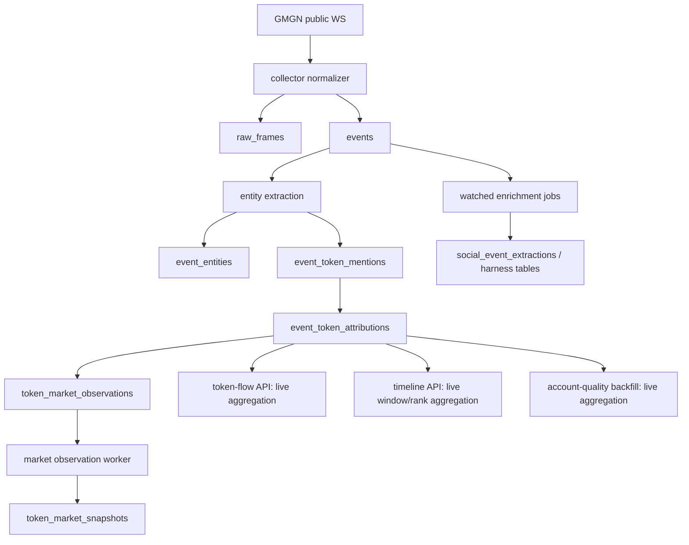
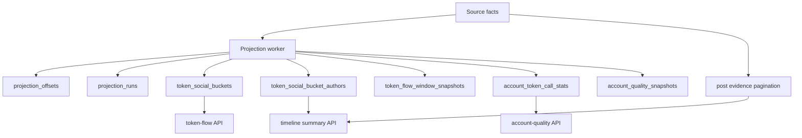

# Production Materialized Read Models Spec

日期：2026-05-06

## 结论

当前系统不应该用“临时缓存”方式优化 `token-flow`、`token-social-timeline`、`account-quality`。正确做法是引入生产级 read model / projection 层：保留 `events`、`event_token_attributions`、`token_market_snapshots` 等事实表作为 source of truth，在后台以幂等、可重放、可校验的方式维护查询优化表。

这不是重复造轮子。它对应成熟的 CQRS read model、Event Sourcing projection、Materialized View pattern。Microsoft Azure Architecture Center 对 Event Sourcing 的描述是：append-only event store 是 authoritative data source，应用通常实现 materialized views，因为按需 replay 成本高；CQRS 文档也明确 read store 可以使用 query-optimized schema/materialized view，并提醒 eventual consistency 和复杂度。PostgreSQL 官方文档也说明 native materialized view 是持久化查询结果，但 `REFRESH MATERIALIZED VIEW` 会整体替换内容；因此本项目需要的是业务投影表和增量维护 worker，而不是简单依赖数据库原生 materialized view。

## 参考原则

1. Source of truth 和 read model 分离。
   - Source of truth：`raw_frames`、`events`、`event_entities`、`event_token_mentions`、`event_token_attributions`、`token_market_snapshots`、`enrichment_jobs`、`social_event_extractions`、`harness_*`。
   - Read model：从 source facts 派生，可删除、可重建、可版本化。

2. 投影必须可重放。
   - 任意 read model 表都不能成为唯一事实来源。
   - 投影逻辑变更时，通过 `projection_version` 和 rebuild CLI 重建。
   - API 不能静默混用新旧投影版本。

3. Eventual consistency 显式暴露。
   - 每个投影返回 `source_max_received_at_ms`、`updated_at_ms`、`lag_ms`。
   - 投影超过 freshness SLA 时，API 返回 `projection_stale` 或降级为显式 stale payload；不做隐式 raw fallback。

4. No lookahead。
   - 决策读模型只能使用 `decision_time_ms` 之前已经存在的 facts 和 market snapshots。
   - outcome/settlement 可以读取未来 price，但必须写入 outcome 表，不能污染 decision read model。

5. 增量维护优先，整表刷新只作为 rebuild。
   - PostgreSQL native materialized view 的 refresh 是全量语义，适合低频报表，不适合高频 token radar。
   - 本项目先用 projection worker 对变化 token/time bucket 做 O(delta) 维护。

6. SQLite 运行约束必须被尊重。
   - SQLite WAL 支持 readers 与 writer 并发，但同一时间只有一个 writer；长读事务会影响 checkpoint。
   - 本项目当前是单写连接 + WAL + `RLock`，投影写入不能放大到阻塞 ingest。

参考链接：

- Microsoft Event Sourcing pattern: https://learn.microsoft.com/en-us/azure/architecture/patterns/event-sourcing
- Microsoft CQRS pattern: https://learn.microsoft.com/en-us/azure/architecture/patterns/cqrs
- PostgreSQL materialized views: https://www.postgresql.org/docs/17/rules-materializedviews.html
- PostgreSQL `REFRESH MATERIALIZED VIEW`: https://www.postgresql.org/docs/17/sql-refreshmaterializedview.html
- SQLite WAL: https://www.sqlite.org/wal.html

## 当前数据库审计

### 现场规模

来源：`gmgn-twitter-intel-app-1` live SQLite，2026-05-06。

| 项目 | 数值 |
|---|---:|
| DB page size | 4096 |
| DB page count | 239084 |
| DB size | 979,288,064 bytes |
| WAL checkpoint passive | busy=0, log=880, checkpointed=860 |

核心表行数：

| 表 | 行数 |
|---|---:|
| `raw_frames` | 174486 |
| `events` | 97173 |
| `event_fts_content` | 97174 |
| `event_entities` | 114064 |
| `event_token_mentions` | 13880 |
| `event_token_attributions` | 20396 |
| `token_market_snapshots` | 7204 |
| `token_market_observations` | 6899 |
| `tokens` | 1812 |
| `account_token_alerts` | 24 |
| `enrichment_jobs` | 191 |
| `notifications` | 120 |
| `harness_snapshots` | 62 |
| `token_signal_snapshots` | 0 |
| `token_signal_outcomes` | 0 |
| `account_profiles` | 0 |
| `account_token_call_stats` | 0 |
| `account_quality_snapshots` | 0 |

最大对象：

| 对象 | 大小 |
|---|---:|
| `events` | 487 MB |
| `raw_frames` | 208 MB |
| `event_fts_content` | 42 MB |
| `token_market_snapshots` | 34 MB |
| `event_entities` | 28 MB |
| `event_token_attributions` | 23 MB |
| `event_fts_data` | 22 MB |

结论：

- 存储膨胀主要来自 `events.event_json/raw_json` 和 `raw_frames.raw_payload_json`，不是来自 token attribution。
- 物化 read model 能降低 API 查询成本，但不能替代 retention/archive。
- `account_quality_*` 表已经存在，但尚未生产化填充，是“已有表结构、缺 worker/settlement”的状态。

### 增长率

过去约 23 个小时，`events` 每小时约 1805-6268，`raw_frames` 每小时约 3212-10957，`event_token_attributions` 每小时约 342-1276。

粗略容量含义：

- 当前日级规模接近 1GB/day。
- 7 天保留可能接近 7GB SQLite 文件。
- 30 天保留可能进入 25-35GB 级别，SQLite 仍可存，但 backup、integrity check、retention、ad hoc analysis 都会变笨重。

### 查询扫描

现场热查询样本：

| 查询 | 平均耗时 |
|---|---:|
| `readyz` DB liveness | 0.014 ms |
| recent watched 50 | 0.739 ms |
| recent all 200 | 9.793 ms |
| top token 5m shape | 0.222 ms |
| FTS simple | 66.633 ms avg, cold max 288.606 ms |
| latest market snapshot | 0.233 ms |

`EXPLAIN QUERY PLAN` 发现：

- `recent_watched_50` 使用 `idx_events_watched_received`，健康。
- `top_token_5m` 使用 `idx_event_token_attributions_status_received`，但 `GROUP BY` 和 `ORDER BY` 使用 temp B-tree。
- `timeline` shape 使用 `idx_event_token_attributions_token_received`，但 window function 和 final order 都使用 temp B-tree。

结论：

- 5m 当前数据量下不是瓶颈。
- 1h/4h/24h、多 token dashboard、高频刷新、多人访问会重复触发同一批聚合。
- Timeline 的 bucket/author/phase 计算适合投影；post evidence 列表仍应从 source facts 分页读取。

### 数据完整性与运行风险

- 之前单独 `PRAGMA quick_check(1)` 返回 `ok`，但在 live 服务中与 `foreign_key_check` 合并运行超过安全交互窗口，不应作为运行期或频繁在线检查。
- 正式 integrity/foreign-key audit 应作为离线维护命令，对备份副本执行，并记录耗时和结果。
- FastAPI 多个 endpoint 是 `async def`，但内部执行同步 SQLite 查询和 Python scoring。重查询在 event loop 上运行时，会影响 WebSocket、health、API 尾延迟。
- 当前修复已避免 health/readiness 卡死，但 heavy read endpoint 仍应进入 thread/offline projection/read-model 方向。

## 当前后端数据流

问题边界：

1. `token-flow` 目前既负责读 facts，又负责计算 rolling grouping、baseline、diffusion、scoring、market block。
2. `timeline` 目前每次请求重建 bucket、author、phase，并逐 bucket 查 price。
3. `account-quality` 有持久表，但依赖 `backfill_account_token_call_stats` 扫描事实表；live API 不自动保证新鲜度。
4. 没有统一的 projection offset、projection run、lag、dirty range 和 rebuild 状态。

## 目标架构

### Source Facts

保持事实表为唯一权威：

- `events`
- `event_token_mentions`
- `event_token_attributions`
- `token_market_snapshots`
- `tokens`
- `harness_*`
- `social_event_extractions`

### Projection Metadata

新增：

#### `projection_offsets`

用途：记录每个 projection 的 high-water mark 和新鲜度。

字段：

- `projection_name TEXT PRIMARY KEY`
- `projection_version TEXT NOT NULL`
- `source_table TEXT NOT NULL`
- `source_max_received_at_ms INTEGER NOT NULL`
- `source_max_id TEXT NOT NULL`
- `last_run_id TEXT`
- `status TEXT NOT NULL`
- `lag_ms INTEGER NOT NULL`
- `last_error TEXT`
- `created_at_ms INTEGER NOT NULL`
- `updated_at_ms INTEGER NOT NULL`

#### `projection_runs`

用途：审计每次 projection batch。

字段：

- `run_id TEXT PRIMARY KEY`
- `projection_name TEXT NOT NULL`
- `projection_version TEXT NOT NULL`
- `mode TEXT NOT NULL`
- `status TEXT NOT NULL`
- `source_start_ms INTEGER`
- `source_end_ms INTEGER`
- `rows_read INTEGER NOT NULL`
- `rows_written INTEGER NOT NULL`
- `dirty_ranges_written INTEGER NOT NULL`
- `started_at_ms INTEGER NOT NULL`
- `finished_at_ms INTEGER`
- `error TEXT`

#### `projection_dirty_ranges`

用途：处理迟到 facts、backfill、market snapshot 到达后的局部重算。

字段：

- `dirty_id TEXT PRIMARY KEY`
- `projection_name TEXT NOT NULL`
- `projection_version TEXT NOT NULL`
- `entity_type TEXT NOT NULL`
- `entity_key TEXT NOT NULL`
- `window TEXT`
- `scope TEXT`
- `start_ms INTEGER NOT NULL`
- `end_ms INTEGER NOT NULL`
- `reason TEXT NOT NULL`
- `status TEXT NOT NULL`
- `created_at_ms INTEGER NOT NULL`
- `updated_at_ms INTEGER NOT NULL`

### Token Flow Read Model

#### `token_social_buckets`

最低粒度：30s bucket。1h/4h/24h 从 30s 或 5m rollup 派生。

主键：

- `projection_version`
- `scope`
- `bucket_size_ms`
- `bucket_start_ms`
- `token_id`

字段：

- `identity_key`
- `chain`
- `address`
- `symbol`
- `post_count`
- `direct_mention_count`
- `selected_symbol_mention_count`
- `weighted_mention_count`
- `attribution_confidence_sum`
- `watched_post_count`
- `unique_author_count`
- `watched_author_count`
- `weighted_reach`
- `first_seen_ms`
- `latest_seen_ms`
- `top_event_ids_json`
- `top_authors_json`
- `source_event_ids_json`
- `source_attribution_ids_json`
- `created_at_ms`
- `updated_at_ms`

#### `token_social_bucket_authors`

用于精确计算跨 bucket unique authors，避免把 per-bucket unique count 直接相加导致错误。

主键：

- `projection_version`
- `scope`
- `bucket_size_ms`
- `bucket_start_ms`
- `token_id`
- `author_handle`

字段：

- `post_count`
- `watched_post_count`
- `followers_max`
- `first_seen_ms`
- `latest_seen_ms`

#### `token_flow_window_snapshots`

用途：缓存 dashboard/top-N 结果，避免每个 API 请求重跑 scoring。

主键：

- `projection_version`
- `window`
- `scope`
- `decision_time_ms`
- `rank`

字段：

- `token_id`
- `identity_json`
- `flow_json`
- `timeline_json`
- `market_json`
- `score_versions_json`
- `component_payload_json`
- `data_health_json`
- `source_bucket_range_json`
- `source_max_received_at_ms`
- `created_at_ms`

刷新策略：

- 5m/all 和 5m/matched：每 15-30s。
- 1h：每 60s。
- 4h/24h：每 5m。
- 每次只保留最近 N 个 decision snapshot，例如 288 个 5m tick 或 24h。

### Timeline Read Model

不新增独立事实源。Timeline summary 从 `token_social_buckets` 和 `token_social_bucket_authors` 读取：

- bucket posts/authors/new_authors/effective_authors/reproduction_rate。
- price per bucket 仍从 `token_market_snapshots` at-or-before 查询，或可二期做 `token_market_bucket_snapshots`。
- post evidence page 仍从 `event_token_attributions JOIN events` 查询，保证可追溯。

不把完整 post list 写进 timeline projection，避免复制大文本和产生一致性问题。

### Account Quality Read Model

已有表：

- `account_profiles`
- `account_token_call_stats`
- `account_quality_snapshots`

需要补齐：

- projection offset；
- incremental worker；
- settlement worker；
- stale/rebuild 状态；
- account quality API 对 projection lag 的暴露。

原则：

- 每个 `(handle, token_id)` 的 first mention 和 mention count 是 source-derived state。
- price outcomes 只在 horizon 到达后 settlement。
- quality snapshot 是按窗口版本生成的 summary，不覆盖 raw call stats。

## API 语义

### `/api/token-flow`

生产目标：

- 读取 `token_flow_window_snapshots`。
- 返回 `projection` block：
  - `projection_version`
  - `source_max_received_at_ms`
  - `updated_at_ms`
  - `lag_ms`
  - `status`
- 如果 projection stale，返回 `ok=false` 和 `projection_stale`，不隐式扫 raw facts 兜底。

### `/api/token-social-timeline`

生产目标：

- summary/buckets/authors 从 projection 表读。
- posts 从 source facts 分页读。
- 返回 `summary_projection` 和 `posts_source` 两个 block，明确两者新鲜度。

### `/api/account-quality`

生产目标：

- 仅读 `account_profiles`、`account_token_call_stats`、`account_quality_snapshots`。
- 如果 handle 没有投影，返回 `projection_missing`，由 ops/backfill 触发构建。
- 不在 API 请求中触发 account-quality 现场 backfill。

## Worker 设计

### Projection Worker

职责：

1. 读取 `projection_offsets`。
2. 扫描 `event_token_attributions` 新增事实。
3. 计算受影响 token、bucket、scope。
4. upsert `token_social_buckets` 和 `token_social_bucket_authors`。
5. 写 `projection_runs`。
6. 更新 `projection_offsets`。
7. 生成 dirty ranges 给 window snapshot worker。

约束：

- 每 batch 限制 rows，例如 2000。
- 每 batch 限制事务时间，例如 <500ms。
- 每个 projection 独立 high-water mark。
- 失败不推进 offset。

### Window Snapshot Worker

职责：

1. 按 `projection_dirty_ranges` 或 schedule 找出需要刷新窗口。
2. 从 bucket/read facts 生成 top-N `token_flow_window_snapshots`。
3. 写 `projection_runs` 和 lag。

约束：

- score version 变化必须新建 projection version。
- 不混写旧版本和新版本。

### Account Quality Worker

职责：

1. 增量维护 `account_profiles` 和 `account_token_call_stats`。
2. 在 5m/1h/24h horizon 到达后填充 outcome。
3. 周期性写 `account_quality_snapshots`。

约束：

- 不在 request path 回填。
- outcome 缺 market snapshot 必须写 explicit status。

## 生产验收

1. 正确性：
   - 对固定 fixture，projection 输出与 raw aggregation 完全一致。
   - 对 live DB 抽样 token/window，projection 与 raw aggregation mismatch 为 0。
   - no-lookahead 测试覆盖 timeline price 和 account outcome。

2. 性能：
   - `/api/token-flow?window=5m&scope=all&limit=50` p95 < 50ms。
   - `/api/token-social-timeline` summary p95 < 80ms，posts page p95 < 120ms。
   - projection worker 单 batch write lock < 500ms。
   - Docker `/healthz` 和 `/readyz` 不受 projection rebuild 影响。

3. 运维：
   - `gmgn-twitter-intel ops projection-status` 显示 lag、last run、last error。
   - `gmgn-twitter-intel ops rebuild-projections --projection token-social --from ... --to ...` 可重建。
   - `gmgn-twitter-intel ops validate-projections --sample 100` 可对账。
   - 所有 projection 表支持按 `projection_version` 清理。

4. 切换：
   - 开发阶段允许 shadow compare。
   - 生产 cutover 后 API 不保留 raw aggregation fallback。
   - 若 projection stale，显式返回 stale，不偷偷现场聚合。

## 不做事项

- 不把 raw frame 文本复制进 projection 表。
- 不用触发器同步全部 read model；SQLite 单 writer 下触发器会把 ingest 延迟隐藏到写路径。
- 不直接依赖 PostgreSQL native materialized view 作为实时增量方案。
- 不把 account quality 在 API 请求时回填。
- 不把 outcome/settlement 数据写入 decision read model。

## 主要风险

1. 写放大。
   - 每条 attribution 更新多个 bucket/scope/window，会增加 SQLite 单 writer 压力。
   - 缓解：先写 30s bucket 和 author bucket；top window snapshot 由独立 worker 批量生成。

2. 迟到事实和 backfill。
   - GMGN frames、market snapshots、attribution rebuild 会修改历史窗口。
   - 缓解：`projection_dirty_ranges` 作为局部重算队列。

3. 唯一作者统计错误。
   - per-bucket unique author 不能直接跨 bucket 相加。
   - 缓解：保留 `token_social_bucket_authors`，窗口级 unique 从 author keys 聚合。

4. 投影和事实不一致。
   - 缓解：offset、run audit、validate CLI、可重建。

5. Event loop 阻塞。
   - 缓解：API 读投影；重查询和 rebuild 不进入 async request path。

## 推荐执行顺序

1. 先做 projection metadata 和 token social buckets。
2. 再做 token-flow window snapshots，并用 shadow compare 验证。
3. 再切 `/api/token-flow`。
4. 再做 timeline summary read model。
5. 再做 account quality incremental/settlement。
6. 最后补 retention/archive 和 PostgreSQL migration readiness。
