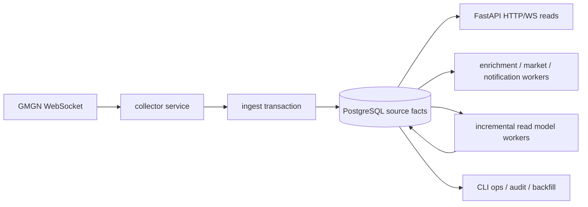
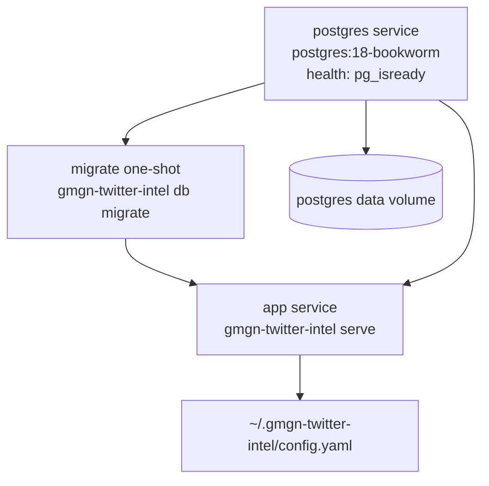
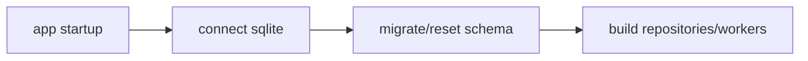
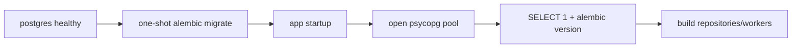

# PostgreSQL Production Migration Spec

日期：2026-05-06

## 结论

一次性从 SQLite 切到 PostgreSQL 是可行的，但它是一次基础设施根迁移，不是单点性能补丁。当前业务算法不必重写，因为 collector、entity extraction、token attribution、harness、notification、HTTP/WS 输出基本都通过 repository 边界访问数据库；但 SQLite 已经显式渗透到 storage、retrieval、settings、CLI、tests 和 README。迁移必须按“替换运行时数据库内核、重建 schema/migration、改写 SQL 方言、重建测试基建、做一次性数据迁移、上线后再做增量投影优化”的顺序执行。

不建议把 PostgreSQL 迁移和 `token-flow` / `timeline` / `account-quality` 增量物化一次混在同一个发布中。正确顺序是：

1. 先把运行时 source-of-truth 从 SQLite 干净切到 PostgreSQL，外部 API 语义和事实表语义不变。
2. 再在 PostgreSQL 上实现增量 read model / projection。

原因很直接：PostgreSQL 解决并发写入、长期存储、在线索引、分析扩展和运维能力；但它不会自动消除 API 请求时现场聚合。PostgreSQL 原生 materialized view 的 `REFRESH` 是替换内容语义，不是内置 O(delta) 快速刷新；本项目需要的是业务投影表和 worker，而不是简单 `CREATE MATERIALIZED VIEW` 后定时全量 refresh。

## 参考原则

官方/成熟实践依据：

- PostgreSQL Docker Official Image 支持 Compose、初始化脚本、`POSTGRES_USER` / `POSTGRES_DB` / `POSTGRES_PASSWORD` / `_FILE` secrets；初始化脚本只在空 data directory 第一次启动时执行。
- PostgreSQL 使用 MVCC 和事务隔离，`INSERT ... ON CONFLICT DO UPDATE` 在 Read Committed 下能保证每行 insert 或 update 其中一种结果。
- PostgreSQL `SELECT ... FOR UPDATE SKIP LOCKED` 适合 queue-like 多 worker 领取任务，但会返回不一致视图，因此只能用于 job claiming，不用于普通业务查询。
- PostgreSQL FTS 用 `tsvector` + `tsquery` + GIN。`websearch_to_tsquery` 比 `to_tsquery` 更宽容，适合用户输入。
- PostgreSQL `jsonb` 支持 GIN 索引，适合有结构查询需求的 JSON；但本项目的核心热查询仍应依赖普通列和 read model，不依赖 JSONB 深查询。
- PostgreSQL declarative partitioning 适合按常见 `WHERE` 条件和 retention 边界分区；过多分区会拉高 planning 成本。
- PostgreSQL 需要 autovacuum / analyze 维护 planner stats、visibility map 和空间复用，不能照搬 SQLite 的“单文件无后台维护”心智。
- Psycopg 3 提供 `dict_row` row factory，可保持 repository 中 `row["column"]` 的调用风格，减少业务层改动。
- Alembic 是成熟迁移工具。即使项目继续使用 raw SQL，也应使用 Alembic 管理 schema revisions，不继续维护自制 `sqlite_schema.py` reset 逻辑。

参考链接：

- PostgreSQL Docker Official Image: https://github.com/docker-library/docs/blob/master/postgres/README.md
- PostgreSQL transaction isolation: https://www.postgresql.org/docs/current/transaction-iso.html
- PostgreSQL row locking / `SKIP LOCKED`: https://www.postgresql.org/docs/10/sql-select.html
- PostgreSQL FTS controls: https://www.postgresql.org/docs/current/textsearch-controls.html
- PostgreSQL GIN indexes: https://www.postgresql.org/docs/current/gin.html
- PostgreSQL JSON types / JSONB indexing: https://www.postgresql.org/docs/current/datatype-json.html
- PostgreSQL materialized view refresh: https://www.postgresql.org/docs/17/sql-refreshmaterializedview.html
- PostgreSQL partitioning: https://www.postgresql.org/docs/current/ddl-partitioning.html
- PostgreSQL routine vacuuming: https://www.postgresql.org/docs/current/routine-vacuuming.html
- Psycopg 3 row factories: https://www.psycopg.org/psycopg3/docs/api/rows.html
- Alembic operations: https://alembic.sqlalchemy.org/en/latest/ops.html

## 当前 SQLite 耦合审计

代码扫描结果：

| 类别 | 发现 |
|---|---:|
| 受 SQLite 关键词影响的文件 | 50 |
| pytest 测试函数数量 | 260 |
| runtime SQLite client/schema 文件 | `sqlite_client.py`, `sqlite_schema.py` |
| 明确 SQLite FTS5 表 | `event_fts` virtual table |
| 明确 SQLite 事务语义 | `BEGIN IMMEDIATE`, app-level `RLock` |
| 明确 SQLite config surface | `storage.sqlite_path`, `Settings.sqlite_path` |

主要耦合点：

1. Connection / transaction。
   - `connect_sqlite()` 创建单写连接和只读连接。
   - `transaction()` 使用 `BEGIN IMMEDIATE`。
   - `api/app.py` 在运行时持有 write repositories 和 read repositories。
   - workers 共用同一个写连接，并通过 `RLock` 串行化写入。

2. Schema / migrations。
   - `sqlite_schema.py` 是单文件 `SCHEMA_SQL`，并带有 destructive reset 逻辑。
   - schema version 记录在自制 `schema_migrations`。
   - FTS5 可用性通过创建虚拟表探测。
   - 旧版本不匹配时可能 drop app tables，这是 PostgreSQL 生产上不能接受的启动行为。

3. SQL 方言。
   - 参数占位符是 SQLite `?` 和 `:name`。
   - 需要改成 Psycopg `%s` / `%(name)s`。
   - `INSERT OR IGNORE` 需要改成 `ON CONFLICT DO NOTHING`。
   - `COALESCE(chain, '')` unique expression 在 PostgreSQL 可以保留为 expression unique index，但更推荐用 generated key 或 `NULLS NOT DISTINCT` 语义评估。
   - `event_fts MATCH ?` 和 `bm25(event_fts)` 需要改成 `search_tsv @@ websearch_to_tsquery(...)` 和 `ts_rank_cd(...)`。
   - `lower(address)` expression indexes 可迁移到 PostgreSQL expression indexes。
   - window functions 已经接近 PostgreSQL 标准，迁移风险较小。

4. JSON。
   - 当前 JSON 都是 `TEXT` 存储，并在 repository 手动 `json.dumps` / `json.loads`。
   - PostgreSQL 应使用 `jsonb` 存储结构化 payload。
   - Psycopg 取回 `jsonb` 后可能直接返回 dict/list，这会影响 decode helper，需要统一适配。

5. Tests。
   - 大量测试直接 import `connect_sqlite` 和 `sqlite_schema.migrate`。
   - 迁移不是改一个 fixture，而是要重建 repository test harness。
   - 需要引入 PostgreSQL test database fixture，而不是继续 SQLite 单元测试。

## 可行性判断

可行，且从中长期生产能力看值得做。

收益：

- 去掉 SQLite 单写限制和全局 `RLock` 的根约束。
- 支持 collector、API、worker 后续拆成多个进程或多个容器。
- 用 `FOR UPDATE SKIP LOCKED` 正确处理 enrichment / market observation / notification delivery 等队列型任务。
- 支持在线索引、EXPLAIN、pg_stat、VACUUM/ANALYZE、backup/restore、连接池、权限隔离。
- FTS 从 SQLite FTS5 迁到 PostgreSQL GIN/tsvector，搜索能力进入同一数据库生产生态。
- JSON payload 改 `jsonb` 后，后续分析和审计可以做结构化查询。
- 长期 retention 可以按时间分区和 detach/archive，不再被 SQLite 单文件操作拖住。

成本：

- 这是中等偏大的迁移，不是小修。
- 需要重写全部 repository SQL 占位符和异常处理。
- 需要一次性迁移数据或接受从空 PostgreSQL 开始。
- FTS 结果排序会与 SQLite BM25 有差异，需要更新 contract。
- tests 需要 PostgreSQL 依赖，CI/local 开发要能启动 test DB。
- 迁移后要维护 PostgreSQL 运维项：backup、vacuum、analyze、连接数、慢查询、WAL/磁盘。

不做兼容代码的定义：

- runtime 只支持 PostgreSQL。
- 删除 `sqlite_client.py` / `sqlite_schema.py` 的运行时引用。
- 删除 `storage.sqlite_path` 配置，替换为 `storage.postgres_dsn` 或结构化 `storage.postgres` 配置。
- 不做双写，不做 read fallback，不做 SQLite/PostgreSQL adapter 同时存在。
- 可以保留一次性离线迁移脚本，因为这是 cutover 工具，不是 runtime 兼容层。

## 是否影响业务逻辑

目标是不影响外部业务语义，但有几个必须显式验收的行为变化：

1. Search ranking。
   - SQLite FTS5 `bm25()` 与 PostgreSQL `ts_rank_cd()` 不是同一排序函数。
   - `/api/search` 的 exact CA/symbol/handle 语义应保持。
   - text FTS 的排序可以变化，但返回字段、鉴权、limit、scope 必须保持。

2. Boolean shape。
   - 当前 SQLite 用 `0/1`。
   - PostgreSQL 应用 `boolean`。
   - API payload 如果历史上暴露 `0/1`，需要在 decode 层保持输出稳定；内部可以用 bool。

3. JSON decode。
   - 当前 JSON text 手动 decode。
   - PostgreSQL `jsonb` 可能直接返回 Python object。
   - decode helpers 必须同时处理 dict/list 和 str，但这是数据类型适配，不是 SQLite 兼容。

4. Deterministic order。
   - PostgreSQL 对同 key 排序不会保证稳定。
   - 所有 API 查询必须补齐 tie-breaker，例如 `ORDER BY received_at_ms DESC, event_id DESC`。

5. Transaction timing。
   - PostgreSQL 默认 Read Committed 与 SQLite single writer 不同。
   - ingest 中依赖“同一事务读到自己写入”的逻辑仍成立。
   - 跨 worker job claiming 必须用 row lock，不能依赖 app-level lock。

6. Startup behavior。
   - SQLite 当前 app startup 会 `migrate(conn)`。
   - PostgreSQL 生产实践应改成单独 migration job 成功后 app 才启动，避免多个 app 实例并发跑 DDL。

## 目标架构



Docker Compose 目标拓扑：



生产原则：

- `postgres` 容器用 named volume，不绑定 macOS host directory 作为 data directory。
- `app` 不在 `/healthz` 做 DB 查询；`/readyz` 做轻量 `SELECT 1` + migration version + critical worker status。
- migration 是单独命令或 one-shot service，不在多副本 app startup 中自动执行 DDL。
- app 使用 psycopg pool，不用每次请求建连接。
- writes 走短事务，API reads 走短读连接。
- job queue 领取使用 `FOR UPDATE SKIP LOCKED`。
- source facts 与 read models 分 schema 或命名前缀：`fact_*` / `projection_*` 可以作为后续整理目标；第一步可保留当前表名降低业务改动。

## PostgreSQL Schema 策略

类型映射：

| SQLite | PostgreSQL |
|---|---|
| `TEXT PRIMARY KEY` | `text PRIMARY KEY` |
| `INTEGER` timestamp ms | `bigint` |
| `INTEGER` boolean | `boolean` |
| `REAL` | `double precision` |
| JSON `TEXT` | `jsonb` |
| FTS5 virtual table | generated `tsvector` + GIN index |

FTS 目标设计：

```sql
ALTER TABLE events
  ADD COLUMN search_tsv tsvector GENERATED ALWAYS AS (
    setweight(to_tsvector('simple', coalesce(author_handle, '')), 'A') ||
    setweight(to_tsvector('simple', coalesce(search_text, '')), 'B') ||
    setweight(to_tsvector('simple', coalesce(text_clean, '')), 'C')
  ) STORED;

CREATE INDEX idx_events_search_tsv ON events USING GIN (search_tsv);
```

用户查询：

```sql
WITH query AS (SELECT websearch_to_tsquery('simple', %s) AS tsq)
SELECT e.*, ts_rank_cd(e.search_tsv, query.tsq) AS score
FROM events e, query
WHERE e.search_tsv @@ query.tsq
ORDER BY score DESC, e.received_at_ms DESC, e.event_id DESC
LIMIT %s;
```

时间分区策略：

- 首版不强制分区全部表，避免主键/外键/partition key 复杂度把迁移变成另一个项目。
- 对增长最快的事实表预留分区决策：
  - `raw_frames`：按 `received_at_ms` 月分区，适合 retention/archive。
  - `events`：可以按 `received_at_ms` 月分区，但 primary key / foreign key 要包含 partition key 会增加改动。
  - `event_token_attributions`：短窗口热查询依赖 `received_at_ms`，也适合后续分区。
- 第一阶段推荐先用普通表 + 正确索引 + read model；当单表进入 10M+ 行或 retention 进入多月后，再做分区迁移。

索引策略：

- 保留现有热查询索引：
  - `events(received_at_ms DESC, event_id DESC)`
  - `events(is_watched, received_at_ms DESC, event_id DESC)`
  - `events(author_handle, received_at_ms DESC, event_id DESC)`
  - `event_token_attributions(token_id, received_at_ms DESC, event_id DESC)` partial where tradeable selected/direct。
  - `event_token_attributions(chain, address, received_at_ms DESC, event_id DESC)` partial where tradeable selected/direct。
  - `token_market_snapshots(token_id, received_at_ms DESC)`
  - queue tables `(status, next_run_at_ms, priority, created_at_ms)`.
- 对 `jsonb` 只给确实查询的字段建 expression/GIn 索引，不给所有 JSON 大字段盲目建 GIN。

## Docker Compose 方案

建议 Compose：

```yaml
services:
  postgres:
    image: postgres:18-bookworm
    restart: unless-stopped
    shm_size: 256mb
    environment:
      POSTGRES_DB: gmgn_twitter_intel
      POSTGRES_USER: gmgn_app
      POSTGRES_PASSWORD_FILE: /run/secrets/postgres_password
      POSTGRES_INITDB_ARGS: "--auth-host=scram-sha-256 --data-checksums"
    secrets:
      - postgres_password
    volumes:
      - gmgn-twitter-intel-postgres:/var/lib/postgresql/18/docker
    healthcheck:
      test: ["CMD-SHELL", "pg_isready -U gmgn_app -d gmgn_twitter_intel"]
      interval: 10s
      timeout: 5s
      retries: 5
      start_period: 20s

  migrate:
    build: .
    restart: "no"
    depends_on:
      postgres:
        condition: service_healthy
    volumes:
      - ${HOME}/.gmgn-twitter-intel:/root/.gmgn-twitter-intel
    command: ["gmgn-twitter-intel", "db", "migrate"]

  app:
    build: .
    init: true
    restart: unless-stopped
    depends_on:
      postgres:
        condition: service_healthy
      migrate:
        condition: service_completed_successfully
    ports:
      - "8765:8765"
    volumes:
      - ${HOME}/.gmgn-twitter-intel:/root/.gmgn-twitter-intel
    healthcheck:
      test:
        [
          "CMD",
          "python",
          "-c",
          "from urllib.request import urlopen; urlopen('http://127.0.0.1:8765/healthz', timeout=10).read()",
        ]
      interval: 30s
      timeout: 10s
      retries: 3
      start_period: 20s

volumes:
  gmgn-twitter-intel-postgres:

secrets:
  postgres_password:
    file: ${HOME}/.gmgn-twitter-intel/postgres_password
```

PostgreSQL 18 官方镜像的默认 `PGDATA` 是 `/var/lib/postgresql/18/docker`，Compose volume 要挂到该路径，避免数据落进匿名 volume。

应用 `config.yaml` 建议：

```yaml
storage:
  postgres:
    dsn: "postgresql://gmgn_app:<password>@postgres:5432/gmgn_twitter_intel"
    pool_min_size: 1
    pool_max_size: 10
    connect_timeout_seconds: 5
```

如果要避免把 password 写进 YAML，应用可以支持 `password_file` 字段，从 `~/.gmgn-twitter-intel/postgres_password` 读取。这不是环境变量配置扩张，仍然保持配置 surface 小。

## 数据迁移策略

两种 cutover 选项：

### 选项 A：保留历史数据，一次性导入

适合当前已经积累的 live evidence 有价值。

步骤：

1. 停止 app collector，保证 SQLite 不再写入。
2. 对 SQLite volume 做 `.backup`。
3. 启动 PostgreSQL。
4. 跑 Alembic schema migration。
5. 跑离线 `scripts/sqlite_to_postgres.py`：
   - 按外键拓扑导入表。
   - 大表分批 copy。
   - JSON text 校验后写入 `jsonb`。
   - boolean 0/1 转 bool。
   - 保持 text primary keys 不变。
   - `event_fts` 不导入，由 generated tsvector 自动生成。
6. 跑 counts/checksum 审计。
7. 启动 app。

这不是兼容代码，因为 runtime 不再读 SQLite。

### 选项 B：从空 PostgreSQL 开始

适合认为当前历史数据可以丢弃或只离线归档。

步骤更短，但会影响历史查询、account quality、harness outcomes 和 notification unread 状态。除非明确接受历史断点，否则不推荐。

## 业务链路优化

### 启动链路

当前：



目标：



启动不再做 destructive schema reset。schema 不匹配直接 fail fast。

### 入库链路

当前写链路是单写连接 + `RLock` + `BEGIN IMMEDIATE`。PostgreSQL 目标是：

- ingest event 一条事务包含：
  - raw event insert
  - entities insert
  - token resolution/upsert
  - token mentions/attributions
  - market observation job enqueue
  - enrichment job enqueue
- 依赖 unique constraints 做幂等。
- duplicate event 用 `ON CONFLICT DO NOTHING RETURNING event_id` 判断 inserted。
- commit 后再 publish WS payload。

仍然保持 store-first publish。

### Worker 链路

队列表：

- `enrichment_jobs`
- `token_market_observations`
- `notification_deliveries`

目标 claim 模式：

```sql
WITH picked AS (
  SELECT job_id
  FROM enrichment_jobs
  WHERE status IN ('pending', 'failed')
    AND next_run_at_ms <= %s
  ORDER BY priority ASC, next_run_at_ms ASC, created_at_ms ASC
  LIMIT %s
  FOR UPDATE SKIP LOCKED
)
UPDATE enrichment_jobs j
SET status = 'running',
    attempt_count = attempt_count + 1,
    updated_at_ms = %s
FROM picked
WHERE j.job_id = picked.job_id
RETURNING j.*;
```

这样后续可以安全扩 worker，不再依赖单进程锁。

### 查询分析链路

PostgreSQL 迁移后立刻优化：

- FTS 查询走 GIN `search_tsv`。
- timeline / token posts window functions 可交给 PostgreSQL 执行。
- account quality backfill 可以用 SQL 聚合而不是 Python 大量扫描。
- CLI ops 可用 `EXPLAIN (ANALYZE, BUFFERS)` 做慢查询审计。

仍然需要下一阶段增量投影：

- PostgreSQL 能把现场聚合跑得更稳，但 `token-flow` 的窗口聚合和 baseline 仍会随历史增长变重。
- 根本优化仍是前一份 read model spec 中的 `token_social_buckets`、`token_flow_window_snapshots`、`account_token_call_stats` 增量 worker。

## 不建议的做法

- 不建议保留 SQLite/PostgreSQL 双 runtime adapter。
- 不建议用 PostgreSQL native materialized view 直接替代业务投影。
- 不建议 app 启动时自动 drop/recreate schema。
- 不建议把所有 JSONB 字段都建 GIN。
- 不建议一边迁 PostgreSQL，一边同时改评分算法。
- 不建议因为 PostgreSQL 并发能力更强就放弃幂等 key 和 store-first publish。
- 不建议把 `pg_isready` 当应用 readiness；DB healthy 不等于 migration/version/worker healthy。

## 推荐执行顺序

1. 建 PostgreSQL 基础设施：compose、settings、psycopg pool、Alembic。
2. 重建 schema：等价迁移当前 source facts 和 existing read/audit tables。
3. 改写 repository SQL：先 storage writes，再 retrieval reads，再 ops。
4. 重建 tests：PostgreSQL fixture 替换 SQLite fixture。
5. 做离线导入工具和 counts/checksum 审计。
6. 启动 live app，验证 collector ingest、API、WS、workers。
7. 再做增量 read model/projection 优化。

## 验收标准

功能验收：

- `uv run pytest` 全量通过。
- Docker Compose 中 `postgres` healthy、`migrate` completed、`app` healthy。
- `/healthz` 只返回 liveness。
- `/readyz` 返回 PostgreSQL liveness、migration version、worker 状态。
- `/ws` auth/subscribe/replay/live push 正常。
- CLI 查询命令正常：
  - `recent`
  - `search`
  - `token-flow`
  - `account-alerts`
  - `social-events`
  - `harness-*`
  - `enrichment-jobs`
  - `market-observations`

数据验收：

- 迁移前后 source facts 表 count 一致。
- 关键主键抽样 hash 一致。
- `event_token_attributions` 与 `events` foreign key 无孤儿。
- `token_market_snapshots` 与 `tokens/events` foreign key 无孤儿。
- `event_fts` 不迁移，但 FTS query smoke test 通过。

性能验收：

- ingest duplicate event 幂等。
- API `recent` p95 < 50ms。
- API exact search p95 < 100ms。
- FTS search p95 < 300ms。
- `token-flow?window=5m&limit=50` 在未投影前 p95 < 500ms；投影后目标 < 50ms。
- readiness p95 < 100ms。

运维验收：

- 有 PostgreSQL backup/restore 命令。
- 有 `db migrate`、`db version`、`db audit` CLI。
- 有慢查询审计方法。
- PostgreSQL volume 路径明确，重建容器不丢数据。

