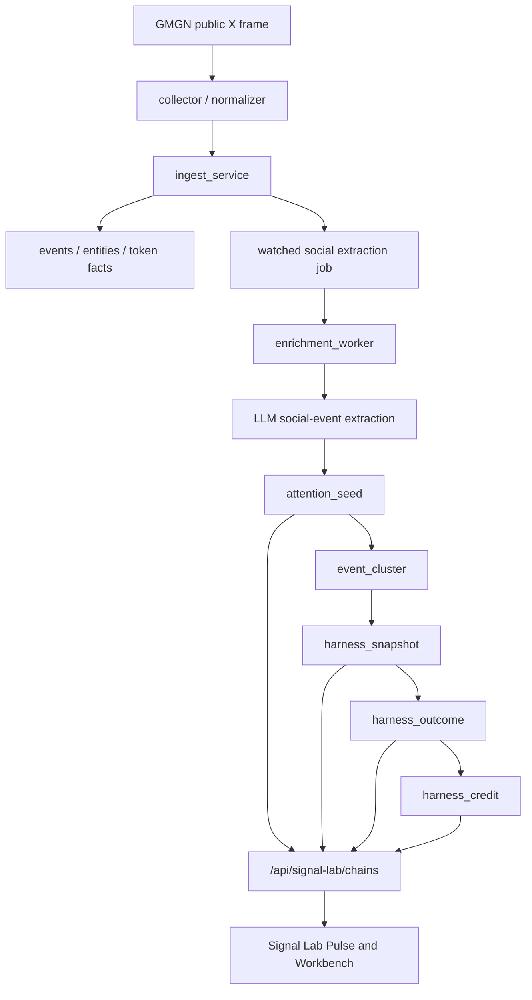
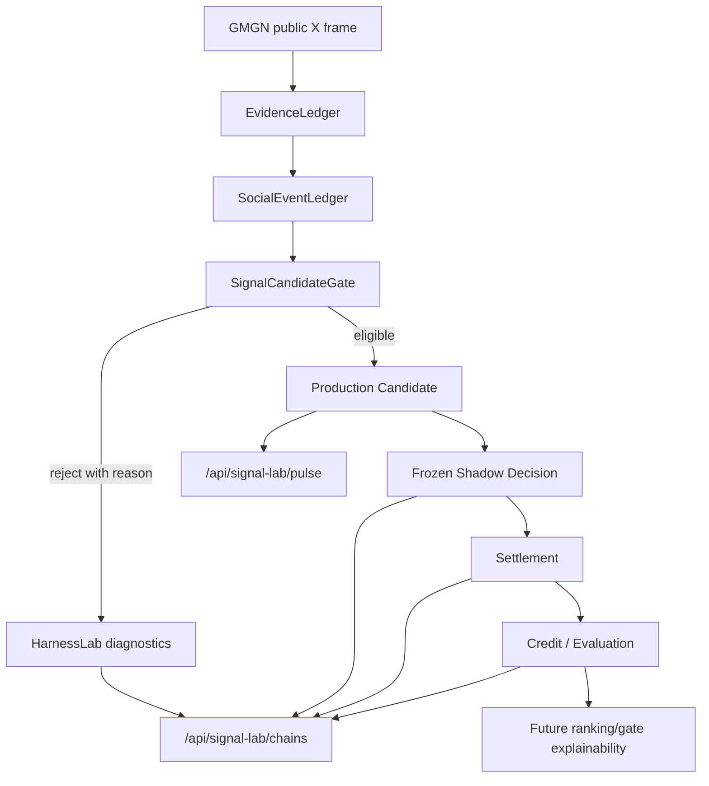

# Signal Lab Production Hard Cut Spec

日期：2026-05-06
状态：Design spec，等待实现计划
范围：Signal Lab Pulse / Harness Lab / closed-loop production gating

## 0. 结论

Signal Lab 现在的问题不是 `0%`、`pending`、`NO TRADE` 的展示问题，而是**产品对象选错了**。

当前 Pulse 把内部审计链路直接当作生产 feed：

```text
social_event_extraction -> attention_seed -> harness_snapshot -> outcome -> credit
```

这条链路适合回答：

```text
某条 watched-account social event 在实验 harness 里走到了哪一步？
```

但生产 Pulse 应该回答：

```text
现在有什么值得交易员注意，为什么可信，市场条件是否允许行动，下一步是什么？
```

这两个问题不是同一个问题。继续在 `/api/signal-lab/chains` 上修排序、文案或过滤，只会把 debug log 包装成产品。正确做法是硬切：

```text
Harness Lab:
  保留 extracted / seeded / frozen / settled / credited 全链路，
  用于审计、评估、模型训练和故障诊断。

Signal Lab Pulse:
  新建生产读模型，
  只展示通过 deterministic asset identity、market readiness、directionality、
  tradeability 和 freshness gate 的候选。
```

旧 `social-harness-mvp-v1` snapshots 必须从生产 Pulse 中失效。旧数据可以留在 Lab 审计里，但不允许继续进入 Pulse。

## 1. 现场证据

2026-05-06 线上容器重建启动后，live DB 状态：

```text
harness_snapshots:
  raw_symbol + missing_market: 6
  raw_symbol + pending:        6
  token_id snapshots:          0

attention_seeds:
  snapshot_ready:              5
```

Pulse 截图中的 `BURNIE / TRENCHER / TOLY` 均来自旧链路生成的 raw-symbol snapshots：

```text
asset = "BURNIE" / "TRENCHER" / "TOLY"
combined_score = 0.0
shadow_signal = NO_TRADE
outcome_status = missing_market 或 pending
credit_status = none
```

它们没有稳定 token identity、没有可结算 entry market、没有可行动 signal，却因为当前 Pulse 复用了 `/api/signal-lab/chains?scope=all&window=24h&limit=200`，被当作生产入口展示。

这证明问题的根因在架构层：

```text
审计生命周期对象被误用为生产候选对象。
```

## 2. 第一性原则

### 2.1 生产信号不是事件，而是可验证的预测承诺

一条 production signal 至少包含：

```text
who said what
which deterministic asset
what direction
what market state at decision time
what action or rejection
what horizon
what outcome later happened
whether this prediction improved future decisions
```

只有 LLM 抽取或 seed 不构成信号。只有 snapshot 也不构成生产信号。生产信号必须是**冻结时可行动、事后可结算、结算后可归因**的预测承诺。

### 2.2 Asset identity 是硬边界，不是展示字段

Crypto 场景里 symbol 不是 identity：

```text
TOLY 可以是 meme phrase、handle、token symbol 或纯文本；
SWEEP 可以是基金名、产品名、token、ticker；
BURNIE / TRENCHER 可能没有可交易市场；
USDC 是资产但不代表这条新闻有交易方向。
```

因此生产候选的 asset 必须是 deterministic `token_id`。Symbol 只能是 display label，不能作为 snapshot asset、join key、filter key 或 settlement key。

### 2.3 Market observability 是入场门槛，不是后置错误

如果 decision_time 没有 entry market snapshot，系统无法回答：

```text
当时价格是多少？
是否已经 priced in？
6h/24h 后实际回报是多少？
相对 benchmark 的 abnormal return 是多少？
```

所以 `missing_market` 不能产生 production snapshot，更不能进 Pulse。它只能成为 Lab diagnostics。

### 2.4 NO_TRADE 是风控结果，不是 Pulse 项

`NO_TRADE` 对 Lab 有意义，因为它说明某条 event 被模型拒绝了。但 Pulse 是生产入口，展示 `NO_TRADE` 会制造低信息噪音。

Pulse 只应该显示：

```text
WATCH
TRADE_CANDIDATE
RISK_REJECTED_HIGH_INFO
```

普通 `NO_TRADE`、`neutral`、`asset_unresolved`、`missing_market` 不进入 Pulse。

### 2.5 闭环必须能改变未来行为

闭环不是“有 outcome 表”。闭环必须满足：

```text
prediction -> outcome -> credit -> evaluation -> future gate/weight/policy
```

如果 settlement coverage 为 0、credit 没有产生、weights 不影响未来候选排序，那只是日志闭环，不是生产闭环。

第一版可以保持 `shadow only`，但必须把 report-only 评价结果接入 Pulse ranking 或 gate explainability。否则系统无法学习。

### 2.6 Lab 和 Pulse 必须分离

Lab 的职责：

```text
解释系统为什么这么判断；
暴露 extraction/seed/snapshot/outcome/credit 的每个中间状态；
帮助研发发现 missing_market、schema failure、低覆盖率、错误归因。
```

Pulse 的职责：

```text
减少交易员认知负担；
只展示当前值得注意的生产候选；
每条给出 action/blocker/risk；
不展示内部阶段噪音。
```

把二者混用，是当前产品不可用的核心原因。

## 3. 当前链路为什么不是生产级闭环

### 3.1 现有数据流



这条链路把所有阶段汇总成 `SignalLabChain`，再被 Pulse 和 Workbench 同时消费。

### 3.2 根本缺陷

| 缺陷 | 现象 | 生产影响 |
|---|---|---|
| Product object 错位 | Pulse 展示 lifecycle chain | 用户看到的是内部状态，不是机会 |
| Identity gate 不硬 | raw symbol snapshot 仍能展示 | 不能 settlement，不能交易，不能归因 |
| Market gate 不硬 | missing market snapshot 进入 Pulse | 到期只能变成失败状态，无法提供指导 |
| `NO_TRADE` 进入生产面 | 顶部全是 NO TRADE | 低信息噪音压过真实候选 |
| 旧 config 未失效 | `social-harness-mvp-v1` 残留继续可见 | 旧半成品污染新体验 |
| Score 没有生产语义 | `0.0` 被展示成 0% 或 NO TRADE | 用户不知道是低分、拒绝、缺数据还是无方向 |
| Settlement/credit 与 ranking 脱节 | 有 worker 但不会改变 Pulse | 闭环没有反馈到未来 |
| Health 不是产品状态 | coverage/job/dead/missing 不转化为 UI gate | 系统坏了仍像有信号 |

### 3.3 当前链路欠缺什么

缺的不是更多 LLM 字段，而是生产级不变量：

1. **Candidate Gate**
   把 social event 转成 production candidate 前必须通过硬门槛。

2. **Deterministic Asset Identity**
   所有 production candidate 使用 `token_id`，symbol 只用于展示。

3. **Entry Market Capture**
   freeze 时必须保存 entry price、liquidity、market cap、volume、pricedness、observation source 和 freshness。

4. **Tradeability Gate**
   market cap 缺失、流动性缺失、价格 stale、稳定币/基金新闻/不可交易资产，都必须被 reject，不进入 Pulse 普通候选。

5. **Production Pulse Read Model**
   Pulse 不能复用 audit chain。它需要自己的 API、排序、状态、空状态和健康降级。

6. **Evaluation Feedback**
   settlement/credit 必须至少影响 Pulse ranking explainability；后续再进入 policy weight。

7. **Version Cutover**
   新旧 config/prompt/schema 必须不可混淆。旧 snapshots 不能被新 Pulse 查询到。

## 4. 目标架构

### 4.1 Bounded Context

```text
EvidenceLedger
  raw_frames
  events
  event_entities
  token facts
  token market snapshots

SocialEventLedger
  model_runs
  social_event_extractions
  LLM schema parse/audit

HarnessLab
  attention_seeds
  event_clusters
  harness_snapshots
  harness_outcomes
  harness_credits
  harness_weights
  /api/signal-lab/chains

SignalCandidateGate
  deterministic identity gate
  direction gate
  market readiness gate
  tradeability gate
  freshness gate
  risk/action classification

SignalPulse
  production read model
  /api/signal-lab/pulse
  Pulse UI
```

### 4.2 目标数据流



关键变化：

```text
Pulse 只读 Production Candidate。
Lab 读完整 Harness。
Reject 不是失败；它是 diagnostics，不是 Pulse feed。
```

## 5. SignalCandidateGate

### 5.1 输入

Gate 输入来自 social event + deterministic facts：

```text
social_event_extraction
attention_seed
resolved token row
entry market snapshot
token tradeability features
source/account features
recent token flow context
historical harness weights
```

### 5.2 硬门槛

Production candidate 必须全部满足：

| Gate | 条件 | 失败状态 |
|---|---|---|
| Signal event | `is_signal_event = true` | `not_signal_event` |
| Direction | direction in `{positive, negative}` | `not_directional` |
| Identity | exactly one deterministic `token_id` or explicitly split candidates | `asset_unresolved` / `asset_ambiguous` |
| Entry market | decision time has price snapshot | `missing_entry_market` |
| Market freshness | price snapshot age within configured SLA | `stale_market` |
| Tradeability | not stable/no-trade asset, market cap/liquidity sufficient | `not_tradeable` |
| Information value | impact/novelty/confidence above floor | `low_information` |
| Coverage | source coverage known | warning only, not hard reject |

失败结果写入 Lab diagnostics，不进入 Pulse。

### 5.3 输出

Gate 输出 `SignalCandidate`：

```text
candidate_id
event_id
seed_id
token_id
display_symbol
direction
pulse_status
decision_time_ms
horizon
candidate_score
action_label
why_now
market_context
risk_reasons
gate_version
source_versions
```

`pulse_status` 枚举：

```text
WATCH
TRADE_CANDIDATE
RISK_REJECTED_HIGH_INFO
SETTLED
CREDITED
```

不包含：

```text
EXTRACTED
SEEDED
FROZEN
NO_TRADE
MISSING_MARKET
PENDING
NONE
```

这些是 Lab 状态，不是 Pulse 状态。

## 6. Harness Lab

`/api/signal-lab/chains` 保留，但语义改回 Lab：

```text
用途：审计生命周期，不作为生产 Pulse 数据源。
数据：可以展示 extracted/seeded/frozen/settled/credited。
空态：必须解释卡在哪个 gate。
排序：按更新时间和诊断严重度，不代表机会优先级。
```

Lab 允许展示：

```text
asset_unresolved
asset_ambiguous
not_directional
market_unavailable
missing_market
insufficient_market_data
NO_TRADE
dead_jobs
schema failures
```

但这些必须显示为 diagnostics，不显示为 production signal。

## 7. Signal Lab Pulse

### 7.1 API

新增：

```text
GET /api/signal-lab/pulse
```

参数：

```text
window=1h|4h|24h
horizon=6h|24h
scope=matched|all
limit=50
cursor=...
status=WATCH|TRADE_CANDIDATE|RISK_REJECTED_HIGH_INFO|SETTLED|CREDITED
asset=token_id or symbol display filter
handle=@source
q=text
```

响应：

```json
{
  "ok": true,
  "data": {
    "query": {},
    "health": {
      "pulse_ready": true,
      "extractor_running": true,
      "harness_ops_running": true,
      "settlement_coverage": 0.72,
      "candidate_count": 12,
      "blocked_count": 34
    },
    "summary": {
      "watch": 8,
      "trade_candidate": 2,
      "risk_rejected_high_info": 2,
      "settled": 5,
      "credited": 3
    },
    "items": []
  }
}
```

### 7.2 Pulse row 信息预算

每条 Pulse row 必须回答：

```text
Asset: 哪个 deterministic token
Why now: 哪个 social event 造成注意力变化
Market: 当时价格/市值/流动性/预涨幅状态
Action: watch / trade candidate / high-info reject
Risk: 最主要的 1-3 个 blocker
Loop: pending settlement / settled / credited
```

不展示：

```text
schema_version
prompt_version
raw extraction fields
full lifecycle trace
all risk list
all event clusters
```

这些进入 Inspector / Lab。

### 7.3 Pulse 排序

排序不再按 Lab stage 排：

```text
TRADE_CANDIDATE > WATCH > RISK_REJECTED_HIGH_INFO > SETTLED > CREDITED
then candidate_score desc
then freshness desc
then source/account relevance desc
```

`NO_TRADE` 没有 rank，因为它不进入 Pulse。

### 7.4 空状态

Pulse 空态必须是生产态：

```text
No production candidates.
Extractor running.
12 social events blocked:
  7 asset_unresolved
  3 missing_entry_market
  2 not_directional
Open Lab to inspect.
```

这比展示 12 条 `NO_TRADE/missing_market` 更有信息量。

## 8. 存储与版本硬切

### 8.1 版本

新增版本：

```text
CONFIG_VERSION = social-harness-v2-production-gated
GATE_VERSION = signal-candidate-gate-v1
PULSE_VERSION = signal-pulse-v1
```

旧版本：

```text
social-harness-mvp-v1
```

只能出现在 Lab，不得进入 Pulse。

### 8.2 旧数据处理

硬切要求：

```text
Pulse 查询只读取 signal_candidates。
signal_candidates 只允许由 v2 gate 写入。
旧 config_version 不允许写入 signal_candidates。
asset not like 'token:%' 不允许写入 signal_candidates。
missing_market / pending raw-symbol residues 必须在迁移中失效。
```

迁移动作：

```text
UPDATE harness_snapshots
SET outcome_status = 'superseded'
WHERE config_version = 'social-harness-mvp-v1'
  AND asset NOT LIKE 'token:%';
```

`superseded` 是 terminal Lab status，不是兼容层。它的目的只有一个：把旧 MVP 样本从生产候选空间里物理切出，并让 Lab 能解释这些历史行为什么不再参与 Pulse。

### 8.3 是否新增表

推荐新增物化表：

```text
signal_candidates
```

理由：

1. Pulse 是生产读模型，不应该每次从 audit chain 临时拼装。
2. candidate 是 gate 的结果，应该可审计、可复放、可评估。
3. settlement/credit 后需要更新 loop status，表级状态更清晰。

字段：

```text
candidate_id primary key
event_id
seed_id
snapshot_id nullable
token_id
display_symbol
horizon
direction
pulse_status
candidate_score
action_label
why_now
market_context_json
gate_reasons_json
risk_reasons_json
gate_version
pulse_version
created_at_ms
updated_at_ms
```

`snapshot_id` nullable 的原因：

```text
WATCH / RISK_REJECTED_HIGH_INFO 可以是候选但不一定有 executable shadow snapshot。
TRADE_CANDIDATE 必须有 snapshot。
```

如果要更简单，也可以第一版不建表，直接派生 query。但这会继续把 Pulse 绑在 harness internals 上。为了根治，推荐建表。

## 9. Scoring 与行动语义

### 9.1 旧分数问题

`combined_score = 0.0` 在 Lab 里代表：

```text
事件分数中性或被 gate 压平。
```

但在 Pulse 里用户会理解为：

```text
这个机会强度是 0%。
```

这是语义错位。

### 9.2 新 candidate_score

Pulse 使用 `candidate_score`，不是裸 `combined_score`。

组成：

```text
event_quality
direction_confidence
source_weight
semantic_novelty
market_readiness
tradeability
pricedness_penalty
historical_credit_weight
freshness_decay
```

输出不是概率，不显示 `%`。显示区间：

```text
High conviction
Watch
Speculative
Blocked
```

第一版可以保留数值用于排序，但 UI 不用百分比表达。

### 9.3 Action label

候选输出必须有明确 action：

```text
WATCH:
  信息有效，市场条件可观察，但分数不足以 trade candidate。

TRADE_CANDIDATE:
  信息有效，市场可观察，风险门槛通过，shadow decision 非 FLAT。

RISK_REJECTED_HIGH_INFO:
  信息强，但被硬风险拒绝。例如流动性不足、已大幅 priced in、market stale。
```

## 10. 运行时闭环

### 10.1 Worker

保留 `HarnessOpsWorker`，但增加 candidate maintenance：

```text
process_once:
  materialize market-ready seeds
  build/update signal_candidates
  settle due snapshots
  attribute credits
  update weights
  refresh candidate loop status
```

### 10.2 闭环反馈

第一版反馈不直接自动交易，但必须影响 Pulse：

```text
historical source/event_type/token credit -> candidate_score explainability
poor settlement coverage -> pulse health degraded
high missing_market rate -> production candidate gate blocks more aggressively
dead extraction jobs -> pulse_ready false if above threshold
```

### 10.3 Health gate

Pulse health 不应只显示 worker running：

```text
pulse_ready =
  extractor_running
  and harness_ops_running
  and dead_job_rate below threshold
  and market_observation_ready
  and settlement_coverage above minimum once enough samples exist
```

当 `pulse_ready=false`：

```text
Pulse 显示 degraded empty state；
不展示旧/不可信 candidates；
引导用户去 Lab diagnostics。
```

## 11. API/UI 变更

### 11.1 Backend

新增：

```text
storage/signal_candidate_repository.py
pipeline/signal_candidate_gate.py
retrieval/signal_pulse_service.py
GET /api/signal-lab/pulse
```

修改：

```text
harness_snapshot_builder.py:
  只负责 Lab snapshot，不负责 Pulse 行动语义。

harness_ops_worker.py:
  调用 candidate gate/refresh。

harness_service.py:
  chains 明确为 Lab audit read model。

api/http.py:
  新增 pulse endpoint。
```

### 11.2 Frontend

修改：

```text
App.tsx:
  SignalLabPulse query 改为 /api/signal-lab/pulse。

SignalLabPulse.tsx:
  消费 SignalPulseData，而不是 SignalLabChainsData。

SignalLabWorkbench.tsx:
  继续消费 /api/signal-lab/chains。

SignalLabInspector:
  Pulse row 点击后可打开 Lab inspector，但 inspector 显示的是 lineage detail。
```

### 11.3 用户体验

默认 Live/Tokens 页面：

```text
Signal Lab Pulse = production candidates only
```

Open Lab：

```text
完整 audit chains + diagnostics
```

这让用户在主工作流中只看高信息候选，在二级页面里看系统为什么拒绝或卡住。

## 12. 测试与验收

### 12.1 单元测试

必须覆盖：

```text
raw symbol never enters Pulse
missing entry market never enters Pulse
NO_TRADE never enters Pulse
token_id + entry market + direction can enter Pulse
tradeability hard reject becomes RISK_REJECTED_HIGH_INFO only when information value high
old config_version excluded from Pulse
Lab chains still show diagnostics
```

### 12.2 API 测试

必须覆盖：

```text
GET /api/signal-lab/pulse returns health + summary + items
Pulse empty state reports blocker counts
Pulse uses cursor pagination
Pulse filters by token_id/display symbol/handle/q
/api/signal-lab/chains remains audit lifecycle source
```

### 12.3 Frontend 测试

必须覆盖：

```text
SignalLabPulse calls /api/signal-lab/pulse, not /api/signal-lab/chains
Pulse does not render NO_TRADE rows
Pulse empty state shows blocker summary
Open Lab still loads chain workbench
Selecting Pulse item opens inspector lineage
```

### 12.4 Live 验收

在当前 live DB 上，硬切后应满足：

```text
Pulse 不再显示 BURNIE/TRENCHER/TOLY raw-symbol missing_market rows。
Pulse 如无 production candidates，显示 degraded/empty state + blocked counts。
Lab 仍能查到这些旧 rows，并标注 legacy/superseded/missing_market。
readyz 显示 harness_ops running。
```

## 13. 落地性判断

这个方案能根本落地，因为它不依赖“模型变聪明”或“数据以后自然变好”。它把当前不可用的地方变成硬不变量：

```text
没有 token_id -> 不进 Pulse
没有 entry market -> 不进 Pulse
NO_TRADE -> 不进 Pulse
旧 config -> 不进 Pulse
Pulse 不读 audit chain -> 不会被内部残片污染
```

它也没有推翻已有工程资产：

```text
collector / ingest / social_event_extractions / attention_seeds / snapshots / outcomes / credits 继续保留；
Harness Lab 继续使用现有 chains；
新增的是生产候选 gate 和 production pulse read model。
```

因此风险集中在三个可控点：

1. 新增 `signal_candidates` 表和 repository。
2. 新增 gate/refresh worker。
3. 前端 Pulse 改 API 和信息架构。

这不是半成品补丁，而是把“实验审计”和“生产入口”拆成两个不同产品对象。拆开之后，缺数据会变成诊断，不会伪装成信号；有信号时才会进入 Pulse，并且能被 settlement/credit 闭环评估。

## 14. 非目标

本次不做：

```text
自动下单
真实资金仓位
复杂 ML ranking
外部新闻源接入
保留旧 Pulse 行为兼容
用 symbol 作为生产 identity
把 missing_market 包装成可行动机会
```

## 15. 实施顺序建议

1. 数据硬切：新增版本、失效旧 raw-symbol production visibility。
2. Gate：实现 `SignalCandidateGate`，先覆盖 identity/market/direction/tradeability。
3. Storage：新增 `signal_candidates` 和 repository。
4. Worker：接入 candidate refresh。
5. API：新增 `/api/signal-lab/pulse`。
6. UI：Pulse 改用新 API；Lab 继续使用 chains。
7. Tests：按 §12 补齐。
8. Live verification：用当前 DB 验证旧残片不再进入 Pulse。
