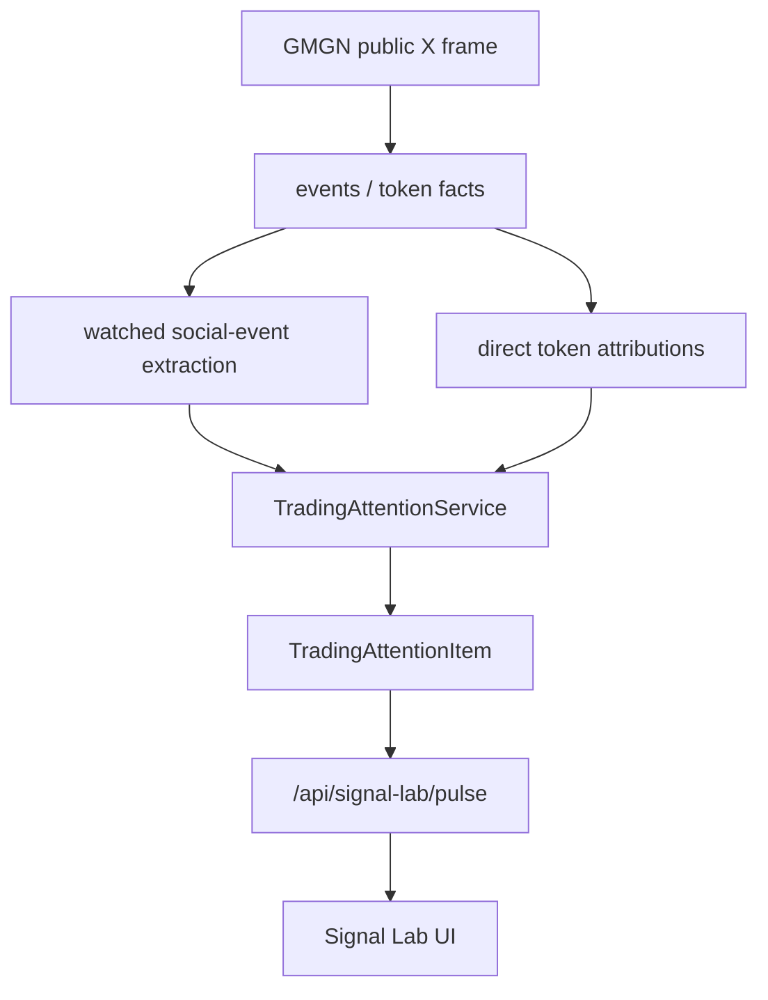

# Watched Account Trading Attention Spec

日期：2026-05-06  
状态：Hard-cut replacement spec  
取代：`2026-05-06-signal-lab-production-hard-cut-cn.md` 的 SignalCandidate/Pulse 方向

## 0. 结论

Signal Lab 的设计方向需要回到更简单的第一性原理：

```text
我关注的账号，现在把交易注意力推向了什么？
```

被关注账号的内容不一定是一个可结算 token call。它可能是：

```text
直接代币：$BNB、CA、listing、launch、buy/sell。
间接话题：CZ 讲 build、Musk 讲 Grok、Toly 讲 Solana 文化。
生态方向：Solana/Base/BNB/AI agent/DePIN/RWA。
市场结构：流动性、仓位、周期、risk-on/off。
风险事件：监管、交易所、合约、项目方、市场异常。
```

旧的 harness 链路把这些内容强行压成：

```text
event -> seed -> snapshot -> outcome -> credit
```

这个方向对研究评估有价值，但对交易员主界面是错的。它会把关键词错误 token 化，把话题误当成资产，把 `NO_TRADE / missing_market / pending` 这种内部状态展示成产品信息。

新的产品对象是：

```text
TradingAttentionItem
```

它回答：

```text
谁说了什么？
这是 direct token、topic heat、ecosystem signal、market structure 还是 risk alert？
与哪些 token/topic/生态相关？
交易相关性有多强？
当前热度和跟进情况如何？
下一步应该看什么？
```

这不是预测归因系统，而是 watched-account trading intelligence radar。

## 1. 第一性目标

### 1.1 用户工作流

用户关注一批账号，是因为这些账号会提前或同步暴露交易注意力：

```text
CZ 说 build on BNB -> 可能影响 BNB 生态、launchpad、meme、CEX 上币情绪。
Musk 说 Grok -> 可能影响 AI agent / Grok meme / xAI 叙事。
Toly 说 Solana -> 可能影响 SOL 生态、builder confidence、Solana meme。
交易员说 market structure -> 可能影响方向、风险偏好、仓位。
```

用户不需要系统把每条内容立刻变成一个 token snapshot。用户先需要：

```text
这条内容有没有交易相关性？
它是直接还是间接？
相关 token/topic 是什么？
有没有开始扩散？
有没有市场反应？
值得点开继续看吗？
```

### 1.2 系统职责

系统应该降低交易员扫描成本：

```text
收集 watched-account event。
抽取交易相关语义。
保留 direct token 与 indirect topic 两条路径。
聚合同类 attention。
提供热度、跟进、市场上下文。
把低信息内容明确降级。
```

系统不应该：

```text
把关键词强行当 token。
把未识别资产变成 snapshot。
把 NO_TRADE 当成 Pulse item。
把内部生命周期阶段放在主界面。
用科研式 credit attribution 作为第一屏。
```

## 2. 旧方向为什么复杂但没用

### 2.1 错误抽象

旧产品对象是 `SignalChain`：

```text
Social Event -> Attention Seed -> Snapshot -> Outcome -> Credit
```

这让产品默认假设：

```text
每条重要 watched-account event 都应该走向某个 token snapshot。
```

实际不成立。很多重要信号是 indirect：

```text
keyword / meme phrase / ecosystem / risk regime / market structure
```

它们先是交易注意力，不是 token call。

### 2.2 错误展示

Pulse 复用 `/api/signal-lab/chains`，导致主界面展示：

```text
FROZEN
NO TRADE
missing_market
pending
0%
```

这些字段对研发调试有意义，对交易员没有第一屏价值。

### 2.3 错误闭环

旧闭环试图证明单条 social event 对 6h/24h price outcome 的因果贡献：

```text
snapshot -> outcome -> credit
```

但 watched-account intelligence 更应该先闭环到：

```text
attention -> follow-up discussion -> token/topic heat -> market reaction -> user scan value
```

也就是交易注意力闭环，而不是单事件因果归因闭环。

### 2.4 错误复杂度

旧架构引入了：

```text
horizon
snapshot
shadow decision
settlement
credit
weights
score buckets
stage filters
trace/snapshot/outcome/credit tabs
```

但用户第一屏真正要的是：

```text
direct token
topic heat
ecosystem signal
risk alert
market structure
```

复杂度没有转化成信息密度。

## 3. 新概念模型

### 3.1 TradingAttentionItem

一条 item 是 watched account event 的交易相关解释：

```text
item_id
kind
priority
heat_score
source
event
summary
why_it_matters
linked_tokens
linked_topics
metrics
risks
next_action
```

`kind`：

```text
direct_token
topic_heat
ecosystem_signal
market_structure
risk_alert
low_signal
```

`priority`：

```text
hot
watch
context
muted
```

### 3.2 Direct token 与 indirect topic 分离

Direct token 条件：

```text
CA / resolved token_id / direct token attribution / unambiguous cashtag
```

Indirect topic 条件：

```text
anchor term
subject
hashtag
known ecosystem term
watched account semantic event
```

间接 topic 不会被强制写成 token snapshot。它可以链接多个可能相关 token，但必须标为：

```text
relation = direct | ecosystem | narrative | keyword | risk
```

### 3.3 Trading relevance

交易相关性来自可解释 features：

```text
direct token mention
watched source
event_type
direction_hint
impact_hint
semantic_novelty_hint
confidence
token/topic follow-up count
distinct watched authors
market reaction when token is resolved
risk flags
```

分数只用于排序，不显示成概率。

## 4. 目标数据流



注意：

```text
harness_snapshot / outcome / credit 不在主链路。
```

它们可以作为后台研究工具存在，但不能驱动 Signal Lab 产品界面。

## 5. 后端设计

### 5.1 新服务

新增：

```text
src/gmgn_twitter_intel/retrieval/trading_attention_service.py
```

输入 repository：

```text
evidence
signals
tokens
```

不依赖：

```text
HarnessRepository
HarnessService
harness_snapshots
harness_outcomes
harness_credits
```

### 5.2 API

新增并作为唯一 Signal Lab 前端数据源：

```text
GET /api/signal-lab/pulse
```

参数：

```text
window=5m|1h|4h|24h
scope=matched|all
limit=80
cursor=...
kind=direct_token|topic_heat|ecosystem_signal|market_structure|risk_alert|low_signal
handle=@cz_binance
q=grok
```

响应：

```json
{
  "query": {
    "window": "1h",
    "scope": "matched",
    "kind": null,
    "handle": null,
    "q": null
  },
  "summary": {
    "direct_token": 4,
    "topic_heat": 8,
    "ecosystem_signal": 3,
    "market_structure": 2,
    "risk_alert": 1,
    "low_signal": 5,
    "hot": 2,
    "watch": 9,
    "context": 7,
    "muted": 5
  },
  "items": [],
  "returned_count": 80,
  "has_more": false,
  "next_cursor": null
}
```

### 5.3 Ranking

排序：

```text
priority_rank desc
heat_score desc
received_at_ms desc
```

Priority 规则：

```text
hot:
  direct token 或 high-impact topic，且 heat_score >= 75

watch:
  trading relevance 明确，heat_score >= 45

context:
  有交易语义但缺少扩散或市场上下文

muted:
  低信息、闲聊、无法解释交易相关性
```

### 5.4 Topic extraction

Topic 来源优先级：

```text
social_event_extractions.anchor_terms
social_event_extractions.subject
event.hashtags
event.cashtags without resolved token
simple text fallback
```

需要保留关键词形态，不强制 token 化。

### 5.5 Token linking

Token 来源：

```text
event_token_attributions direct/selected
account_token_alerts
event_token_mentions
```

linked token 字段：

```text
token_id
identity_key
symbol
chain
address
relation
confidence
status
```

未 resolved 的 symbol 可以展示，但必须：

```text
status = unresolved_symbol
relation = keyword
```

### 5.6 Heat metrics

第一版按需计算，不新增表：

```text
window_mentions:
  同 token_id 或 topic key 在窗口内出现次数

watched_author_count:
  同 token/topic 在窗口内出现的 watched authors 数

direct_token_count:
  当前 event 的 direct/selected token links 数

topic_count:
  当前 event 的 extracted topics 数
```

后续如需要性能优化，再加 materialized read model。第一版不要过早持久化。

## 6. 前端设计

### 6.1 Signal Lab 定位

Signal Lab 不再是 harness workbench，而是 watched-account trading attention cockpit。

主文案：

```text
Track watched-account trading attention across direct tokens, topics, ecosystems, risk, and market structure.
```

### 6.2 Pulse row

每行展示：

```text
kind badge
priority
source handle
title
summary / why it matters
linked tokens
linked topics
heat score label
metrics chips
relative time
source link
```

不展示：

```text
FROZEN
SETTLED
CREDITED
NO TRADE
horizon
snapshot/outcome/credit
```

### 6.3 Workbench

Signal Lab 页面展示：

```text
summary cards:
  Direct token
  Topic heat
  Ecosystem
  Structure
  Risk

filters:
  kind
  source
  search

main list:
  TradingAttentionItem[]
```

### 6.4 Inspector

右侧 detail 不再是 Trace/Snapshot/Outcome/Credit。

改为：

```text
Attention detail
  original post
  why it matters
  linked tokens
  linked topics
  metrics
  risks
```

## 7. 旧逻辑删除

从前端产品路径删除：

```text
SignalLabChain as UI selection object
SignalChainList
SignalLabInspector lifecycle tabs
SignalLabWorkbench stage/horizon filters
SignalLabPulse sorting by lifecycle stage
App query to /api/signal-lab/chains
backend /api/signal-lab/chains read model
top stats seeded/frozen/settled
```

后端保留 harness CLI/API 可以作为后台研究接口，但 Signal Lab UI 不再引用它。

本次同时删除 `/api/signal-lab/chains` 这条旧产品 read model；如果后续要完全删除 harness backend，需要单独 migration 和 CLI deprecation。根治范围是 Signal Lab 产品链路，不再让旧 harness 逻辑污染用户界面或公开 Signal Lab API。

## 8. 验收标准

### 8.1 当前 live DB 验收

重构后：

```text
Signal Lab Pulse 不显示 FROZEN / NO TRADE / missing_market。
BURNIE/TRENCHER/TOLY 如果出现，只能作为 topic/direct-token attention item，并说明为什么交易相关。
没有 resolved token 的关键词不会被假装成 token snapshot。
Open Lab 展示 Direct token / Topic heat / Ecosystem / Structure / Risk 分类。
```

### 8.2 自动化测试

必须覆盖：

```text
direct token event becomes direct_token item
keyword-only event becomes topic_heat item
market_structure_comment becomes market_structure item
negative exchange/regulation event becomes risk_alert item
low information event becomes low_signal or filtered by priority
frontend calls /api/signal-lab/pulse and /api/signal-lab/chains no longer exists
frontend does not render lifecycle words: FROZEN, SETTLED, CREDITED, NO TRADE
```

## 9. 非目标

本次不做：

```text
单条 event 因果归因
6h/24h settlement
credit attribution
自动交易
new materialized tables
ML ranking
旧 Signal Chain UI 兼容
```
