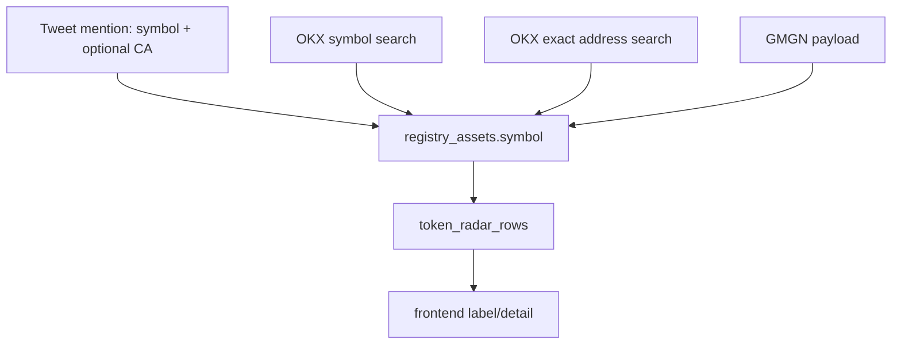
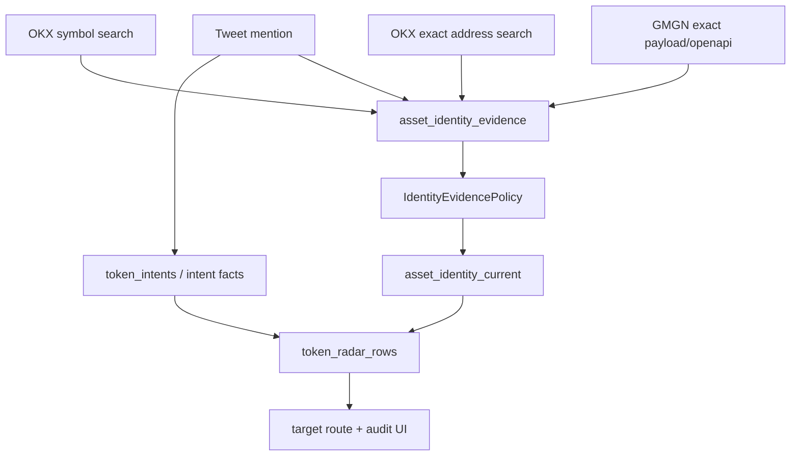

# Token Identity Evidence Hard Cut Spec

## 一句话结论

Token Radar 不能再靠 `primary_source` 字符串优先级和局部补丁维护资产身份。目标架构必须把“用户提到什么”和“链上地址真实身份是什么”拆开，把身份证据建成一条可解释、可审计、可重算的 evidence ledger，然后用一个简单确定性的 policy 产出当前 canonical identity。

这是一轮 hard cut，不保留双写、旧字段 fallback、前端修正表、历史兼容 adapter。旧数据通过一次性 migration/backfill 转成新模型；无法可信迁移的资产标为 unverified，并由 exact-address verification 重建身份。

## 背景

2026-05-10 之前，Token Radar 出现过一类严重错配：

- radar row 显示 `SHIT`，点进去实际 target/price 像 `SLOP`。
- `SLOP` row 点进去可能落到另一个 CA。
- `0x999b...`、`0xaf1e...`、`0x829f...` 等地址的 symbol/name/price 在 GMGN/OKX 精确地址 truth 和本地 registry 之间不一致。
- `5m/1h/4h/24h` 的投影可以把错身份稳定输出，因为错误已经落进 registry，不是前端 click handler 临时点错。

已经落地的短期修复：

- `okx_dex_search` 拆成 symbol search 与 exact address search 两类 source。
- exact address search 可纠正 tweet alias，但低于 GMGN payload。
- market sync 对非地址验真来源重新 exact address search。
- projection/frontend 优先 target identity，不让 mention symbol 覆盖 resolved target。

这解决了当前故障模式，但仍然暴露了更深层问题：现有 registry 的“source 字符串 + 数字优先级”不是一个足够明确的身份架构。

## 根因

### 1. `source` 同时表达了太多概念

当前 `registry_assets.primary_source` / `source` 字符串混合表达了：

- provider：数据来自 GMGN、OKX、tweet。
- lookup mode：按 symbol 搜索，还是按 exact address 搜索。
- authority：是否有资格覆盖 canonical symbol/name。
- freshness：什么时候看到过。
- confidence：是候选、用户提及、还是 provider 精确确认。

这导致 `okx_dex_search` 这个名字曾同时代表两种完全不同的证据：

- `$SHIT` symbol search 返回的一批候选：低可信。
- `0x999b...` exact address search 返回的同链同地址资产：高可信。

因为它们共享同一个 source，系统无法表达“同一个 provider，不同 lookup mode，可信度不同”。

### 2. Tweet mention 被当成 canonical identity 候选

Tweet 里提到 `$SATO` 并附带一个 CA，本质上只说明：

> 这条 tweet 把某个文本 symbol 和某个地址放在同一语境里。

它不能证明：

> 这个地址的真实 token symbol 就是 tweet 里的 `$SATO`。

旧逻辑把 tweet alias 写进 registry asset 的 `symbol`，并且它的优先级可能高于 provider exact address search。于是用户文本污染了 canonical identity。

### 3. Market sync 用“字段完整”判断“身份可信”

旧 `_needs_address_search` 类逻辑看的是：

- `symbol` 是否存在。
- `market_cap_usd` 是否存在。
- `liquidity_usd` 是否存在。
- `holders` 是否存在。

但这些字段完整只说明 market snapshot 比较完整，不说明 identity 被验证过。如果错误 symbol 已经带了完整价格/市值，系统反而不会再 exact address search，错误就被固化。

### 4. Projection 和 frontend 被迫消化不可靠 registry

Projection 本应只读 canonical identity；frontend 本应只消费 target/ref。由于 registry 身份不可靠，后续层被迫加判断：

- 目标 symbol 到底用 registry、feed、target 还是 mention？
- resolved row 要不要保留 mention label？
- 二级页没有当前窗口 row 时要不要 fallback？

这些都是上游身份模型不清晰后扩散出来的复杂度。

## 目标

### Product Goals

- Token Radar 的每个 row 都能解释：
  - 用户原文提到了什么。
  - 系统解析到哪个 target。
  - target 的 canonical symbol/name 来自哪条证据。
  - 为什么这条证据赢过冲突证据。
  - price 绑定的是哪个 target，而不是哪个 mention。
- 点击任何 row 都必须进入同一个 target identity，不允许 label/price/detail 三者分叉。
- 对 SHIT/SLOP/SATO 这类同名、多链、meme 垃圾桶场景，系统默认保守、可解释，不靠前端补丁。

### Engineering Goals

- 身份事实和社交 mention 分离。
- 资产身份选择由一个 deterministic policy 完成。
- 所有身份覆盖必须可审计。
- 不再把 provider source 字符串当业务策略散落在各处。
- 不再用 market 数据完整性替代 identity confidence。
- 不保留旧模型兼容代码，避免双路径长期存在。

## Non-Goals

- 不做链上合约深度风险分析。
- 不做 ML/LLM 身份判断。
- 不为历史 API 形状保留 compatibility shim。
- 不保证旧 token radar materialized rows 原样可读；它们必须 rebuild。
- 不在 frontend 维护 token correction map。
- 不为个别 token 写 allowlist/denylist 特例。

## 第一性原则

### 1. Address identity is stronger than mention identity

链上资产的 identity key 是：

```text
chain_id + token_standard + normalized_address
```

Symbol 不是 identity key。Symbol 是可变 display attribute，也是冲突最多的字段。

### 2. Mention is evidence of attention, not evidence of identity

Tweet text 可以给 token radar 提供 attention、intent、语境、作者、时间，但不能单独决定 canonical symbol/name。

### 3. Exact lookup and candidate lookup are different evidence kinds

同一个 provider 的两个查询模式必须分开：

- exact address lookup：可用于 canonical identity。
- symbol search：只能用于 candidate discovery，不能压过 exact evidence。

### 4. Identity confidence is independent from market freshness

价格新鲜不代表身份正确。Identity verification 是单独状态。

### 5. One policy decides canonical identity

所有 canonical symbol/name 的选择只能来自一个模块，例如 `IdentityEvidencePolicy`。Repository 只写 evidence，projection 只读 current identity，frontend 不纠正 identity。

### 6. Hard cut over compatibility

旧字段、旧 source 字符串、旧 projection fallback 不作为运行时兼容层保留。迁移可以一次性读取旧数据，但迁移后 runtime 只能走新模型。

## Target Architecture

### Current bad shape



Bad property: every source writes the same mutable `registry_assets.symbol`; correctness depends on ad hoc numeric precedence.

### New shape



Good property: mention and canonical identity are separate inputs. A single policy chooses canonical identity and records why.

## Data Model

### `registry_assets`

Purpose: stable target table. It stores identity key and lifecycle status, not raw provider claims.

Target columns:

```text
asset_id TEXT PRIMARY KEY
chain_id TEXT NOT NULL
token_standard TEXT NOT NULL
address TEXT NOT NULL
project_id TEXT NULL
status TEXT NOT NULL
first_seen_at_ms BIGINT NOT NULL
updated_at_ms BIGINT NOT NULL
```

Rules:

- `asset_id` remains deterministic from chain/standard/address.
- `symbol`, `name`, `decimals`, `primary_source` are removed from this table as mutable source-owned fields.
- Display identity comes from `asset_identity_current`.
- `registry_assets` may be created by tweet CA, symbol search candidate, GMGN, or exact address lookup, but creation does not imply canonical symbol is known.

### `asset_identity_evidence`

Purpose: append-only-ish ledger of provider/user identity claims.

Target columns:

```text
evidence_id TEXT PRIMARY KEY
asset_id TEXT NOT NULL REFERENCES registry_assets(asset_id)
evidence_kind TEXT NOT NULL
provider TEXT NOT NULL
lookup_mode TEXT NOT NULL
chain_id TEXT NOT NULL
address TEXT NOT NULL
symbol TEXT NULL
name TEXT NULL
decimals INTEGER NULL
observed_at_ms BIGINT NOT NULL
payload_hash TEXT NOT NULL
raw_payload_json JSONB NOT NULL DEFAULT '{}'::jsonb
```

`evidence_id` is deterministic:

```text
sha256(asset_id + evidence_kind + provider + lookup_mode + payload_hash)
```

This avoids duplicate rows on repeated sync while keeping changed provider payloads visible.

Allowed `lookup_mode`:

```text
exact_address
provider_payload
cex_universe
symbol_search
tweet_mention
manual_repair
```

Allowed `evidence_kind`:

```text
gmgn_openapi_exact
gmgn_payload_exact
okx_dex_exact_address
okx_dex_symbol_candidate
okx_cex_instrument
tweet_contract_mention
manual_identity_repair
```

KISS rule: these strings live in one domain module only. No source string comparisons outside identity policy/tests.

### `asset_identity_current`

Purpose: current canonical display identity selected by policy.

Target columns:

```text
asset_id TEXT PRIMARY KEY REFERENCES registry_assets(asset_id)
canonical_symbol TEXT NULL
canonical_name TEXT NULL
decimals INTEGER NULL
identity_confidence TEXT NOT NULL
selected_evidence_id TEXT NULL REFERENCES asset_identity_evidence(evidence_id)
selection_reason_codes JSONB NOT NULL DEFAULT '[]'::jsonb
conflict_count INTEGER NOT NULL DEFAULT 0
verified_at_ms BIGINT NULL
updated_at_ms BIGINT NOT NULL
```

Allowed `identity_confidence`:

```text
provider_exact
provider_candidate
mention_only
unknown
manual
```

Rules:

- `provider_exact` means selected evidence was exact-address/provider-payload/cex-universe.
- `provider_candidate` means only symbol-search provider candidate exists.
- `mention_only` means asset was created from tweet CA, but no provider identity has verified the symbol/name.
- `unknown` means no usable symbol/name evidence exists.
- `manual` is allowed only through explicit ops command and must write evidence.

### Existing tables that stay conceptually separate

`token_intent_resolutions` continues to answer:

> Which target did this mention resolve to, and why?

It must not answer:

> What is this target's canonical symbol?

`price_observations` continues to answer:

> What market data did we observe for this target?

It must not answer:

> Is this target identity verified?

## Identity Evidence Policy

One function owns identity selection:

```text
select_current_identity(asset_id, evidence_rows) -> asset_identity_current
```

Decision order:

1. `manual_identity_repair`
   - only if created through explicit ops command.
   - requires reason text in raw payload.
2. `gmgn_openapi_exact`
   - provider exact identity.
3. `gmgn_payload_exact`
   - event/provider payload with chain/address match.
4. `okx_dex_exact_address`
   - provider exact address match on same chain/address.
5. `okx_cex_instrument`
   - only for CEX token identity, not DEX chain assets.
6. `okx_dex_symbol_candidate`
   - candidate display only, never beats exact evidence.
7. `tweet_contract_mention`
   - can set `mention_only`, but cannot become canonical symbol if any provider evidence exists.
8. no evidence
   - `unknown`.

Tie-breakers within the same evidence kind:

1. newest `observed_at_ms`.
2. lexicographically smallest `evidence_id`.

Conflict handling:

- If lower-priority evidence disagrees on symbol/name, record it in `conflict_count`.
- `selection_reason_codes` must include at least:
  - `SELECTED_<EVIDENCE_KIND>`
  - `OUTRANKED_<EVIDENCE_KIND>` for conflicts
  - `EXACT_ADDRESS_MATCH` where applicable
  - `MENTION_NOT_CANONICAL` when tweet symbol differs from selected symbol

KISS constraint: no weighted scoring. A fixed ordered policy is enough.

## Pipeline Design

### Ingest

Input: GMGN anonymous public WebSocket events.

Steps:

1. Normalize event.
2. Extract mention facts:
   - display symbol from text.
   - CA/address if present.
   - chain hint if present.
3. Create/update `registry_assets` by deterministic address key when CA exists.
4. Write `asset_identity_evidence` with `evidence_kind=tweet_contract_mention`.
5. Write token intent/resolution facts.

Hard rule:

- Ingest must not write canonical symbol/name directly.
- Tweet symbol remains mention context.

### Discovery

Symbol discovery:

1. `$SYMBOL` lookup can call provider symbol search.
2. Each provider result creates/updates `registry_assets`.
3. Each result writes `asset_identity_evidence` with `evidence_kind=okx_dex_symbol_candidate`.
4. Policy may select candidate display only if no exact evidence exists.

Address discovery:

1. Address lookup must call exact provider search.
2. A result is accepted only if provider chain and address exactly match requested chain/address.
3. It writes `evidence_kind=okx_dex_exact_address`.
4. Policy recalculates `asset_identity_current`.

Hard rule:

- Symbol search and address search may share client code, but not evidence kind or identity authority.

### Market Sync

Market sync can write prices, market cap, liquidity, holders.

Before relying on a chain asset's market data in Token Radar:

- if `asset_identity_current.identity_confidence` is `mention_only` or `unknown`, schedule exact-address verification.
- if exact-address verification fails, price can still be stored, but radar must show identity confidence as unverified.

Hard rule:

- Market field completeness must never skip identity verification.

### Projection

Token Radar projection joins:

- `token_intent_resolutions` for target and mention context.
- `asset_identity_current` for canonical target display.
- `price_observations` for market data.

Projection output contract:

```text
target.symbol = asset_identity_current.canonical_symbol
target.name = asset_identity_current.canonical_name
intent.display_symbol = original mention symbol
identity.confidence = asset_identity_current.identity_confidence
identity.reason_codes = asset_identity_current.selection_reason_codes
```

Hard rule:

- Resolved target labels never fall back to `intent.display_symbol`.
- Only unresolved rows may display mention symbol as the primary label.

### Frontend

Frontend consumes API identity as read-only.

Rules:

- Route key is target ref: `target_type + target_id`.
- Label comes from `target.symbol/name`.
- Mention symbol can be shown as evidence/context, not canonical title.
- No token-specific correction maps.
- No frontend special case for SHIT/SLOP/SATO.

## API Explainability Contract

Token Radar row must expose enough identity metadata for debugging:

```json
{
  "target": {
    "target_type": "Asset",
    "target_id": "asset:eip155:1:erc20:0x999b...",
    "symbol": "SLOP",
    "name": "SLOP",
    "address": "0x999b...",
    "chain_id": "eip155:1"
  },
  "intent": {
    "display_symbol": "SATO"
  },
  "identity": {
    "confidence": "provider_exact",
    "selected_evidence_kind": "okx_dex_exact_address",
    "selected_provider": "okx_dex",
    "selected_observed_at_ms": 1778380296518,
    "reason_codes": [
      "SELECTED_OKX_DEX_EXACT_ADDRESS",
      "EXACT_ADDRESS_MATCH",
      "MENTION_NOT_CANONICAL"
    ],
    "conflict_count": 1
  }
}
```

This can be embedded in `/api/token-radar` or exposed through a compact identity audit endpoint. KISS preference: include compact identity metadata in existing radar response; add a separate endpoint only if payload size becomes a measured problem.

## Hard Cut Migration

### Migration principles

- One-way migration.
- No runtime compatibility reading both old and new identity models.
- No dual writes.
- No hidden fallback to `registry_assets.primary_source`.
- All token radar materialized rows are rebuilt after migration.

### Phase 1: Schema

Add:

- `asset_identity_evidence`
- `asset_identity_current`

Remove or stop using:

- `registry_assets.symbol`
- `registry_assets.name`
- `registry_assets.decimals`
- `registry_assets.primary_source`

If physical column removal is too large for a single migration, columns may remain temporarily at the database level but runtime code must not read or write them. Final acceptance requires a deletion migration.

### Phase 2: One-time data conversion

Convert existing registry rows into evidence:

| Old primary source | New evidence kind | Confidence |
|---|---|---|
| `gmgn_openapi` | `gmgn_openapi_exact` | `provider_exact` |
| `gmgn_payload` | `gmgn_payload_exact` | `provider_exact` |
| `gmgn_token_payload` | `gmgn_payload_exact` | `provider_exact` |
| `okx_dex_address_search` | `okx_dex_exact_address` | `provider_exact` |
| `okx_dex_search` | `okx_dex_symbol_candidate` | `provider_candidate` |
| `tweet_ca` | `tweet_contract_mention` | `mention_only` |

Then run `IdentityEvidencePolicy` for every asset.

Important: this mapping exists only in migration code. Runtime code must not keep an old-source compatibility adapter.

### Phase 3: Reverification

Queue exact-address verification for every asset where:

- current confidence is `mention_only`.
- current confidence is `provider_candidate`.
- conflict_count > 0.
- canonical symbol changed during migration.

For each accepted exact-address hit, write new exact evidence and recompute current identity.

### Phase 4: Rebuild projections

Rebuild:

- token intent resolutions where identity context changed.
- token radar materialized rows for all windows/scopes.
- token target timeline summaries if they cache target symbol/name.

### Phase 5: Delete old runtime paths

Delete:

- `_SOURCE_PRECEDENCE`.
- `DEX_SEARCH_SOURCE`/`DEX_ADDRESS_SEARCH_SOURCE` as registry overwrite authorities.
- `RegistryRepository.upsert_chain_asset(... source=...)` source-precedence behavior.
- `_needs_address_search` identity inference based on `symbol/market_cap/liquidity/holders`.
- projection code that lets mention symbol overwrite resolved target label.
- frontend code that guesses canonical identity from display symbol.

## Deletion List

The implementation is not complete until these are gone or converted to pure migration code:

- Runtime source precedence map.
- Runtime old-source mapping table.
- Any `if source == "tweet_ca"` style canonical identity branch outside migration/tests.
- Any `okx_dex_search` comparison used to decide canonical overwrite authority.
- Any frontend correction/special-case table for token symbol/address mismatches.
- Any projection fallback that uses `intent.display_symbol` as resolved target symbol.
- Any test fixture that asserts old `primary_source` semantics.

## Testing Strategy

### Golden conflict corpus

Add fixtures for known ambiguous cases:

- `0x999b49c0d1612e619a4a4f6280733184da025108`
  - tweet mention may say SATO/SLOP.
  - exact address identity must select SLOP.
- `0xaf1e52927d724fd34773bd53ada57f4c2b742069`
  - exact address identity must select SHIT / Dogeshit.
- `0x829f4b62eebe12af653b4dd4ffc480966f7d7f09`
  - exact address identity must select SATO / sato.
- `ShitJuMfPKCQU7LedLERFYapDta7CCdKExPWX2gETRH`
  - Solana SHIT remains a distinct target from EVM SHIT.

### Unit tests

Policy tests:

- exact address evidence beats tweet mention.
- GMGN exact beats OKX exact.
- symbol search cannot beat exact evidence.
- tweet mention cannot become canonical when provider evidence exists.
- newest evidence wins only inside the same evidence kind.
- conflicts produce reason codes.

Repository tests:

- ingest writes evidence, not canonical symbol.
- evidence upsert is idempotent by payload hash.
- current identity recompute is deterministic.

Market sync tests:

- mention-only asset triggers exact-address verification even if market fields are complete.
- provider-candidate asset triggers exact-address verification.
- provider-exact asset does not need repeated exact search unless stale policy says so.

Projection tests:

- resolved target label comes from `asset_identity_current`.
- `intent.display_symbol` remains visible but cannot override target symbol.
- SHIT/SLOP/SATO rows have label/address/price aligned.

Frontend tests:

- route target ref remains stable.
- detail page title uses API target identity.
- conflicting mention symbol appears only as evidence/context.

### Integration tests

End-to-end fixture:

1. ingest tweet with `$SATO` and CA `0x999b...`.
2. write tweet mention evidence.
3. run projection before exact verification: row is mention-only/unverified, not canonical SATO if no provider evidence exists.
4. run exact address search returning SLOP.
5. recompute current identity.
6. rebuild radar.
7. assert row target is SLOP, intent remains SATO, reason includes `MENTION_NOT_CANONICAL`.

### Regression gates

Required before merge:

```bash
uv run pytest -q
uv run ruff check src tests
uv run python -m compileall src tests
npm test -- --run
npm run build
```

Required with local Postgres:

```bash
uv run gmgn-twitter-intel ops verify-token-identity --golden docs/generated/token_identity_golden.json
uv run gmgn-twitter-intel ops rebuild-token-radar --window 5m --scope all
uv run gmgn-twitter-intel ops rebuild-token-radar --window 1h --scope all
uv run gmgn-twitter-intel ops rebuild-token-radar --window 4h --scope all
uv run gmgn-twitter-intel ops rebuild-token-radar --window 24h --scope all
```

If the verify command does not exist yet, it is part of this spec.

## Ops And Observability

### CLI

Add:

```bash
uv run gmgn-twitter-intel ops verify-token-identity
uv run gmgn-twitter-intel ops repair-token-identity --chain eip155:1 --address 0x...
uv run gmgn-twitter-intel ops rebuild-asset-identity-current
```

KISS rule:

- repair writes `manual_identity_repair` evidence.
- repair does not mutate `asset_identity_current` directly.
- current identity is always recomputed by policy.

### Metrics

Expose in `/api/status`:

```text
identity_assets_total
identity_provider_exact_total
identity_provider_candidate_total
identity_mention_only_total
identity_unknown_total
identity_conflict_total
identity_reverify_queue_depth
```

### Audit query

For any target page, the system should answer:

```text
asset_id
current canonical symbol/name
selected evidence id/kind/provider
all conflicting evidence rows
original mention symbol(s)
latest price subject id/feed id
```

This is a debugging tool and a product trust feature.

## Acceptance Criteria

- AC1: There is no runtime `_SOURCE_PRECEDENCE` map for registry canonical overwrites.
- AC2: Tweet mentions write evidence/context but cannot directly set canonical target symbol.
- AC3: Exact address evidence selects canonical symbol/name for chain assets.
- AC4: Symbol search evidence cannot overwrite exact evidence.
- AC5: Market sync rechecks identity based on `identity_confidence`, not field completeness.
- AC6: Token Radar API exposes compact identity confidence and reason codes.
- AC7: Projection never uses mention symbol as resolved target label.
- AC8: Frontend routes by target ref and does not correct identity locally.
- AC9: All token radar rows can be explained from evidence rows and policy reason codes.
- AC10: Old materialized rows are rebuilt after migration.
- AC11: No compatibility shim remains for old `primary_source` semantics outside one-time migration.
- AC12: SHIT/SLOP/SATO golden corpus passes end to end.

## Risks

| Risk | Severity | Mitigation |
|---|---:|---|
| Migration initially marks many assets as unverified. | Medium | This is acceptable. Unknown is safer than wrong. Queue exact-address verification and show confidence. |
| Payload size grows if radar includes identity audit fields. | Low | Include compact identity metadata first; move full audit to endpoint only if measured. |
| Manual repair becomes a new hidden override path. | High | Manual repair must write evidence and reason text; policy still selects it visibly. |
| Old tests keep asserting `primary_source`. | Medium | Update tests to evidence/current identity semantics; do not keep old tests through compatibility helpers. |
| Provider exact sources conflict. | Medium | Fixed policy order plus conflict reason codes; no weighted scoring. |

## Alternatives Considered

### Keep current source precedence and add more source names

Rejected. It fixes the immediate bug but preserves the core problem: strings still encode provider, lookup mode, authority, and confidence at once.

### Store canonical symbol only in latest price observation

Rejected. Price freshness and identity correctness are separate domains.

### Let frontend reconcile label/target mismatch

Rejected. Frontend does not have enough evidence and would create hidden product-specific correction logic.

### Add ML/LLM resolver for conflicts

Rejected for KISS. The current need is deterministic identity provenance, not probabilistic interpretation.

### Keep backwards-compatible old API fields indefinitely

Rejected. The user explicitly wants no compatibility code, and this class of bug came from ambiguous old semantics. Runtime must hard cut.

## Implementation Shape

Minimum clean implementation:

1. Add evidence/current tables.
2. Implement `IdentityEvidencePolicy`.
3. Change all asset identity writers to write evidence.
4. Change registry current identity reads to use `asset_identity_current`.
5. Change market sync verification trigger to use `identity_confidence`.
6. Change projection contract to expose target identity plus mention context.
7. Change frontend to consume that contract without identity guessing.
8. One-time migration/backfill/reverify/rebuild.
9. Delete old source precedence runtime code.

Do not split this into many partial compatibility layers. If review size is a concern, split by vertical slices where each slice removes an old path before the next begins.

## Definition Of Done

This spec is done only when a fresh engineer can inspect a bad-looking radar row and answer, from data alone:

```text
Why does this row say SLOP?
Which tweet mentioned which symbol?
Which evidence selected SLOP?
Which evidence lost?
Which exact address/chain is priced?
Why will this not flip back on the next sync?
```

If any answer requires reading frontend code, remembering a special case, or trusting a source precedence number outside the identity policy, the architecture is not done.
