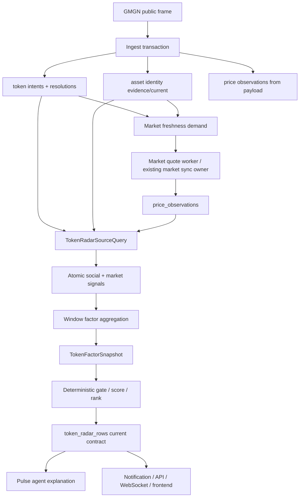

# Token Radar Factor Snapshot + Market Freshness Hard Cut Spec

**Status**: Draft, awaiting review  
**Date**: 2026-05-10  
**Owner**: Codex with Qinghuan  
**Related**:

- `docs/superpowers/specs/active/2026-05-08-auditable-token-radar-design-cn.md`
- `docs/superpowers/specs/active/2026-05-09-standardized-social-factor-pipeline.md`
- `docs/superpowers/specs/active/2026-05-10-token-identity-evidence-hard-cut-spec-cn.md`
- `src/parallax/domains/token_intel/ARCHITECTURE.md`

## 一句话结论

Token Radar 的根因不是某一个分数公式不够好，也不是缺一个更强 prompt。根因是当前系统没有一个统一、点时、可审计的 factor snapshot 合同，同时价格刷新需求隐藏在 market sync 的扫描逻辑里，Pulse 和通知又从旧 `score_json` / `market_context_json` / agent thesis 里拼事实。

目标架构必须 hard cut 到：

```text
resolved token target + fresh market observation + social evidence
  -> TokenFactorSnapshot
  -> deterministic gate / score / rank
  -> Pulse agent explanation
  -> notification / API / frontend
```

不保留运行时兼容 fallback，不从旧 score/thesis 反推新事实，不让 projection 调 provider，不让 agent 覆盖 hard gate。

## Background

当前 Token Intel 架构已经把 ingest、identity、market observation 和 projection 分成阶段。模块架构明确说明 Token Radar projection 读取 current resolution、identity current、market observations 后评分，且 projection 不调用 provider 或 preflight refresh，见 `src/parallax/domains/token_intel/ARCHITECTURE.md:39` 到 `src/parallax/domains/token_intel/ARCHITECTURE.md:40`。

`TokenRadarSourceQuery` 已经能拉到足够多的原始事实：intent/resolution、event/account profile、LLM social hints、asset identity current、CEX feed、latest feed price、latest subject price、message price、event-history price、before-event price，见 `src/parallax/domains/token_intel/queries/token_radar_source_query.py:16` 到 `src/parallax/domains/token_intel/queries/token_radar_source_query.py:99`，以及 price observation join，见 `src/parallax/domains/token_intel/queries/token_radar_source_query.py:166` 到 `src/parallax/domains/token_intel/queries/token_radar_source_query.py:239`。

`TokenRadarProjection` 当前一次 rebuild 会拉 source rows、按 target 分组、计算投影、做 cohort rank、写 `token_radar_rows`，见 `src/parallax/domains/token_intel/services/token_radar_projection.py:48` 到 `src/parallax/domains/token_intel/services/token_radar_projection.py:152`。市场新鲜度在 projection 内按固定 `MARKET_FRESH_MS = 5 * 60 * 1000` 判断，见 `src/parallax/domains/token_intel/services/token_radar_projection.py:35` 和 `src/parallax/domains/token_intel/services/token_radar_projection.py:455` 到 `src/parallax/domains/token_intel/services/token_radar_projection.py:515`。

当前 projection 的输出不是一个稳定 factor contract，而是分散在 `attention_json / market_json / price_json / score_json / data_health_json`，repository insert 也以这些 JSON block 为中心，见 `src/parallax/domains/token_intel/repositories/token_radar_repository.py:56` 到 `src/parallax/domains/token_intel/repositories/token_radar_repository.py:69`。

行情刷新现在由两个入口完成。`MessageMarketObservation` 只为尚无 message payload/message quote 的 resolution 补一次点时价格，见 `src/parallax/domains/asset_market/queries/pending_market_observation_query.py:87` 到 `src/parallax/domains/asset_market/queries/pending_market_observation_query.py:102` 和 `src/parallax/domains/asset_market/services/message_market_observation.py:17` 到 `src/parallax/domains/asset_market/services/message_market_observation.py:61`。`AssetMarketSyncWorker` 以默认 300 秒 interval 运行，同时启动 CEX 和 DEX provider task，DEX stale threshold 是 5 分钟、每轮 limit 是 80，见 `src/parallax/domains/asset_market/runtime/asset_market_sync_worker.py:13` 到 `src/parallax/domains/asset_market/runtime/asset_market_sync_worker.py:15`，`src/parallax/domains/asset_market/runtime/asset_market_sync_worker.py:46` 到 `src/parallax/domains/asset_market/runtime/asset_market_sync_worker.py:53`，以及 `src/parallax/domains/asset_market/runtime/asset_market_sync_worker.py:91` 到 `src/parallax/domains/asset_market/runtime/asset_market_sync_worker.py:100`。

DEX 刷新队列来自 recent radar candidates 的派生查询，按 hot window、latest candidate time、oldest price 排序，见 `src/parallax/domains/asset_market/repositories/registry_repository.py:307` 到 `src/parallax/domains/asset_market/repositories/registry_repository.py:378`。这说明系统有市场 observation store，但没有面向 Token Radar 产品 SLO 的显式 freshness contract。

Pulse 和通知进一步放大了耦合。Pulse context 从 radar row 里抽 `radar_score` 和 `market_context` 后交给 agent/gate，见 `src/parallax/domains/pulse_lab/runtime/pulse_candidate_worker.py:242` 到 `src/parallax/domains/pulse_lab/runtime/pulse_candidate_worker.py:310`；gate 读取 thesis、radar_score、market_context、timeline_context，见 `src/parallax/domains/pulse_lab/runtime/pulse_candidate_worker.py:435` 到 `src/parallax/domains/pulse_lab/runtime/pulse_candidate_worker.py:442`；candidate 持久化 `radar_score_json` 和 `market_context_json`，见 `src/parallax/domains/pulse_lab/runtime/pulse_candidate_worker.py:454` 到 `src/parallax/domains/pulse_lab/runtime/pulse_candidate_worker.py:478`。Signal Pulse read model 继续暴露这两个旧 payload，见 `src/parallax/domains/pulse_lab/read_models/signal_pulse_service.py:108` 到 `src/parallax/domains/pulse_lab/read_models/signal_pulse_service.py:147`；通知 severity 由 Pulse status 映射，正文先展示 thesis 而不是市场/社交事实，见 `src/parallax/domains/notifications/services/notification_rules.py:19` 到 `src/parallax/domains/notifications/services/notification_rules.py:25` 和 `src/parallax/domains/notifications/services/notification_rules.py:515` 到 `src/parallax/domains/notifications/services/notification_rules.py:538`。

2026-05-10 本地生产 DB audit 暴露了同一根因的两个症状：一类是 SHIT/SLOP/SATO 这类 row 的 mention identity 与 canonical target identity 曾混在展示和 registry 语义里；另一类是活跃 DEX target 的 price observation 可以因为 refresh queue 排名靠后而滞后数小时。identity hard cut 已经把第一类问题拆到 `asset_identity_evidence/current`，本 spec 处理第二类问题，并把下游消费统一到 factor snapshot。

## Problem

Token Radar 现在缺少一个稳定的“当前事实合同”。行情是否新鲜、身份是否可信、社交是否独立、链上代理质量是否过低、timing 是否 chase risk，都散落在查询、score JSON、Pulse context、agent thesis、通知 body 里。结果是价格刷新滞后时 projection 只能标 stale，不能表达刷新需求；Pulse 和通知仍可能用旧 score/thesis 拼出高优先级候选；排查一个 alert 要跨 `score_json`、`market_json`、`price_json`、`market_context_json`、`radar_score_json` 和 thesis 字段。

## Root Cause

### 1. Observation 和 product freshness 没有合同

`price_observations` 是正确的事实表，但当前系统只把它当最新快照读取，没有一个明确的 Token Radar freshness SLO。`MessageMarketObservation` 只补 message-level quote；`AssetMarketSyncWorker` 做周期性扫描；projection 不允许调 provider。三者各自合理，但合起来没有回答：

- 当前产品表面上的 hot target 是否必须在多少秒内刷新？
- stale target 谁负责优先刷新？
- provider 正常但 queue 太大时，哪个 target 先刷新？
- 超过 freshness SLO 后，Pulse/notification 如何 fail closed？

### 2. Factor 和 score 耦合

当前 `score_json` 同时承担解释、排名、gate、debug 和下游上下文。它不是原子事实，也不是稳定 contract。下游为了拿到想要的信息，会从 `score_json`、`market_json`、`price_json` 中各取一点，导致每次 scoring 改动都会影响 Pulse、notification、UI 和 audit。

### 3. Agent 被放在事实边界之前

Pulse agent 现在消费 timeline + radar score + market context，输出 thesis。由于输入不是 factor-key-backed snapshot，agent 很容易生成流畅但不可审计的 confirmation/risk 文案。通知又优先展示 thesis，于是 deterministic market/social gate 的弱点被自然语言掩盖。

### 4. CEX 与 DEX 市场语义混在 tradeability 里

DEX target 需要 holders、liquidity、market cap、pool/feed readiness、freshness。CEX token 没有 holders/liquidity，应看 feed readiness、volume、open interest、freshness。当前 scoring 已有分支雏形，但 product contract 没有强制“DEX gate 不套到 CEX，CEX gate 不伪造 DEX 安全感”。

## First Principles

1. **Repository is the system of record**: agent、frontend、notification 只能消费 repository 中可重放的事实合同。Prompt 不是事实源，UI 不是修正层。
2. **One lifecycle owner per fact**: identity 由 identity evidence policy 负责；market observation 和 freshness 由 asset market 层负责；factor snapshot、gate、rank 由 token intel projection 负责；Pulse 只解释，不授权事实。
3. **Freshness is product health, not identity**: 价格新鲜不证明身份正确；身份正确也不代表价格可用于 alert。两者必须在 snapshot 中分开表达。
4. **Hard gate before agent**: identity missing、market stale、DEX liquidity/holders/market cap 低、social quality 薄、timing chase risk，都必须先限制 severity，再进入 agent explanation。
5. **KISS over platformization**: v1 不建设量化平台，不为所有 DEX token 建 realtime stream，不加 agent tools。先把已有 observations、social evidence 和 deterministic gates 组织成一个合同。
6. **Hard cut over compatibility**: 当前运行时只走新 contract。旧 JSON 可以作为 migration/backfill 输入，但不能作为 runtime fallback。

## Goals

- **G1 Factor Snapshot Contract**: 每个当前 resolved Token Radar row 都必须有 `TokenFactorSnapshot`。snapshot 覆盖 identity、social_attention、social_quality、social_semantics、market_quality、timing、gate_result、provenance。缺 snapshot 的 current row 不是合法 current row。
- **G2 Market Freshness Contract**: hot target 与 warm target 有明确 freshness SLO、provider 状态、snapshot age、stale reason。hot target stale 时，Token Radar 可展示但 Pulse high/critical eligibility fail closed。
- **G3 Explicit Refresh Demand**: market observation 层必须能从当前 token-intel 产品需求中派生刷新优先级，并把刷新结果写回 `price_observations`。projection 只读 observation，不调 provider，不做 preflight refresh。
- **G4 Deterministic Gate Before Score/Agent**: high/critical severity 先由 snapshot gate 授权。agent 不能把 gated candidate 升级，只能解释 gate、风险和 measurable upgrade/invalidation conditions。
- **G5 DEX/CEX Market Semantics Separation**: DEX Asset 使用 DEX market-quality gates；CEX token 使用 CEX feed/volume/open-interest gates。两者的 missing data 不能互相补。
- **G6 No Runtime Compatibility Layer**: 当前 API、WebSocket、Pulse、notification、frontend read path 不允许 `factor_snapshot or score_json`、`market_snapshot or market_context_json`、`thesis fallback facts` 这类兼容桥。
- **G7 Auditable Production Debugging**: 对任意 alert，能从 row 追到 factor key、raw/window value、normalization、gate reason、price observation、identity evidence、source event ids、projection version 和 factor version。

## Non-Goals

- 不重做 token identity hard cut；本 spec 依赖 `asset_identity_evidence/current` 作为身份事实。
- 不新增 live LLM 调用，不让 agent 查询 DB 或外部网络。
- 不建设完整 quant research platform，不引入 IC/ICIR、在线学习、回测优化、PCA/GBDT。
- 不实现完整 holder distribution、top holder concentration、tax/honeypot、LP lock、transfer flow、smart-money labels。
- 不把 OKX CEX WebSocket 当成 DEX CA 价格解决方案。CEX WS 只适合已上市 CEX instruments；长尾 DEX CA 仍走 DEX quote provider 或其他明确 DEX provider。
- 不把 GMGN public WebSocket 当价格 feed。GMGN payload 中的 chain/address 可以作为 identity evidence；payload 中的 price / market cap 不写入 `price_observations`，也不作为 current-market 或 timing baseline 来源。
- 不为旧 `score_json` / `radar_score_json` / `market_context_json` / thesis-first notification 保留运行时兼容。

## Target Architecture

目标架构是 factor-first、freshness-aware、agent-after-gate。



Key properties:

- `asset_market` owns provider interaction and `price_observations`.
- `token_intel` owns factor snapshot, gate, rank, and current row contract.
- `pulse_lab` consumes snapshot and emits recommendation/explanation.
- `notifications` and frontend render facts from snapshot before thesis.
- Projection remains pure: it never calls OKX, GMGN, WebSocket clients, or any provider.

### Component Ownership

| Component | Owner | Responsibility |
|-----------|-------|----------------|
| Identity evidence/current | `asset_market` | Select canonical asset symbol/name/confidence from evidence. |
| Market observations | `asset_market` | Fetch CEX/DEX quotes, write point-in-time observations, expose provider/freshness health. |
| Market freshness demand | `asset_market` with token-intel inputs | Prioritize active targets by product need, target type, last observation age, provider capability, and stale severity. |
| Factor snapshot | `token_intel` | Convert source rows into atomic signals, window aggregates, normalized factor points, gates, scores, provenance. |
| Pulse agent | `pulse_lab` | Explain a snapshot-backed recommendation. It does not create facts or override gates. |
| Notification/UI/API | Consumers | Render snapshot facts and gate status. They do not resolve tokens, refresh prices, or synthesize missing factor data. |

## Market Freshness Contract

Freshness is an explicit contract between Token Radar and market observation.

### Target classes

- **Hot target**: a resolved token target that appears in current 5m or 1h Token Radar windows, has a pending/running Pulse candidate, or has new high-confidence mentions in the hot lookback window.
- **Warm target**: a resolved token target that appears only in 4h/24h windows or recent research surfaces.
- **Cold target**: a registry asset or CEX token without current product demand.

### Initial SLO

These values are product defaults, not hidden magic constants:

- Hot CEX token: target latest observation age should be under 60 seconds when provider is healthy.
- Hot DEX Asset: target latest observation age should be under 90 seconds when provider is healthy and provider rate limits allow the configured batch budget.
- Warm target: target latest observation age should be under 5 minutes.
- High/critical alert eligibility requires market observation age under 120 seconds for hot targets, unless the target type has no market provider and is explicitly marked research-only.
- Stale, missing, provider_error, rate_limited, and identity_unverified are distinct states.

The SLO is not a guarantee that every long-tail DEX token is realtime. It is a deterministic contract for what may be promoted to high/critical product surfaces.

### Provider strategy

- CEX listed instruments may use REST polling or WebSocket-backed ticker cache behind the same market observation interface.
- DEX CA prices use DEX quote providers capable of chain+address requests. REST batch polling is acceptable for v1 if it meets hot-target SLO.
- GMGN message payload prices are ignored as market data. GMGN payloads may seed exact identity evidence only; active quote refresh owns current market and timing baselines.
- Provider health is part of snapshot data health. A provider outage downgrades eligibility instead of creating stale high alerts.

### Refresh priority

The freshness demand selector must prioritize:

1. hot targets with no observation.
2. hot targets over high/critical stale threshold.
3. hot targets nearest Pulse/notification eligibility.
4. warm targets over warm SLO.
5. cold/background sync.

This can be implemented by replacing or tightening the existing market sync selection. The spec does not require a new table or worker if the existing worker can own this contract cleanly.

## Core Models

### FactorPoint

A `FactorPoint` is one explainable measurement, such as `market_quality.liquidity_usd`, `social_quality.unique_authors_1h`, or `timing.price_change_since_social_pct`.

It contains:

- factor family and key.
- raw value and window when applicable.
- transformed value when scoring uses log/clip/scale.
- baseline status/value when time-series comparison exists.
- cross-section rank/percentile when cohort comparison exists.
- score.
- confidence.
- freshness and data health.
- source refs.
- risk flags.
- hard gate contribution.

### TokenFactorSnapshot

A `TokenFactorSnapshot` is the authoritative fact object for one target/window/scope/projection version.

It contains:

- subject identity: target type/id, symbol/name, chain/address or CEX market id, identity confidence, conflict flags.
- factor families: identity, social_attention, social_quality, social_semantics, market_quality, timing.
- market freshness state: observation age, provider, provider status, target class, stale reason.
- gate result: severity eligibility, blocking reasons, downgrade reasons, missing-data reasons.
- composite scores: family scores and final rank score.
- provenance: source event ids, selected post ids, price observation ids, identity evidence ids, factor version, projection version, computed_at.

### MarketFreshnessState

`MarketFreshnessState` describes whether market data is usable for a product decision:

- target class: hot, warm, cold.
- target type: Asset or CexToken.
- provider family and provider status.
- latest observation timestamp and age.
- freshness status: fresh, stale, missing, provider_error, rate_limited, unsupported.
- SLO threshold used.
- whether high/critical eligibility is allowed.

### GateResult

`GateResult` is deterministic. It is computed from factor snapshot before agent execution.

It contains:

- allowed product surfaces.
- max notification severity.
- blocking reasons.
- downgrade reasons.
- missing/unknown risk reasons.
- measurable upgrade conditions.

### AgentRecommendation

Agent output is downstream of snapshot and gate. It contains:

- recommendation: ignore, watch, research, alert, trade_candidate.
- summary/explanation in Chinese.
- primary reasons linked to factor keys.
- upgrade conditions linked to factor thresholds.
- invalidation conditions linked to factor thresholds.
- residual risks linked to risk flags or missing data.

The agent may choose a lower recommendation than the deterministic max severity. It may not choose a higher one.

## Factor Families

### Identity

Identity answers whether the system knows what object is being discussed.

Required factor points:

- resolver status and mention confidence.
- target type.
- identity confidence from asset identity current or CEX feed binding.
- direct CA / exact feed binding.
- conflict count and reason codes.
- source mention label kept separately from canonical target label.

High/critical requires resolved target identity. Source-seed or symbol-only candidates can remain research items only.

### Social Attention

Social attention answers whether discussion volume is abnormal.

Required factor points:

- mentions by window.
- weighted mentions.
- unique authors.
- watched mentions and watched share.
- baseline surprise.
- stream share/noise ratio.

Attention can nominate a target. It cannot by itself authorize high severity.

### Social Quality

Social quality answers whether discussion is broad, independent, and informative.

Required factor points:

- independent authors and effective authors.
- top author share.
- duplicate text share.
- informative post ratio.
- market-context ratio.
- watched source count.
- low-information/public-only flags.

Single-author copy-pasta must score materially lower than a small set of independent organic mentions.

### Social Semantics

Social semantics consumes existing enrichment output. It does not add live LLM calls.

Required factor points:

- direction/sentiment distribution.
- impact hint.
- novelty hint.
- enrichment confidence.
- mixed-signal flag.

Semantics is volume-gated. A single low-confidence bullish mention cannot create a strong bullish factor.

### Market Quality

Market quality is target-type-specific.

For DEX Asset:

- market freshness.
- market cap absolute quality.
- liquidity absolute quality.
- liquidity-to-market-cap sanity band when both exist.
- holders proxy quality.
- pool/feed readiness.
- volume when available.
- unavailable security data marked unknown, not safe.

Initial high/critical floors:

- holders below 100 blocks high/critical.
- liquidity below 25,000 USD blocks high/critical.
- market cap below 50,000 USD blocks high/critical.
- stale/missing market blocks high/critical.
- unsupported provider blocks high/critical.

For CEX token:

- pricefeed/native market readiness.
- volume 24h quality.
- open interest availability/quality when present.
- market freshness.

CEX token must not fail DEX holders/liquidity gates. DEX Asset must not get CEX-style safety from exchange volume fields.

### Timing

Timing answers whether the social signal is early or late.

Required factor points:

- social signal start timestamp.
- price before social start.
- price at social start.
- current/reference price.
- price change before social.
- price change since social.
- price change since first snapshot.
- chase-risk flag.
- missing point-in-time price reason.

Timing must distinguish early discovery from post-pump commentary.

## Hard Gate Semantics

Hard gates run before score, Pulse agent, and notification severity.

High/critical eligibility requires:

- resolved identity.
- market freshness within alert threshold.
- DEX market-quality floors when target type is Asset.
- CEX feed readiness when target type is CexToken.
- sufficient social quality: at least 3 unique authors unless there is a watched source, duplicate share below 0.50, and no single-author dominance.
- no severe chase risk.
- unknown security data shown as risk, not positive evidence.

Blocked candidates may still appear in research/watch views with explicit reasons. They cannot become high/critical push alerts.

## Interface Contracts

### Token Radar API / WebSocket

Current Token Radar rows expose factor snapshot as the authoritative explanation. Consumers render:

- family scores and gate status.
- market facts and freshness status.
- social facts and source refs.
- identity confidence and canonical-vs-mention distinction.
- score provenance, factor version, projection version.

No runtime response fallback may synthesize factor snapshot from `score_json`, `attention_json`, `market_json`, `price_json`, `data_health_json`, or thesis fields.

### Signal Lab Pulse

Pulse candidates are created from factor snapshots. The agent input includes snapshot, gate result, selected posts, and source refs. The gate result constrains max recommendation/severity.

`source_seed` candidates without resolved target identity are a separate research lane. They must not use high/critical token notification path.

### Notifications

Signal Pulse notifications are fact-first:

1. target identity and confidence.
2. market freshness and DEX/CEX market facts.
3. social attention and social quality.
4. deterministic gate status.
5. agent explanation.

Severity comes from gate + factor score, not from thesis verdict alone.

### CLI / Audit

CLI audit surfaces must be able to answer:

- which current rows lack factor snapshot.
- which high/critical candidates are blocked by market freshness.
- which high/critical candidates are blocked by DEX floors.
- which rows still expose old score/thesis fields as runtime source of facts.

## Acceptance Criteria

- **AC1**. WHEN a current resolved Token Radar row is written, THEN it SHALL include `TokenFactorSnapshot`, `GateResult`, factor version, projection version, and provenance.
- **AC2**. WHEN a current row lacks factor snapshot, THEN API/WebSocket/Pulse/notification SHALL treat it as invalid current output rather than reconstructing it from legacy JSON.
- **AC3**. WHEN a hot DEX Asset has latest observation age above the high/critical threshold, THEN high/critical eligibility SHALL be blocked with explicit `market_freshness.stale` reason.
- **AC4**. WHEN a hot target has provider failure or rate-limit state, THEN the snapshot SHALL expose provider health and SHALL block high/critical severity instead of using an old observation silently.
- **AC5**. WHEN a DEX Asset has holders below 100, liquidity below 25,000 USD, or market cap below 50,000 USD, THEN high/critical eligibility SHALL be blocked or downgraded with explicit `market_quality` reasons.
- **AC6**. WHEN a CEX token has no holders/liquidity fields, THEN the system SHALL evaluate it from CEX feed readiness, volume, open interest, and freshness, without applying DEX holder/liquidity gates.
- **AC7**. WHEN social attention is high but duplicate share is at least 0.50 or unique authors are below the social-quality floor, THEN high/critical eligibility SHALL be blocked or downgraded.
- **AC8**. WHEN price moved materially before social signal, THEN timing SHALL expose chase risk and SHALL cap high/critical severity according to gate policy.
- **AC9**. WHEN Pulse agent output states a reason, risk, upgrade condition, or invalidation condition, THEN it SHALL link to factor keys or source refs present in the input snapshot.
- **AC10**. WHEN notification renders a Signal Pulse candidate, THEN its first screen SHALL include identity, market freshness, market cap/liquidity/holders or CEX volume, mention count, unique authors, watched source count, and deterministic gate status when available.
- **AC11**. WHEN implementation is reviewed, THEN current runtime code SHALL NOT contain compatibility paths that read `score_json`, `market_json`, `price_json`, `radar_score_json`, or `market_context_json` as fallback sources for factor facts.
- **AC12**. WHEN running the same production DB window before and after the hard cut, THEN all previously stale high/critical candidates SHALL either have fresh observations within SLO or be downgraded/blocked with explicit freshness reasons.

## Expected Product Effects

| Current failure mode | After hard cut |
|----------------------|----------------|
| Price is stale for an active DEX target, but row remains visually strong. | Row shows stale freshness; high/critical is blocked until fresh observation exists. |
| Low-holder/low-liquidity DEX asset becomes high `token_watch` because market fields exist. | DEX floors block or downgrade before agent execution. |
| Pulse thesis hides weak social evidence behind fluent prose. | Agent reasons must cite factor keys; thin/duplicate/socially narrow evidence becomes downgrade reason. |
| Notification first screen hides market facts. | Notification starts with identity, freshness, market facts, social facts, gate. |
| UI/API/debugging requires reading many JSON blobs. | Factor snapshot is the single explanation contract. |
| CEX and DEX candidates use mixed market semantics. | Target-type-specific market factors and gates are explicit. |

## Risks

| Risk | Severity | Mitigation |
|------|----------|------------|
| Hard cut breaks unknown consumers of legacy row fields | High | Migrate known runtime consumers in one plan; fail closed; use grep/audit to prove no runtime fallback. |
| DEX hot-target SLO is too aggressive for provider limits | Medium | SLO affects high/critical eligibility, not visibility; provider rate-limit state is explicit. |
| Factor snapshot payload grows too large | Medium | Public list rows expose selected headline facts; detail surfaces can load fuller source refs. |
| Early micro-cap opportunities are downgraded | Medium | Keep research/watch visibility separate from high/critical notification eligibility. |
| Agent still invents unsupported facts | High | Agent output requires factor-key-backed reasons; unsupported claims are rejected or repaired before persistence. |
| Market refresh logic becomes a second projection | High | Market layer only fetches observations and provider health. It does not score, rank, or decide notification severity. |

## Evolution Path

After v1 is stable:

- add holder distribution factors when holder snapshot data exists.
- add transfer/flow factors when labeled address flow exists.
- add CEX WebSocket ticker cache for listed instruments if REST polling cannot meet hot SLO.
- add persistent refresh leases/requests only if single-worker derived demand cannot meet SLO or multi-worker coordination becomes necessary.
- evaluate factor snapshots against realized forward returns once enough point-in-time snapshots exist.

The v1 contract must keep factor keys, factor version, data health, and source refs stable enough for these additions without changing Pulse/notification semantics.

## Alternatives Considered

- **Improve prompts and keep score/thesis-first flow**: rejected because prompts cannot create missing market freshness, factor provenance, or deterministic gates.
- **Keep `score_json` as runtime contract and add `factor_snapshot` beside it**: rejected because dual authoritative surfaces preserve the current coupling. The implementation may use old fields during one-time migration/backfill, but current runtime cannot dual-read.
- **Call providers from projection when market is stale**: rejected because it couples read projection to network IO, rate limits, and provider failure. Projection must remain replayable.
- **Build a full market-refresh request table immediately**: rejected for v1 KISS. The service has one PostgreSQL store and an existing market sync owner; first replace implicit scanning with a clear freshness-demand contract. Add persistent leases only if derived demand cannot meet SLO.
- **Use OKX/GMGN WebSocket as universal realtime solution**: rejected because CEX WS does not price long-tail DEX CAs, and GMGN social WS is not a complete quote feed. WebSocket can be a provider implementation, not the product contract.
- **Create separate factor pipelines for Token Radar and Pulse**: rejected because it duplicates identity, market, social, and timing logic. Token Radar owns the snapshot; Pulse consumes it.

## Boundaries

| Class | Behaviour |
|-------|-----------|
| Always | Current Token Radar explanation, Pulse gate, notification facts, and UI details read from factor snapshot. |
| Always | Market freshness is explicit and target-type-specific. |
| Always | Projection is pure and never calls providers. |
| Always | Agent recommendation is downstream of deterministic gate. |
| Always | DEX and CEX market-quality gates are separate. |
| Always | Missing security data is unknown risk, not passing evidence. |
| Ask first | Adding a persistent market refresh request table or multiple market workers. |
| Ask first | Adding new provider APIs beyond current OKX/GMGN provider boundaries. |
| Ask first | Changing high/critical numeric floors after production measurement. |
| Never | Current runtime falls back from factor snapshot to legacy score/market/thesis fields. |
| Never | Agent prose overrides hard gates. |
| Never | Frontend repairs token identity, market freshness, or gate state. |
| Never | Market freshness is used as identity confidence. |
