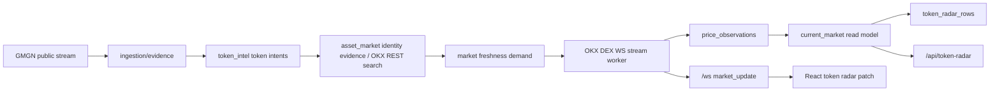

# Spec — OKX DEX WS Market Stream and Token Radar Recovery

**Status**: Draft
**Date**: 2026-05-11
**Owner**: Codex
**Related**: `docs/superpowers/plans/active/2026-05-11-okx-dex-ws-market-stream-and-radar-recovery-cn.md`

## Background

Token Radar 的公开 HTTP 合同要求 `/api/token-radar` 行暴露 `current_market`，前端必须从 `current_market.fields` 读取 live price、market cap、liquidity、holders、volume、provider、freshness；旧的 `factor_snapshot` market facts 不能作为价格兼容层，见 `docs/CONTRACTS.md:36`.

当前行情事实表是 `price_observations`。`PriceObservationRepository.insert_observation(...)` 已经支持 `price_usd`、`market_cap_usd`、`liquidity_usd`、`volume_24h_usd`、`open_interest_usd`、`holders` 等字段，见 `src/gmgn_twitter_intel/domains/asset_market/repositories/price_observation_repository.py:13`.

当前 OKX DEX REST adapter 只有 `search_tokens(...)` 和 `token_prices(...)` 两个同步方法，见 `src/gmgn_twitter_intel/integrations/okx/dex_client.py:39` 和 `src/gmgn_twitter_intel/integrations/okx/dex_client.py:55`。领域 provider contract 也只暴露 `DexMarketProvider.search_tokens(...)` 与 `DexMarketProvider.token_prices(...)`，见 `src/gmgn_twitter_intel/domains/asset_market/providers.py:52`.

最新 hard cut 正确地阻止了 price-only provider 污染 metadata：`sync_dex_prices(...)` 写入 `okx_dex_price` 时明确把 `market_cap_usd`、`liquidity_usd`、`holders` 置空，见 `src/gmgn_twitter_intel/domains/asset_market/services/asset_market_sync.py:256`. `CurrentMarketRepository.current_for_subjects(...)` 也只允许 `gmgn_payload` 与 `okx_dex_search` 供应 DEX metadata，见 `src/gmgn_twitter_intel/domains/asset_market/repositories/current_market_repository.py:84`.

Token Radar projection worker 每轮总是重建 `5m` hot windows，然后轮询一个 background window/scope，见 `src/gmgn_twitter_intel/domains/token_intel/runtime/token_radar_projection_worker.py:89`. Projection 本身先跑 source query，再批量 hydrate current market，见 `src/gmgn_twitter_intel/domains/token_intel/services/token_radar_projection.py:51` 和 `src/gmgn_twitter_intel/domains/token_intel/services/token_radar_projection.py:156`.

API read path 仍会在每次 `/api/token-radar` 请求时再次读取 `CurrentMarketRepository.current_for_subjects(...)`，见 `src/gmgn_twitter_intel/domains/token_intel/read_models/asset_flow_service.py:30` 和 `src/gmgn_twitter_intel/domains/token_intel/read_models/asset_flow_service.py:42`. 前端当前通过 HTTP polling 每 10 秒拉 `/api/token-radar`，见 `web/src/App.tsx:132`.

OKX 官方 Onchain OS DEX WebSocket endpoint 是 `wss://wsdex.okx.com/ws/v6/dex`。官方 `price` channel 返回实时 token price；`price-info` channel 返回 price、marketCap、liquidity、holders、volume、price changes 等字段；price/trading channels 订阅前需要 HMAC login。参考：

- OKX skill: `https://raw.githubusercontent.com/okx/onchainos-skills/main/skills/okx-dex-ws/SKILL.md`
- Login: `https://web3.okx.com/onchainos/dev-docs/market/websocket-login`
- Subscribe: `https://web3.okx.com/onchainos/dev-docs/market/websocket-subscribe`
- Price channel: `https://web3.okx.com/onchainos/dev-docs/market/websocket-price-channel`
- Price-info channel: `https://web3.okx.com/onchainos/dev-docs/market/websocket-price-info-channel`

2026-05-11 live smoke test result:

- Unauthenticated `price` / `price-info` subscription returned `60011 Please log in`.
- Authenticated login returned `{"event":"login","code":"0"}`.
- Authenticated `price-info` for Ethereum USDT returned price, marketCap, liquidity, holders.
- Authenticated `price-info` for Solana TROLL `5UUH9RTDiSpq6HKS6bp4NdU9PNJpXRXuiw6ShBTBhgH2` returned marketCap about `110.9m`, liquidity about `4.82m`, holders `57141`.

2026-05-11 Token Radar zero-data investigation:

- `/api/token-radar?window=5m&scope=all` returned 5 targets; `/api/token-radar?window=1h&scope=all` initially returned 0 targets.
- `/api/status` showed `token_radar_projection_worker` running with `last_run_at_ms=None`, then later showed only `5m` windows completed.
- `pg_stat_activity` showed a long-running `CurrentMarketRepository.current_for_subjects(...)` query stuck on `price_observations`.
- `price_observations` had about 1.75m rows while Postgres statistics estimated about 27k before `ANALYZE`; after `ANALYZE`, `1h:all` completed, but `/api/token-radar` could still timeout because API read path rehydrates current market live.
- A local 1h/all source query using production data read 4,374 source rows in about 54 seconds; current-market hydrate for 5 subjects took about 44 seconds before targeted indexes existed.

## Problem

The current architecture has two user-visible failures. First, price-only REST refresh keeps price fresh while market cap, liquidity, and holders can remain stale for many hours, so Token Radar can show TROLL around 51m after the provider already has about 100m+ market cap. Second, after the v10 current-market hard cut, Token Radar can show 0 rows for `1h`/`4h`/`24h` because the projection worker blocks on expensive source/current-market queries and the API repeats expensive hydration on every request.

## First Principles

1. **Provider facts are field-capable, not provider-branded blobs.** A provider that can only supply price cannot refresh market cap/liquidity/holders. This is enforced by the `okx_dex_price` write shape in `asset_market_sync.py:256` and by provider filters in `current_market_repository.py:73`.
2. **External streams belong behind backend adapters.** The frontend must not connect to OKX DEX WS directly because OKX credentials, quotas, and subscription lifecycle are backend concerns. Existing app composition puts concrete integrations in `app/runtime/providers_wiring.py:218`, not in `web/`.
3. **Public Token Radar surfaces must be served from bounded read models.** `/api/token-radar` is a user-facing contract, not a place for unbounded provider calls or unindexed per-request hydration. The current endpoint delegates to `AssetFlowService.asset_flow(...)` at `http.py:156`.

## Goals

- G1. Hot Token Radar DEX targets SHALL receive metadata-capable market updates from OKX DEX `price-info` within 5 seconds of an upstream push after subscription is active.
- G2. A metadata-capable OKX DEX WS update SHALL refresh `price_usd`, `market_cap_usd`, `liquidity_usd`, `holders`, and `volume_24h_usd` without weakening the price-only hard cut.
- G3. `/api/token-radar?window=1h&scope=all&limit=48` SHALL return from the current DB in under 2 seconds p95 after indexes and query changes, with no live provider calls.
- G4. After a projection-version bump, all public windows/scopes (`5m`, `1h`, `4h`, `24h` x `all`, `matched`) SHALL have explicit current-version coverage state. A successfully computed empty window is `ready` with zero rows; only absent/running/failed coverage returns `projection.status=pending`.
- G5. Token extraction and identity resolution SHALL remain independent from market stream subscription. OKX DEX WS consumes resolved `chainIndex + tokenContractAddress`; it does not resolve tweet symbols.

## Non-goals

- N1. Do not let the browser connect directly to OKX DEX WS or hold OKX credentials.
- N2. Do not introduce a universal all-market subscription. OKX `price-info` is per token; subscribe only hot/resolved targets with caps and TTL.
- N3. Do not reintroduce compatibility reads from old factor snapshot market JSON.
- N4. Do not make CEX WebSocket solve DEX CA pricing. CEX streams are a separate provider path for listed instruments.

## Target Architecture

`asset_market` remains the owner of market observations. A new OKX DEX WS integration adapter translates upstream `price-info` frames into domain market fact updates. A new asset-market stream worker derives a bounded hot target set from current Token Radar/resolution demand, logs in to OKX DEX WS, subscribes to `price-info`, writes field-capable `price_observations`, and emits backend market update events after commit.

Projection and API read paths remain pure read-model consumers. Projection uses optimized SQL/indexes and records coverage for every public window/scope. API returns projected rows plus current-market snapshots from indexed local observations only. Frontend receives baseline data by HTTP and market deltas by the existing backend `/ws`.

## Conceptual Data Flow



Changed arrows:

- `Demand -> Stream` is new and bounded to hot resolved DEX assets.
- `Stream -> Obs` writes `okx_dex_ws_price_info`, a metadata-capable provider.
- `Stream -> BackendWS` sends local post-commit deltas; it is not an OKX browser proxy.

## Core Models

- **DexMarketFactUpdate**: normalized domain event for one subject at one observed time. Contains `subject_type`, `subject_id`, `chain_id`, `address`, `provider`, `observed_at_ms`, optional price/market fields, and raw payload hash.
- **DexMarketStreamTarget**: a resolved DEX target eligible for subscription. Contains `asset_id`, `chain_id`, `address`, latest Token Radar activity time, freshness status, and subscription priority.
- **MarketUpdatePayload**: backend `/ws` event with `type="market_update"`, `target_type`, `target_id`, `current_market`, `observed_at_ms`, and `provider`.
- **ProjectionCoverage**: explicit current-version status per window/scope (`running`, `ready`, `failed`) with `source_rows`, `row_count`, `computed_at_ms`, and optional error. Coverage is not inferred from `token_radar_rows` row count.

## Interface Contracts

### Config

Add optional OKX DEX WS knobs under `providers.okx`:

- `dex_ws_enabled`: default false until deployed and verified.
- `dex_ws_url`: default `wss://wsdex.okx.com/ws/v6/dex`.
- `dex_ws_subscription_limit`: max active token subscriptions.
- `dex_ws_hot_target_ttl_seconds`: unsubscribe cold targets after TTL.
- `dex_ws_reconnect_delay_seconds`: reconnect backoff base.

Existing `dex_api_key`, `dex_secret_key`, `dex_passphrase` are reused. Startup must reject `dex_ws_enabled=true` unless all three credentials exist.

### HTTP

`/api/token-radar` keeps the existing response shape. When coverage for a requested current projection version/window/scope is absent, running, or failed, `projection.status` SHALL be `pending` and `projection.reason` SHALL be `projection_window_missing`, `projection_window_running`, or `projection_window_failed`. When coverage is `ready` with zero rows, `projection.status` SHALL be `fresh` and `targets`/`attention` SHALL be empty. Existing clients that only read `targets` still see an empty list, but the UI can distinguish "not ready" from "no opportunities".

### WebSocket

Existing auth stays unchanged. Existing subscribe payload is extended with optional `market_targets`:

```json
{"type":"subscribe","market_targets":[{"target_type":"Asset","target_id":"asset:eip155:1:erc20:0xabc0000000000000000000000000000000000000"}]}
```

Server may also deliver market updates matching subscribed symbols/CAs. Push payload:

```json
{"type":"market_update","target_type":"Asset","target_id":"asset:eip155:1:erc20:0xabc0000000000000000000000000000000000000","current_market":{"price_usd":0.1234,"market_cap_usd":100000000.0,"liquidity_usd":4800000.0,"observed_at_ms":1778461902000,"provider":"okx_dex_ws_price_info"}}
```

`market_update` is idempotent by `target_type + target_id + observed_at_ms + provider`.

## Acceptance Criteria

- AC1. WHEN OKX DEX WS `price-info` pushes TROLL marketCap 100m+ THEN `price_observations` SHALL contain an `okx_dex_ws_price_info` observation with that `market_cap_usd`, `liquidity_usd`, and `holders`.
- AC2. WHEN `okx_dex_price` writes price-only data THEN `CurrentMarketRepository` SHALL NOT read its market cap/liquidity/holders.
- AC3. WHEN current projection version is bumped THEN every public window/scope SHALL become ready through worker coverage backfill, or `/api/token-radar` SHALL return `projection.status=pending` from explicit coverage state. A computed zero-row window SHALL NOT be treated as missing coverage.
- AC4. WHEN `/api/token-radar?window=1h&scope=all&limit=48` runs against a database with at least 1.5m price observations THEN it SHALL complete in under 2 seconds p95 after warmup.
- AC5. WHEN the browser receives a `market_update` for a visible token THEN it SHALL update that row's `current_market` without waiting for the 10 second HTTP polling interval.
- AC6. WHEN OKX WS disconnects or sends service notice THEN the stream worker SHALL reconnect, login, and resubscribe the active target set without duplicating observations.

## Risks

| Risk | Severity | Mitigation |
|------|----------|------------|
| OKX subscription quota exhaustion | High | Central subscription manager with max active targets, TTL, reconnect resubscribe, and status counters. |
| Market-update flood overwhelms API WS clients | Medium | Coalesce by target and observed timestamp; frontend patches only visible Token Radar rows. |
| Partial indexes lock production writes during migration | High | Use a rollout window; prefer concurrent index creation if migration tooling supports autocommit; verify on staging volume first. |
| Projection worker hides failed windows | High | Record per-window result and expose coverage in `/api/status`; API distinguishes pending vs no rows. |
| Token extraction accidentally couples to market stream | Medium | WS stream only accepts resolved `Asset` targets; discovery/search remains REST/background. |

## Evolution Path

After OKX DEX `price-info` stabilizes for hot assets, CEX listed instruments can add a separate CEX WS ticker provider behind the same field-capable observation model. Do not merge CEX and DEX stream protocols into one upstream client; merge only at the domain `price_observations/current_market` contract.

## Alternatives Considered

- **Browser connects directly to OKX DEX WS** — rejected because credentials, subscription limits, retry policy, and raw provider payloads would leak into the client.
- **Use OKX DEX `price` channel only** — rejected because it does not solve stale market cap/liquidity/holders.
- **Return old v9 rows while v10 backfills** — rejected because the current hard cut intentionally forbids cross-version compatibility surfaces.
- **Run full-market subscription** — rejected because OKX DEX market channels are per token, and quota/volume would be unbounded.

## Boundaries

| Class | Behaviour |
|-------|-----------|
| Always | Write WS market facts through `price_observations`; keep projection/API provider-free; use backend `/ws` for frontend live updates. |
| Ask first | Increasing subscription cap above the configured default; adding new paid OKX channels; changing public Token Radar ranking semantics. |
| Never | Frontend direct OKX WS; price-only metadata copy-forward; synchronous provider calls in `/api/token-radar`; symbol extraction depending on OKX WS. |
