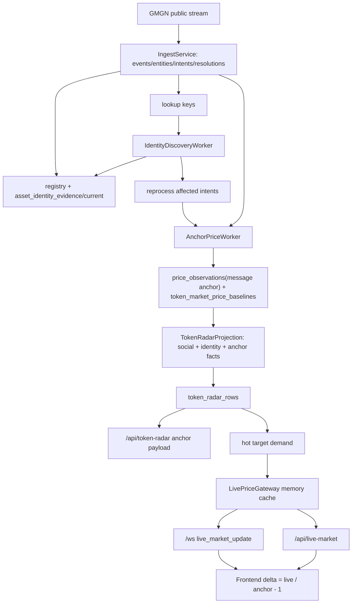

# Spec — Token Radar Anchor / Live Worker Simplification

**Status**: Draft, awaiting review
**Date**: 2026-05-11
**Owner**: Codex with Qinghuan
**Related**:

- `docs/ARCHITECTURE.md`
- `docs/CONTRACTS.md`
- `src/gmgn_twitter_intel/domains/token_intel/ARCHITECTURE.md`
- `docs/superpowers/specs/active/2026-05-11-token-radar-market-boundary-hard-cut-cn.md`
- `docs/superpowers/specs/active/2026-05-11-okx-dex-ws-market-stream-and-radar-recovery-cn.md`

## Background

Token Radar 现在已经不是最早那版“ingest 同步写 payload price”的实现。当前 `IngestService.ingest_event(...)` 在一个事务里完成 entity extraction、event/entity 写入、token evidence、token intents、GMGN payload / CA registry identity upsert、deterministic resolution、lookup keys、alerts/enrichment enqueue，见 `src/gmgn_twitter_intel/domains/evidence/services/ingest_service.py:63` 到 `src/gmgn_twitter_intel/domains/evidence/services/ingest_service.py:149`。GMGN payload registry path 只写 `registry_assets` 和 `asset_identity_evidence`，并 recompute current identity，见 `src/gmgn_twitter_intel/domains/evidence/services/ingest_service.py:151` 到 `src/gmgn_twitter_intel/domains/evidence/services/ingest_service.py:184`。

当前 normalized `TokenSnapshot` 只有 `address / chain / symbol / icon_url / trigger_type / raw`，见 `src/gmgn_twitter_intel/domains/evidence/types/twitter_event.py:69` 到 `src/gmgn_twitter_intel/domains/evidence/types/twitter_event.py:77`。GMGN token payload parser 明确只把 `a/c/s/i/tt` 放进 normalized raw，`mc/p` 这类价格字段不会进入 normalized token snapshot，见 `src/gmgn_twitter_intel/domains/ingestion/types/gmgn_token_payload.py:17` 到 `src/gmgn_twitter_intel/domains/ingestion/types/gmgn_token_payload.py:45`。完整 upstream item 仍在 `events.raw_json` 中入库，见 `src/gmgn_twitter_intel/domains/evidence/repositories/evidence_repository.py:194` 到 `src/gmgn_twitter_intel/domains/evidence/repositories/evidence_repository.py:238`。

价格 observation repository 当前显式拒绝 `provider="gmgn_payload"`，见 `src/gmgn_twitter_intel/domains/asset_market/repositories/price_observation_repository.py:46` 到 `src/gmgn_twitter_intel/domains/asset_market/repositories/price_observation_repository.py:47`。集成测试也锁定了这个行为：含 `mc/p` 的 GMGN payload 会写 exact identity，但不会写 `price_observations` 或 current market，见 `tests/integration/test_asset_ingest_flow.py:42` 到 `tests/integration/test_asset_ingest_flow.py:83`。

当前唯一接近“消息锚点价”的 worker 是 `MessageMarketObservationWorker`。它每 5 秒跑一次，选择 current `Asset` / `CexToken` resolution 中尚无 `message_quote` observation 的 rows，见 `src/gmgn_twitter_intel/domains/asset_market/runtime/message_market_observation_worker.py:14` 到 `src/gmgn_twitter_intel/domains/asset_market/runtime/message_market_observation_worker.py:58` 和 `src/gmgn_twitter_intel/domains/asset_market/queries/pending_market_observation_query.py:87` 到 `src/gmgn_twitter_intel/domains/asset_market/queries/pending_market_observation_query.py:102`。它为 CEX 逐条 `ticker(inst_id=...)`，为 DEX 批量 `token_prices(...)`，再写 `observation_kind="message_quote"`，见 `src/gmgn_twitter_intel/domains/asset_market/services/message_market_observation.py:73` 到 `src/gmgn_twitter_intel/domains/asset_market/services/message_market_observation.py:126`，`src/gmgn_twitter_intel/domains/asset_market/services/message_market_observation.py:129` 到 `src/gmgn_twitter_intel/domains/asset_market/services/message_market_observation.py:203`。

`PriceObservationRepository.insert_observation(...)` 现在不只是写 `price_observations`。它还同步写 `current_market_field_facts`，并在 message attribution 足够时 upsert `token_market_price_baselines`，见 `src/gmgn_twitter_intel/domains/asset_market/repositories/price_observation_repository.py:116` 到 `src/gmgn_twitter_intel/domains/asset_market/repositories/price_observation_repository.py:147`。`token_market_price_baselines` 是 Token Radar source query 的消息锚点输入，见 `src/gmgn_twitter_intel/domains/token_intel/queries/token_radar_source_query.py:80` 到 `src/gmgn_twitter_intel/domains/token_intel/queries/token_radar_source_query.py:97` 和 `src/gmgn_twitter_intel/domains/token_intel/queries/token_radar_source_query.py:108` 到 `src/gmgn_twitter_intel/domains/token_intel/queries/token_radar_source_query.py:110`。

`AssetMarketSyncWorker` 仍然承担“数据库当前价刷新器”的职责。CEX path 对每个 OKX ticker 写 `cex_tokens`、`price_feeds` 和一条 `price_observations` refresh，见 `src/gmgn_twitter_intel/domains/asset_market/services/asset_market_sync.py:24` 到 `src/gmgn_twitter_intel/domains/asset_market/services/asset_market_sync.py:88`。DEX path 同时做 exact address identity verification、`okx_dex_search` metadata observation、再对候选资产批量 `token_prices(...)` 写 `okx_dex_price` refresh，见 `src/gmgn_twitter_intel/domains/asset_market/services/asset_market_sync.py:91` 到 `src/gmgn_twitter_intel/domains/asset_market/services/asset_market_sync.py:290`。runtime 默认 CEX interval 是 300 秒，DEX interval 是 30 秒，见 `src/gmgn_twitter_intel/domains/asset_market/runtime/asset_market_sync_worker.py:20` 到 `src/gmgn_twitter_intel/domains/asset_market/runtime/asset_market_sync_worker.py:47`。

`TokenDiscoveryWorker` 是必要的 identity / registry discovery worker，但它现在也顺手写 pricefeed 和 price observation。symbol discovery 写 retained candidates 后把 `pricefeeds_written` 和 `price_observations_written` 加一，见 `src/gmgn_twitter_intel/domains/asset_market/runtime/token_discovery_worker.py:211` 到 `src/gmgn_twitter_intel/domains/asset_market/runtime/token_discovery_worker.py:255`。address discovery 也有同样计数，见 `src/gmgn_twitter_intel/domains/asset_market/runtime/token_discovery_worker.py:258` 到 `src/gmgn_twitter_intel/domains/asset_market/runtime/token_discovery_worker.py:305`。具体写入发生在 `_write_dex_candidate(...)`，它写 asset identity evidence 后又 upsert pricefeed 并 insert `okx_dex_search` observation，见 `src/gmgn_twitter_intel/domains/asset_market/runtime/token_discovery_worker.py:308` 到 `src/gmgn_twitter_intel/domains/asset_market/runtime/token_discovery_worker.py:370`。

`DexMarketStreamWorker` 是最重的 live path。它从 hot Token Radar rows 取 DEX targets，订阅 OKX DEX WS；每条 upstream update 都 upsert pricefeed、insert `price_observations`、commit、再查询 `repos.current_market.current_for_subjects(...)`，最后 publish `market_update`，见 `src/gmgn_twitter_intel/domains/asset_market/runtime/dex_market_stream_worker.py:50` 到 `src/gmgn_twitter_intel/domains/asset_market/runtime/dex_market_stream_worker.py:78` 和 `src/gmgn_twitter_intel/domains/asset_market/runtime/dex_market_stream_worker.py:108` 到 `src/gmgn_twitter_intel/domains/asset_market/runtime/dex_market_stream_worker.py:159`。

Token Radar projection 和 API read path 都依赖 current-market DB read model。Projection rebuild 会 `_hydrate_current_market(...)`，见 `src/gmgn_twitter_intel/domains/token_intel/services/token_radar_projection.py:69` 到 `src/gmgn_twitter_intel/domains/token_intel/services/token_radar_projection.py:78` 和 `src/gmgn_twitter_intel/domains/token_intel/services/token_radar_projection.py:220` 到 `src/gmgn_twitter_intel/domains/token_intel/services/token_radar_projection.py:245`。`/api/token-radar` 调 `AssetFlowService(... current_market=...)`，而 `AssetFlowService` 又在每次 read 时调用 `current_market.current_for_subjects(...)`，见 `src/gmgn_twitter_intel/app/surfaces/api/http.py:156` 到 `src/gmgn_twitter_intel/app/surfaces/api/http.py:173` 和 `src/gmgn_twitter_intel/domains/token_intel/read_models/asset_flow_service.py:20` 到 `src/gmgn_twitter_intel/domains/token_intel/read_models/asset_flow_service.py:75`。前端收到 `market_update` 后直接用 payload 替换 row 的 `current_market`，见 `web/src/features/live/marketUpdatePatch.ts:35` 到 `web/src/features/live/marketUpdatePatch.ts:53`。

因此，对用户给出的分析需要校准：**方向正确，代码细节有几处过期**。已经不成立的是“ingest 同步写 GMGN payload price”；仍然成立的是“数据库被同时当作消息锚点账本和当前报价器”。如果产品第一性原则是“DB 只记录消息到达附近的锚点价，实时涨跌由 frontend 通过 live WS / polling 看”，那么当前 `AssetMarketSyncWorker` price refresh、`TokenDiscoveryWorker` price side effect、`DexMarketStreamWorker` write-then-query current market、projection/API 的 DB current-market hydration 都是可删复杂度。

## Problem

Token Radar 的数据库行情层现在同时承担两种生命周期相反的事实：一类是 per-message anchor price，应该写一次、可审计、晚几秒没关系；另一类是 live/current price，应该高频、易失、只服务当前 UI。把 live price 写进 `price_observations/current_market_field_facts` 造成持续写放大、worker 职责混杂、projection/API 读取变重，并让前端看到的“当前价”被 DB write/query cadence 绑定。

## First Principles

1. **DB is an event archive, not a ticker cache.** `price_observations` 只应该保存与 social event / token intent / resolution 可追溯绑定的 anchor observation，或明确低频的 research/evaluation observation。`PriceObservationRepository` 已经支持 message attribution 并写 `token_market_price_baselines`，见 `src/gmgn_twitter_intel/domains/asset_market/repositories/price_observation_repository.py:132` 到 `src/gmgn_twitter_intel/domains/asset_market/repositories/price_observation_repository.py:147`。
2. **Live price is transient.** OKX DEX WS update 和 CEX live ticker/polling update 应进入 process-local live cache 和 backend WebSocket payload，不应进入 `price_observations`，也不应触发 `current_market.current_for_subjects(...)`。
3. **Identity is independent from price.** GMGN payload、tweet CA、OKX exact address、OKX symbol candidates 继续写 registry / identity evidence / discovery result；价格刷新失败不能让 extraction 或 deterministic resolution 消失。当前 ingest path 已经 provider-free，见 `src/gmgn_twitter_intel/domains/evidence/services/ingest_service.py:63` 到 `src/gmgn_twitter_intel/domains/evidence/services/ingest_service.py:149`。
4. **Backend ranking must not depend on live display price.** 如果 live price 不入库，Token Radar factor snapshot 不能继续把 DB current-market freshness 当 high-alert gate 或 timing alpha 的运行时真相。涨跌展示由 `anchor_price + live_price` 在 frontend/read surface 计算；backend factor snapshot 保留可审计 social/identity/anchor facts。

## Goals

- **G1 Anchor-Only Price Persistence**: 生产 runtime 中，只有 AnchorPriceWorker 可以为 Token Radar 写 `price_observations`，并且每个 current `source_resolution_id` 最多写一条 anchor observation。验收标准：OKX WS live updates、CEX universe sync、DEX refresh、discovery search 都不会产生 un-attributed `observation_kind="refresh"` price rows。
- **G2 Keep Ingest Fast and Provider-Free**: Ingest 继续只做 extraction、identity evidence、intent、resolution、lookup keys、alert/enrichment enqueue。验收标准：GMGN payload with `mc/p` 仍不在 ingest transaction 内写 market observation；provider outage 不影响 event/token_intent persistence。
- **G3 Discovery Without Price Side Effects**: Token discovery 保留 symbol/address lookup、registry asset creation、identity evidence、discovery result、reprocess；移除 price observation writes。验收标准：发现一个 OKX candidate 会 reprocess affected intents，但 `price_observations_written` 不再是 discovery result counter。
- **G4 Route Sync Without Current Price Writes**: CEX universe sync 只维护 `cex_tokens` 和 `price_feeds` route identity，可降为低频或 operator command；DEX periodic price refresh 删除，exact-address identity verification 合并到 discovery/identity worker。验收标准：service runtime 不再启动一个混合 CEX/DEX price refresh worker。
- **G5 LivePriceGateway**: 后端提供 process-local live price gateway，负责 hot target subscription/polling、in-memory latest map、backend WS publish、HTTP polling fallback。验收标准：一条 OKX DEX WS update 可以更新 frontend visible row，但不会改变 `price_observations` 行数，也不会调用 `CurrentMarketRepository`。
- **G6 Public Contract Split**: `/api/token-radar` 返回 immutable `anchor_price` / `anchor_observed_at_ms` / `anchor_provider` / `anchor_status`，不再返回 DB-backed `current_market` 作为 live price source。live value 通过 `live_market` WS/polling contract 单独返回。验收标准：frontend 用 `live_price` 和 `anchor_price` 计算涨跌，不等待 Token Radar projection rebuild。
- **G7 Explicit Research/Evaluation Choice**: 如果还需要 forward-return settlement，必须用独立、低频、明确命名的 settlement sampler；不得把 UI live stream 写库来顺便满足回测。验收标准：`settle-token-factors` 的 missing exit price 被视为覆盖率问题，或由 settlement sampler 填补，而不是由 live UI worker 产生隐式训练数据。

## Non-goals

- 不在本 spec 实现代码；本文件只定义 why/what，批准后再写 plan。
- 不改变 token extraction / intent construction 的语义。
- 不让 frontend 直接连接 OKX / GMGN / CEX provider，也不把 provider secret 暴露给浏览器。
- 不把 GMGN payload 重新作为 current-market provider。若使用 GMGN raw payload price，只能作为 event anchor source，不能更新 live/current market。
- 不保证每个冷门 token 都有 live price。live gateway 只服务 hot/resolved/visible targets，并且允许返回 missing/stale。
- 不把 current-market DB read model 继续优化成实时 ticker；这个 spec 的目标是删除这条职责，而不是让它更快。

## Target Architecture

目标架构把行情拆成三条互不混淆的线：

1. **Identity Line**: ingest 和 discovery 写 registry / identity evidence / discovery result / route facts。它回答“这条消息提到的 token 是谁”。
2. **Anchor Line**: AnchorPriceWorker 为 resolved message 写一次 anchor observation 和 `token_market_price_baselines`。它回答“这条消息附近的入场参考价是多少”。
3. **Live Line**: LivePriceGateway 在内存里维护 hot targets 最新价，通过 backend WS 或 polling 给 frontend。它回答“用户现在屏幕上看到的价是多少”。



### Worker Boundary After The Cut

| Current component | Target outcome | Reason |
|-------------------|----------------|--------|
| `IngestService` | Keep. No provider calls, no price writes. | Correct identity/extraction boundary already exists. |
| `MessageMarketObservationWorker` | Keep but rename/constrain to `AnchorPriceWorker`. | This is the one worker that matches “late is okay, write one event price”. |
| `AssetMarketSyncWorker.sync_cex_universe` | Replace with route-only CEX universe sync; low-frequency/manual. | CEX identity/route is useful; periodic ticker observations are live-price writes. |
| `AssetMarketSyncWorker.sync_dex_prices` | Delete periodic price refresh; move exact-address identity verification to discovery. | It mixes identity repair with current-price refresh. |
| `TokenDiscoveryWorker` | Keep identity/discovery/reprocess; remove pricefeed/price observation side effects except route facts required for resolution. | Discovery should not mutate market-price history. |
| `DexMarketStreamWorker` | Replace with `LivePriceGateway` behavior: subscribe/poll, memory cache, publish live update, no DB write/current-market query. | WS is a live transport, not a persisted observation source. |
| `TokenRadarProjectionWorker` | Keep social/identity/anchor projection; remove DB current-market hydration from scoring. | Projection should not depend on live ticker availability. |

### Anchor Source Policy

AnchorPriceWorker chooses exactly one anchor per `source_resolution_id`:

1. If an approved GMGN raw payload price parser is implemented and the raw payload matches the resolved chain/address, it may write `provider="gmgn_payload_anchor"` with `observation_kind="message_anchor"`.
2. Otherwise, it uses the configured market provider once: CEX ticker for `CexToken`, DEX batch price for `Asset`.
3. If no provider can quote, it records anchor status as missing/pending in the baseline/read model; it does not retry forever as a current-price refresh loop.

This policy intentionally does not reintroduce `provider="gmgn_payload"` as current market. It creates an event-anchor source only, with source event / intent / resolution attribution.

### Metadata For Identity And Gates

Some OKX search fields are not live price but still useful for symbol disambiguation and DEX safety context: market cap, liquidity, holders, community recognition. These should move out of the live price path.

The target model is:

- Discovery stores provider candidate metadata with identity/discovery provenance.
- Resolver/gates may use that metadata if freshness/provenance policy allows it.
- Price-only live updates never improve metadata confidence.
- Anchor price observations do not become canonical market-cap/liquidity/holders facts.

The plan can choose whether to persist this as `asset_identity_evidence.raw_payload_json`, a small discovery metadata table, or a renamed market metadata read model. The invariant is semantic: metadata used for identity/gates is not current price.

### Projection And Scoring

Token Radar projection becomes social-first plus identity/anchor-aware:

- Keep attention, diffusion, semantic quality, identity, source event provenance, and anchor price readiness.
- Remove DB live market freshness as a high-alert blocker.
- `timing_response` cannot depend on DB current price after this cut. It should either be removed from rank weight, marked display-only, or rebuilt from explicit anchor/settlement observations in a later approved spec.
- Factor snapshot may include `anchor_price` as immutable provenance. It must not include live price as a persisted scoring fact.

## Conceptual Data Flow

```text
GMGN frame
  -> ingest event/intents/resolutions (local only)
  -> identity discovery/reprocess (provider search, no price write)
  -> anchor price worker (one quote per resolved message)
  -> token_market_price_baselines
  -> token_radar_rows with anchor_price context
  -> API returns rows + anchor context
  -> live gateway streams/polls current prices in memory
  -> frontend computes live delta from anchor
```

Changed arrows:

- `OKX WS -> price_observations -> current_market -> frontend` is replaced by `OKX WS -> LivePriceGateway memory -> frontend`.
- `AssetMarketSyncWorker periodic refresh -> price_observations` is removed for Token Radar runtime.
- `TokenDiscoveryWorker -> price_observations` is removed; discovery writes identity/discovery facts only.
- `TokenRadarProjection -> current_market` is removed; projection reads anchor baseline and identity metadata only.

## Core Models

### AnchorPrice

An `AnchorPrice` is the persisted price near a social message / token resolution.

Fields:

- `event_id`, `intent_id`, `resolution_id`.
- `target_type`, `target_id`.
- `anchor_observed_at_ms`, `event_received_at_ms`, `anchor_lag_ms`.
- `price_usd` or quote price with `quote_symbol` / `price_basis`.
- `provider`, `source_observation_id`, raw payload hash.
- `status`: `ready`, `missing_provider`, `missing_quote`, `basis_mismatch`, `error`.

Invariant: one current resolution has at most one canonical anchor price. Re-runs are idempotent and update the same anchor identity, not append current-price history.

### LiveMarketSnapshot

A `LiveMarketSnapshot` is process-local state for a current target.

Fields:

- `target_type`, `target_id`, optional chain/address/native market id.
- `price_usd`, `price_quote`, `quote_symbol`, `price_basis`.
- optional live metadata if provider pushes it, such as market cap, liquidity, holders.
- `observed_at_ms`, `received_at_ms`, `provider`, `status`, `age_ms`.

Invariant: this is not the system of record. Restart may clear it. Missing live state is acceptable and must not corrupt DB history.

### LiveMarketUpdate

A `LiveMarketUpdate` is a backend WebSocket / polling payload derived from `LiveMarketSnapshot`.

Fields:

- `type="live_market_update"`.
- target identity.
- changed field keys.
- current snapshot.
- optional `anchor_price` echo only if already present in the row/read model.

Invariant: idempotent by `target_type + target_id + provider + observed_at_ms`. It does not imply a DB commit.

### IdentityMarketMetadata

`IdentityMarketMetadata` is provider metadata used for symbol disambiguation and DEX gate context.

Fields:

- target identity or candidate identity.
- provider/search source.
- market cap, liquidity, holders, community recognition when returned by provider search/metadata.
- observed_at and source payload hash.
- confidence/freshness policy for resolver usage.

Invariant: metadata is not live price. It can rank/qualify candidates, but live price updates cannot overwrite it.

## Interface Contracts

### HTTP: `/api/token-radar`

The response should expose anchor facts under each row:

- `anchor_price.status`
- `anchor_price.price_usd` or quote price fields
- `anchor_price.anchor_observed_at_ms`
- `anchor_price.event_received_at_ms`
- `anchor_price.anchor_lag_ms`
- `anchor_price.provider`

The response should not expose DB-backed `current_market` as the live price source. During migration, if `current_market` remains for compatibility, it must be explicitly marked deprecated and not patched by live updates.

### HTTP: `/api/live-market`

Add or repurpose a backend endpoint for polling live price snapshots from LivePriceGateway memory.

Semantics:

- Inputs are resolved targets: `target_type`, `target_id`.
- Reads do not trigger provider calls synchronously.
- Returns `status="live" | "stale" | "missing" | "unsupported"`.
- Missing live cache after restart is a valid response.

### WebSocket: `/ws`

Extend subscription with `market_targets` as already supported by `PublicWebSocketHub`, see `src/gmgn_twitter_intel/app/surfaces/api/ws.py:216` to `src/gmgn_twitter_intel/app/surfaces/api/ws.py:234`.

New push payload:

```json
{
  "type": "live_market_update",
  "target_type": "Asset",
  "target_id": "asset:solana:token:5UUH9RTDiSpq6HKS6bp4NdU9PNJpXRXuiw6ShBTBhgH2",
  "provider": "okx_dex_ws_price_info",
  "observed_at_ms": 1778461902000,
  "live_market": {
    "status": "live",
    "price_usd": 0.111,
    "quote_symbol": "USD",
    "age_ms": 1200
  }
}
```

The existing `market_update` payload that carries DB-backed `current_market` is deprecated by this spec.

### CLI / Ops

Existing current-market and backfill commands should not be used as the Token Radar live-price path after this cut. If retained, they are historical/debugging commands. Any new settlement sampler must be explicit, such as `ops sample-token-settlement-prices`, not hidden inside a live worker.

## Acceptance Criteria

- **AC1.** WHEN a GMGN token payload contains `mc` or `p` THEN ingest SHALL write identity evidence/resolution but SHALL NOT write a current-market observation in the ingest transaction.
- **AC2.** WHEN AnchorPriceWorker sees a current resolved `source_resolution_id` without an anchor THEN it SHALL write at most one canonical anchor observation and update `token_market_price_baselines`.
- **AC3.** WHEN the same anchor candidate is processed again THEN it SHALL be idempotent and SHALL NOT append a refresh/time-series row.
- **AC4.** WHEN TokenDiscoveryWorker finds symbol/address candidates THEN it SHALL persist identity/discovery facts and reprocess affected intents, but SHALL NOT write `price_observations`.
- **AC5.** WHEN CEX universe sync runs THEN it SHALL write route identity (`cex_tokens`, `price_feeds`) only, not ticker observations.
- **AC6.** WHEN OKX DEX WS pushes a live price update for a visible target THEN backend SHALL publish `live_market_update` and update memory cache, while `price_observations` row count remains unchanged.
- **AC7.** WHEN `/api/token-radar` returns a row THEN the row SHALL include anchor price status and SHALL NOT require `CurrentMarketRepository.current_for_subjects(...)` to render live price.
- **AC8.** WHEN frontend has `anchor_price` and later receives `live_market_update` THEN it SHALL compute live delta locally and update the visible row without waiting for Token Radar projection rebuild.
- **AC9.** WHEN forward-return settlement is run without explicit settlement sampler data THEN unsettled rows SHALL report missing exit price rather than relying on UI live updates having been persisted.
- **AC10.** WHEN `make check-all` runs after implementation THEN architecture/contract tests SHALL fail if `DexMarketStreamWorker` or its replacement writes `price_observations` for live updates.

## Risks

| Risk | Severity | Mitigation |
|------|----------|------------|
| Losing forward-return settlement coverage because live prices no longer persist. | High | Make this explicit. Either accept lower coverage or add a separate low-frequency settlement sampler with its own spec/plan and operation name. |
| Symbol-only resolver loses market-dominance facts when discovery stops writing price observations. | High | Move OKX search metadata into identity/discovery metadata read path before removing observation writes. Add resolver tests for dominance metadata provenance. |
| Frontend sees missing live price after backend restart. | Medium | Live payload/status explicitly supports `missing`; HTTP polling can return missing until gateway receives a fresh tick. |
| Public contract migration breaks existing UI/tests expecting `current_market`. | High | Introduce `anchor_price` and `live_market` in one cut, deprecate `market_update/current_market`, and update frontend contract tests. |
| CEX symbol resolution regresses if CEX route sync is reduced too far. | Medium | Keep route-only CEX universe sync on a daily/manual cadence and test `find_cex_token` / `find_preferred_cex_pricefeed`. |
| GMGN raw payload price parser reintroduces untrusted current market semantics. | Medium | Allow GMGN payload only under `gmgn_payload_anchor` with event attribution; never include it in live/current market provider sets. |
| Provider WS flood overwhelms connected clients. | Medium | Coalesce in LivePriceGateway by target and observed timestamp; publish only subscribed/visible/hot target updates. |

## Evolution Path

After this cut, the clean next expansion is not “put live prices back into DB”. It is one of two explicit products:

1. **Settlement sampler**: sparse, low-frequency, horizon-aware price sampling for evaluation/IC coverage. It writes research observations with a separate kind and does not feed UI live price.
2. **Richer live gateway**: CEX WS support, provider health, coalescing, and multi-provider fallback in memory. It improves UI freshness without changing DB semantics.

If later GMGN raw payload price proves trustworthy, it can become an anchor source, not a current-market provider.

## Alternatives Considered

- **Keep field-aware `current_market` and optimize indexes** — rejected for this product goal. It fixes stale-field correctness but keeps DB as a ticker cache, which is exactly the complexity this spec removes.
- **Let frontend connect directly to OKX / GMGN** — rejected because provider credentials, quotas, target mapping, and subscription lifecycle belong behind backend adapters.
- **Write WS live cache to Postgres or Redis** — rejected for the first cut. Redis would be a reasonable distributed live cache later, but Postgres writes are the main thing being removed.
- **Use GMGN payload price as the only anchor** — rejected as a default because current normalized payload intentionally strips price fields and existing tests enforce identity-only GMGN payload behavior. It can be added as an explicitly named anchor source after validation.
- **Delete all market data from backend scoring immediately** — rejected because anchor price and some discovery metadata still have product value for audit, display, resolver disambiguation, and future evaluation.

## Boundaries

| Class | Behaviour |
|-------|-----------|
| Always | Persist one anchor price per resolved message when available; keep extraction/provider separation; send live price through backend WS/polling without DB writes. |
| Ask first | Reintroducing GMGN raw payload price as an anchor source; adding settlement sampler writes; retaining any `current_market` compatibility field after frontend migration. |
| Never | Use Postgres as high-frequency live ticker storage; let WS live updates write `price_observations`; let discovery/search price side effects stand in for anchor observations; let frontend call provider APIs directly. |
