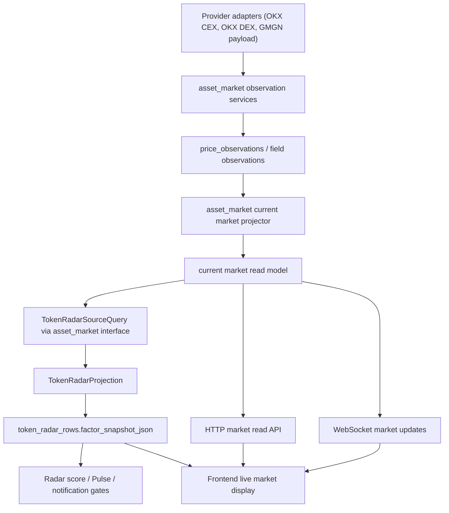

# Token Radar / Market Service Boundary Hard Cut Spec

**Status**: Approved for implementation planning
**Date**: 2026-05-11
**Owner**: Codex with Qinghuan
**Related**:

- `docs/superpowers/specs/active/2026-05-10-token-radar-factor-snapshot-architecture-cn.md`
- `docs/superpowers/specs/active/2026-05-10-providers-and-enforcement-design-cn.md`
- `src/gmgn_twitter_intel/domains/token_intel/ARCHITECTURE.md`
- `docs/ARCHITECTURE.md`

## Background

仓库的全局架构已经把市场事实和 Token Radar 评分放在不同 domain。`asset_market` 拥有 asset registry、price observations、discovery、asset-market sync 和 message-market observation，`token_intel` 拥有 Token Radar feature aggregation、factor snapshot projection、audit query 和 signal alert，见 `docs/ARCHITECTURE.md:40` 到 `docs/ARCHITECTURE.md:41`。同一文档规定跨域依赖必须通过目标域 `interfaces.py`，SQL 只能在 repositories / queries / platform db / app runtime 健康检查中出现，见 `docs/ARCHITECTURE.md:84` 到 `docs/ARCHITECTURE.md:88`。

Token Intel 的局部架构也已经写明生产链路：ingest 写入 `price_feeds / price_observations`，market observation workers 刷新市场事实，之后 `TokenRadarProjectionWorker` 生成 `token_radar_rows.factor_snapshot_json` 并被 HTTP / WebSocket / CLI / frontend 消费，见 `src/gmgn_twitter_intel/domains/token_intel/ARCHITECTURE.md:10` 到 `src/gmgn_twitter_intel/domains/token_intel/ARCHITECTURE.md:25`。同一 stage map 明确 market observation 属于 `../asset_market/runtime/{asset_market_sync_worker.py,message_market_observation_worker.py}` 和 `../asset_market/services/{asset_market_sync.py,message_market_observation.py}`，而 Radar projection 只 join current resolutions、events、identity 和 market observations，且 projection 不调用 provider 或 preflight-refresh markets，见 `src/gmgn_twitter_intel/domains/token_intel/ARCHITECTURE.md:39` 到 `src/gmgn_twitter_intel/domains/token_intel/ARCHITECTURE.md:40`。

当前 `price_observations` 是一行同时承载多类市场字段的表：行级 `observed_at_ms` 加 `price_usd / price_quote / market_cap_usd / liquidity_usd / volume_24h_usd / open_interest_usd / holders`，没有字段级 observed_at 或字段级 provenance，见 `src/gmgn_twitter_intel/platform/db/alembic/versions/20260507_0008_token_radar_deterministic_registry.py:101` 到 `src/gmgn_twitter_intel/platform/db/alembic/versions/20260507_0008_token_radar_deterministic_registry.py:118`。repository 的 `insert_observation` 也把这些字段作为同一 observation 写入和 upsert，见 `src/gmgn_twitter_intel/domains/asset_market/repositories/price_observation_repository.py:13` 到 `src/gmgn_twitter_intel/domains/asset_market/repositories/price_observation_repository.py:80`。

DEX provider contract 当前把搜索候选和价格刷新分成两种能力。`DexTokenCandidate` 有 `price_usd / market_cap_usd / liquidity_usd / holders`，但 `DexTokenPrice` 只有 `price_usd`，见 `src/gmgn_twitter_intel/domains/asset_market/providers.py:17` 到 `src/gmgn_twitter_intel/domains/asset_market/providers.py:37`。OKX DEX adapter 的 `/api/v6/dex/market/token/search` 解析 `marketCap / liquidity / holders`，见 `src/gmgn_twitter_intel/integrations/okx/dex_client.py:103` 到 `src/gmgn_twitter_intel/integrations/okx/dex_client.py:121`；`/api/v6/dex/market/price` 只解析 `price` 和 `time`，见 `src/gmgn_twitter_intel/integrations/okx/dex_client.py:55` 到 `src/gmgn_twitter_intel/integrations/okx/dex_client.py:66` 以及 `src/gmgn_twitter_intel/integrations/okx/dex_client.py:124` 到 `src/gmgn_twitter_intel/integrations/okx/dex_client.py:137`。

这就暴露出当前最危险的语义缺口：价格刷新写入 `okx_dex_price` 时，代码会把上一条 asset row 里的 `market_cap_usd / liquidity_usd / holders` 塞进新的 price observation。`sync_dex_prices` 在价格端点返回后写 `price_usd=price.price_usd`，同时写 `market_cap_usd=asset.get("market_cap_usd")`、`liquidity_usd=asset.get("liquidity_usd")`、`holders=asset.get("holders")`，见 `src/gmgn_twitter_intel/domains/asset_market/services/asset_market_sync.py:233` 到 `src/gmgn_twitter_intel/domains/asset_market/services/asset_market_sync.py:271`。message-level DEX quote 也用同样方式把 pending query 读到的 `asset_market_cap_usd / asset_liquidity_usd / asset_holders` 写进新的 message quote observation，见 `src/gmgn_twitter_intel/domains/asset_market/services/message_market_observation.py:153` 到 `src/gmgn_twitter_intel/domains/asset_market/services/message_market_observation.py:187`。pending query 里的这些 asset market 字段又来自 subject 的 latest price observation，见 `src/gmgn_twitter_intel/domains/asset_market/queries/pending_market_observation_query.py:79` 到 `src/gmgn_twitter_intel/domains/asset_market/queries/pending_market_observation_query.py:86`。

Token Radar source query 读取 market 的方式也放大了这个问题。它用 `latest_feed_price` 和 `latest_subject_price` 的最新行，通过 `COALESCE` 输出 `market_observed_at_ms / market_price_usd / market_market_cap_usd / market_liquidity_usd / market_holders`，见 `src/gmgn_twitter_intel/domains/token_intel/queries/token_radar_source_query.py:59` 到 `src/gmgn_twitter_intel/domains/token_intel/queries/token_radar_source_query.py:72`，并且最新 subject price 只按 `observed_at_ms DESC, observation_id DESC LIMIT 1` 取整行，见 `src/gmgn_twitter_intel/domains/token_intel/queries/token_radar_source_query.py:178` 到 `src/gmgn_twitter_intel/domains/token_intel/queries/token_radar_source_query.py:188`。

Projection 层随后把这一行当成整组市场快照判断新鲜度。`_market()` 只看 `market_observed_at_ms` 与 `MARKET_FRESH_MS`，再把 `price_usd / market_cap_usd / liquidity_usd / holders / snapshot_age_ms` 组成 market dict，见 `src/gmgn_twitter_intel/domains/token_intel/services/token_radar_projection.py:509` 到 `src/gmgn_twitter_intel/domains/token_intel/services/token_radar_projection.py:571`。这意味着只要 price-only observation 是新的，旧市值、旧流动性和旧 holders 也会被同一个 row-level age 标成新。

当前 API/frontend 又把 Token Radar 的 scoring facts 当成价格合同。`AssetFlowService._public_row` 从 `factor_snapshot_json` 取 `market_quality.facts`，并同时暴露为 `"market": market` 和 `"price": market`，见 `src/gmgn_twitter_intel/domains/token_intel/read_models/asset_flow_service.py:54` 到 `src/gmgn_twitter_intel/domains/token_intel/read_models/asset_flow_service.py:69`。测试也锁定了这个行为：`price == market == factor_snapshot.families.market_quality.facts`，见 `tests/test_asset_flow_service.py:175` 到 `tests/test_asset_flow_service.py:200`。

但 factor snapshot 的 market facts 不是 live market contract。`_market_quality_family` 只保留 `target_market_type / market_status / holders / liquidity_usd / market_cap_usd / volume_24h_usd / open_interest_usd / native_market_id`，没有 `price_usd / provider / snapshot_age_ms / snapshot_observed_at_ms / field freshness / source observation ids`，见 `src/gmgn_twitter_intel/domains/token_intel/scoring/factor_snapshot.py:165` 到 `src/gmgn_twitter_intel/domains/token_intel/scoring/factor_snapshot.py:196`。前端类型和转换逻辑却期望 `price_usd / snapshot_age_ms / snapshot_observed_at_ms / market_observation_status` 存在于 row price 或 market facts 中，见 `web/src/api/types.ts:286` 到 `web/src/api/types.ts:319`，以及 `web/src/lib/tokenRadar.ts:108` 到 `web/src/lib/tokenRadar.ts:123` 和 `web/src/lib/tokenRadar.ts:161` 到 `web/src/lib/tokenRadar.ts:181`。

生产中的 `$TROLL` 症状正是这个架构缺口的自然结果：系统可以持续写入新的 `okx_dex_price` 价格行，但市值仍来自旧 search/full-market observation；由于当前 row-level freshness 把整行标新，Token Radar 和前端会看到“新鲜”的 51M market cap，而不是明确看到“price fresh, market_cap stale/missing”。这不是前端格式问题，也不是单纯轮询间隔问题，而是市场事实生命周期和 Radar product contract 混在一起。

## Tweet ingress dependency audit

从一条推文进入系统看，token extraction 本身不依赖 OKX search 或 CEX search。`CollectorService.handle_frame` 只解析 GMGN frame、写 raw frame、把 item normalizer 成 `TwitterEvent`，然后调用 ingest store；watched event 才发布 WebSocket payload，见 `src/gmgn_twitter_intel/domains/ingestion/runtime/collector_service.py:68` 到 `src/gmgn_twitter_intel/domains/ingestion/runtime/collector_service.py:94` 以及 `src/gmgn_twitter_intel/domains/ingestion/runtime/collector_service.py:132` 到 `src/gmgn_twitter_intel/domains/ingestion/runtime/collector_service.py:160`。normalizer 从 GMGN item 构建 `TwitterEvent`，并把 GMGN token payload 解析成 `token_snapshot`，见 `src/gmgn_twitter_intel/domains/ingestion/services/normalizer.py:69` 到 `src/gmgn_twitter_intel/domains/ingestion/services/normalizer.py:112`。

进入 ingest transaction 后，`IngestService.ingest_event` 先从 tweet surfaces 提取实体、写 event/entities，再用 entity 和 GMGN token snapshot 构造 token evidence / token intents / deterministic resolution；这条路径没有 provider call，见 `src/gmgn_twitter_intel/domains/evidence/services/ingest_service.py:65` 到 `src/gmgn_twitter_intel/domains/evidence/services/ingest_service.py:123`。实体提取是 regex/parser 路径，覆盖 EVM/Solana/TON CA、cashtag、hashtag、mention、URL/domain，见 `src/gmgn_twitter_intel/domains/evidence/services/entity_extractor.py:61` 到 `src/gmgn_twitter_intel/domains/evidence/services/entity_extractor.py:198`。`build_token_evidence` 只把 CA、cashtag、GMGN payload 转成 token evidence，见 `src/gmgn_twitter_intel/domains/token_intel/services/token_evidence_builder.py:32` 到 `src/gmgn_twitter_intel/domains/token_intel/services/token_evidence_builder.py:47`；`build_token_intents` 再把强身份证据和局部 cashtag alias 组成 intent，见 `src/gmgn_twitter_intel/domains/token_intel/services/token_intent_builder.py:37` 到 `src/gmgn_twitter_intel/domains/token_intel/services/token_intent_builder.py:84`。

依赖 OKX/CEX registry 的阶段是 resolution / discovery，而不是 extraction。`DeterministicTokenResolver.resolve` 的顺序是 CEX pricefeed exact、chain+address、address without chain、symbol，见 `src/gmgn_twitter_intel/domains/token_intel/services/deterministic_token_resolver.py:53` 到 `src/gmgn_twitter_intel/domains/token_intel/services/deterministic_token_resolver.py:87`。symbol-only resolution 会先查 `cex_tokens`，再查 DEX assets by symbol，并用 market cap / holders / liquidity 做 dominant asset 判定，见 `src/gmgn_twitter_intel/domains/token_intel/services/deterministic_token_resolver.py:217` 到 `src/gmgn_twitter_intel/domains/token_intel/services/deterministic_token_resolver.py:296` 和 `src/gmgn_twitter_intel/domains/token_intel/services/deterministic_token_resolver.py:299` 到 `src/gmgn_twitter_intel/domains/token_intel/services/deterministic_token_resolver.py:340`。CEX registry 不是 per-tweet search，而是 `sync_cex_universe` 从 OKX tickers 周期性 upsert `cex_tokens / price_feeds / price_observations`，见 `src/gmgn_twitter_intel/domains/asset_market/services/asset_market_sync.py:23` 到 `src/gmgn_twitter_intel/domains/asset_market/services/asset_market_sync.py:87`。

DEX search 是异步 discovery/reprocess 链路。`DiscoveryRepository.due_lookup_keys` 从 recent NIL/AMBIGUOUS lookup keys 中选择 `symbol:*` 和 `address:*`，见 `src/gmgn_twitter_intel/domains/asset_market/repositories/discovery_repository.py:15` 到 `src/gmgn_twitter_intel/domains/asset_market/repositories/discovery_repository.py:95`。`TokenDiscoveryWorker` 对 symbol lookup 调 `dex_market.search_tokens`，写 retained DEX candidates、identity evidence、pricefeed 和 search observation，再 reprocess affected intents，见 `src/gmgn_twitter_intel/domains/asset_market/runtime/token_discovery_worker.py:102` 到 `src/gmgn_twitter_intel/domains/asset_market/runtime/token_discovery_worker.py:180`，`src/gmgn_twitter_intel/domains/asset_market/runtime/token_discovery_worker.py:211` 到 `src/gmgn_twitter_intel/domains/asset_market/runtime/token_discovery_worker.py:255`，以及 `src/gmgn_twitter_intel/domains/asset_market/runtime/token_discovery_worker.py:308` 到 `src/gmgn_twitter_intel/domains/asset_market/runtime/token_discovery_worker.py:369`。

这条依赖链的正确边界是：推文 extraction 必须总是本地、快速、可重放；symbol/address resolution 可以暂时 `NIL` 或 `AMBIGUOUS`，再由 discovery 补 registry 后 reprocess；market current read model 只能影响市场展示和 market-quality gates，不能让 extraction 等待 provider，也不能让 price-only refresh 改写 identity evidence。唯一需要跟本 spec 联动的 resolution 风险是：symbol-only dominant asset 目前读取 latest observation 中的 market fields，如果这些字段继续被 price-only row copy-forward，就可能同时污染 UI 市场展示和 symbol disambiguation。field-level freshness 因此必须服务两个消费者：current market display 和 deterministic resolver 的 market-dominance input。

## Problem

用户可见问题是：Token Radar 页面不能稳定展示接近实时的价格/市值，甚至会把 stale market cap 伪装成 fresh market snapshot。生产上 `$TROLL` 市值已变到约 100M，但 Radar 仍停在 51M；系统表面看有新的价格刷新，实际刷新的是 price-only 字段，市值字段被旧值复制进新 observation。前端之所以不能实时，是因为它没有独立的 live market contract，只能读 Token Radar projection 产出的 scoring snapshot；而 projection 本身又按 5m/1h/4h/24h 窗口重建，且被设计成不调用 provider。

## Root cause

根因不是“刷新不够勤”，而是四个架构边界没有切开。

1. **字段事实没有生命周期**：`price_observations.observed_at_ms` 是 row-level freshness，却被用来代表 price、market cap、liquidity、holders 的共同新鲜度。price-only provider 刷新后复制旧 market cap，会制造“新 observation + 旧字段”的伪新鲜事实。
2. **Token Radar 被当成价格服务**：Radar projection 是评分投影，不是 current market feed。把 `factor_snapshot.market_quality.facts` 同时暴露为 API `price`，使前端价格被 Radar rebuild cadence、source query 性能和 factor snapshot 字段裁剪共同限制。
3. **Provider capability 没有进入模型**：OKX search endpoint 能给 full-market metadata，price endpoint 只能给 price。当前模型没有表达“这个 provider call 只证明 price 字段，不证明 market_cap/liquidity/holders 字段”。
4. **消费合同反向驱动领域边界**：前端、Pulse、通知都消费 Radar row；于是为了让 UI 有价格，Token Radar snapshot 被迫承载 market current read model 的职责，破坏了 `asset_market` owns market facts / `token_intel` owns scoring 的 SOP。

## First principles

1. **One lifecycle owner per fact**：市场事实由 `asset_market` 拥有，Radar 只读市场事实。现有文档已经把 price observations 放在 `asset_market`，把 factor snapshot projection 放在 `token_intel`，见 `docs/ARCHITECTURE.md:40` 到 `docs/ARCHITECTURE.md:41`。
2. **Projection purity**：Token Radar projection 不调用 provider、不做 preflight refresh，只消费 repository/read model 中已落库的事实。这个约束已写入 Token Intel 架构，见 `src/gmgn_twitter_intel/domains/token_intel/ARCHITECTURE.md:39` 到 `src/gmgn_twitter_intel/domains/token_intel/ARCHITECTURE.md:40`。
3. **Freshness must be field-level when provider capability is field-level**：一个 provider response 只能刷新它实际返回并可验证的字段。`DexTokenPrice` 当前只包含 `price_usd`，不能刷新 `market_cap_usd / liquidity_usd / holders`，见 `src/gmgn_twitter_intel/domains/asset_market/providers.py:31` 到 `src/gmgn_twitter_intel/domains/asset_market/providers.py:37`。
4. **Product contract must match consumer use**：前端需要 current market，Signal/notification 需要 auditable scoring facts。两类消费者不能共享同一个半截 JSON 作为事实源。

## Goals

- **G1 Market Current Read Model**: 存在一个由 `asset_market` 拥有的 current market read model。它按 target subject 暴露 price、market cap、liquidity、volume、OI、holders 等字段，并为每个字段提供 status、observed_at、age、provider、source observation ref。验收标准：任意 target 能区分 `price=fresh` 与 `market_cap=stale/missing`。
- **G2 No Copy-Forward As Fresh**: price-only provider response 不得把旧 `market_cap_usd / liquidity_usd / holders` 写成 fresh facts。验收标准：OKX `/market/price` 刷新 `$TROLL` price 后，market cap 字段的 observed_at 不改变，除非 provider response 或另一个 full-market source 明确返回 market cap。
- **G3 Token Radar Clean Boundary**: `token_intel` 的 Token Radar projection 只消费 `asset_market` current market snapshot 或 observation read interface，不再从 latest price observation row 推断整组市场字段。验收标准：Radar factor snapshot 内只保存评分所需 market context 和 provenance，不作为前端实时价格源。
- **G4 Frontend Live Market Contract**: 前端价格展示从 market current read model 或 market WS event 获取，而不是从 `factor_snapshot.market_quality.facts` 获取。验收标准：Radar projection 未重建时，current market 更新仍能刷新前端 price/market cap 展示。
- **G5 Provider Capability Accounting**: provider adapter 和 service 层明确标记每次 observation 的 field capability。验收标准：price endpoint、search/full metadata endpoint、CEX ticker endpoint 的输出能力不同，field freshness 不混用。
- **G6 Rate-limit and Backlog Visibility**: OKX DEX 等 provider 的 rate limit、error、backlog、next retry 必须进入 `asset_market` health/read model。验收标准：provider 429 时，UI/ops 能看到 provider status 为 `rate_limited`，Radar high-alert gate fail closed，而不是继续把旧市值当 fresh。
- **G7 SOP Enforcement Ready**: spec 批准后的 plan 必须给出架构测试或 contract test，防止 UI/API 再把 factor snapshot 当 live price feed。验收标准：测试能在有人恢复 `price == factor_snapshot.market_quality.facts` 时失败。
- **G8 Extraction / Resolution Boundary Preservation**: token extraction 不得引入 provider dependency；OKX/CEX registry 只参与 deterministic resolution、discovery/reprocess、market current。验收标准：推文 ingest path 在 provider 不可用时仍写 event/entities/token_evidence/token_intents/current NIL-or-AMBIGUOUS resolution，并留下 lookup keys 供 discovery 后续处理。

## Non-goals

- 不在本 spec 里实现代码；本文件只定义 why/what，plan 批准后再写 how。
- 不把 Token Radar projection 改成 provider caller。projection purity 保留。
- 不承诺所有长尾 DEX token 都能 exchange-grade realtime。目标是 active/hot Radar targets 的 provider-budget-bound near-realtime，以及不把 stale 字段伪装成 fresh。
- 不让前端直接调用 OKX、GMGN 或任意外部 provider。provider secrets、quota、identity mapping 和 freshness semantics 必须留在后端。
- 不把 GMGN public WebSocket 当作连续价格 feed。GMGN payload 只能作为 event/message price evidence。
- 不重做 token identity hard cut；本 spec 依赖 `asset_identity_evidence/current` 和 resolver 输出。
- 不在 factor snapshot 中塞入所有 market current 字段来“临时满足 UI”。这会继续耦合 Radar scoring 和 price product。
- 不把 OKX search 或 CEX universe sync 加进 synchronous tweet ingest hot path。

## Target architecture

目标架构是：`asset_market` 产出可审计 current market snapshot，`token_intel` 只消费 snapshot 做评分，frontend/API 通过 market read model 获取实时市场展示。



关键切分：

- `asset_market` owns provider calls, observation writes, field freshness, current market snapshot, provider health, market backlog.
- `token_intel` owns target grouping, social/factor aggregation, market scoring context, hard gates, rank, factor snapshot.
- `app/surfaces/api` composes consumer responses. It may return a Radar row plus a current market block, but the current market block comes from `asset_market`, not from factor snapshot facts.
- `frontend` displays two related but separate concepts: Radar score context and live market state. They may have different computed_at/observed_at timestamps.

### Market field ownership

| Field class | Owner | Freshness clock | Notes |
|-------------|-------|-----------------|-------|
| `price_usd`, `price_quote`, `quote_symbol`, `price_basis` | `asset_market` | price field observed_at | OKX DEX price endpoint can refresh these. |
| `market_cap_usd` | `asset_market` | market cap field observed_at | Only full metadata source, verified supply-derived source, or provider field that returns market cap can refresh. |
| `liquidity_usd` | `asset_market` | liquidity field observed_at | Price-only endpoint cannot refresh. |
| `holders` | `asset_market` | holders field observed_at | Price-only endpoint cannot refresh. |
| `volume_24h_usd`, `open_interest_usd` | `asset_market` | venue ticker observed_at | CEX ticker can refresh CEX fields; DEX depends on provider capability. |
| `market_status` for scoring | `token_intel` from market snapshot | computed_at | Derived from field status policy, not source observation row age alone. |
| `rank_score`, `eligible_for_high_alert` | `token_intel` | projection computed_at | Never used as live market freshness. |

### Freshness policy

The system SHALL classify each market field independently:

- `fresh`: field value came from a provider/source that actually returned or derived that field within the configured SLO.
- `stale`: field exists but field observed_at is older than SLO.
- `missing`: no trusted field value exists.
- `unsupported`: provider/source cannot supply this field for this target class.
- `rate_limited` / `provider_error`: value may exist, but current refresh health is impaired.

The current market snapshot MAY also expose aggregate status such as `tradability_status`, but aggregate status MUST be derived from field statuses and MUST not hide stale fields.

## Conceptual data flow

```text
GMGN payload / OKX search / OKX ticker / OKX price
  -> asset_market observation writer
  -> field-aware observation ledger
  -> current market snapshot projector
  -> current market read model
  -> (a) frontend market block over HTTP/WS
  -> (b) Token Radar scoring input
  -> token_factor_snapshot_v1 scoring context
  -> Pulse / notification / ranking
```

Changes to existing arrows:

- `TokenRadarSourceQuery -> price_observations latest row` is replaced or wrapped by `TokenRadarSourceQuery -> asset_market current market snapshot interface`. The reason is semantic, not cosmetic: latest row cannot express field-level freshness.
- `AssetFlowService -> factor_snapshot.market_quality.facts -> price` is split into `AssetFlowService -> token_radar_rows` for scoring and `AssetFlowService/API composition -> current market read model` for live market display.
- `OKX price endpoint -> price_observations with copied market cap` becomes `OKX price endpoint -> price field refresh only`.
- `tweet -> extraction -> token intent` remains provider-free. `token intent -> discovery/reprocess` remains async and registry-backed.

No new provider call originates from Token Radar. If a hot Radar target needs refresh, it emits demand/priority for `asset_market`; `asset_market` owns whether, when, and how provider calls happen.

## Core models

### MarketFieldFact

A `MarketFieldFact` is one current market field for one subject.

Semantic fields:

- field key, such as `price_usd`, `market_cap_usd`, `liquidity_usd`, `holders`.
- value.
- status: `fresh`, `stale`, `missing`, `unsupported`, `rate_limited`, `provider_error`.
- observed_at_ms and age_ms.
- provider and provider capability key.
- source observation id or source payload ref.
- derivation basis when not directly provider-returned, such as `price * circulating_supply`.

Invariant: a provider response can update a `MarketFieldFact` only for fields it returned or fields the system can deterministically derive from fresh dependencies.

### CurrentMarketSnapshot

A `CurrentMarketSnapshot` is the latest field-aware market state for a subject.

Semantic fields:

- subject identity: `target_type`, `target_id`, chain/address or native market id.
- display identity refs from `asset_identity_current` or CEX token identity.
- field facts for price, quote, market cap, liquidity, volume, OI, holders.
- aggregate health: market_status, provider_status, stale_reasons, missing_reasons.
- updated_at_ms and computed_at_ms.
- source refs: latest observation ids per field.

Invariant: aggregate `market_status=fresh` requires the fields needed by that target class and consumer context to be fresh. For DEX high-alert eligibility, fresh price alone is insufficient when market cap/liquidity/holders are required.

### TokenRadarMarketContext

`TokenRadarMarketContext` is the scoring input extracted from `CurrentMarketSnapshot` at projection time.

Semantic fields:

- field values needed by scoring.
- field statuses needed by hard gates.
- selected market snapshot ref.
- projection-time copy of age/status used for audit.

Invariant: this is an immutable scoring context, not a live price feed. It can explain why a Radar row was scored a certain way, but it is not the frontend's source for current price.

### MarketRefreshDemand

`MarketRefreshDemand` is a priority signal from product/read models to `asset_market`.

Semantic fields:

- subject identity.
- demand source: Radar hot window, message quote, Pulse candidate, manual audit.
- required fields.
- freshness SLO.
- priority class: hot, warm, cold.
- last attempt, next retry, provider status.

Invariant: demand influences refresh priority; it does not grant `token_intel` permission to call providers.

### ResolutionMarketEvidence

`ResolutionMarketEvidence` is the market-quality input used only for symbol disambiguation, such as dominant DEX asset selection.

Semantic fields:

- subject identity.
- field facts for market cap, liquidity, holders.
- field statuses and observed_at per field.
- source: discovery search, verified full metadata, or current market snapshot.

Invariant: resolver may use market facts to break symbol ambiguity only when those facts are supported by field-level provenance. Price-only refresh MUST NOT update or improve resolver market dominance evidence.

## Interface contracts

### HTTP: Token Radar / asset flow

The existing Token Radar asset-flow response SHOULD keep Radar score, attention, target, resolution, decision, data health, and factor snapshot semantics. Its `price`/`market` field SHALL no longer be an alias for `factor_snapshot.market_quality.facts`.

The API MAY include a `current_market` block per Radar row or return market refs that the frontend resolves through a separate market endpoint. Either shape is acceptable in the later plan, but the semantics are fixed:

- `current_market` comes from `asset_market` current snapshot.
- factor snapshot remains scoring provenance.
- timestamps distinguish `projection.computed_at_ms` from market field observed_at times.

### HTTP: Current market read

There SHALL be a backend surface for reading current market snapshots by subject identity. It accepts resolved target refs, not raw untrusted symbols. Error modes distinguish unresolved target, unsupported provider, stale data, provider error, and rate limited data.

Idempotency: repeated reads do not trigger provider calls directly. Reads observe current state; refresh is handled by background demand/worker flow.

### WebSocket: Market updates

There SHOULD be a market update event for current market snapshot changes that matter to active frontend views. It carries subject ref, changed field keys, field statuses, and snapshot updated_at. It does not carry Radar score changes unless Radar projection also changed.

### CLI / Ops

Ops audit SHALL be able to answer:

- What are the latest field facts for this target?
- Which provider/source refreshed each field?
- Is price fresh while market cap stale?
- Is the target blocked from high alert because market cap/liquidity/holders are stale or missing?
- What refresh demand/backlog/provider health is preventing update?

## Acceptance criteria

- **AC1**. WHEN OKX DEX `/market/price` refreshes `$TROLL` price but does not return market cap, THEN system SHALL update price field freshness only and SHALL NOT update market cap/liquidity/holders observed_at.
- **AC2**. WHEN a target has fresh price and stale market cap, THEN frontend SHALL display the fresh price state and a stale/missing market cap state instead of one aggregate fresh market snapshot.
- **AC3**. WHEN Token Radar projection rebuilds, THEN it SHALL consume current market snapshot/context and SHALL NOT call OKX/GMGN/provider clients.
- **AC4**. WHEN `factor_snapshot.market_quality.facts` lacks `price_usd` or field age, THEN frontend SHALL still be able to render current price from the market contract.
- **AC5**. WHEN provider returns 429 or the refresh backlog exceeds SLO, THEN current market health SHALL show `rate_limited` or stale reasons, and high-alert eligibility SHALL fail closed for targets requiring those fields.
- **AC6**. WHEN full metadata source later observes `$TROLL` market cap near 100M, THEN current market snapshot SHALL update market cap independently of the next Radar projection, and frontend SHALL reflect it through market read/WS path.
- **AC7**. WHEN Radar factor snapshot is inspected for a historical row, THEN it SHALL show the market context used for scoring at that time, including source snapshot/field refs, but SHALL NOT claim to be current live price.
- **AC8**. WHEN a developer accidentally reintroduces `price == factor_snapshot.market_quality.facts` as the frontend market source, THEN contract tests SHALL fail.
- **AC9**. WHEN OKX/CEX providers are unavailable during tweet ingest, THEN system SHALL still extract entities, write token evidence/intents, and persist deterministic NIL/AMBIGUOUS/exact-CA resolutions without blocking on provider search.
- **AC10**. WHEN symbol-only resolution uses market dominance, THEN system SHALL use only market-cap/liquidity/holders facts with their own freshness/provenance and SHALL NOT let a fresh price-only row refresh dominance evidence.

## Risks

| Risk | Severity | Mitigation |
|------|----------|------------|
| Field-level freshness model adds complexity | High | Keep v1 field set small: price, market cap, liquidity, holders, volume, OI. Use semantic read model first; avoid generic market-data platform. |
| Current market snapshot and factor snapshot drift visibly | Medium | Treat this as a feature, not a bug: UI labels `market observed_at` separately from `radar computed_at`. Historical Radar keeps scoring provenance. |
| Provider cannot supply fresh market cap frequently enough | High | Show stale/unsupported honestly, fail closed for high alerts, and later add better DEX provider or supply-derived market cap as separate approved work. |
| Existing tests assume `price == market_quality.facts` | Medium | Plan must update those tests into anti-regression tests for separated contracts. |
| Read model introduces another table/worker | Medium | Prefer deriving from existing observations if sufficient, but do not keep row-level latest observation semantics. Any new projector must live in `asset_market`. |
| WebSocket update volume becomes noisy | Low | Emit only for active/hot targets and meaningful field/status changes; HTTP polling can be fallback. |
| Rate limit worsens if hot refresh priority is naive | High | Centralize OKX DEX provider budget and retry/backoff in `asset_market`; do not create independent per-worker client loops. Existing wiring currently creates multiple DEX market providers, see `src/gmgn_twitter_intel/app/runtime/providers_wiring.py:192` 到 `src/gmgn_twitter_intel/app/runtime/providers_wiring.py:202`. |

## Evolution path

V1 should hard-cut semantics with the smallest useful field-aware read model. After that, the system can evolve in three directions without re-coupling:

- Add stronger DEX market providers or a provider quorum behind `asset_market`.
- Add supply-derived market cap as a field derivation if fresh supply/price dependencies are auditable.
- Add active-view market subscription throttling for frontend panels and Pulse candidate watchlists.

The design must not foreclose future high-frequency feeds, but it must not pretend the current REST DEX provider is a true realtime exchange feed.

## Alternatives considered

- **Add missing price fields into factor snapshot**: rejected. It would make the UI look better temporarily, but would still bind realtime market display to Radar projection cadence and would not fix copied stale market cap.
- **Poll OKX more frequently**: rejected as a root fix. More polling can reduce price lag but amplifies 429s and still cannot make price-only responses refresh market cap/liquidity/holders.
- **Let frontend call OKX/GMGN directly**: rejected. It leaks provider concerns into UI, bypasses resolver identity, loses auditability, and duplicates rate-limit handling.
- **Let TokenRadarProjection call provider before scoring**: rejected. It violates projection purity and couples scoring latency to external provider health.
- **Keep latest `price_observations` row as current market snapshot**: rejected. The latest row is exactly where row-level freshness and copy-forward semantics create stale-field bugs.
- **Create a generic market-data platform now**: rejected. The immediate need is a field-aware current snapshot for resolved Radar targets, not a broad quant feed platform.

## Boundaries

| Class | Behaviour |
|-------|-----------|
| Always | `asset_market` owns provider calls, market observations, field freshness, current market read model, provider health, and refresh backlog. |
| Always | `token_intel` owns Radar grouping, scoring, factor snapshot, gates, ranking, and scoring provenance. |
| Always | Tweet extraction and intent construction stay provider-free; discovery/search remains asynchronous registry enrichment. |
| Always | Frontend current price/market display comes from market current contract, not from factor snapshot market facts. |
| Ask first | Adding a new external DEX provider, changing high-alert market freshness SLOs, or making market WebSocket updates default for all targets. |
| Ask first | Deriving market cap from supply if supply source, decimals, circulating supply, or FDV semantics are not already auditable. |
| Never | Copy stale market cap/liquidity/holders into a fresh price-only observation as if those fields were refreshed. |
| Never | Put OKX search, CEX universe sync, or DEX price refresh in the synchronous tweet ingest/extraction path. |
| Never | Have Token Radar projection call OKX, GMGN, or any external provider. |
| Never | Treat GMGN social/message payload as a continuous realtime market feed. |
| Never | Use natural-language agent output to override deterministic market freshness gates. |
