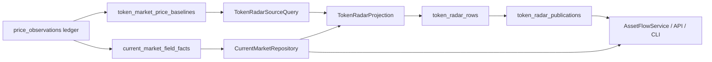

# Spec — Token Radar Production Read Models

**Status**: Approved
**Date**: 2026-05-11
**Owner**: Codex with Qinghuan
**Related**:

- `docs/superpowers/specs/active/2026-05-11-token-radar-market-boundary-hard-cut-cn.md`
- `docs/superpowers/plans/active/2026-05-11-token-radar-production-read-models-cn.md`
- `docs/ARCHITECTURE.md`
- `docs/CONTRACTS.md`
- `src/parallax/domains/token_intel/ARCHITECTURE.md`

## Background

当前系统已经完成了第一层 hard cut：`asset_market` 拥有 price observations/current market，`token_intel` 拥有 Token Radar factor snapshot 和 ranking，见 `docs/ARCHITECTURE.md:40` 到 `docs/ARCHITECTURE.md:41`。Token Intel 局部架构也写明 projection 消费 asset-market current-market snapshots，不调用 provider、不把 latest price-observation row 当 live market contract，见 `src/parallax/domains/token_intel/ARCHITECTURE.md:38` 到 `src/parallax/domains/token_intel/ARCHITECTURE.md:40`。

公开合同要求 `/api/token-radar` 行暴露 `current_market`，前端必须从 `current_market.fields` 读取 live price、market cap、liquidity、holders、volume、provider 和 freshness；同时禁止 `price`/`market` alias 从 factor snapshot 反推，见 `docs/CONTRACTS.md:31` 到 `docs/CONTRACTS.md:45`。

但当前实现仍有三个生产级缺口。第一，`TokenRadarProjection.rebuild(...)` 在重建开始时把窗口 coverage 标成 `running` 并立即 commit，见 `src/parallax/domains/token_intel/services/token_radar_projection.py:47` 到 `src/parallax/domains/token_intel/services/token_radar_projection.py:65`。`AssetFlowService.asset_flow(...)` 又只要 coverage 不是 `ready` 就返回 pending empty，见 `src/parallax/domains/token_intel/read_models/asset_flow_service.py:27` 到 `src/parallax/domains/token_intel/read_models/asset_flow_service.py:33`。因此一个长时间 running 的 `24h/all` refresh 会隐藏上一版已发布 rows。

第二，当前 `CurrentMarketRepository.current_for_subjects(...)` 每次读 current market 都对 append-only `price_observations` 做多个 lateral latest lookup，见 `src/parallax/domains/asset_market/repositories/current_market_repository.py:31` 到 `src/parallax/domains/asset_market/repositories/current_market_repository.py:150`。这虽然有 partial indexes，但热点 API/projection 仍把当前状态构建压力放在历史 ledger 上。

第三，`TokenRadarSourceQuery.source_rows(...)` 已经从 source query 中硬切掉历史 price observation joins，并把 first/event/before price fields 全部置为 `NULL`，见 `src/parallax/domains/token_intel/queries/token_radar_source_query.py:80` 到 `src/parallax/domains/token_intel/queries/token_radar_source_query.py:97`。这修掉了慢查询，却让 `price_change_since_social_pct` 和 `price_change_before_social_pct` 长期没有输入，进而让前端相对涨跌显示退化为 insufficient history。

前端的 `Cannot redefine property: ethereum` 堆栈来自 `evmAsk.js` 注入脚本，不来自仓库代码；仓库中没有定义 `window.ethereum` 的业务逻辑。它应被作为浏览器钱包扩展噪音从监控中过滤，不作为 Token Radar 数据链路根因。

## Problem

Token Radar 的用户可见症状是 `24h` 窗口无数据、价格相对涨跌消失、页面同时出现无关 wallet extension console error。根因不是 React 渲染或单点 SQL bug，而是 production read path 仍把“刷新状态”“已发布快照”“当前市场事实”“事件时点价格基线”混在一起：长 refresh 会遮蔽 last-good projection；current market 依赖历史 ledger 的 request/projection-time lateral scan；历史价格基线被性能修复直接切空。

## First Principles

1. **Published data and refresh lifecycle are different facts.** Public API 应读 last published projection；refresh `running/failed` 只能作为 metadata，不得隐藏 last-good rows。
2. **Append-only ledger is not a hot read model.** `price_observations` 继续作为审计 ledger；hot current market read 应读窄表事实模型，避免每次请求扫描/排序历史表。
3. **Historical price timing is a write-time/read-model concern.** 相对涨跌需要事件时点价格、social 前价格和 first price；这些不能回到 Token Radar source query 的 unbounded lateral join。
4. **No compatibility fallback.** 本次不从旧 coverage 表、旧 projection version、`price_json`/`market_json`、或 `factor_snapshot.market_quality.facts` 恢复 live price。

## Goals

- **G1 Last-good publication**: 当某个 window/scope refresh 正在 running 或 failed 时，`/api/token-radar` 仍返回该 window/scope 最近一次成功发布的 current-version rows，并在 `projection.refresh_status` 暴露刷新状态。
- **G2 Bounded current market reads**: `CurrentMarketRepository.current_for_subjects(...)` 不再读取 `price_observations`；它只读取 asset-market 维护的 field-fact read model。
- **G3 Restored price relative change**: Token Radar source query 从事件价格基线 read model 读取 first/event/before price fields；`price_change_since_social_pct` 与 `price_change_before_social_pct` 不再因 source query hard cut 永久为 null。
- **G4 Atomic publish**: Projection rebuild 先写 rows，再原子更新 public publish pointer；失败不移动 pointer。
- **G5 Contract hard cut**: API/CLI/runtime 构造 `AssetFlowService` 时必须传入 current-market repository；public rows 不从 factor snapshot 伪造 `current_market` provenance。
- **G6 PostgreSQL production practice**: 新表使用明确主键、窄索引和 concurrent index；高频读取走等值索引，不依赖 `MAX(computed_at_ms)` 扫描或 request-time ledger hydration。

## Non-goals

- 不在本次实现 OKX DEX WebSocket provider 或浏览器 market-update patch。
- 不让 `/api/token-radar` 或 projection 调用外部 provider。
- 不保留旧 coverage public-read fallback。
- 不恢复 Token Radar source query 对 `price_observations` 的历史 lateral joins。
- 不处理浏览器钱包扩展注入冲突，只在结论中说明该报错不是仓库业务根因。

## Target Architecture

目标架构新增三个 production read model：

1. **TokenRadarPublication**：每个 `projection_version + window + scope` 一条 publication metadata。它持有 last published `computed_at_ms`、row/source counts、refresh status、start/finish/error。API 按 publication pointer 读取 rows，而不是按 coverage status 或 `MAX(token_radar_rows.computed_at_ms)` 推断。
2. **CurrentMarketFieldFact**：`asset_market` 从 `price_observations` 写入窄字段事实。每个字段事实有 field key、value、provider、observed_at、source observation id。Current market reads 聚合这个 read model，继续输出 field-level status/provenance。
3. **TokenMarketPriceBaseline**：message/event-level price observation 写入时同步维护事件价格基线。Token Radar source query 只 join 这个窄表来取 first/event/before price，不再扫描历史 price observations。



## Conceptual Data Flow

```text
provider/message observation
  -> price_observations append-only ledger
  -> current_market_field_facts for hot current reads
  -> token_market_price_baselines for event timing
  -> TokenRadarProjection writes rows
  -> token_radar_publications publishes last-good computed_at_ms
  -> /api/token-radar reads published rows + current_market facts
  -> web displays rows and relative price timing
```

Changed arrows:

- `coverage.status -> public visibility` is removed. Publication pointer owns public visibility.
- `current market -> price_observations lateral joins` is replaced by `current market -> current_market_field_facts`.
- `TokenRadarSourceQuery -> NULL timing prices` is replaced by `TokenRadarSourceQuery -> token_market_price_baselines`.

## Core Models

### TokenRadarPublication

One public pointer per projection version/window/scope. It stores the last successful `published_computed_at_ms`, published counts, current refresh status, refresh timestamps, and last error. Invariant: `running` or `failed` refresh status never changes `published_computed_at_ms`.

### CurrentMarketFieldFact

One auditable field fact produced from a capable price observation. It stores subject, field key, JSON value, observed time, provider, source observation id, and update time. Invariant: only provider-capable fields are inserted; price-only provider output cannot create metadata facts.

### TokenMarketPriceBaseline

One timing baseline per token intent resolution. It stores event price, before-event price, first-known price, target identity, and event time. Invariant: Token Radar projection may read this model, but may not query historical `price_observations` for timing.

## Interface Contracts

`/api/token-radar` keeps the existing top-level `targets`, `attention`, and `projection` response. `projection.status` remains `fresh` when published rows exist. It adds refresh metadata such as `refresh_status`, `refresh_started_at_ms`, `refresh_finished_at_ms`, and `error` when relevant. If no publication exists for the requested current version/window/scope, the endpoint returns pending.

Rows keep `current_market` from `asset_market` and do not expose `price`/`market` aliases. Timing facts continue to live inside `factor_snapshot.families.timing.facts`.

CLI `asset-flow` follows the same semantics as HTTP. Ops rebuild commands publish only after row replacement succeeds.

## Acceptance Criteria

- AC1. WHEN `24h/all` refresh is `running` and a prior publication exists THEN `/api/token-radar` SHALL return prior published rows with `projection.status=fresh` and `projection.refresh_status=running`.
- AC2. WHEN a refresh fails after source query or row construction THEN the publication pointer SHALL remain on the last successful `computed_at_ms`.
- AC3. WHEN current market is read for subjects THEN repository SQL SHALL not reference `price_observations`.
- AC4. WHEN a capable price observation is inserted THEN field facts SHALL be written with provider, observed_at, source observation id, and field value.
- AC5. WHEN a message-level price observation with source resolution is inserted THEN a token price baseline SHALL be available to Token Radar source query.
- AC6. WHEN Token Radar source query is rendered THEN it SHALL join `token_market_price_baselines` and SHALL not join `price_observations`.
- AC7. WHEN API/CLI/runtime build `AssetFlowService` THEN they SHALL inject current-market repository and SHALL not reconstruct current_market from factor snapshot.

## Risks

| Risk | Severity | Mitigation |
|------|----------|------------|
| Field-fact table grows with observation volume | Medium | Store only capable non-null fields, keep narrow columns, index by subject/field/observed_at, and leave raw payload only in ledger. |
| Existing DB has no baseline rows immediately after migration | Medium | Add write-time maintenance now and an ops backfill path in rollout; projection remains honest with null timing until baseline exists. |
| Publication pointer update races with older writer | High | Use same advisory lock and reject stale computed_at before publish. |
| Current-market future timestamps hide older facts | Low | Reads bound facts by read time; stale/missing status is safer than showing future data. |
| Extension `window.ethereum` console error distracts incident response | Low | Classify as browser extension noise; do not modify app business logic. |

## Evolution Path

The next expansion is a capped market stream worker that writes the same field-fact and baseline models. Do not add browser-direct provider connections or projection-time provider calls; new providers should only add observation writers.

## Alternatives Considered

- **Keep coverage but special-case running** — rejected because coverage mixes refresh lifecycle and public pointer; a production read model should make publication explicit.
- **Use materialized views over `price_observations`** — rejected for this path because writes are frequent and field capability semantics live in domain code; a domain-maintained read model is clearer and easier to test.
- **Restore old source query lateral joins with more indexes** — rejected because it reintroduces the original 24h performance failure mode.
- **Fallback to factor snapshot market facts for current_market** — rejected because it violates the current public contract and loses field provenance.

## Boundaries

| Class | Behaviour |
|-------|-----------|
| Always | Serve Token Radar from current-version publication pointer; read current market from field facts; read timing prices from baselines. |
| Ask first | Dropping old tables from production; changing ranking score formulas; adding a provider stream. |
| Never | Public fallback to old projection versions; request-time provider calls; historical price lateral joins in Token Radar source query; factor snapshot as live price source. |
