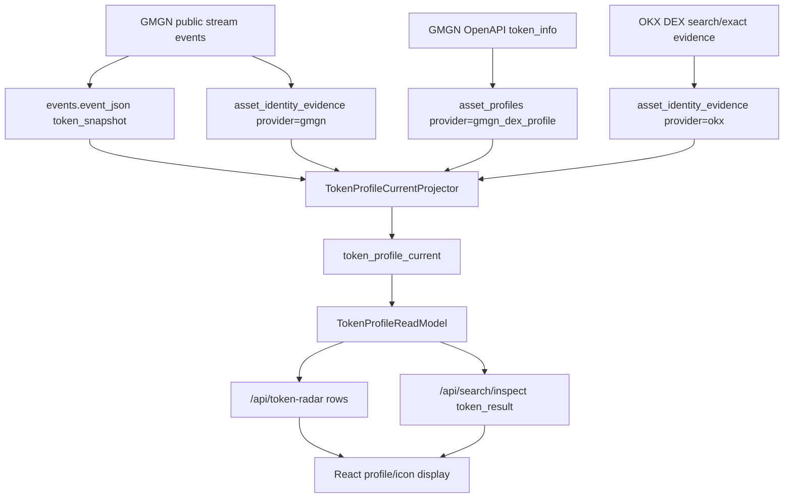

# Spec — Token Profile Current Facts Hard Cut

**Status**: Ready for implementation
**Date**: 2026-05-17
**Owner**: Codex / Qinghuan
**Scope**: Token Radar DEX icon/profile current facts, GMGN stream profile promotion, OKX DEX profile promotion, explicit CEX profile unsupported state
**Supersedes**: `docs/superpowers/specs/active/2026-05-13-token-profile-facts-read-model-cn.md`
**Related**:

- `docs/superpowers/specs/active/2026-05-17-gmgn-openapi-provider-gateway-cn.md`
- `docs/superpowers/plans/active/2026-05-17-token-profile-current-facts-hard-cut-plan-cn.md`
- `docs/ARCHITECTURE.md`
- `docs/WORKERS.md`
- `src/gmgn_twitter_intel/domains/asset_market/read_models/token_profile_read_model.py`
- `src/gmgn_twitter_intel/domains/asset_market/repositories/asset_profile_repository.py`
- `src/gmgn_twitter_intel/domains/ingestion/types/gmgn_token_payload.py`
- `src/gmgn_twitter_intel/integrations/okx/dex_client.py`

## One-line Decision

Hard-cut the public token profile chain from a GMGN-only `asset_profiles` lookup to one canonical `token_profile_current` projection built from persisted facts already in PostgreSQL: GMGN OpenAPI profile rows, GMGN stream token snapshots, and OKX DEX identity evidence. Do not add Binance in this pass because the observed DEX icon gap is already covered by existing GMGN stream and OKX DEX source facts.

## Current Code Audit

| Area | Current state | Gap |
|---|---|---|
| GMGN stream parser | `parse_gmgn_token_payload` reads `raw.t.i` into `TokenSnapshot.icon_url` and preserves `i` in `TokenSnapshot.raw`. | The icon is treated as identity evidence only; it never becomes a public profile/logo fact. |
| Ingest service | `_upsert_gmgn_payload_registry` writes GMGN payload evidence to `asset_identity_evidence` with provider `gmgn` and exact asset id. | `asset_identity_evidence.raw_payload_json.i` is not consumed by `TokenProfileReadModel`. |
| OKX DEX client | `_candidate_from_row` keeps the full OKX token search row in `OkxDexTokenCandidate.raw`. Live raw rows include `tokenLogoUrl`. | The typed candidate has no `logo_url`, and public profile reads never inspect exact OKX evidence raw payload. |
| GMGN OpenAPI profile cache | `asset_profiles` stores `gmgn_dex_profile` rows and status. The new gateway prevents provider outage from polluting token errors. | The table is a single-provider source cache, not a canonical current profile view. Existing `error/missing` rows block valid stream/OKX icons from surfacing. |
| Public read model | `TokenProfileReadModel` imports `GMGN_DEX_PROFILE_PROVIDER`, filters only `target_type == "Asset"`, and calls `asset_profiles.profiles_for_asset_ids(... provider=GMGN_DEX_PROFILE_PROVIDER)`. | Public contract is hardcoded to GMGN OpenAPI. CEX returns `None`. No source priority or current profile materialization exists. |
| Token Radar flow | `AssetFlowService` hydrates `row["profile"]` from `TokenProfileReadModel` after reading `token_radar_rows`. | The hydration point is correct, but it reads the wrong source model. |
| Frontend | `TokenRadarTable` displays icon from `profile.identity.logo_url`. | Frontend is not the root cause; it should not parse fallback raw payloads. |
| CEX sources | `OkxCexInstrument`, `OkxCexTicker`, `cex_tokens`, and `price_feeds` have no logo/icon field. | Current official CEX path cannot produce icons. Do not fake CEX icons by DEX symbol matching. |

## Live Data Findings

The local configured environment is `~/.gmgn-twitter-intel`. On 2026-05-17:

- `providers.gmgn.configured = true`, `openapi_base_url = https://openapi.gmgn.ai`.
- `ops refresh-asset-profiles --limit 20` returned `provider_blocked=1`, `ready=0`, `missing=0`, `error=0`, with Cloudflare challenge 403. This proves the new provider-block guard works, but GMGN OpenAPI cannot be the only icon path.
- `asset_profiles` contained `5484` GMGN ready rows with `4907` logos, plus many older `error/missing` rows without logos.
- Recent GMGN stream events already carried token snapshot icons: in a 24h probe, `1061` events had `token_snapshot.icon_url`.
- Among recent stream icon assets, there were assets with `profile_status IS NULL` or `profile_status='error'` while the event snapshot had an icon. These are source facts currently stranded outside public profile reads.
- OKX DEX identity evidence already carries logos: `18979` persisted OKX raw rows had `tokenLogoUrl`.
- In the current 1h DEX radar sample, `22/91` assets had GMGN profile logos, and another `31` had an OKX `tokenLogoUrl` despite missing GMGN profile logo. Some OKX URLs are generic `default-logo` placeholders and must not count as valid icons.
- OKX CEX public instruments and local CEX models do not expose icon fields.
- Binance official skills were checked. Binance Web3 can return DEX token metadata/icons, but Binance CEX skills do not solve official CEX icons. Because GMGN stream plus OKX DEX evidence already address the DEX gap, Binance is deferred.

## Problem

The root cause is architectural, not a missing frontend fallback. The system already receives icon/profile facts from multiple source inputs, but the public profile lane collapses everything into one GMGN OpenAPI cache read. When GMGN OpenAPI is blocked or has stale `error/missing` rows, valid icons already present in `events.event_json.token_snapshot` and `asset_identity_evidence.raw_payload_json` are ignored.

The current shape also mixes source cache and public current state:

```text
GMGN OpenAPI -> asset_profiles(provider='gmgn_dex_profile')
                                |
                                v
TokenProfileReadModel hardcoded to GMGN provider
                                |
                                v
Token Radar / Search / frontend profile.identity.logo_url
```

This violates the first-principles fix: solve the source-of-truth chain in PostgreSQL, not by adding request-time fallbacks or UI parsing.

## First Principles

1. **Facts first, fallback never.** If a provider/source already gave an icon, promote it into a canonical profile fact. Do not ask the UI or API handler to rediscover it.
2. **PostgreSQL remains business truth.** GMGN stream frames, OKX raw rows, and GMGN OpenAPI responses are inputs. Public reads consume materialized PostgreSQL facts only.
3. **One runtime writer per current model.** `token_profile_current` has exactly one writer and is rebuildable from existing source tables.
4. **Source caches are not public contracts.** `asset_profiles` remains the GMGN OpenAPI source cache; it is no longer the public profile read model.
5. **Exact asset joins only.** DEX profile promotion uses exact `asset_id`, chain, and address evidence. No symbol-only icon matching.
6. **CEX absence is explicit.** If official CEX sources do not expose icons, return `unsupported`; do not synthesize CEX icons from DEX tokens.
7. **KISS over provider sprawl.** Do not introduce Binance, proxy pools, browser automation, or a generic provider arbitration framework in this pass.
8. **Hard cut.** No feature flag and no dual GMGN-only read path. Tests should fail if public profile reads still import `GMGN_DEX_PROFILE_PROVIDER`.

## Goals

- **G1 Canonical current table.** Add `token_profile_current`, keyed by `(target_type, target_id)`, as the public profile current-state read model.
- **G2 Deterministic source promotion.** Project profile facts from existing PostgreSQL sources in a fixed priority order: GMGN OpenAPI ready rows, GMGN stream exact token snapshots, then OKX DEX exact identity evidence.
- **G3 No public provider hardcode.** Replace `TokenProfileReadModel` so it reads `token_profile_current` and returns explicit statuses for `Asset` and `CexToken`.
- **G4 No frontend fallback.** Keep frontend rendering from `profile.identity.logo_url`; do not add raw provider parsing in React.
- **G5 Explicit CEX outcome.** Return `unsupported` for CEX tokens unless a future official CEX profile source is added.
- **G6 Rebuildable ops path.** Add a one-shot rebuild CLI and a worker that can rebuild current profile facts from source tables.
- **G7 Guardrails.** Add tests that forbid Binance imports/config, request-time provider profile calls, and GMGN-only public read paths.

## Non-goals

- Do not add Binance as a runtime dependency, config section, worker, or profile source in this pass.
- Do not replace OKX CEX or DEX market providers.
- Do not solve GMGN Cloudflare/WAF beyond the provider gateway already specified.
- Do not add browser automation, proxy rotation, login cookies, or challenge solving.
- Do not add website scraping or image search.
- Do not add a generic provider arbitration subsystem.
- Do not derive CEX logos from matching DEX symbols or contracts.
- Do not put profile fields into `token_radar_rows.factor_snapshot_json`.
- Do not make `/api/token-radar`, `/api/search/inspect`, CLI read paths, or frontend components call external providers.

## Target Architecture



Ownership:

- `asset_market` owns source promotion, canonical profile current rows, and read-model normalization.
- `asset_profile_refresh` may continue to refresh GMGN OpenAPI source rows, but it is not a public profile read path.
- `token_intel` composes profile blocks into Token Radar/Search payloads.
- `web` renders normalized profile fields only.

## Data Model

Add `token_profile_current` as a rebuildable read model:

```sql
CREATE TABLE token_profile_current (
  target_type TEXT NOT NULL,
  target_id TEXT NOT NULL,
  status TEXT NOT NULL CHECK (status IN ('ready', 'missing', 'unsupported', 'error')),
  profile_provider TEXT,
  source_kind TEXT NOT NULL,
  source_ref TEXT,
  symbol TEXT,
  name TEXT,
  logo_url TEXT,
  banner_url TEXT,
  website_url TEXT,
  twitter_username TEXT,
  twitter_url TEXT,
  telegram_url TEXT,
  gmgn_url TEXT,
  geckoterminal_url TEXT,
  description TEXT,
  quality_flags_json JSONB NOT NULL DEFAULT '[]'::jsonb,
  source_payload_json JSONB NOT NULL DEFAULT '{}'::jsonb,
  observed_at_ms BIGINT,
  computed_at_ms BIGINT NOT NULL,
  updated_at_ms BIGINT NOT NULL,
  PRIMARY KEY(target_type, target_id)
);
```

Index requirements:

- `(status, updated_at_ms DESC)` for ops/debug.
- `(profile_provider, updated_at_ms DESC)` for source coverage audits.
- Optional partial index for valid logos: `WHERE logo_url IS NOT NULL`.

Semantics:

- `ready`: the selected source has a usable, non-placeholder HTTP(S) `logo_url`. Link/description-only profiles are retained as source facts but are not public icon-ready rows.
- `missing`: exact DEX asset was considered, but no usable profile source exists.
- `unsupported`: target type is valid, but current architecture has no trusted profile source. This is the default CEX outcome.
- `error`: projector could not evaluate the target because source data was malformed beyond local sanitization. Provider outages remain source-level state, not current profile token errors.
- `pending` remains a read-only API state when a resolved target has no `token_profile_current` row yet.

## Source Priority

The projector chooses one public current row per target using deterministic priority:

1. **GMGN OpenAPI ready profile with valid logo** from `asset_profiles(provider='gmgn_dex_profile', status='ready')`.
   - Use official links, description, logo, banner, and raw payload.
   - Do not let `asset_profiles.status IN ('error', 'missing')` block lower-priority valid sources.
2. **GMGN stream exact snapshot** from `asset_identity_evidence(provider='gmgn', evidence_kind='gmgn_payload_exact')` or equivalent exact payload rows containing `raw_payload_json.i`.
   - Use `raw_payload_json.i` as `logo_url`, `raw_payload_json.s` as symbol, source event id as provenance.
   - This is not a fallback call; it is promotion of already-ingested GMGN source facts.
3. **OKX DEX exact evidence** from `asset_identity_evidence(provider='okx', evidence_kind='okx_dex_exact_address')` rows for the same exact `asset_id` whose raw payload includes `tokenLogoUrl`.
   - Use `tokenLogoUrl`, `tokenName`, `tokenSymbol`, and source evidence id.
   - Filter known placeholders such as URLs containing `/default-logo/`; record `okx_placeholder_logo` in `quality_flags_json` and do not publish that URL as `logo_url`.
   - Never use `okx_dex_symbol_candidate` rows for profile logos.

If none of the above yields a usable profile for a DEX asset, write or return `missing`. For `CexToken`, return `unsupported` until an official CEX profile source is introduced in a future spec.

## Public Contract

`TokenProfileReadModel.profiles_for_targets()` returns blocks shaped like:

```json
{
  "status": "ready",
  "provider": "gmgn_stream_snapshot",
  "observed_at_ms": 123,
  "identity": {
    "symbol": "ABC",
    "name": "ABC Token",
    "logo_url": "https://...",
    "banner_url": null,
    "description": null
  },
  "links": {
    "website_url": null,
    "twitter_url": null,
    "twitter_username": null,
    "telegram_url": null,
    "gmgn_url": null,
    "geckoterminal_url": null
  },
  "source": {
    "provider": "gmgn_stream_snapshot",
    "source_kind": "asset_identity_evidence",
    "source_ref": "event_or_evidence_id",
    "quality_flags": [],
    "raw_available": true,
    "last_error": null
  }
}
```

API statuses:

- `ready`: persisted current row exists and is usable.
- `pending`: no current row exists yet for a resolved DEX asset.
- `missing`: current row exists but no usable source was found.
- `unsupported`: target type has no trusted profile source, especially `CexToken`.
- `error`: current row exists with projector error.

`/api/token-radar`, `asset-flow`, and `/api/search/inspect` must use the same block. The frontend must not receive provider raw payloads as a fallback channel.

## Binance Decision

Binance is not introduced in this pass.

Rationale:

- The DEX icon gap is already explained by existing source facts that are ignored by the public read model.
- Binance Web3 token metadata can return DEX icons, but adding it would create another external provider before fixing the current data-flow bug.
- Binance CEX skills do not solve the official CEX icon gap.
- KISS path is to promote GMGN stream and OKX DEX exact evidence first, then measure residual missing coverage.

Future trigger to revisit Binance: after this hard cut, a coverage audit shows a meaningful residual DEX icon gap where no GMGN stream, GMGN OpenAPI, or OKX DEX exact evidence exists.

## Acceptance Criteria

- **AC1.** WHEN a DEX `Asset` has `asset_profiles.status='ready'` with a valid logo, THEN `token_profile_current` contains a `ready` row sourced from `gmgn_dex_profile`.
- **AC2.** WHEN a DEX `Asset` has GMGN stream exact evidence with `raw_payload_json.i` but GMGN OpenAPI profile is missing or error, THEN `token_profile_current.logo_url` uses the GMGN stream icon.
- **AC3.** WHEN a DEX `Asset` has OKX exact evidence with a non-placeholder `tokenLogoUrl` and no higher-priority usable source, THEN `token_profile_current.logo_url` uses the OKX URL.
- **AC4.** WHEN OKX raw logo URL contains a known default placeholder pattern, THEN it is not exposed as `profile.identity.logo_url` and `quality_flags_json` records the placeholder reason.
- **AC5.** WHEN `TokenProfileReadModel` is inspected, THEN it does not import `GMGN_DEX_PROFILE_PROVIDER` and does not call `asset_profiles.profiles_for_asset_ids`.
- **AC6.** WHEN `/api/token-radar` returns DEX rows, THEN rows hydrate profile from `token_profile_current` only.
- **AC7.** WHEN `/api/token-radar` returns CEX rows, THEN profile status is `unsupported` or absent by explicit contract; no DEX symbol matching is used.
- **AC8.** WHEN GMGN OpenAPI is Cloudflare-blocked, THEN the current profile projector can still surface icons from GMGN stream and OKX DEX persisted evidence.
- **AC9.** WHEN implementation dependencies/config are searched, THEN there is no Binance runtime dependency, config, worker, or source provider.
- **AC10.** WHEN frontend renders token radar icons, THEN it uses the same `profile.identity.logo_url` field and no new raw-provider fallback.

## Verification

- Unit tests for source priority: GMGN OpenAPI wins over stream/OKX, stream wins over OKX, OKX fills when GMGN sources are absent.
- Unit tests for placeholder filtering.
- Unit tests for explicit CEX unsupported profile.
- Architecture test forbidding public read-model imports of `GMGN_DEX_PROFILE_PROVIDER`.
- Architecture test forbidding Binance profile source code/config.
- Integration test for `asset-flow` profile hydration from `token_profile_current`.
- CLI ops test for the one-shot rebuild.
- Live local check after rebuild: DEX icon coverage must be greater than the GMGN-only baseline. On the 2026-05-17 sample, the known opportunity is GMGN `22/91` plus up to `31` exact OKX rows before placeholder filtering, with additional GMGN stream icons available from recent events.

## Boundaries

| Decision | Rule |
|---|---|
| Source promotion | Use existing persisted source facts only. |
| External calls | Only existing workers/providers may call upstream APIs. Public reads never call providers. |
| `asset_profiles` | Keep as GMGN OpenAPI source cache, not public current read model. |
| `token_profile_current` | Rebuildable derived current table with one writer. |
| CEX icons | Explicit unsupported until official CEX profile source exists. |
| Binance | Deferred; no implementation in this pass. |
| Compatibility | No old GMGN-only read path, no feature flag, no dual hydration. |
