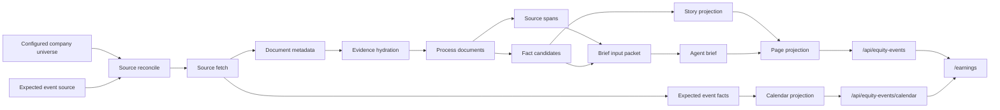

# Spec - Earnings Product Hard-Cut Root Fix

**Status**: Draft, ready for implementation planning
**Date**: 2026-05-26
**Owner**: Qinghuan / Codex
**Related**:
- `AGENTS.md`
- `docs/ARCHITECTURE.md`
- `docs/CONTRACTS.md`
- `docs/FRONTEND.md`
- `docs/RELIABILITY.md`
- `docs/WORKER_FLOW.md`
- `docs/WORKERS.md`
- `docs/TESTING.md`
- `src/gmgn_twitter_intel/domains/equity_event_intel/ARCHITECTURE.md`
- `docs/superpowers/specs/active/2026-05-22-equity-event-intel-cn.md`

## 一句话

把 `/earnings` 从“SEC submissions metadata 到了就算成功”的半成品，硬切成产品可用的财报/公司事件链路：官方文档证据、预期日历、事实提取、brief、读模刷新、页面交互各自有明确真相来源和失败语义；不保留 metadata-only、旧字段兜底或兼容性路径。

## 结论

当前 `/earnings` 感觉数据不更新、数据缺失，不是前端 polling 失效，也不是 worker 没启动。根因是产品链路把“source fetch 新鲜”误当成“产品数据新鲜”，同时实际 fetch 到的是 SEC submissions 元数据，不是 filing 正文、表格、XBRL 或 IR 证据。

所以页面能看到 worker running、sources success、feed rows，但用户真正需要的东西没有形成：

- 最新 source success 已经到 2026-05-26，但 material event 最新只到 2026-05-23。
- provider documents 有 16,923 条，但可用于事实/brief 的正文证据为 0。
- spans/facts 为 0，brief 只能落到 `insufficient` / `failed`。
- calendar rows 为 0，因为 expected events 当前没有被物化。
- summary 的 `brief_pending_count=15013` 是历史全表 pending 语义，不代表 active work queue。
- 前端每 15 秒请求 feed，但客户端又按 priority 重排，用户看到的不是严格时间序；有 `next page` 提示却没有可用分页动作。

修复方向不是重新 enqueue 一批 brief，也不是只改 UI 文案，而是硬切数据链路：没有官方可审计证据，就不能进入“可分析/可 brief”的产品状态；没有 material event/read model 更新，就不能把 provider success 展示成页面新鲜。

## Current Diagnosis

### Runtime evidence

实测 live runtime 使用 operator config：

- `config_path=/Users/qinghuan/.gmgn-twitter-intel/config.yaml`
- `workers_config_path=/Users/qinghuan/.gmgn-twitter-intel/workers.yaml`
- `equity_event_intel_enabled=True`
- `sec_user_agent_configured=True`
- `company_count=100`
- `expected_event_count=0`
- `agent_enabled=True`
- `equity_event_brief_configured=True`

`/readyz` 显示 equity event workers 在跑：

- `equity_event_source_reconcile`
- `equity_event_fetch`
- `equity_event_process`
- `equity_event_story_projection`
- `equity_event_brief`
- `equity_event_page_projection`

但 `/earnings` 页面和 API 显示的产品状态是：

- `p0_open_count=3214`
- `today_count=0`
- `brief_pending_count=15013`
- `latest_event_at_ms=1779483611000`，即 2026-05-23 05:00:11 Asia/Shanghai。
- `/api/equity-events/calendar` 返回 0 行。
- feed 中大量行显示 `insufficient brief` / `brief failed`，证据常见为 `docs 1 facts 0`。

DB 侧观察：

- sources 均 enabled，latest source success 到 2026-05-26。
- provider docs 总数 16,923，最大 fetched_at 到 2026-05-26。
- provider docs 中正文证据为 0。
- event docs 最新 event_time 到 2026-05-22 UTC。
- source spans 为 0，fact candidates 为 0，accepted facts 为 0。
- briefs 只有 `failed` / `insufficient`，没有 ready。
- calendar rows 为 0，alert candidates 为 0。
- dirty projection targets 为空。

### Code evidence

当前代码已经揭示了断点：

- `src/gmgn_twitter_intel/domains/equity_event_intel/ARCHITECTURE.md` 定义了从 equity sources 到 `/api/equity-events*` 再到 `/earnings` 的链路。
- `src/gmgn_twitter_intel/app/runtime/provider_wiring/equity_events.py` 只调用 `fetch_company_submissions`，保存 SEC submissions payload，没有继续拉取 filing document HTML、XBRL、exhibit 或 IR release 正文。
- `src/gmgn_twitter_intel/domains/equity_event_intel/services/sec_submission_normalizer.py` 尝试从 submissions recent item 里取 `title`、`description`、`body_text`，但 SEC submissions 本身通常只是 filing 元数据。
- `src/gmgn_twitter_intel/domains/equity_event_intel/services/fact_candidates.py` 在没有 document text 时不会产生 spans/facts。
- `src/gmgn_twitter_intel/domains/equity_event_intel/services/source_reconcile.py` 只会从 config 的 `expected_events` 物化 calendar；当前 runtime `expected_event_count=0`。
- `src/gmgn_twitter_intel/domains/equity_event_intel/repositories/equity_event_repository.py` 的 summary 统计把全表 `brief_json.status = pending` 都算进 pending，混淆了历史 backlog 和当前 due work。
- `web/src/features/equity-events/api/useEquityEvents.ts` 确实在 polling feed/calendar。
- `web/src/features/equity-events/model/equityEventViewModel.ts` 会在客户端按 priority 重排 API rows，削弱了“最新更新”的感知。
- `web/src/features/equity-events/ui/EquityEventFeed.tsx` 展示 `next page`，但没有实际 Load More 或 cursor 操作。

## Problem

目标用户打开 `/earnings`，期待的是一个财报和公司事件工作台：

- 今天和最近几小时哪些公司有正式 filing、press release、transcript 或 guidance 更新。
- 每个事件有什么官方证据、哪些事实已提取、哪些 brief 可读、还缺什么。
- 哪些预期财报已经发生、哪些 missed、哪些 upcoming。
- 页面刷新时能明确知道是“没有新事件”，还是“source 没抓到”，还是“抓到了但 evidence/brief 还没处理完”。

当前链路无法回答这些问题。它只能证明 SEC submissions endpoint 被检查过，不能证明产品事件、证据和分析已更新。结果是用户看到很多旧 P0、旧 pending、空 calendar、facts=0、brief failed，然后自然感觉“数据不更新、数据缺失”。

## First Principles

**Product freshness != source freshness.** Source success 只能说明 provider 被检查过；产品新鲜度必须由 material event、evidence、fact、brief、projection 的最新完成时间共同表达。

**Official evidence first.** 财报/公司事件不是 headline feed。没有 filing HTML、table/XBRL、exhibit、IR release 或 transcript 证据，就不能进入可分析状态。

**No metadata-only analysis.** SEC submissions item 的 form、filingDate、accessionNumber 可以生成 raw event，但不能当作正文证据，也不能让 LLM 假装有内容可总结。

**Calendar is material fact.** Expected earnings/call schedule 是产品链路的一等事实，不是前端静态辅助，也不是 summary 文案。

**Workers own mutations.** API 和 React 只读 read models；provider calls、evidence hydration、document parsing、fact validation、brief generation 都必须在 worker 链路里完成。

**One truth, rebuildable views.** `company_events`、documents、spans、facts、briefs 是业务真相；page/calendar/timeline/alert rows 是可重建读模。

**Hard cut beats compatibility.** 旧 metadata-only 字段、旧 raw_payload 文本猜测、旧 pending 统计不能保留为 runtime 兜底。迁移可以一次性清理或重建，但产品运行时只能走新语义。

## Goals

- **G1 Evidence hydration hard cut.** SEC filing 到达后，系统必须获取并持久化可审计证据：filing HTML/text、filing table/XBRL/companyfacts、exhibit、IR release 或 transcript。抓不到时要写明确 `evidence_unavailable` 原因，而不是产出空正文的“成功事件”。
- **G2 Product freshness semantics.** Summary/source status 必须区分 source check、new material event、evidence ready、projection updated、brief ready，不能把 provider success 当成 page freshness。
- **G3 Calendar materialization.** Expected events 必须从配置或 provider materialized 成事实和 calendar rows；没有配置时页面要明确显示“calendar source not configured”，不能静默空表。
- **G4 Fact extraction works on evidence packets.** 10-K/10-Q/8-K/press release/transcript 至少要在有证据时产生 source spans 和确定性 fact candidates；没有可抽取事实时写 `no_extractable_facts`，而不是 facts=0 且原因不明。
- **G5 Brief readiness is honest.** Brief worker 只能处理 evidence packet 或明确 insufficient audit。空证据不能进入正常 LLM brief；failed/insufficient/retryable/pending_due 要有可操作原因。
- **G6 Feed is time-trustworthy.** 默认 feed 保持后端 cursor 的时间序。Priority 可以作为筛选或分组模式，但不能让用户误以为旧 P0 是最新事件。
- **G7 Pagination is real.** API 有 next cursor 时，页面必须有可点击的 Load More 或等价分页动作。
- **G8 Backlog is not fake pending.** Summary 只能把 due/retryable/in-progress 算作当前 pending；历史不可处理旧数据必须标成 backlog/historical/unscheduled。
- **G9 Rebuildability.** 删除 page/calendar/timeline/alert read models 并重新 enqueue 后，应能从 material facts 重建同等产品视图。
- **G10 Operational diagnosis.** `/readyz`、ops diagnostics、source status、UI empty/error states 能指出链路卡在 source、evidence、facts、brief、projection 哪一段。

## Non-goals

- 不做前端文案级遮羞修复。
- 不通过重新 enqueue 旧 brief 来假装恢复。
- 不保留 metadata-only brief 路径。
- 不保留 `raw_payload.title/description/body_text` 作为产品证据兜底。
- 不在 API request path 或 React frontend 里拉 SEC、解析 HTML、调用 LLM。
- 不把 calendar 写死在前端。
- 不要求本 spec 覆盖全美股 universe；默认仍可从当前 100 公司 universe 起步。
- 不做自动交易、下单、回测平台或投资建议合规包装。
- 不把 equity event 数据写入 Token Radar、Pulse、News Intel 的事实表。

## Target Product Chain

关键语义：

- `Source fetch` 成功只更新 source status。
- `Document metadata` 只能证明 filing/press release/transcript 可能存在。
- `Evidence hydration` 才决定事件能否进入 facts/brief。
- `Process documents` 只处理 evidence-ready 或 explicit-unavailable 文档。
- `Page projection` 只从 material facts/readiness 状态生成 UI rows。
- `/earnings` 不合成事实，不自行判断事件新鲜度。

## Target Domain Model

### Equity Source Status

表达 provider 检查状态，不表达产品完整性。

必须区分：

- source enabled / disabled。
- last check attempted。
- last check success。
- last provider error。
- duplicate/no-new-data。
- latest material document discovered。
- latest expected event discovered。

### Equity Document Metadata

表达“发现了一份官方或可信来源文档”。

核心字段：

- company identity。
- source role: `sec_filing`、`ir_release`、`press_release`、`transcript`、`presentation`、`calendar`。
- provider document id。
- accession/form/filed_at/report_period when SEC。
- canonical document URL。
- discovered_at。
- metadata hash。

Document metadata 不能被当作 brief evidence。

### Equity Evidence Artifact

表达“产品可以引用和分析的证据”。

核心字段：

- document id。
- artifact kind: `html_text`、`xbrl`、`companyfacts`、`table`、`exhibit_text`、`transcript_text`、`ir_text`。
- extraction status: `ready`、`unavailable`、`failed`。
- content hash。
- extracted text/table location。
- excerpt/span index。
- failure/unavailable reason。
- fetched_at / parsed_at。

### Equity Expected Event

表达预期财报/电话会/公司事件。

核心字段：

- company identity。
- expected event type。
- expected date/session/time。
- source role/provider。
- confidence。
- status: `upcoming`、`matched`、`missed`、`cancelled`、`unknown`。
- matched actual event id when available。

### Equity Fact Candidate

表达可审计事实候选。

核心字段：

- event/document/span reference。
- fact type。
- value/unit/period/comparison basis。
- confidence。
- deterministic validation status。
- source excerpt/table cell reference。

### Equity Brief Readiness

表达 brief 是否可以生成、为什么不能生成、是否值得重试。

必须区分：

- `pending_due`: 有 evidence packet，等待 worker。
- `in_progress`: 正在执行。
- `ready`: brief complete and cited。
- `insufficient`: evidence packet 不足，且原因可展示。
- `failed_retryable`: provider/LLM/timeout 等可重试失败。
- `failed_terminal`: schema/domain validation 等不可自动重试失败。
- `stale`: facts/evidence 更新后 brief 过期。
- `historical_unscheduled`: 老数据不属于当前 due queue。

### Product Freshness Snapshot

Summary 和 source status 都应能表达：

- latest source success。
- latest material document event。
- latest evidence ready。
- latest fact extraction。
- latest brief ready。
- latest page projection。
- current due queue size。
- retryable failures。
- stale/historical backlog。

## API Contract

### `/api/equity-events`

默认按 material event time 或 projection time 的后端 cursor 返回。前端默认不能重新排序成 priority-first。

Row 必须能表达：

- event identity/company identity。
- event_type / priority / source_role。
- event_time / discovered_at / projected_at。
- evidence_status and evidence counts。
- fact counts。
- brief_status and reason。
- freshness markers。
- next cursor。

Priority 模式应通过 query 参数表达，例如 `priority=P0` 或 `group_by=priority`，而不是客户端隐式重排。

### `/api/equity-events/summary`

废弃全表 `brief_pending_count` 语义，改为产品可读指标：

- P0 open current window。
- today material events。
- due brief queue。
- retryable brief failures。
- stale brief rows。
- historical unscheduled backlog。
- latest material event time。
- latest source success time。
- latest projection time。
- calendar configured / not configured。

### `/api/equity-events/calendar`

返回 materialized expected events：

- upcoming。
- matched。
- missed。
- cancelled/unknown。
- source and confidence。
- matched actual event link。

没有 calendar source 时返回明确配置状态，页面显示可理解 empty state。

### `/api/equity-events/sources/status`

不能只显示 last success。必须拆分：

- provider check status。
- material document freshness。
- evidence hydration status。
- processing backlog。
- expected event source status。
- last actionable error。

## Frontend Contract

`/earnings` 第一屏必须让用户区分四种状态：

1. Source checked, no new material filings/events。
2. New metadata discovered, evidence hydration pending/failed。
3. Evidence ready, facts/brief pending。
4. Facts/brief ready, product row actionable。

页面行为：

- 默认 feed 保持时间序。
- Priority 是 filter/segment，不是隐式排序。
- 有 next cursor 时展示真实 Load More。
- Calendar empty 必须说明是 no upcoming/matched events，还是 calendar source not configured。
- Row 中 `docs 1 facts 0` 必须有原因：evidence missing、no extractable facts、processing pending、failed terminal。
- Summary 不展示会误导用户的全表历史 pending。
- 不在前端生成 facts、brief、calendar match 或 freshness 判断。

## Acceptance Criteria

### Freshness and source semantics

- **AC1** Given SEC source fetch succeeds but only returns duplicates, `/earnings` summary shows source checked and no new material events; latest material event time does not move.
- **AC2** Given source success is newer than latest material event, UI explicitly distinguishes source freshness from product freshness.
- **AC3** Given workers are running and dirty queues are empty, diagnostics can explain whether there is no due work, no evidence, no facts, or no configured calendar.

### Evidence and facts

- **AC4** Given a SEC filing metadata item has accession/document URL, worker fetches and persists at least one evidence artifact or writes `evidence_unavailable` with reason.
- **AC5** Given no evidence artifact is ready, fact extraction does not silently produce facts=0 without a reason.
- **AC6** Given evidence text/table/XBRL is ready for 10-K/10-Q/8-K, process worker creates source spans and deterministic fact candidates or writes `no_extractable_facts`.
- **AC7** Given an evidence artifact changes hash, dependent facts, brief readiness, and page projection are invalidated/recomputed through dirty targets.

### Briefs

- **AC8** Given a row has no evidence packet, brief worker does not make a normal LLM call for that row.
- **AC9** Given brief fails due to capacity/timeout/provider error, row is marked retryable with next retry semantics.
- **AC10** Given brief fails due to domain validation or insufficient evidence, row shows terminal/insufficient reason and is not counted as active pending.

### Calendar

- **AC11** Given expected events are configured or fetched, `/api/equity-events/calendar` returns upcoming/matched/missed rows.
- **AC12** Given no expected event source is configured, calendar endpoint and UI return an explicit not-configured state.
- **AC13** Given an actual filing/press release matches an expected event window, expected event status becomes matched and links to the actual event/story.

### Feed and UX

- **AC14** Given backend returns rows in time cursor order, frontend default feed preserves that order.
- **AC15** Given user selects P0/P1 or priority grouping, priority ordering is explicit in UI/API state.
- **AC16** Given API returns next cursor, frontend exposes a working Load More or equivalent pagination action.
- **AC17** Given a row displays zero facts, it also displays the underlying reason.
- **AC18** Given historical raw backlog exists, summary labels it as historical/backlog rather than current pending.

### Hard cut and rebuildability

- **AC19** Runtime code has no metadata-only brief path and no `raw_payload.title/description/body_text` compatibility evidence path.
- **AC20** Page/calendar/timeline read models can be truncated and rebuilt from material facts without provider calls in API/frontend.
- **AC21** Architecture tests enforce one writer per read model and prevent API/frontend mutation of equity event facts.
- **AC22** Running the product against live config no longer shows `docs > 0, facts = 0` without a machine-readable reason.

## Migration And Cleanup Policy

This is a hard cut. The implementation plan must include cleanup of stale semantics rather than preserving them:

- Existing metadata-only documents may be rehydrated, marked `evidence_unavailable`, or removed/rebuilt according to migration safety.
- Old `brief_pending_count` semantics must be replaced, not renamed and kept beside the new metric.
- Old raw payload text guesses must not remain in runtime extraction or brief input.
- Historical rows that cannot be rehydrated must be explicitly marked historical/terminal/backlog, not left as active pending.
- Tests must assert removed behavior is gone.

## Observability Requirements

Operators need to answer “卡在哪里” without reading code:

- Source provider checked but no new material docs.
- New docs discovered but evidence hydration pending.
- Evidence hydration failed with URL/status/reason class.
- Evidence ready but fact extraction pending/failed.
- Facts ready but brief pending/backpressured.
- Brief ready but page projection stale.
- Calendar not configured vs configured but empty.
- Active due queue vs historical backlog.

`uv run gmgn-twitter-intel config` remains the first diagnostic command for real-data debugging. Any report must show paths/booleans/counts only and never print secrets.

## Risks

| Risk | Impact | Mitigation |
|------|--------|------------|
| SEC rate limits | Evidence hydration may lag or fail | Respect User-Agent, bounded concurrency, retry windows, cache by accession/content hash |
| Filing HTML variability | Text/table extraction can be brittle | Normalize artifact kinds, keep extraction failure reasons, add fixture coverage |
| XBRL/companyfacts mismatch | Metrics may map incorrectly | Treat XBRL facts as candidates with validation, cite period/unit/context |
| Calendar source quality | Upcoming/missed can be wrong | Track source/confidence, allow multiple providers/config entries |
| LLM backpressure | Briefs lag and rows look incomplete | Separate evidence/facts readiness from brief readiness; show queue state |
| Historical backlog flood | Old rows overwhelm product | Mark historical/backlog outside active pending; process only selected windows |
| Hard cut migration | Temporary loss of old rows | Prefer honest empty/terminal states over misleading rows |
| UI trust | User may still confuse source and product freshness | First-screen freshness labels and status split are required |

## Alternatives Considered

**Only fix frontend sorting/pagination.** Rejected. It improves the stale feeling but does not create evidence, facts, briefs, or calendar rows.

**Re-enqueue all recent brief jobs.** Rejected. With no evidence text, it produces more `insufficient` / `failed` and wastes agent capacity.

**Let LLM summarize SEC submissions metadata.** Rejected. Metadata can identify a filing but cannot support audited financial/event claims.

**Keep raw_payload title/body_text fallback for compatibility.** Rejected. The user explicitly wants a thorough fix with no compatibility code; this path hides missing evidence and recreates the current failure mode.

**Put earnings calendar in frontend config.** Rejected. Calendar is product fact and must participate in matched/missed lifecycle.

**Create a separate service.** Rejected. Existing `equity_event_intel` domain already has the right bounded context, worker registry, API, and frontend route; the issue is chain completeness.

## Implementation Boundaries

Always:

- Treat material facts as truth and read models as rebuildable.
- Keep provider calls out of API/frontend.
- Make missing evidence explicit.
- Make product freshness explicit.
- Add tests for removed old behavior.
- Update docs/contracts when API semantics change.

Ask first:

- Expanding beyond the configured company universe.
- Adding paid providers or new credentials.
- Deleting unrecoverable historical production rows instead of marking/rebuilding them.
- Changing navigation labels outside `/earnings`.

Never:

- Print secrets from runtime config.
- Count historical unscheduled rows as active pending.
- Let LLM output become accepted fact without evidence.
- Preserve metadata-only product analysis as a runtime path.
- Hide source/evidence/fact/brief failure behind generic `pending`.

## Definition Of Done

The fix is product-complete when a user can open `http://localhost:8765/earnings` and answer, without code knowledge:

- Have sources checked recently?
- Did any new material earnings/company events arrive today?
- Is calendar configured, and what is upcoming/missed/matched?
- For each event, is evidence ready?
- If facts are missing, why?
- If brief is missing, is it pending, retryable, insufficient, terminal, or historical?
- Are rows ordered the way the UI says they are ordered?
- Can the user page through older events?

From the engineering side, the same state must be reproducible from DB facts and worker projections, with no compatibility evidence path and no misleading global pending count.
