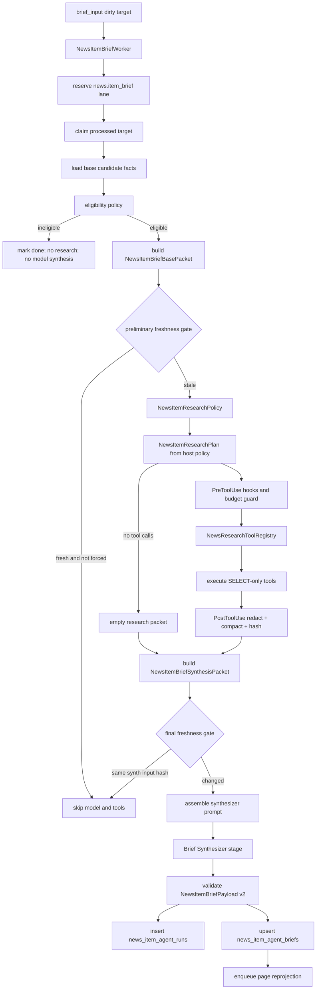

# Spec — News Local Research Harness Hard Cut

**Status**: Draft
**Date**: 2026-06-03
**Owner**: Qinghuan / Codex
**Base**: local `main` at `a80b705a`
**External reference**: `shareAI-lab/learn-claude-code` at `91682fa7fc1f919a7cf38a534548115565989943`
**Related**:

- `src/parallax/domains/news_intel/ARCHITECTURE.md`
- `docs/AGENT_EXECUTION.md`
- `src/parallax/platform/agent_execution.py`
- `src/parallax/domains/news_intel/runtime/news_item_brief_worker.py`
- `src/parallax/domains/news_intel/services/news_item_brief_input.py`
- `src/parallax/domains/news_intel/prompts/news_item_brief.md`

## Executive Summary

This spec replaces the earlier fixed-prefetch News context design with an **adaptive News-local research harness**.

The worker still owns admission, persistence, and current brief writes. The shared `AgentExecutionGateway` and `AgentStageSpec` remain unchanged. The change is inside the News item brief lane:

1. Build a small base packet from the current item, token lanes, fact lanes, and provider evidence.
2. Run a **deterministic News research policy** that chooses bounded News-owned read-only tool calls from content class, fact lanes, observation summary, and resolved target refs.
3. Execute those tool calls in the News harness through a registry, permission hooks, deterministic budgets, redaction, and hashing.
4. Ask a **Brief Synthesizer** model stage to produce the final `NewsItemBriefPayload` v2 using only the base packet and compact research packet.
5. Validate, append `news_item_agent_runs`, upsert `news_item_agent_briefs`, and dirty page projection.

This is closer to the harness philosophy in `learn-claude-code` in the parts that matter for Parallax P0: tool schema, permission hooks, context compaction, audit, and phase-specific recovery. It is not a full Claude Code/PI runtime because the model does not receive native tools and does not control the database. That is intentional: live News brief latency is already high, and the useful tool policy is mostly deterministic from existing News facts.

## Why The Previous Design Was Not Enough

The previous plan improved the packet by prefetching three fixed context classes. That would help, but it was too coarse: it did not define tools as typed, permissioned, compacted, auditable interfaces.

The missing harness properties were:

- **Explicit research policy**: the host did not first declare why a context lane was useful or skipped.
- **Adaptive observation**: every item got the same context, even when different content classes need different evidence.
- **Tool registry**: repository reads were not described as a stable tool catalog with schemas, permissions, and result contracts.
- **Prompt assembly**: one prompt had to carry identity, policy, research semantics, and output schema instead of runtime sections.
- **Context budget**: result truncation existed, but not as a first-class pre-model budget pipeline.
- **Recovery and audit**: failures in research policy, tool execution, and synthesis were not separated.

`learn-claude-code` repeatedly emphasizes that an agent product is the model plus a harness: tools, knowledge, observation, action interfaces, and permissions. Its lessons also show stable patterns this design borrows: tool schema plus handler dispatch, todo planning, hook-based permission, runtime prompt assembly, context compaction, memory/audit separation, and error recovery.

## Current Parallax Constraints

The shared Parallax agent execution contract is not a Claude-style runtime tool loop today:

- `AgentStageSpec` has one `input_payload` and no `tools` field.
- News model execution currently builds a stage and delegates to `AgentExecutionGateway`.
- `NewsItemBriefWorker` is the only runtime writer for `news_item_agent_runs` and `news_item_agent_briefs`.
- News Intel cannot import or write Token Radar, Pulse, or market read models.

Therefore this spec implements a **local harness loop inside News**:

```text
Host research policy -> News harness executes read-only tools -> LLM synthesizer JSON
```

It does not implement:

```text
LLM native tool_use -> gateway executes tools -> tool_result -> same model loop
```

That second shape belongs to a separate shared-kernel spec.

## Goals

- G1. Give News item brief a News-local research harness where host policy chooses bounded News-owned read tools before final synthesis.
- G2. Keep all tools read-only, schema-described, permission-checked, redacted, budgeted, hashed, and audited.
- G3. Preserve Kappa/CQRS boundaries: PostgreSQL News facts/read models remain truth; tool results are run input evidence only.
- G4. Add prompt assembly for the v2 synthesizer and make research-policy/tool semantics explicit in the synthesis packet.
- G5. Add output semantics for novelty, confirmation, source consensus, and retrieval notes.
- G6. Hard-cut old prompt/schema/current brief serving; no v1/v2 compatibility reader.
- G7. Keep shared `AgentExecutionGateway`, `AgentStageSpec`, lane accounting, and application workflow kernel unchanged.
- G8. Provide objective latency and failure controls so the enhanced agent does not overwhelm the worker lane.

## Non-goals

- N1. No shared gateway-level tool-calling and no `tools` field on `AgentStageSpec`.
- N2. No arbitrary SQL, provider clients, external HTTP, write tools, mutation tools, or retryable side-effect tools.
- N3. No `news_context_items`, legacy `context_items`, replies/comments/social threads, or story projection tables.
- N4. No cross-domain Token Radar, Pulse, market tick, macro, or CEX context in P0.
- N5. No long-term LLM memory table. News DB facts and run ledger are enough for this cut.
- N6. No public API redesign beyond compact v2 brief fields and stale state.
- N7. No attempt to make source quality an admission dependency.

## Target Architecture



## Plain-English Walkthrough

1. **The worker receives a brief target.**
   This is the same queue surface as today. Backpressure and lane reservation still happen before claim.

2. **The worker loads the item and checks eligibility.**
   If the item is not processed or does not pass the brief policy, the worker stops. It does not run research tools or the model.

3. **The worker builds the base packet.**
   The base packet is the small, deterministic view of the current item: headline/body excerpt, token lanes, fact lanes, provider signal evidence, source ids, and current versions.

4. **A cheap freshness gate may skip work.**
   If the current brief already matches the base packet, prompt/schema/tool catalog versions, and the dirty reason does not force context refresh, the worker can skip the expensive path.

5. **The harness chooses research tools deterministically.**
   `NewsItemResearchPolicy` uses content class, base budget report, observation summary, target resolution quality, fact lanes, and dirty reason. Low-signal or already self-contained items get an explicit empty research packet. Fact-bearing or target-specific items get bounded tool calls. This is not old compatibility mode: the synthesizer still writes strict v2 output and the run ledger still records why research was skipped or selected.

6. **The News harness executes only allowed tools.**
   The model does not get SQL or DB handles. The host policy names tools from a registry. The harness validates the tool name and arguments, enforces limits, blocks unsafe or cross-domain requests, and runs SELECT-only repository methods.

7. **Tool results are compacted and hashed.**
   Raw provider payloads, source item keys, feed URLs, sync cursors, credentials, and oversized text are removed. Each result gets a stable material hash. Runtime metadata like latency and `generated_at_ms` is audit-only.

8. **The Synthesizer writes the final brief.**
   It sees the base packet and compact research packet. It outputs one strict `NewsItemBriefPayload` v2 with novelty, confirmation, source consensus, and retrieval notes.

9. **Validation is still the publication gate.**
   The validator checks schema, grounding, evidence refs, action-audit violations, heuristic-vs-exact claims, and unsupported assets.

10. **The run is audited and the current brief is updated.**
    `news_item_agent_runs` stores the research policy decision, tool result hashes, synthesis audit, and response. `news_item_agent_briefs` stores the current v2 brief. Page projection is dirtied.

## Harness Mapping

| Harness idea from `learn-claude-code` | News design mapping | Objective fit |
|---|---|---|
| Agent loop stays simple; mechanisms attach around it | Shared gateway stays unchanged; News adds host research policy -> tool executor -> synthesizer orchestration | Fits current `AgentStageSpec` without pretending it has native tools |
| Tool = schema + handler | `NewsResearchToolDefinition` + repository handler | Clear, testable, bounded action surface |
| TodoWrite prevents drift | Host policy outputs `research_todos` and skip/selection reasons before tool calls | Improves reasoning visibility without giving mutation power |
| PreToolUse / PostToolUse hooks | Permission/redaction/hash hooks around each News tool call | Enforces trust boundary before results reach model |
| Prompt assembled at runtime | Synthesizer prompt is built from sections and receives a typed research packet | Reduces prompt contradiction and makes evidence policy explicit |
| Context compaction and tool budget | Per-tool row limits, total char budget, deterministic truncation, result hashes | Keeps model input predictable and replayable |
| Memory vs session state separation | News DB facts are memory; run ledger is audit; neither is blindly injected | Avoids self-invalidating run-history context |
| Error recovery | Separate research policy, tool, and synthesis failure handling | Failures are diagnosable and retry policy can differ by phase |

This is not a perfect Claude Code clone. It is a product-specific adaptation. P0 deliberately keeps planning deterministic because the live DB shows tool selection is mostly content-class and evidence-lane driven, while extra model turns would materially increase latency.

## Concrete Example

Suppose a processed item arrives:

```text
Title: "SEC is said to approve spot SOL ETF filings"
Symbols: SOL
Source: specialist media
Published: now
```

The worker does not fetch "all news in the last 24 hours" and paste it into the prompt. The flow is:

1. Base packet contains the current item only: title, summary/body excerpt, source role/trust tier, extracted SOL mention, fact candidates, provider signal, and item observation summary.
2. `NewsItemResearchPolicy` sees a fact-bearing ETF/regulation-style item with a resolved SOL target and emits a bounded plan, for example:
   - `get_observation_history(news_item_id, limit=25)`;
   - `search_news_archive(query_terms=["SOL ETF", "SEC", "approval"], symbols=["SOL"], window_hours=168, limit=8)`;
   - `get_target_news_context(target_refs=[{"target_type": "CexToken", "target_id": "cex_token:SOL"}], window_hours=72, limit=12)`;
   - `get_fact_context(news_item_id, include_rejected=false, limit=20)`.
3. Executor still clamps every input even though P0 calls are host-generated. If a future P1 planner asks for `window_hours=720`, the archive search becomes `168`. If it asks for `limit=100`, it becomes `8` or `12` depending on the tool.
4. Tools query PostgreSQL through `NewsRepository` only. They return compact rows such as other item ids, short titles, published time, source role, match reason, confidence, and compact current brief status. They do not return raw provider payloads or full historical article bodies.
5. Synthesizer receives the compact evidence and can say: "this is an update in a 72h SOL ETF stream" or "multi-source confirmed" only if exact observation/source evidence supports that claim.

Therefore "24h" is not the universal rule. P0 uses different windows by evidence type:

- exact observation history: no time window, item-scoped, capped by edge count;
- archive similarity: default 168h, max 168h, max 8 compact rows;
- target context: default 72h, max 168h, max 12 compact rows;
- source quality: configured source-quality windows, usually `24h` and `7d`;
- fact context: no time window, item-scoped, max 20 compact fact rows.

Real-data calibration from the live DB on 2026-06-03 showed an important nuance: multiple `source_id`s can still be the same aggregator domain. For example, `opennews-news` and `opennews-listing` both map to `6551.io`. That is useful duplicate/coverage evidence, but it is not independent source confirmation. The validator must treat independent confirmation as `source_domain_count > 1` or a future explicit independent-source policy, not merely `source_count > 1`.

The same live sample also showed why tool choice must be evidence-lane aware rather than score-only:

| Evidence lane | Live DB observation | Design consequence |
|---|---|---|
| Source/observation | Past 24h had many duplicate edges, but multi-`source_id` examples still had `source_domain_count = 1` because both lanes were `6551.io` | `get_observation_history` supports duplicate/coverage claims, not independent confirmation, unless domains differ |
| Token mentions | Broad subjects such as `BTC`, `ETH`, `SOL`, `CL`, and synthetic `XYZ-CL` produce very large candidate sets | target context must prefer resolved `target_type`/`target_id`; symbol-only rows stay heuristic |
| Facts | Facts are dense for ETF/listing/regulation/security/protocol classes and nearly absent for low-signal, crypto-market, and geopolitics classes | `get_fact_context` should be conditional, not a default call |
| Source quality | Current live sources are OpenNews lanes on the same aggregator domain with quality scores around watch tier | source quality is source-health context, not source-independence evidence |
| Latency | Current single-stage ready briefs already run around p50 9s and p95 19s in the sampled lane | P0 must avoid an extra planner model call; every added context row must earn its keep |

Concrete live simulation:

- Item: `news-item-44d7b208d471b817414ebacb3915c09d`, title `Grayscale gets behind the hype, launching its HYPG Hyperliquid ETF on Nasdaq`.
- Base shape: `content_class=etf_fund_flow`, provider score 85, resolved `HYPE -> CexToken`, ambiguous `NASDAQ`, one `attention` ETF/fund-flow fact, source domain `6551.io`.
- Research policy selects `get_observation_history`, `get_fact_context`, narrow archive search on `Grayscale/HYPG/HYPE`, and resolved `get_target_news_context` for HYPE.
- Research policy does not select broad symbol context for `NASDAQ`, does not treat source quality as independent confirmation, and does not pass all HYPE rows. The 72h HYPE context can be hundreds of mentions, so the tool returns aggregate counts, high-score counts, latest/top evidence, truncation flags, and matching basis.

Current live fact candidates are `attention` rows, not accepted facts. The synthesizer may use them as structured evidence candidates but must not phrase them as independently verified facts.

## Core Components

### `NewsItemBriefWorker`

Owns orchestration:

- reserve/claim;
- eligibility;
- base packet construction;
- research policy decision;
- tool execution;
- synthesis call;
- validation;
- run/current brief persistence;
- dirty page enqueue.

It must not hold a DB session while calling the synthesis model stage.

### `NewsItemBriefPromptAssembler`

Builds the v2 synthesizer prompt from sections.

The assembler is the canonical v2 synthesizer prompt source. During incremental implementation, the active markdown prompt must stay aligned with the currently wired packet until `NewsItemBriefStage` accepts `NewsItemBriefSynthesisPacket`; the stage switch and prompt switch happen in the same hard-cut change so runtime prompt text and runtime payload never belong to different generations.

Required sections:

- identity and role;
- News boundary and trust policy;
- research packet contract;
- context budget;
- evidence and uncertainty rules;
- output schema guidance;
- stale/hard-cut version metadata.

The prompt is assembled from real runtime state, not by keyword guessing.

### `NewsItemResearchPolicy`

Input: `NewsItemBriefBasePacket`.

Output: `NewsItemResearchPlan`.

This deterministic policy chooses tool calls and emits visible `research_todos`, skip reasons, and evidence-lane reasons. High score only gates eligibility; it does not justify calling every tool. The policy must be versioned and tested against live-data shapes such as fact-bearing ETF/listing/regulation items, broad market subjects, same-domain multi-source lanes, and unresolved symbols.

### `NewsResearchToolRegistry`

Defines allowed tools:

- name;
- description;
- input schema;
- query version;
- source tables;
- max rows;
- max chars;
- supports confirmation claims;
- supports source-health claims;
- requires allowed context target;
- result basis enum;
- concurrency safety;
- handler.

Adding a new News research tool means adding one definition and one handler. The worker loop does not grow one `if` branch per tool.

### `NewsResearchToolExecutor`

Executes policy-selected tools:

- validates schema;
- runs pre-tool hooks;
- batches concurrency-safe read tools;
- calls repository handlers;
- runs post-tool hooks;
- returns redacted, compact, hashed `NewsResearchToolResult` objects.

### Brief Synthesizer Stage

Input: `NewsItemBriefSynthesisPacket`.

Output: `NewsItemBriefPayload` v2.

It may use only the base packet and research packet. It must not invent unseen sources or turn heuristic matches into canonical confirmation.

### Validator

The validator remains stricter than the prompt:

- rejects schema drift;
- rejects non-empty runtime action traces such as `tool_calls`, `tools`, or `handoffs` in model audit;
- validates asset grounding against base packet and tool evidence;
- validates novelty/confirmation claims against result confidence;
- marks output unpublishable when evidence is insufficient.

## P0 Tool Catalog

All P0 tools are read-only PostgreSQL SELECTs owned by `news_intel`. No tool receives a SQL string, table name, provider URL, credential, network target, or mutation instruction from the model.

The executor applies these global hard limits before any repository handler runs:

- max 5 tool calls per item;
- max 2 `search_news_archive` calls per item;
- target max 3,000 material result characters across all tool outputs;
- hard max 6,000 material result characters across all tool outputs;
- max 25 rows for any one tool, with stricter defaults below;
- max 5 query terms and max 5 symbols per archive call;
- max 5 target refs per target-context call, selected only from base-packet allowed refs;
- deterministic truncation order, with `truncated=true` and before/after counts.

The synthesizer input budget is separate from DB execution:

- base packet target max: 12,000 material characters;
- research plan target max: 1,000 material characters;
- tool results target max: 3,000 material characters;
- tool results hard max: 6,000 material characters;
- total synthesis packet target max: 18,000 material characters before prompt text.

If base token/fact lanes exceed the base budget, the packet includes a `base_budget_report` with original counts, kept counts, and truncation reasons. `NewsItemResearchPolicy` uses this to decide whether `get_fact_context` is worth calling.

### Research Tool Selection Policy

The host policy must not treat provider score as a command to fetch every context lane. Score decides eligibility; content class and base-packet evidence decide tool choice.

| Item shape | Default tool policy | Tools usually skipped |
|---|---|---|
| `exchange_listing`, `etf_fund_flow`, `regulation`, `security_hack`, `protocol_development` with fact candidates | Call `get_observation_history`; call `get_fact_context` when facts are truncated or fact status/reason matters; use archive search with title/fact terms; use target context only for resolved targets | broad symbol fallback |
| `crypto_market` broad price/risk update | Call archive search only with narrow title terms or resolved target refs; target context only if there is a specific token catalyst | fact context when no fact candidates; source quality unless source reliability is disputed |
| `energy_geopolitics`, rates/macro, market-structure news | Call archive search with event terms; target context only for resolved non-crypto targets and label market-subject heuristics | crypto asset context claims from `BTC`/`CL` impact lists |
| `low_signal` but high provider score | Call observation history and source quality only when source/duplicate status affects publishability; archive search only for distinctive event phrases | target context from broad symbols; fact context if no facts |
| Base packet reports many token mentions but low resolution confidence | Prefer no target context; ask archive search for title/fact matches instead | symbol-only target lookup except as explicitly heuristic |

The policy must reject or downgrade `get_target_news_context` calls using only broad symbol fallbacks when the research todo claims confirmation, novelty, or source consensus. A fallback may be allowed only when the todo explicitly says it is looking for weak background context.

Target context must return aggregate counts and top evidence, not a raw recent-news list. A live HYPE ETF example had about 252 HYPE mentions in 72h; the tool should surface counts, high-score counts, source-domain counts, latest items, and top 3-5 compact evidence rows rather than expanding all rows into the synthesizer packet.

### `get_observation_history`

Purpose: determine whether the current canonical item is single-source, multi-source, repeated, or dedup-collapsed.

Input:

```json
{"news_item_id": "string", "limit": 25}
```

Defaults and clamps:

- no time window;
- limit default 25, max 25;
- item-scoped only.

Reads:

- `news_items`;
- `news_item_observation_edges`;
- public-safe source/provider observation fields.

Returns:

- source count;
- source domain count;
- source independence class: `single_source`, `same_domain_multi_lane`, or `independent_domains`;
- duplicate/observation count;
- first/last observed time;
- source roles/trust tiers;
- public URLs;
- match/dedup confidence;
- evidence refs.

### `search_news_archive`

Purpose: answer whether the News DB already has similar or same-theme news.

Input:

```json
{
  "query_terms": ["string"],
  "symbols": ["SOL"],
  "window_hours": 168,
  "match_modes": ["title", "token", "fact", "source_title"],
  "limit": 8
}
```

Defaults and clamps:

- default `window_hours`: 168;
- max `window_hours`: 168 in P0;
- limit default 8, max 8;
- max 5 query terms, each max 64 chars;
- max 5 symbols;
- must receive the current item id from the harness context and must exclude it.

Reads:

- `news_items`;
- `news_page_rows`;
- `news_token_mentions`;
- `news_item_agent_briefs` for compact current brief status only.

Returns only other `news_item_id`s plus compact public-safe summaries. It excludes the current item, deduplicates candidates, and labels `match_reason`, `matching_basis`, and `match_confidence` as `strong` or `heuristic`.

Candidate ordering must rank exact/canonical matches first, then title/fact matches, then token-only matches. Token-only matches for broad symbols or market subjects such as `BTC`, `ETH`, `SOL`, `CL`, or synthetic provider symbols such as `XYZ-CL` are allowed only as `symbol_heuristic`; they cannot support novelty or confirmation claims without a title/fact/observation match.

Implementation must use bounded branches, not one broad `OR` scan:

- exact/canonical branch when public canonical identity or observation edge evidence exists;
- title branch using existing title trigram support, bounded by `published_at_ms`;
- token branch from recent processed items joined to `news_token_mentions`;
- compact current-brief branch only for already selected candidates.

P0 must not scan full `body_text` history. Summary/body semantic search belongs to a later indexed retrieval spec.

### `get_source_quality`

Purpose: check the quality/health/classification of the current item source.

Input:

```json
{"news_item_id": "string"}
```

Defaults and clamps:

- item-scoped only;
- returns at most the source row plus compact quality rows for configured windows, normally `24h` and `7d`.

Reads only the current item source and its compact source-quality rows from `news_source_quality_rows`. It must not run all-source `list_source_status()` per item.

This tool cannot establish source independence by itself. In the current live source mix, source-quality rows mostly describe aggregator lane health and extraction quality. Independence must come from observation/source-domain evidence, not from quality score alone.

### `get_target_news_context`

Purpose: summarize recent News-owned context for resolved entities or market targets mentioned by the item.

Input:

```json
{
  "target_refs": [
    {"target_type": "CexToken", "target_id": "cex_token:SOL"}
  ],
  "symbol_fallbacks": ["SOL"],
  "window_hours": 72,
  "limit": 12
}
```

Defaults and clamps:

- default `window_hours`: 72;
- max `window_hours`: 168 in P0;
- limit default 12, max 12;
- max 5 resolved target refs;
- max 3 symbol fallbacks, and only when the base packet has no usable resolved target for the policy's stated question.

Reads:

- `news_token_mentions`;
- `news_items`;
- `news_page_rows`;
- compact current brief metadata where available.

This helps distinguish "new asset-specific catalyst" from "one more article in an ongoing stream".

No caller can invent target ids. The base packet exposes an `allowed_context_targets` list built by the harness from resolved mentions, including target type, target id, display symbol, resolution status, confidence, and whether the target is crypto, non-crypto, or unknown. The executor rejects target refs not present in that allow-list.

Target refs must use the exact `target_type` and `target_id` values from `news_token_mentions`. The policy must not synthesize target ids from display symbols or normalize away prefixes such as `cex_token:`.

Symbol-only matching is a fallback, not the normal path. Every returned row must include `matching_basis`, one of:

- `resolved_target`: matched the requested `target_type`/`target_id`;
- `title_or_fact_symbol`: matched a symbol in title/fact evidence, not only a provider impact list;
- `symbol_heuristic`: matched only by display/observed symbol;
- `market_subject_heuristic`: matched a broad non-crypto or synthetic subject.

For live OpenNews-style payloads, provider impacts can include broad market subjects (`BTC`, `CL`) and synthetic symbols (`XYZ-CL`). The synthesizer must not treat `symbol_heuristic` or `market_subject_heuristic` rows as asset-specific confirmation unless the item also has exact observation, title, fact, or resolved target evidence.

The tool name is intentionally `target`, not `asset`: News mentions include crypto tokens, ETFs, equities, commodities, rates, macro subjects, and provider synthetic symbols. Calling all of these "assets" would hide a real trust-boundary problem.

### `get_fact_context`

Purpose: expose deterministic fact candidate details when the base packet is truncated or when rejection/attention reasons matter.

Input:

```json
{"news_item_id": "string", "include_rejected": false, "limit": 20}
```

Defaults and clamps:

- no time window;
- item-scoped only;
- `include_rejected` default false;
- limit default 20, max 20.

Reads:

- `news_fact_candidates`;
- item-local evidence refs.

It is read-only and item-scoped.

This tool is intentionally cheap and partly redundant with the base packet. The research policy should call it only when the base packet reports fact truncation, rejected/attention facts matter, or the synthesizer needs more deterministic fact detail.

## Research Plan Contract

`NewsItemResearchPlan` fields:

- `status`: `ready`, `skip`, or `failed`;
- `research_todos`: list of `{id, content_zh, status}`;
- `tool_calls`: list of `{tool_call_id, tool_name, input, purpose_zh, expected_evidence}`;
- `budget`: max calls, max rows, max chars;
- `skip_reason_zh`;
- `policy_notes_zh`;
- `evidence_refs`.

Hard limits:

- max 5 tool calls;
- max 2 calls to `search_news_archive`;
- no unknown tool names;
- no tool call may request a table, SQL, provider URL, credential, or mutation.

## Tool Result Contract

`NewsResearchToolResult` fields:

- `tool_call_id`;
- `tool_name`;
- `schema_version`;
- `query_version`;
- `input`;
- `source_tables`;
- `rows`;
- `row_count`;
- `truncated`;
- `skipped_reason`;
- `result_hash`;
- `generated_at_ms`;
- `latency_ms`;
- `redaction_notes`;
- `evidence_refs`.

Material hash includes stable query identity, input, rows, truncation, skip reason, and result hash. It excludes `generated_at_ms`, latency, usage, run ids, current brief, and latest run metadata.

## Synthesis Output Contract

`NewsItemBriefPayload` v2 adds:

- `novelty_status`: `new`, `repeat`, `update`, `duplicate`, `unclear`;
- `confirmation_state`: `single_source`, `multi_source_confirmed`, `provider_only`, `conflicting`, `unclear`;
- `source_consensus_zh`;
- `retrieval_notes_zh`;
- `retrieval_evidence_refs`;
- `research_todos_zh`;
- `used_tool_call_ids`.

The old v1 output shape is not a serving fallback.

## Freshness And Replay

The design uses three material hashes:

1. `base_input_hash`: base packet plus base packet builder version.
2. `research_packet_hash`: research policy version, tool catalog version, selected tool calls, material tool results, truncation flags, skip reasons, and result hashes.
3. `synthesis_input_hash`: base packet, research packet, synthesizer prompt version, output schema version, validator version, and tool catalog version.

Current brief freshness uses `synthesis_input_hash`. A preliminary skip can use `base_input_hash` only when the dirty reason does not require context refresh. This saves latency for no-op requeues but still lets forced context refresh rebuild tool evidence.

When the research policy chooses the empty path, `research_packet_hash` still includes a harness-created `NewsItemResearchPlan(status="skip", tool_calls=[], skip_reason_zh=...)` and policy version. It is not a v1 fallback.

The run ledger stores:

- research policy decision;
- selected research plan or empty plan;
- tool calls and result hashes;
- synthesizer request/audit/response;
- validation result;
- final payload or failure payload.

No new business fact table is introduced.

## Error Handling

Research policy failures:

- invalid base packet or unsupported policy state: write failed run, do not publish current brief;
- empty/skip plan: synthesize only if validator can accept thin context, otherwise failed run.

Tool failures:

- unknown or disallowed tool from host policy: fail fast because this is a code/config bug;
- query timeout: return skipped tool result with error class, then synthesize with uncertainty;
- result over budget: deterministic compaction and truncation;
- sensitive field found after redaction: fail validation before synthesis if not safely removable.

Synthesizer failures:

- schema invalid: one repair retry;
- unsupported assets or ungrounded claims: validator drops/blocks per existing policy;
- runtime audit claims tool calls/handoffs: reject publishable output.

Transient model failures:

- use existing gateway/provider retry behavior where available;
- record phase-specific error class in run ledger.

## Serving Hard Cut

Old current briefs with missing or mismatched schema return:

```json
{
  "status": "stale",
  "stale_schema_version": "news_item_brief_v1",
  "required_schema_version": "news_item_brief_v2"
}
```

Readers must not translate v1 into v2. Cleanup may clear old current briefs through `NewsRepository` and enqueue both page reprojection and eligible `brief_input` work.

## Acceptance Criteria

- AC1. Eligible stale item brief work writes v2 only through the new synthesis packet path: base packet -> deterministic research packet -> synthesis.
- AC2. Research policy produces visible research todos, selected tool calls, and skip/selection reasons; the model does not decide tool calls in P0.
- AC3. Unknown tools, mutation requests, SQL requests, provider/network requests, and cross-domain requests are rejected before execution.
- AC4. P0 tool results are SELECT-only, public-safe, bounded, redacted, compacted, and hashed.
- AC5. `search_news_archive` returns only other items, excludes current item, and labels confidence.
- AC6. Source quality uses targeted item-source reads, not all-source status scans.
- AC7. `generated_at_ms`, latency, usage, and run metadata do not affect freshness hashes.
- AC8. Synthesizer prompt uses only base packet and research packet.
- AC9. Validator rejects ungrounded assets and heuristic matches presented as exact confirmation.
- AC10. No shared `AgentStageSpec` or gateway tool-calling change is required.
- AC11. Worker does not hold DB sessions during the synthesis model call.
- AC12. Old or missing-schema current briefs serve as `stale`, not translated v2.
- AC13. Architecture tests still forbid Token Radar, Pulse, market, `news_story_*`, and legacy context table references.
- AC14. Run ledger contains enough compact phase/tool audit to replay why a brief was produced.
- AC15. Provider capacity denied before claim still results in no claim and no ledger write.

## Risks

| Risk | Severity | Mitigation |
|---|---|---|
| Research packet grows too large. | High | Aggregate-first tool outputs, max 5 tool calls, bounded DB queries, 2-3k research-packet target. |
| Host policy chooses weak or irrelevant tools. | Medium | Versioned policy, live-data-shaped tests, registry semantic metadata, validator checks. |
| Archive search becomes slow. | High | Bounded `UNION ALL` branches, stable indexes, small limits, query tests, no broad OR scan. |
| Model over-trusts heuristic matches. | High | `match_confidence`, prompt rule, validator block for exact confirmation claims without exact evidence. |
| Tool results leak internal provider data. | High | Allow-list columns, redaction hooks, public-safe tests, no `to_jsonb(table.*)`. |
| Run history self-invalidates freshness. | Medium | Run history is audit only and excluded from model-visible context/input hash. |
| The local harness drifts toward a second global kernel. | Medium | Keep it News-only, read-only, and typed; defer true runtime tool loop to separate shared-kernel spec. |

## Evolution Path

- P0: adaptive News-local research harness with five read-only News tools and an empty-plan fast path.
- P1: add optional LLM planner only for context-worthy ambiguous cases if deterministic policy still misses important context and latency budget allows it.
- P2: add provider-signal neighborhood and trace-only previous-run diagnostics if needed.
- P3: add cross-domain market/radar context through an integration-layer adapter, not `news_intel` imports.
- P4: consider shared gateway-native tool loop only after a separate application-kernel design.

## Objective Harness Assessment

This design fits harness principles better than fixed prefetch because tools are typed, permissioned, compacted, and audited, while the host protects latency with deterministic selection. It does not fully implement Claude Code-style agency because the model does not choose tools in P0 and the shared gateway still lacks native `tool_use`. That is an intentional compromise: it improves evidence quality while respecting Parallax's current architecture, live latency, and Kappa/CQRS constraints.
