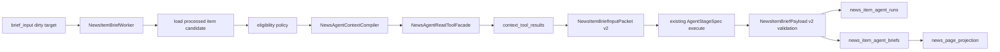

# Spec — News Agent Context Tools Hard Cut

**Status**: Draft  
**Date**: 2026-06-03  
**Owner**: Qinghuan / Codex  
**Base**: local `main` at `a80b705a`  
**Related**:

- `src/parallax/domains/news_intel/ARCHITECTURE.md`
- `docs/superpowers/specs/active/2026-06-01-news-intel-kiss-simplification-cn.md`
- `docs/superpowers/specs/completed/2026-06-03-news-intel-hard-cut-residual-root-fix-cn.md`
- `docs/AGENT_EXECUTION.md`

## Background

News Intel 当前已经完成了必要的链路收敛：News owns configured source ingestion、deterministic entity/token/fact observations、item-scoped agent briefs，以及独立的 News page read model（`src/parallax/domains/news_intel/ARCHITECTURE.md:3`）。News bounded context 明确不拥有 Token Radar、Pulse 或 market facts，News workers 也不能写这些跨域 read models（`src/parallax/domains/news_intel/ARCHITECTURE.md:7`）。当前 truth/read-model 规则也已经明确：`news_item_agent_runs` 是单条新闻 brief attempt 的 append-only audit ledger，`news_item_agent_briefs` 是 current item-scoped brief read model，且 `NewsItemBriefWorker` 是二者唯一 runtime writer（`src/parallax/domains/news_intel/ARCHITECTURE.md:43`）。

最新 stage map 已经把核心链路和可选 agent 链路分开：required core 是 `news_fetch -> news_item_process -> news_page_projection`，optional enhancement 是 `news_item_process -> news_item_brief -> news_page_projection`（`src/parallax/domains/news_intel/ARCHITECTURE.md:53`）。Fetch 只负责 provider facts、normalized news items 和 semantic page/source-refresh work，不再创建 agent brief work；item processing 才负责 processed-state policy 后的 optional item-brief admission（`src/parallax/domains/news_intel/ARCHITECTURE.md:72`）。

当前 News agent 入口是 `NewsItemBriefWorker.run_once()`。它先读取 brief queue depth，再 reserve `news.item_brief` lane，只有 reservation 成功后才 claim dirty targets（`src/parallax/domains/news_intel/runtime/news_item_brief_worker.py:69`）。随后 worker 加载 candidates、执行 processed-state eligibility、构建 packet、检查 current brief freshness、调用 provider，并在验证通过后写 `news_item_agent_runs` 和 `news_item_agent_briefs`（`src/parallax/domains/news_intel/runtime/news_item_brief_worker.py:99`, `src/parallax/domains/news_intel/runtime/news_item_brief_worker.py:141`, `src/parallax/domains/news_intel/runtime/news_item_brief_worker.py:153`, `src/parallax/domains/news_intel/runtime/news_item_brief_worker.py:238`, `src/parallax/domains/news_intel/runtime/news_item_brief_worker.py:271`, `src/parallax/domains/news_intel/runtime/news_item_brief_worker.py:289`）。写 current brief 时会 enqueue page reprojection，但不改其他 read model（`src/parallax/domains/news_intel/runtime/news_item_brief_worker.py:569`）。

当前 agent input 是 bounded packet，而不是可检索上下文。`build_news_item_brief_input_packet()` 只接收 item、token mentions、fact candidates 和 agent config（`src/parallax/domains/news_intel/services/news_item_brief_input.py:28`），packet 只包含 `news_item`、`token_lanes`、`fact_lanes`、`provider_signal_evidence`、`evidence_refs`、constraints、prompt/schema version 和 input hash（`src/parallax/domains/news_intel/types/news_item_brief.py:195`）。packet hash 由 material input payload 生成，排除 `input_hash` 自身（`src/parallax/domains/news_intel/services/news_item_brief_input.py:80`）。测试已经明确 legacy `context_items` 不应进入 packet（`tests/unit/domains/news_intel/test_news_item_brief_input.py:179`）。

当前 prompt 明确要求 agent 不调用工具、不请求外部数据、不使用 packet 外知识（`src/parallax/domains/news_intel/prompts/news_item_brief.md:5`）。这与当前 `AgentStageSpec` 的能力一致：stage spec 只有 lane、stage、instructions、input payload、output type、prompt/schema metadata 和 trace metadata，且 `extra="forbid"`，没有 tools 字段（`src/parallax/platform/agent_execution.py:130`）。News adapter 也只是 build stage 并交给 shared gateway audit/execute（`src/parallax/integrations/model_execution/news_item_brief_agent_client.py:51`, `src/parallax/integrations/model_execution/news_item_brief_agent_client.py:55`）。

Repository 里已经存在可复用的 News-owned evidence surface，但多数没有进入 item brief packet。`load_items_for_brief_targets()` 目前会取 processed item、enabled observation summary、current brief、latest run、token mentions 和 fact candidates（`src/parallax/domains/news_intel/repositories/news_repository.py:2021`, `src/parallax/domains/news_intel/repositories/news_repository.py:2062`, `src/parallax/domains/news_intel/repositories/news_repository.py:2073`, `src/parallax/domains/news_intel/repositories/news_repository.py:2079`）。`get_news_item_detail()` 已经能返回 observation edges 和 provider observations 的 public-safe 版本，并剥离 provider item id、source item key、raw payload 等敏感/内部字段（`src/parallax/domains/news_intel/repositories/news_repository.py:2238`, `src/parallax/domains/news_intel/repositories/news_repository.py:2279`, `tests/integration/domains/news_intel/test_news_repository.py:3517`）。source quality 输入、source status 和 dedup diagnostics 已经存在于 repository 层（`src/parallax/domains/news_intel/repositories/news_repository.py:2328`, `src/parallax/domains/news_intel/repositories/news_repository.py:2558`, `src/parallax/domains/news_intel/repositories/news_repository.py:2671`）。

## Problem

当前 News agent 能把单条 provider high-score 新闻转成结构化中文 brief，但它看不到足够的 News-owned context：它不知道这条新闻是首次出现、重复观测、多源确认还是旧消息回流；它不能稳定利用 source quality、dedup/observation history、相似新闻、旧 brief/run history；也不能查询项目自己的 News 数据库来验证“数据库中是否已有同类型新闻”。结果是 agent 的判断仍停留在单条 item + token/fact packet 上，缺少符合 trader/operator 工作流的 novelty、confirmation、source consensus 和历史对照能力。

这个问题不应该通过改 shared application workflow kernel 解决。当前 `AgentStageSpec` 没有 tool contract，强行做 gateway-level tool-calling 会变成全局 agent runtime 改造。正确方向是在 News agent 自己的 adapter/worker 边界内 hard-cut 出一个 read-only、bounded、DB-backed context tool facade，把工具结果作为 material input snapshot 喂给现有 typed stage。

## First Principles

1. PostgreSQL material facts and current read models remain product truth. Agent trace、tool result、prompt summary 和 model output 都不能替代 `news_items`、`news_item_observation_edges`、`news_token_mentions`、`news_fact_candidates`、`news_item_agent_runs`、`news_item_agent_briefs` 或 `news_page_rows` 的既有 ownership（`src/parallax/domains/news_intel/ARCHITECTURE.md:13`）。
2. News agent enhancement must stay inside the News agent boundary. News domain code delegates model execution to `AgentExecutionGateway` but owns validation and persistence（`src/parallax/domains/news_intel/ARCHITECTURE.md:108`）。This work must not add shared gateway tools, new global runtime hooks, or cross-domain write paths.
3. Context is a turn snapshot. Every DB-backed context result included in the agent run must be bounded, deterministic, hashed, and included in the material input hash so freshness/replay semantics remain content-stable（`src/parallax/domains/news_intel/services/news_item_brief_input.py:77`, `src/parallax/platform/agent_execution.py:145`）。
4. Tool wrappers are a safety boundary, not model freedom. The model must never receive raw SQL, raw provider payloads, raw HTTP/WS provider access, ORM sessions, credentials, or unbounded result sets.
5. Hard cut, no compatibility code. The new News item brief packet/schema/prompt replaces the old packet shape. Implementation must not keep v1/v2 dual parsing, legacy `context_items` restoration, feature flags for old behavior, or fallback prompts.

## Goals

- G1. Item brief input becomes a News-owned context snapshot containing the base item packet plus bounded DB-backed retrieval context for observation history, source quality, similar/repeat news, and brief/run history.
- G2. All retrieval context is produced by typed read-only domain tools with explicit input schema, source table list, query version, row limit, truncation flag, and `result_hash`.
- G3. The model output can express novelty and confirmation, not only direction and market read. New output semantics must cover `novelty_status`, `confirmation_state`, `source_consensus_zh`, and `retrieval_notes_zh`.
- G4. No shared `AgentExecutionGateway`, `AgentStageSpec`, lane accounting, or application workflow kernel changes are required.
- G5. No News provider IO, external HTTP call, raw SQL tool, mutation tool, or cross-domain market/Token Radar repository is exposed to the News agent in P0/P1.
- G6. Old current briefs from previous schema/prompt are not served through compatibility branches. They are either naturally stale through version bump plus dirty work, or explicitly cleared/reprojected by the implementation plan.
- G7. `news_item_agent_runs` remains the audit ledger and `news_item_agent_briefs` remains the current read model. Tool results are run input evidence, not a new business fact table.
- G8. Architecture tests continue to enforce that `news_intel` does not reference Token Radar, Pulse, or market tick tables（`tests/architecture/test_news_intel_boundaries.py:11`, `tests/architecture/test_news_intel_boundaries.py:18`）。

## Non-goals

- N1. This spec does not implement gateway-level dynamic tool-calling or add a `tools` field to `AgentStageSpec`.
- N2. This spec does not give the model arbitrary SQL, provider clients, network access, write access, or retryable side-effect tools.
- N3. This spec does not restore `news_context_items`, `context_items`, replies, comments, social threads, or any half-connected legacy context path.
- N4. This spec does not reintroduce `news_story_groups`, `news_story_members`, or a story projection worker.
- N5. This spec does not add market price, Token Radar, Pulse, macro, or cross-domain trading context to the News domain. Those require a later adapter-level spec if still needed.
- N6. This spec does not redesign `/api/news` or the React News page beyond exposing compact new brief fields already carried by the current brief read model.
- N7. This spec does not preserve old item brief schema output as a serving fallback.

## Target Architecture

After this change, `news_item_brief` remains one worker and one typed model stage, but its input builder becomes a small News agent harness:

```text
item brief dirty target
  -> reserve news.item_brief
  -> claim processed item target
  -> load base candidate facts
  -> evaluate item brief eligibility
  -> compile News agent context snapshot
  -> build NewsItemBriefInputPacket v2
  -> skip fresh current brief by v2 input hash/artifact/prompt/schema/validator
  -> execute existing typed AgentStageSpec
  -> validate NewsItemBriefPayload v2
  -> append news_item_agent_runs
  -> upsert news_item_agent_briefs
  -> page dirty
```

### NewsAgentContextCompiler

`NewsAgentContextCompiler` is the deterministic pre-model compiler for a single `news_item_id`. It receives the already-loaded candidate and uses News repository read methods to fetch bounded context. It does not own persistence and does not call the model. It returns:

- base item/token/fact/provider packet material;
- ordered `context_tool_results`;
- `context_budget` metadata;
- `context_snapshot_hash`;
- exclusion reasons when a tool has no rows, is skipped by policy, or truncates output.

The compiler is part of News item brief input construction. It must run after item eligibility passes and before current brief freshness check, because `context_snapshot_hash` changes the packet `input_hash`.

### NewsAgentReadToolFacade

`NewsAgentReadToolFacade` wraps repository reads as typed read-only tools. These tools are not exposed to `AgentStageSpec` as runtime tools; they are deterministic context fetches whose results enter the packet. Every tool returns an envelope:

```text
tool_name
schema_version
query_version
input
source_tables
limit
rows
truncated
result_hash
generated_at_ms
```

Tool envelopes are sorted by `tool_name` and `query_version` before hashing. Row ordering must be deterministic. Empty results are explicit rows or empty arrays, not omitted fields.

### Required P0 Tools

1. `get_news_observation_history`

   Purpose: answer whether the item is single-source, multi-source, repeated, or dedup-collapsed. Output includes enabled source count, duplicate count, source roles/trust tiers, provider payload status, published/observed time bounds, match/dedup confidence where available, and public URLs. It must use public-safe observation data like the detail query already exposes（`src/parallax/domains/news_intel/repositories/news_repository.py:2238`）。

2. `get_source_quality_context`

   Purpose: let the agent distinguish authority/specialist/aggregator quality and fetch/processing health. Output includes current compact `source_quality_status`, latest quality row summary, recent fetch outcome, and source classification. It may reuse `list_source_status()` and source-quality rows（`src/parallax/domains/news_intel/repositories/news_repository.py:2558`）。

3. `get_existing_brief_history`

   Purpose: prevent repeated failures and make current/previous audit state visible. Output includes current brief compact metadata and latest N run summaries: status, outcome, input/output hash, prompt/schema/artifact versions, error class, latency, and usage summary. It must not return full old `request_json` or full old `response_json` by default.

4. `find_similar_news_items`

   Purpose: answer the user's core need: the DB may already have同类型新闻. Output includes up to 8 similar items from News-owned facts/read models with match reason and confidence hint. Matching may use canonical URL/key, provider article keys, content hash, title fingerprint, source-domain/title overlap, token overlap, and recent page rows. It must not use removed story tables.

### P1 Tools

1. `get_token_mentions_context`

   Purpose: expose all mention resolution states and ambiguity reasons in a compact tool result when the main packet truncates or when output validation needs stronger asset provenance.

2. `get_fact_candidates_context`

   Purpose: expose accepted/attention/rejected fact candidates with evidence quotes and rejection reasons when a single item has many facts or the model needs to understand deterministic validation boundaries.

3. `get_related_provider_signal_context`

   Purpose: compare current provider-native signal with recent provider high-score items in the same source/domain/token neighborhood. This is still News-owned because it reads `news_items.provider_signal_json` and `news_page_rows`, not external provider APIs.

### Prompt And Output Schema

The prompt must be hard-cut to the new contract:

- remove the statement that the agent does not use tools or packet-external context;
- replace it with: the agent may use only the packet and `context_tool_results`;
- explain that tool results are source-backed DB observations, not final truth;
- require explicit uncertainty when similar news is heuristic rather than exact identity;
- prohibit trading instructions as today.

`NewsItemBriefPayload` becomes v2 and adds:

- `novelty_status`: `new`, `repeat`, `update`, `duplicate`, `unclear`;
- `confirmation_state`: `single_source`, `multi_source_confirmed`, `provider_only`, `conflicting`, `unclear`;
- `source_consensus_zh`: concise Chinese statement about source quality and confirmation;
- `retrieval_notes_zh`: concise Chinese statement about similar/prior context used;
- `retrieval_evidence_refs`: bounded refs such as `tool:get_news_observation_history`, `similar:item:<news_item_id>`, `source_quality:<source_id>`, `brief_history:<run_id>`.

The old v1 output shape is not supported as a serving fallback. The implementation must bump `NEWS_ITEM_BRIEF_PROMPT_VERSION`, `NEWS_ITEM_BRIEF_SCHEMA_VERSION`, `NEWS_ITEM_BRIEF_VALIDATOR_VERSION`, and `NEWS_ITEM_BRIEF_GUARDRAIL_VERSION` together（`src/parallax/domains/news_intel/_constants.py:5`）。

### Audit And Freshness

No new ledger table is introduced. Tool envelopes are part of run input evidence:

- `request_json` stores the material packet plus compact tool envelope metadata.
- `input_hash` includes every tool result hash.
- `trace_metadata_json` may include `context_snapshot_hash`, tool names, tool result hashes, truncation flags, and query versions.
- `news_item_agent_runs` remains append-only audit（`src/parallax/domains/news_intel/repositories/news_repository.py:1368`）。
- `news_item_agent_briefs` remains current serving state（`src/parallax/domains/news_intel/repositories/news_repository.py:1397`）。

Old current briefs with previous schema/prompt are not upgraded in place. The implementation plan must choose a hard-cut cleanup path: either clear old `news_item_agent_briefs` and reproject affected page rows to pending, or enqueue rebrief work for eligible rows and prevent old schema rows from being treated as fresh. No compatibility reader may translate v1 rows into v2 output.

## Conceptual Data Flow



The only new arrows are compiler-to-read-tool and tool-result-to-packet. There is no model-to-tool loop in P0/P1, no provider network arrow, and no new writer.

## Core Models

### NewsItemBriefInputPacket v2

Semantic fields:

- `news_item`: current bounded item material.
- `token_lanes`: deterministic token mentions.
- `fact_lanes`: deterministic fact candidates.
- `provider_signal_evidence`: compact provider-native signal.
- `context_tool_results`: ordered list of read-only tool envelopes.
- `context_snapshot_hash`: hash of all tool envelopes.
- `evidence_refs`: stable refs from item/token/fact/provider/tool rows.
- `constraints`: source text is data, tool results are bounded observations, no trading instructions.
- `prompt_version`, `schema_version`, `input_hash`.

### NewsContextToolResult

Semantic fields:

- identity: `tool_name`, `schema_version`, `query_version`;
- provenance: `source_tables`, `generated_at_ms`;
- input: normalized input and limits;
- output: rows plus `truncated`;
- audit: `result_hash`, exclusion reason when skipped.

Tool result rows are evidence, not truth tables.

### SimilarNewsItem

Semantic fields:

- `news_item_id`, title/headline, source domain/name/role/trust tier;
- published/fetched timestamps;
- provider score/direction where present;
- current agent status and compact decision where present;
- match reason: `same_canonical_url`, `same_provider_article_key`, `same_content_hash`, `same_title_fingerprint`, `token_overlap`, `source_title_overlap`;
- `match_confidence`: `exact`, `strong`, `heuristic`;
- `evidence_ref`.

### ObservationHistory

Semantic fields:

- enabled/disabled source counts;
- duplicate/source/provider article counts;
- first/last observed and published timestamps;
- source roles and trust tiers;
- public URLs;
- provider payload status;
- evidence refs.

### SourceQualityContext

Semantic fields:

- source id/domain/name/role/trust tier;
- current `source_quality_status`;
- latest quality window and quality score;
- fetch success, duplicate rate, process success, resolved token rate, accepted/attention fact rates;
- latest fetch run compact status;
- evidence refs.

### BriefHistoryContext

Semantic fields:

- current brief status and version metadata;
- latest N run summaries;
- error class/status/outcome;
- input/output hash and execution trace id;
- usage/latency summary;
- evidence refs.

## Interface Contracts

### Public HTTP / WebSocket / CLI

No new public route is required.

Existing `/api/news` and item detail surfaces continue to read projected rows/detail data. After v2 briefs are written, compact new v2 fields may appear inside the existing agent brief envelope. Public surfaces must not execute tools, run agents, fetch providers, repair data, or expose raw tool internals.

### Agent Input Contract

The News item brief stage still receives one `input_payload` through `AgentStageSpec`. The payload is now packet v2 and includes precomputed `context_tool_results`. Because `AgentStageSpec` forbids extra fields and has no runtime tool list, this is the only allowed P0/P1 agent input mechanism（`src/parallax/platform/agent_execution.py:130`）。

### Agent Output Contract

The output remains one strict JSON object, now matching `NewsItemBriefPayload` v2. The validator must reject schema drift and unexpected runtime action traces just as current validation rejects non-empty tool/action audit keys（`src/parallax/domains/news_intel/services/news_item_brief_validation.py:16`, `src/parallax/domains/news_intel/services/news_item_brief_validation.py:29`）。

### Repository Contract

Repository methods used by tools are read-only, bounded, and deterministic. They may be new methods in `NewsRepository` or narrow wrappers over existing methods, but they must not:

- call providers;
- mutate dirty targets or read models;
- return raw payload JSON, credentials, sync cursors, provider item ids, source item keys, or feed URLs;
- reference `news_story_*`, Token Radar, Pulse, or market tick tables.

## Acceptance Criteria

- AC1. WHEN `news_item_brief` processes an eligible target THEN it SHALL build a packet v2 containing `context_tool_results` for observation history, source quality context, similar news, and brief history before calling the model.
- AC2. WHEN a context tool runs THEN it SHALL return a bounded envelope containing `tool_name`, `schema_version`, `query_version`, normalized input, `source_tables`, `limit`, `rows`, `truncated`, `generated_at_ms`, and `result_hash`.
- AC3. WHEN tool results differ THEN packet `input_hash` SHALL differ, so current brief freshness cannot skip changed context.
- AC4. WHEN tool results are empty THEN the packet SHALL include an explicit empty/skipped result with an exclusion reason rather than silently omitting that context class.
- AC5. WHEN the prompt is updated THEN it SHALL no longer say the agent cannot use tools or packet-external context; it SHALL say the agent may use only packet fields and precomputed `context_tool_results`.
- AC6. WHEN output schema is updated THEN the system SHALL bump prompt, schema, validator, and guardrail versions together.
- AC7. WHEN old v1 current briefs exist THEN the system SHALL NOT translate them through compatibility code; they SHALL be cleared, marked stale by version mismatch, or replaced by v2 rebrief output through a hard-cut cleanup/rebuild path.
- AC8. WHEN item detail or page projection reads an old v1 brief during the transition THEN it SHALL not fabricate v2 fields; the serving state must be pending/stale until v2 output exists.
- AC9. WHEN `find_similar_news_items` runs THEN it SHALL use only current News-owned tables/read models and SHALL NOT reference `news_story_groups`, `news_story_members`, or removed context tables.
- AC10. WHEN `find_similar_news_items` returns heuristic matches THEN rows SHALL label match reason and confidence so the model cannot treat heuristic similarity as canonical truth.
- AC11. WHEN observation history or provider observations enter a tool result THEN provider item ids, source item keys, raw payload JSON, feed URLs, sync cursors, and credentials SHALL be absent.
- AC12. WHEN source quality context enters the packet THEN it SHALL use existing source/source-quality data and SHALL NOT make source quality a hot-path writer or item admission dependency.
- AC13. WHEN model output names affected assets THEN validation SHALL continue dropping unsupported assets not grounded in item text, token lanes, fact lanes, or tool evidence.
- AC14. WHEN the agent run is inserted THEN `news_item_agent_runs.request_json` and/or `trace_metadata_json` SHALL include enough compact tool metadata and hashes to explain the input without adding a new ledger table.
- AC15. WHEN provider capacity is denied before claim THEN behavior SHALL remain no claim and no ledger write, preserving current backpressure semantics（`tests/unit/domains/news_intel/test_news_item_brief_worker.py:229`）。
- AC16. WHEN provider execution happens THEN the worker SHALL NOT hold a DB session through model execution, preserving the current no-DB-session-during-execution behavior（`tests/unit/domains/news_intel/test_news_item_brief_worker.py:52`）。
- AC17. WHEN architecture tests scan News Intel THEN they SHALL still pass forbidden cross-domain import/table rules.
- AC18. WHEN implementation is complete THEN there SHALL be no legacy `context_items` packet path, v1/v2 dual parser, compatibility feature flag, old prompt fallback, or restored story/context table reference.

## Risks

| Risk | Severity | Mitigation |
|------|----------|------------|
| Tool context makes packets too large. | High | Hard limits per tool, deterministic truncation, compact rows, and context budget metadata. |
| Similar-news heuristics create false confirmation. | High | Every match carries reason/confidence; prompt and schema distinguish exact/strong/heuristic matches. |
| Old briefs remain visible after schema hard cut. | Medium | Plan must clear/reproject old current briefs or force stale-by-version before serving v2 fields. |
| Tool reads slow down brief worker. | Medium | Use bounded SELECTs, small limits, deterministic indexes already used by page/source queries, and per-tool query budgets. |
| Source quality over-influences market judgment. | Medium | Source quality is context and uncertainty, not admission or ranking truth. |
| Tool result audit becomes a shadow fact table. | Medium | Store compact envelopes in run audit only; no new persistent business table. |
| Implementation accidentally changes shared agent runtime. | High | Acceptance criteria forbid `AgentStageSpec`/gateway tool changes in P0/P1. |
| Cross-domain context is tempting for market reads. | Medium | Keep Token Radar/market context out of News domain; reserve adapter-level P2 spec. |

## Evolution Path

1. P0: deterministic News context compiler with observation history, source quality context, similar news, and brief history precomputed before the model call.
2. P1: add token/fact detail tools and related provider-signal context if P0 output still shows asset grounding or novelty gaps.
3. P2: consider a News adapter-level two-pass tool-intent flow only if deterministic P0/P1 context is insufficient. This still must not change shared gateway tools unless a separate application-kernel spec is approved.
4. P3: consider cross-domain market/radar context through an integration-layer facade, not through `news_intel` imports, only after News-owned context improves brief quality.

## Alternatives Considered

- Add gateway-level tool-calling now — rejected because `AgentStageSpec` has no tools field and `extra="forbid"`; this would be a shared workflow kernel change, not a News agent optimization.
- Give the model arbitrary SQL over Parallax DB — rejected because it violates tool-wrapper safety, query budget, provenance, and Kappa/CQRS boundaries.
- Restore `context_items` — rejected because latest hard-cut tests explicitly keep legacy context items out of the packet, and the current schema cleanup removed `news_context_items` as an active surface.
- Reintroduce story projection tables for similar news — rejected because story projection was hard-cut; similar news can be a bounded read-only heuristic over current News facts/read models.
- Add a new `news_agent_tool_runs` table — rejected because tool results are run input evidence, not business truth. Existing `news_item_agent_runs` can audit compact tool metadata and hashes.
- Keep v1 and v2 brief schemas side by side — rejected because the user explicitly requested no compatibility code and because old-current serving fallback would hide whether v2 context actually improved the agent.

## Boundaries

| Class | Behaviour |
|-------|-----------|
| Always | Build packet v2 from current News facts plus bounded read-only context tool envelopes; hash tool results into input identity; write only existing run/current brief outputs; keep model execution through the current gateway. |
| Ask first | Add cross-domain market/Token Radar context; add true runtime model-to-tool loops; add public API fields outside the current brief envelope; delete historical run ledger rows. |
| Never | Keep v1/v2 compatibility code; expose arbitrary SQL/provider/network tools; restore `context_items` or `news_story_*`; mutate read models from tools; import Token Radar/Pulse/market repositories into `news_intel`. |
