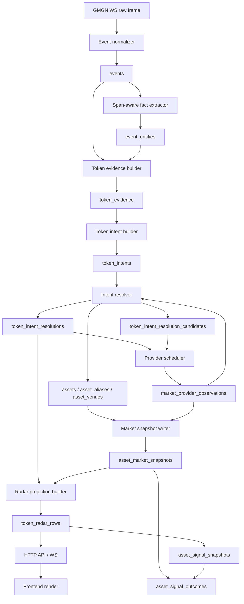

# Token Radar V3: Intent-First Identity, Market, And Scoring Production Spec

Date: 2026-05-07

Status: hard-cut production spec

Supersedes:

- `docs/2026-05-06-token-identity-resolution-production-spec-cn.md`
- earlier draft of `docs/2026-05-07-token-radar-identity-market-v3-production-spec-cn.md`

Companion audit:

- `docs/2026-05-07-token-radar-v3-code-review-cn.md`

## Executive Summary

Token Radar 当前失败不是 `$VERSA` 单点没解析，而是系统没有稳定的领域主语。现在 runtime 里同时有四个主语：

- `asset_mentions`: 文本里出现的 mention；
- `asset_attributions`: mention 级解析结果；
- `token_id`: 旧 token market/signal 闭环；
- frontend `TokenFlowItem`: UI 重新合成的 scoring 对象。

这四个主语会互相覆盖，导致：

- `$VERSA + 0x2cc0...` 被拆成 ambiguous symbol 和 resolved CA；
- market unavailable 不能区分身份未解析、无 venue、provider 未配置、provider 查无结果、价格刷新中；
- unresolved/ambiguous attention row 被前端重算成 `driver`；
- projection 表存在但 API 仍 request-time group raw attributions；
- 价格与 outcome settlement 仍可能落在旧 `token_market_snapshots`。

V3 采用硬切方案：

```text
raw GMGN frame
-> normalized event
-> span-aware immutable text facts
-> token evidence
-> event token intent
-> intent resolution
-> asset registry + venue
-> provider market observation
-> venue market snapshot
-> materialized token radar row
-> backend-owned score and decision
-> frontend render
-> asset/venue outcome settlement
```

V3 的核心原则是：**event token intent 是 Radar 的唯一业务主语**。Mention 只是 evidence，asset registry 只保存真实资产，market 只绑定 venue，UI 只展示后端决策。

## Review Findings To Hard Requirements

| Review finding | V3 hard requirement |
| --- | --- |
| Entity facts drop span context | `event_entities` 或 `token_evidence` 必须保存 `span_start/span_end/text_surface/sentence_id/local_group_key`。 |
| Ingest materializes mention-level attributions | ingest runtime 必须写 `token_evidence/token_intents/token_intent_resolutions`；`asset_mentions/asset_attributions` 不能作为 Radar source。 |
| CA without chain skips local exact venue lookup | resolver 对无链 CA 必须先查本地 exact CA venue，只有没有命中才 queue provider。 |
| Provider backfill reassigns mention classes | provider job 必须写 observation/candidates，然后重算 intent resolution，不能只重写 symbol/CA attribution。 |
| Radar groups raw attributions by asset_id | Radar 必须读 materialized `token_radar_rows`，projection builder 做 event-intent dedupe。 |
| Missing market states collapse to provider_not_found | market status 必须区分 `no_venue/provider_not_configured/provider_not_found/provider_error/rate_limited/pending_refresh/ready/stale/insufficient_history`。 |
| Frontend overrides backend decision | backend 是 score/decision 唯一 owner；frontend 不计算 opportunity 和 decision。 |
| Projection tables exist without real read path | V3 必须实现真实 projection writer + read API；未闭环的 v1 projection 表不得继续作为生产承诺。 |
| Old token repositories remain wired into runtime | 旧 `TokenRepository/TokenSignalRepository/token_market_*` 只允许 migration/debug，不允许服务 V3 live Radar/outcome。 |

这些要求是 exit gate，不是优化项。

## Non-Goals

V3 不做这些事：

- 不用 LLM 解析 hot path token identity。
- 不自研市场数据基础设施；provider 通过 adapter 接入。
- 不在 HTTP request path 调 provider。
- 不继续扩展 `asset_flow-v1`。
- 不让 frontend 维护另一套交易决策。
- 不要求 symbol-only 一定解析成唯一资产；宁可 ambiguous，也不强选。

## First Principles

Token Radar 的任务不是“看到一个 symbol 就找价格”，而是把社交事件解释成可审计的交易注意力对象。

系统必须逐层回答：

1. **Fact:** 文本和 payload 里出现了什么事实？
2. **Evidence:** 哪些事实可能指向 token？
3. **Intent:** 作者在这个事件中表达了几个 token intent？
4. **Identity:** 每个 intent 能否确定到真实 asset？
5. **Venue:** 真实 asset 是否有可交易 venue？
6. **Market:** venue 是否有可用价格、流动性、市值、成交量或 OI？
7. **Radar:** 这个 intent 在窗口内热度、质量、扩散、可交易性、时机如何？
8. **Decision:** 后端给出的动作是什么？
9. **Outcome:** 后续市场结果是否验证当时决策？

每一层只依赖上一层的稳定输出，不能跨层偷数据。

## Target Architecture



## Bounded Contexts

### Evidence Context

Owns:

- raw frames;
- normalized events;
- immutable text facts;
- token evidence rows.

Does not own:

- identity selection;
- provider calls;
- scoring;
- market status.

### Intent Context

Owns:

- deterministic event-level token intent construction;
- evidence grouping;
- display evidence selection.

Does not own:

- final asset registry persistence;
- provider HTTP details;
- Radar ranking.

### Asset Registry Context

Owns:

- real assets;
- aliases;
- venues.

Does not own:

- unresolved or ambiguous intent as fake assets;
- mention rows;
- social windows;
- frontend display scoring.

### Resolution Context

Owns:

- intent-to-asset decision;
- candidate audit;
- provider scheduling;
- identity status.

Does not own:

- provider adapter internals;
- market snapshot freshness policy;
- UI decision.

### Market Context

Owns:

- provider observations;
- venue market snapshots;
- market availability status;
- CEX/DEX field semantics.

Does not own:

- social heat;
- identity construction;
- Radar decision.

### Radar Context

Owns:

- materialized token radar rows;
- score ledger;
- decision;
- data health.

Does not own:

- raw entity extraction;
- provider HTTP;
- frontend-derived scores.

### Outcome Context

Owns:

- frozen signal snapshots;
- entry/exit market selection;
- outcome settlement;
- score version evaluation.

Does not own:

- old token-only settlement.

## Data Model

### `events`

Keep existing `events` table as the immutable normalized social event layer.

Requirements:

- `event_id` remains replay key.
- `search_text` includes primary text plus reference text.
- `coverage=public_stream` remains explicit in public outputs.
- Updating resolver policy never mutates `events`.

### `event_entities`

Existing entity facts must be upgraded or mirrored into a span-aware shape.

Required fields:

```text
entity_id
event_id
entity_type              ca | symbol | hashtag | mention | url | domain | chain_hint | provider_url
raw_value
normalized_value
chain
token_resolution_status
confidence
source
text_surface             primary | reference | bio | payload
span_start
span_end
sentence_id
local_group_key
created_at_ms
```

Rules:

- Entity facts do not select assets.
- `span_start/span_end` are offsets within `text_surface`.
- `local_group_key` identifies a deterministic local clause/sentence group.
- CA chain hints can be inferred, but unknown EVM remains `evm_unknown`.
- Cashtag extraction must use iterator matches, not `findall()`, so span is preserved.

### `token_evidence`

New table. One row is one token-relevant evidence item.

```text
evidence_id              primary key
event_id                 references events
source_kind              entity | gmgn_payload | provider_url | social_extraction | operator_seed
source_id                event_entities.entity_id or stable payload id
evidence_type            ca | cashtag | gmgn_token_payload | provider_url | plain_symbol | project_name
raw_value
normalized_symbol
chain_hint
address_hint
provider
provider_ref
text_surface             primary | reference | bio | payload
span_start
span_end
sentence_id
local_group_key
strength                 strong | medium | weak
confidence
created_at_ms
```

Strength rules:

- `strong`: exact CA, GMGN payload with chain/address, provider URL with exact contract.
- `medium`: cashtag, chain-specific token URL, provider candidate URL without exact contract.
- `weak`: plain symbol/project name from watched-account extraction.

### `token_intents`

New table. One row is one possible token/project/market object expressed by one event.

```text
intent_id                primary key
event_id                 references events
intent_key               stable hash from event_id + evidence cluster
construction_policy      token_intent_builder_v1
primary_evidence_id      strongest identity evidence
display_symbol
display_name
chain_hint
address_hint
intent_status            pending | resolving | resolved | unresolved | ambiguous | rejected
intent_confidence
created_at_ms
updated_at_ms
```

Relation table:

```text
token_intent_evidence(
  intent_id,
  evidence_id,
  role                  primary_identity | display_alias | chain_hint | context | rejected_context
)
```

Rules:

- One event can have multiple intents.
- One intent can have multiple evidence rows.
- One event contributes at most once to one intent in Radar.
- Display evidence does not select identity.

### Asset Registry Tables

Keep and tighten:

- `assets`
- `asset_aliases`
- `asset_venues`

Changes:

- `assets` only stores real resolved assets.
- Unresolved/ambiguous are resolution states, not fake assets.
- `asset_id` stays provider-neutral.
- `canonical_symbol` must not be a contract address when a provider or evidence symbol exists.
- `asset_aliases` stores symbol/name/CA/provider slug but never selects identity alone.
- `asset_venues` is the only table that defines tradability.

Asset types:

```text
dex_asset
cex_asset
index_asset          future
```

Venue types:

```text
dex
cex_spot
cex_swap
```

### `token_intent_resolutions`

New table. This replaces Radar runtime use of `asset_attributions`.

```text
resolution_id
intent_id                 references token_intents
event_id                  references events
asset_id                  nullable references assets
primary_venue_id          nullable references asset_venues
resolution_status         direct | selected | unresolved | ambiguous | rejected | superseded
identity_status           resolved | unresolved | ambiguous | rejected
confidence
resolver_policy_version
reasons_json
risks_json
decision_time_ms
created_at_ms
```

Rules:

- Exactly one active resolution per intent.
- Superseded resolutions remain for audit.
- `unresolved/ambiguous/rejected` rows may have no `asset_id`.
- Radar reads only active resolution rows.

### `token_intent_resolution_candidates`

New audit table.

```text
candidate_id
intent_id
asset_id
venue_id
provider
candidate_kind           local_ca | local_alias | gmgn_payload | okx_cex | okx_dex | manual | secondary_dex
score
decision                 selected | rejected | retained_ambiguous
reasons_json
risks_json
raw_observation_id
created_at_ms
```

Rules:

- Candidate rows are keyed by intent, not mention.
- Provider backfill writes candidates then re-runs resolver.
- Selection thresholds are policy-owned and versioned.

### `market_provider_observations`

New table. Every provider call outcome is persisted.

```text
observation_id
provider
request_kind             cex_ticker | dex_contract_search | dex_symbol_search | dex_price | gmgn_payload | gmgn_token_info
request_key
chain_hint
address_hint
symbol_hint
status                   ready | not_configured | not_found | provider_error | rate_limited
raw_payload_hash
raw_payload_json
error_code
error_message
observed_at_ms
created_at_ms
```

Rules:

- No provider call disappears.
- `not_configured` is recorded without pretending a provider query happened.
- `not_found` only means a configured provider was queried and returned no candidate/data.
- `provider_error/rate_limited` must be visible in ops health.

### `asset_market_snapshots`

Keep table, strengthen semantics.

Requirements:

- Snapshot is venue-specific.
- DEX fields: `price_usd`, `market_cap_usd`, `liquidity_usd`, `holders`, pool metadata when available.
- CEX spot fields: `price_usd`, `volume_24h_usd`.
- CEX swap fields: `price_usd`, `volume_24h_usd`, `open_interest_usd`, funding later.
- CEX rows are not penalized for missing DEX-only fields.

### `token_radar_rows`

New materialized read model. API reads this table.

```text
row_id
projection_version
window
scope
computed_at_ms
source_max_received_at_ms
lane                      resolved | attention
rank
intent_id
event_id
asset_id
primary_venue_id
identity_json
evidence_json
attention_json
resolution_json
market_json
score_json
decision                  driver | watch | investigate | discard
data_health_json
source_event_ids_json
created_at_ms
```

Rules:

- HTTP does not compute Radar rows on request.
- Projection builder owns score and decision.
- One event-intent contributes once per window.
- Unresolved/ambiguous rows can appear in attention lane, never as `driver`.

### `asset_signal_snapshots` And `asset_signal_outcomes`

New outcome tables replacing live use of `token_signal_snapshots`.

`asset_signal_snapshots` stores the frozen Radar decision:

```text
snapshot_id
row_id
intent_id
asset_id
primary_venue_id
decision_time_ms
score_version
score_json
market_json
identity_json
window
scope
created_at_ms
```

`asset_signal_outcomes` stores settled result:

```text
outcome_id
snapshot_id
horizon
status
entry_snapshot_id
exit_snapshot_id
entry_price
exit_price
actual_return
benchmark_return
abnormal_return
realized_vol
normalized_outcome
market_coverage_status
settled_at_ms
```

## Intent Builder Policy

The intent builder is deterministic and has no provider dependency.

Inputs:

- `events`
- span-aware `event_entities`
- `token_evidence`
- GMGN token payload evidence
- optional weak watched-account social extraction output

### Locality Rules

Local grouping order:

1. Same `local_group_key`.
2. Same `sentence_id`.
3. Within 80 characters on the same `text_surface`.
4. Same exact CA across primary/reference text.
5. Same exact cashtag across primary/reference text when quote/repost semantics indicate propagation.

Never merge only because evidence shares `event_id`.

### Evidence Clustering Rules

1. **GMGN payload with chain/address**
   - Creates one intent.
   - Payload chain/address is primary identity evidence.
   - Payload symbol is display alias evidence.

2. **CA only**
   - Creates one intent per CA.
   - Nearby single cashtag attaches as display evidence.
   - No nearby symbol means display label can be short address until provider/local alias exists.

3. **Cashtag only**
   - Creates one symbol-only intent.
   - Resolver may select CEX, select DEX, mark ambiguous, or mark unresolved.

4. **Cashtag + CA in same local group**
   - Creates one intent.
   - CA is primary identity evidence.
   - Cashtag is display alias evidence.
   - This is the `$VERSA 0x2cc0...` case.

5. **Multiple cashtags + one CA**
   - If only one cashtag matches resolved/local/provider symbol for CA, attach it.
   - Otherwise create CA intent and separate symbol intents.

6. **One cashtag + multiple CAs**
   - Do not guess.
   - Pair only when span/local group gives deterministic one-to-one relation.
   - Otherwise create separate intents.

7. **Plain symbol/project name**
   - Does not create intent by default.
   - May create weak evidence only from watched-account extraction or explicit provider URL.

8. **Provider URL**
   - Exact contract URL is strong evidence.
   - Symbol-only provider URL is medium evidence.

## Resolver Policy V3

Resolver input is one token intent.

### Decision Priority

```text
1. GMGN payload chain/address
2. Exact CA with chain hint
3. Exact CA without chain hint, local exact CA lookup
4. Exact CA without chain hint, provider exact contract search
5. Symbol with one high-confidence local CEX asset and no conflicting DEX evidence
6. Symbol with one high-confidence local DEX asset and no conflicting CEX evidence
7. Provider candidates with deterministic score margin
8. Ambiguous
9. Unresolved
10. Rejected
```

### Exact CA Without Chain

Required algorithm:

```text
candidates = asset_venues where venue_type starts with dex and lower(address)=lower(address_hint)
if one active candidate:
  select candidate
elif multiple active candidates:
  ambiguous with candidates
else:
  queue provider exact contract search across chain allowlist
```

This must happen before unresolved is returned.

### Symbol Resolution

Symbol-only selection is conservative.

Candidate scoring:

```text
+35 exact symbol alias match
+25 exact CA match
+15 chain hint match
+10 provider/source strength
+10 liquidity/volume sanity
+5 holder/community sanity
-30 symbol mismatch
-20 thin market
-20 unknown chain
-25 conflicting CEX/DEX identity
```

Selection:

```text
selected if top_score >= 70 and top_score - second_score >= 15
ambiguous if candidates exist but selection margin is insufficient
unresolved if no candidates and no provider observations
```

### Output Contract

Each resolver run writes:

- active `token_intent_resolutions` row;
- zero or more `token_intent_resolution_candidates`;
- explicit reasons;
- explicit risks;
- resolver policy version;
- next provider job when needed.

## Provider Strategy

V3 reuses mature provider APIs. We do not rebuild market infrastructure.

### OKX CEX

Use for:

- CEX spot/swap universe sync;
- ticker price;
- volume;
- open interest for swaps.

Rules:

- Adapter remains isolated in `market/okx_cex_client.py`.
- Sync writes CEX venues and snapshots.
- CEX venue identity is `exchange + inst_type + inst_id`.

### OKX DEX

Use for:

- exact contract search;
- symbol candidate search;
- DEX price refresh.

Rules:

- Adapter remains isolated in `market/okx_dex_client.py`.
- Provider calls run only in worker/jobs.
- Missing credentials produce `not_configured`, not `not_found`.
- Results write provider observations and candidates before resolver re-runs.

### GMGN Payload

Use for:

- low-latency strong evidence;
- initial market snapshot when payload carries price/market cap.

Rules:

- GMGN payload is evidence, not a parallel identity path.
- Payload snapshot writes venue-specific `asset_market_snapshots` after intent resolves.

### Secondary DEX Providers

V3 can add DexScreener/GeckoTerminal style adapters later behind this interface:

```text
search_by_contract(chain_hint, address) -> provider candidates
search_by_symbol(symbol) -> provider candidates
market_for_venue(chain, address) -> market snapshot
provider_status() -> configured | running | error | rate_limited
```

No provider-specific logic enters resolver beyond normalized candidates.

## Market Semantics

Market status answers why a Radar row does or does not have price.

Allowed `market_observation_status`:

```text
ready
stale
no_venue
provider_not_configured
provider_not_found
provider_error
rate_limited
pending_refresh
insufficient_history
```

Mapping:

- `no_venue`: identity unresolved/ambiguous/rejected or no active venue.
- `provider_not_configured`: required provider credentials/config absent.
- `provider_not_found`: configured provider queried exact request and returned no match/data.
- `provider_error`: provider call failed.
- `rate_limited`: provider returned or implied rate limiting.
- `pending_refresh`: job queued or snapshot older than policy.
- `ready`: fresh usable market snapshot.
- `stale`: usable but older than freshness threshold.
- `insufficient_history`: current market exists, baseline price missing.

Market availability is computed by venue type:

- DEX tradeability checks identity, active DEX venue, price freshness, liquidity, market cap, holders when available.
- CEX spot tradeability checks identity, active CEX spot venue, price freshness, volume.
- CEX swap tradeability checks identity, active CEX swap venue, price freshness, volume, open interest when available.

## Radar Projection And Scoring

Projection builder reads:

- active token intents;
- active intent resolutions;
- events;
- author features;
- market snapshots;
- provider observations;
- prior Radar state.

Projection builder writes:

- `token_radar_rows`;
- optional `asset_signal_snapshots` for frozen decisions.

Scoring components:

- heat;
- discussion quality;
- propagation;
- tradeability;
- timing;
- opportunity.

Decision gates:

```text
driver:
  identity resolved
  active venue
  market ready or stale-but-usable
  no hard risk
  opportunity score above threshold

watch:
  resolved identity with pending/stale market
  or high-quality attention with manageable risk

investigate:
  unresolved or ambiguous identity with meaningful social signal
  no trade action implied

discard:
  low quality
  duplicate/repeated
  rejected identity
  hard risk
```

Hard rule:

```text
if identity_status in unresolved, ambiguous, rejected:
  decision cannot be driver
```

## API Contracts

### `/api/asset-flow`

V3 response:

```json
{
  "ok": true,
  "data": {
    "window": "1h",
    "scope": "all",
    "projection": {
      "version": "token-radar-v3",
      "status": "fresh",
      "computed_at_ms": 0,
      "source_max_received_at_ms": 0
    },
    "resolved_assets": [],
    "attention_candidates": []
  }
}
```

Row shape:

```json
{
  "intent": {
    "intent_id": "",
    "display_symbol": "VERSA",
    "display_name": null,
    "evidence": []
  },
  "asset": {
    "asset_id": "",
    "symbol": "VERSA",
    "asset_type": "dex_asset",
    "identity_status": "resolved"
  },
  "primary_venue": {},
  "attention": {},
  "resolution": {},
  "market": {},
  "score": {},
  "decision": "watch",
  "data_health": {}
}
```

API requirements:

- `projection.source` must not be `asset_attributions`.
- API reads `token_radar_rows`.
- API does not compute score or decision on request.

### `/api/search`

Search must be intent-aware.

Symbol:

- search `token_evidence.normalized_symbol`;
- attach current intent resolution;
- include candidate audit when available;
- FTS is additional match type, not replacement.

CA:

- search `token_evidence.address_hint`;
- search local exact venue;
- attach current intent resolution and candidates.

### `/ws`

Replay/live payload includes:

```json
{
  "type": "event",
  "event": {},
  "entities": [],
  "token_intents": [],
  "token_resolutions": [],
  "alerts": []
}
```

Migration rule:

- `asset_attributions` may be included only behind a debug flag during cutover.
- token filters match intents/resolutions, not only raw entities.

### Frontend

Frontend requirements:

- Replace `TokenFlowItem` as Radar runtime model with `TokenRadarRow`.
- `Decision` type includes `driver | watch | investigate | discard`.
- Delete score synthesis from `assetFlowRowToTokenItem()`.
- UI sorts by server component scores.
- UI displays server decision and server risks.
- Venue links use `primary_venue`.
- Symbol display order: `intent.display_symbol`, `asset.symbol`, provider alias, short address.

## Compatibility Cut List

Delete or quarantine from V3 runtime:

- `asset_mentions` as Radar source.
- `asset_attributions` as Radar source.
- `asset_flow-v1`.
- frontend `assetFlowRowToTokenItem()` scoring logic.
- live wiring of `TokenRepository` for Radar/outcome.
- live wiring of `TokenSignalRepository` for Radar/outcome.
- `MarketObservationWorker` old token-market path.
- `token_signal_settlement.py` old token-only settlement.
- `asset_attention_buckets` and `asset_flow_window_snapshots` unless a real writer/read path is implemented.

Allowed during migration:

- old tables as backfill source material;
- old endpoints under debug/archive namespace;
- parity tools comparing old output to V3 output.

## Repository And Module Layout

Target modules:

```text
pipeline/token_evidence_builder.py
pipeline/token_intent_builder.py
pipeline/token_intent_resolver.py
pipeline/token_resolution_worker.py
pipeline/asset_market_observer.py
pipeline/token_radar_projection.py
pipeline/asset_signal_settlement.py

storage/token_evidence_repository.py
storage/token_intent_repository.py
storage/asset_registry_repository.py
storage/intent_resolution_repository.py
storage/market_repository.py
storage/token_radar_repository.py
storage/asset_signal_repository.py

retrieval/token_radar_service.py
retrieval/token_intent_search_service.py
retrieval/token_intent_trace_service.py
```

Boundary rules:

- Builders do not contain SQL.
- Repositories do not contain resolver policy.
- Provider adapters do not contain scoring.
- API handlers do not run projection SQL.
- Frontend components do not compute business decisions.
- Files above 200 lines should be split unless they are generated migration files.

## Migration Plan

### Phase 0: Contract Freeze

Deliver:

- this spec;
- review audit;
- golden corpus fixtures;
- cut list issue tracker.

Exit:

- no new feature extends `asset_attributions` Radar projection;
- V3 requirements are accepted as implementation gates.

### Phase 1: Span-Aware Evidence

Deliver:

- span-aware entity extraction;
- `token_evidence`;
- evidence builder for CA, cashtag, GMGN payload, provider URL;
- tests proving spans for CA and cashtag.

Exit:

- `$VERSA 0x2cc0...` evidence has usable locality metadata.

### Phase 2: Intent Builder

Deliver:

- `token_intents`;
- `token_intent_evidence`;
- deterministic clustering policy;
- golden corpus tests.

Exit:

- `$VERSA + 0x2cc0...` produces one intent.
- `$A CA1 $B CA2` does not blind merge.

### Phase 3: Intent Resolver

Deliver:

- `token_intent_resolutions`;
- `token_intent_resolution_candidates`;
- local CA lookup before provider;
- conservative symbol policy.

Exit:

- no-chain CA with local venue resolves synchronously.
- provider jobs target intents, not mentions.

### Phase 4: Provider Observation And Market

Deliver:

- `market_provider_observations`;
- OKX CEX/DX observation writes;
- status derivation;
- venue-specific market snapshot handling.

Exit:

- not configured, not found, error, rate limited, pending refresh are distinguishable.

### Phase 5: Radar Projection V3

Deliver:

- `token_radar_rows`;
- projection builder;
- backend score ledger;
- event-intent dedupe.

Exit:

- API can serve Radar without querying `asset_attributions`.
- unresolved/ambiguous cannot be driver.

### Phase 6: API, WS, Frontend Hard Cut

Deliver:

- `/api/asset-flow` V3;
- `/api/search` intent-aware;
- `/ws` token intents/resolutions;
- frontend `TokenRadarRow` model;
- removed frontend score synthesis.

Exit:

- `rg "assetFlowRowToTokenItem"` finds no runtime scoring.
- `Decision` type includes `investigate`.

### Phase 7: Outcome Closure

Deliver:

- `asset_signal_snapshots`;
- `asset_signal_outcomes`;
- asset/venue settlement;
- score-version evaluation.

Exit:

- live outcome path does not read `token_market_snapshots`.

### Phase 8: Quarantine Old Runtime

Deliver:

- old token endpoints moved to archive/debug or removed;
- repository session no longer mounts old token repos for normal runtime;
- project-structure tests prevent old runtime reintroduction.

Exit:

- `rg "TokenRepository|TokenSignalRepository|token_market_snapshots|token_signal_snapshots" src/parallax` shows only migration/debug/archive references.

## Golden Corpus

1. Chinese VERSA:
   - Text: `很不错的一个项目，挺有格局的dev， $VERSA 0x2cc0db4f8977accadb5b7da59c5923e14328eba3`
   - Expected: one intent, display symbol VERSA, resolved Base DEX asset if local venue exists, one Radar row.

2. VERSA symbol-only:
   - Text: `$VERSA is live`
   - Expected: symbol-only intent, selected only if resolver policy passes margin, otherwise ambiguous/unresolved.

3. HANTA unresolved:
   - Expected: attention lane, `market_observation_status=no_venue`, decision `investigate` or `discard`, never `driver`.

4. BTC:
   - Expected: CEX asset, OKX venue, no chain/address required.

5. EVM CA no chain with local venue:
   - Expected: local exact CA selected before provider.

6. EVM CA no chain without local/provider match:
   - Expected: unresolved intent, provider job queued, market status `no_venue` or `pending_refresh` depending job state.

7. Multiple symbols plus one CA:
   - Expected: only matching symbol attaches after resolution; no blind merge.

8. One symbol plus multiple CAs:
   - Expected: separate intents unless locality gives deterministic pairing.

9. GMGN payload:
   - Expected: strong evidence, direct intent resolution, market snapshot seed.

10. Provider not configured:
    - Expected: `provider_not_configured`, not `provider_not_found`.

11. Provider error/rate limit:
    - Expected: provider observation persisted and surfaced in data health.

12. Frontend decision:
    - API attention row with `decision=investigate` renders investigate, not driver.

## Testing Strategy

Unit tests:

- entity span extraction;
- evidence builder;
- intent clustering;
- no-chain CA local lookup;
- symbol candidate scoring;
- provider observation status mapping;
- market status derivation;
- venue-specific tradeability;
- backend decision hard gates;
- frontend render-only decision.

Integration tests:

- ingest event to evidence to intent to resolution;
- provider observation to intent re-resolution;
- market snapshot to Radar projection;
- Radar API reads materialized rows;
- WS emits token intents/resolutions;
- outcome settlement uses asset market snapshots.

Regression tests that must fail before V3 and pass after:

- `$VERSA + 0x2cc0...` does not create duplicate Radar rows.
- no-chain CA checks local exact venue first.
- unresolved/ambiguous identity cannot be driver.
- provider not configured is not provider not found.
- frontend does not compute opportunity decision.
- V3 API source is not `asset_attributions`.

## Ops And Observability

New CLI:

```bash
uv run parallax ops audit-token-intent --event-id ...
uv run parallax ops audit-token-intent --intent-id ...
uv run parallax ops token-intent-health --window 24h
uv run parallax ops provider-health
uv run parallax ops rebuild-token-radar --window 1h --scope all
uv run parallax ops trace-token-radar-row --row-id ...
```

Health metrics:

- evidence count by type and surface;
- intents per event distribution;
- unresolved rate;
- ambiguous rate;
- local CA hit rate;
- provider configured/running/error/rate-limited state;
- provider not found rate;
- no venue rate;
- pending refresh queue age;
- Radar projection freshness;
- server decision distribution;
- frontend score synthesis absence check.

Required trace:

```text
event
-> entity facts
-> token evidence
-> token intent
-> resolution candidates
-> selected/rejected resolution
-> asset
-> venue
-> provider observations
-> market snapshots
-> radar row
-> frozen signal
-> outcome
```

## Definition Of Done

V3 is complete only when all are true:

1. `ExtractedEntity` or `token_evidence` persists span and text surface.
2. `$VERSA 0x2cc0...` produces one token intent.
3. The VERSA cashtag remains display evidence, not a separate ambiguous Radar row for the same event.
4. No-chain CA checks local exact venue before provider.
5. Provider jobs re-resolve intents, not mention classes.
6. Radar API reads `token_radar_rows`.
7. `asset_attributions` is not a Radar source.
8. Market status distinguishes all required failure states.
9. Backend owns score and decision.
10. Frontend does not synthesize opportunity score or decision.
11. `investigate` is a first-class frontend decision.
12. Unresolved/ambiguous identity cannot be `driver`.
13. CEX tradeability does not require chain/address.
14. DEX tradeability requires chain/address venue.
15. Outcome settlement reads `asset_market_snapshots`.
16. Old token runtime is removed or isolated under debug/archive.
17. Ops trace explains every Radar row end to end.
18. Golden corpus passes.

## Source Code Audit References

Reviewed current modules:

- `src/parallax/pipeline/entity_extractor.py`
- `src/parallax/pipeline/ingest_service.py`
- `src/parallax/pipeline/asset_mention_builder.py`
- `src/parallax/pipeline/asset_resolver.py`
- `src/parallax/pipeline/asset_resolution_worker.py`
- `src/parallax/storage/asset_repository.py`
- `src/parallax/retrieval/asset_flow_service.py`
- `src/parallax/pipeline/asset_market_sync.py`
- `src/parallax/pipeline/asset_market_sync_worker.py`
- `src/parallax/api/http.py`
- `src/parallax/api/ws.py`
- `src/parallax/api/app.py`
- `src/parallax/storage/repository_session.py`
- `src/parallax/pipeline/market_observation_worker.py`
- `src/parallax/pipeline/token_signal_settlement.py`
- `web/src/App.tsx`
- `web/src/api/types.ts`
- `web/src/components/TokenRadarRow.tsx`

## Final Position

The production answer is not a smarter mention resolver. The production answer is a stable event token intent model with explicit evidence, explicit resolution, explicit market status, and a single backend-owned Radar decision.

Any implementation that keeps `asset_mentions -> asset_attributions -> asset_flow_rows -> frontend opportunityScore` as the live Radar path has not implemented V3.
