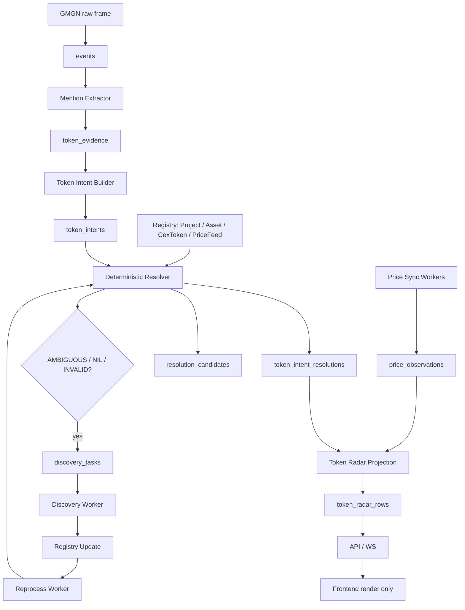

# Token Radar V4: KISS Deterministic Resolver Production Spec

Date: 2026-05-07

Status: hard-cut production spec

Supersedes:

- `docs/2026-05-06-token-identity-resolution-production-spec-cn.md`
- `docs/2026-05-07-token-radar-identity-market-v3-production-spec-cn.md`
- earlier draft of `docs/2026-05-07-token-radar-v4-entity-linking-production-spec-cn.md`

Companion plan:

- `docs/2026-05-07-token-radar-v4-entity-linking-implementation-plan-cn.md`

## Executive Summary

V3 的方向是正确的：Token Radar 的主语已经从 mention-level attribution 切到 event-level token intent，frontend 也不再拥有 decision。但 live 数据仍然暴露出更底层的问题：

- `$MASK`、`$SPACEXAI`、`$PEPE` 这类 symbol-only 文本仍然容易被误当成某个链上资产；
- CEX ticker、DEX token、Project 被混在 `asset + venue` 里；
- `asset_venues` 同时像“价格源”、又像“DEX token contract”、又像“CEX market”，边界太软；
- resolver 还在用候选数量、confidence、alias 表做近似判断；
- price snapshot 绑定到 asset/venue，无法表达“这是 token 级价格源，不是交易池/交易目标”；
- 解析失败后缺少自动 discovery -> registry update -> reprocess 的闭环。

V4 改成更简单、更可解释的生产架构：

```text
Tweet
-> deterministic mention extraction
-> event token intent
-> deterministic resolver
-> EXACT / UNIQUE_BY_CONTEXT / PROJECT_ONLY / AMBIGUOUS / NIL / INVALID
-> discovery queue for unresolved work
-> registry update
-> re-run resolver
-> price observations
-> token_radar_rows
```

核心取舍：

```text
不猜。
能确定就解析。
不能确定就 AMBIGUOUS / NIL。
NIL / AMBIGUOUS 自动进入 discovery 和 reprocess。
```

## What Changes From Earlier V4

Earlier V4 仍然保留了黑盒 candidate confidence 和 threshold 的味道。这个方向容易滑回“流动性最大所以就是它”的错链风险。

本版 V4 改为：

- identity resolution 不使用 ML confidence；
- identity resolution 不用单个 liquidity/market-cap 指标强选；
- symbol-only 先走 CEX token，再走链上市场主导选择；证据不足才保持未决；
- 同名 token 文本只召回候选；最终 identity 由 CEX registry、显式 chain/CA、或市场主导规则决定；
- price/liquidity/holder 只通过显式 Market Dominance Selector 参与链上候选选择；
- resolver 输出枚举状态，而不是 0.73/0.86 这种伪精确值；
- discovery/reprocess 是生产闭环的一等模块，不是 ops 补丁。

## Non-Goals

V4 不做这些事：

- 不用 LLM 解析 hot path identity；
- 不做人肉标注闭环；
- 不把多链同 symbol 自动合并成一个 Project；
- 不把 CEX ticker 映射到单一链上 CA；
- 不在当前阶段建 DEX pool / AMM execution market 模型；
- 不把 token 级 provider price 当成 DEX pool 或交易目标；
- 不为了精确 FX 把 `USDT/USDC/USD` CEX quote 做复杂换算，Radar 只需要明确标记的 `usd_like` 近似；
- 不让 frontend 计算或覆盖 Radar decision；
- 不在 API request path 调 provider；
- 不保留 `asset_mentions` / `asset_attributions` / request-time asset-flow 作为 Token Radar runtime；
- 不为了覆盖率强行解析 `$SYMBOL`。

## First Principles

1. Symbol 不是实体，只是召回键。
2. EVM CA 不包含 chain，不能默认 Ethereum。
3. CEX ticker 不是链上 token。
4. 当前阶段不做 DEX pool 身份，不做交易执行目标。
5. DEX token Asset 必须有 `chain + address/mint`。
6. CEX token 和 CEX price feed 必须分开。
7. 同名 symbol 先作为候选召回键；只有 CEX 确认或链上市场主导规则通过时，才可解析成具体目标。
8. 市值、holder、流动性可以参与链上候选的确定性主导选择；不能用黑盒 score 或“最高一个指标”强行选。
9. Resolver 的正确输出包括“不知道”：`PROJECT_ONLY`、`AMBIGUOUS`、`NIL`、`INVALID` 都是正常生产状态。
10. 闭环不是人工标注，而是 discovery + registry update + deterministic reprocess。
11. `USDT/USDC/USD` quote 可以作为 Radar 的 `usd_like` 近似美元价格；非稳定币 quote 不能伪装成 USD。
12. 价格 observation 不是交易身份。当前阶段所有价格都进入 PriceFeed/PriceObservation，不产出交易 Market。
13. 确认过的 CEX token 优先于同 symbol DEX 候选；这是 registry 事实，不是 liquidity 排名。

## Minimal Domain Model

V4 当前阶段只保留四类 runtime 实体。

| Entity | Meaning | Example |
| --- | --- | --- |
| `Project` | 项目/概念层 | `project:pepe`, `project:wif`, `project:ethereum` |
| `Asset` | 链上资产，必须带 chain + address/mint | `asset:eip155:1:erc20:0x6982...`, `asset:solana:token:<mint>` |
| `CexToken` | 确认的 CEX 代币，不指定 exchange、quote 或 market type | `cex_token:PEPE` |
| `PriceFeed` | provider 价格源，不代表交易执行目标 | `pricefeed:cex:okx:spot:TON-USDT`, `pricefeed:dex-token:okx:eip155:1:0x6982...`, `pricefeed:gmgn-payload:eip155:1:0x6982...` |

### Current Repo Mapping

Current V3 good spine:

- keep `events`;
- keep `event_entities` as span-aware facts;
- keep `token_evidence`;
- keep `token_intents`;
- keep `token_radar_rows`;
- keep `projection_runs/projection_offsets`;
- keep provider adapters under `src/parallax/market`.

Current V3 boundaries to replace:

- replace `assets` as catch-all registry with Project/Asset/CexToken/PriceFeed semantics;
- replace `asset_venues` as production price source identity with `price_feeds`;
- replace `asset_market_snapshots` with `price_observations` keyed by `pricefeed_id` and subject;
- replace `token_intent_resolutions.asset_id + primary_venue_id` as final target with `target_type + target_id`;
- remove `AssetRepository.candidates_for_symbol()` from resolver hot path;
- remove hidden confidence-based candidate selection from identity resolver;
- replace `tradeability_scoring.py`, pool-based score components, and UI `Tradeability` blocks with current-stage attention/price-health scoring that never depends on pool identity.

Migration may read old tables once to backfill V4 registry, but runtime code cannot depend on old tables after the cut.

### Hard-Cut Boundary

V4 is not a compatibility layer over V3. It is a replacement of Token Radar runtime identity.

Allowed after V4 cut:

- old `assets`, `asset_venues`, `asset_market_snapshots` tables may exist only as one-time migration input or for unrelated historical tooling;
- migration code may read old tables to populate V4 registry;
- tests may mention old names only when asserting that V4 runtime does not import or query them.

Forbidden after V4 cut:

- dual-write V3 and V4 identity paths;
- request-time fallback from V4 target to old `asset_id + primary_venue_id`;
- resolver fallback to `AssetRepository.candidates_for_symbol()`;
- projection fallback to `asset_venues` or `asset_market_snapshots`;
- frontend fallback from V4 target to old `asset` semantics;
- `tradeability_score`, `pool_status`, or UI `Tradeability` as Token Radar V4 ranking inputs;
- API responses that expose V4 rows as if every target were executable.

The branch is not releasable until the old Token Radar runtime imports and SQL references are zero.

## ID Design

IDs must encode identity, not display.

```text
Project:
  project:pepe

Asset:
  asset:eip155:1:erc20:0x6982508145454ce325ddbe47a25d4ec3d2311933
  asset:eip155:8453:erc20:0x2cc0db4f8977accadb5b7da59c5923e14328eba3
  asset:solana:token:69PzM2hDa3MCo7cvKPgiPxhr1FdGdMV3S7h6wpRkpump
  asset:ton:jetton:<canonical-ton-address>

CexToken:
  cex_token:PEPE
  cex_token:TON

PriceFeed:
  pricefeed:cex:binance:spot:PEPEUSDT
  pricefeed:cex:bybit:swap:1000PEPEUSDT
  pricefeed:cex:okx:swap:TON-USDT-SWAP
  pricefeed:dex-token:okx:eip155:1:0x6982508145454ce325ddbe47a25d4ec3d2311933
  pricefeed:gmgn-payload:eip155:1:0x6982508145454ce325ddbe47a25d4ec3d2311933
```

Rules:

- `project:pepe` does not imply any chain Asset.
- `cex_token:PEPE` does not imply any chain Asset.
- `pricefeed:cex:bybit:swap:1000PEPEUSDT` has base CexToken/project and multiplier metadata.
- `pricefeed:dex-token:*` is a token-level price source and does not imply pool identity.
- Project merge requires strong evidence, never symbol equality alone.

## Resolution Status

V4 resolver returns one of:

```text
EXACT
UNIQUE_BY_CONTEXT
PROJECT_ONLY
AMBIGUOUS
NIL
INVALID
```

| Status | Meaning | Price Handling |
| --- | --- | --- |
| `EXACT` | 输入含确定 ID：chain+CA/mint 或 CEX native price feed id | priceable if active PriceFeed or provider observation exists |
| `UNIQUE_BY_CONTEXT` | 明确上下文过滤后只剩一个候选 | priceable if active PriceFeed or provider observation exists |
| `PROJECT_ONLY` | 只能确定项目，不能确定链上 asset/CEX token/feed | investigation only |
| `AMBIGUOUS` | 多个候选都合理，不硬选 | investigation only |
| `NIL` | 当前 registry 没有命中，需要 discovery | investigation only |
| `INVALID` | 格式像地址/market，但 parser 或校验失败 | discard or investigation only |

`confidence` 在 identity resolution 中废弃。Radar scoring 可以继续对 heat/quality/propagation/market timing 打分，但 identity status 本身必须是枚举和 reason codes。

### Resolution Row Lifecycle

`resolution_status` is identity output only. It must never carry storage lifecycle values.

Allowed `resolution_status` values:

```text
EXACT
UNIQUE_BY_CONTEXT
PROJECT_ONLY
AMBIGUOUS
NIL
INVALID
```

Resolution history uses separate fields:

```text
record_status = current | superseded
is_current = true | false
superseded_at_ms
```

Runtime reads only `is_current = true`. Reprocess writes a new current row and marks the previous row superseded. No code may test `resolution_status <> 'superseded'`.

## Target Architecture



## Extraction Scope

Extractor remains deterministic. It extracts keys, not identity.

Extract:

- EVM address: `0x[a-fA-F0-9]{40}`, then parser validation;
- Solana mint: base58 candidate, then `solders.Pubkey` validation;
- TON address: maintained TON parser validation;
- cashtag: `$PEPE`, `$WIF`, `$TRUMP`;
- CEX market text: `PEPEUSDT`, `PEPE/USDT`, `TON-USDT-SWAP`, `1000PEPEUSDT`;
- DEX/provider token URLs: DexScreener, GeckoTerminal, GMGN, explorer URLs when they expose chain + token address;
- chain hints: `eth`, `ethereum`, `base`, `bsc`, `sol`, `solana`, `arb`, `arbitrum`, `ton`;
- venue hints: `binance`, `bybit`, `okx`, `coinbase`, `uniswap`, `raydium`, `meteora`, `pump`, `pancake`;
- intent hints: `ca`, `contract`, `mint`, `listing`, `listed`, `perp`, `futures`;
- source context keys from author handle, mentioned handle, URL domain, and reference/quoted tweet surface.

Do not extract:

- suffixes from Solana address text as symbol;
- every uppercase word as ticker;
- stock/crypto identity without registry lookup;
- social hashtags as token identity unless promoted by deterministic rules.

Plain symbol text such as `uPeg` or `vvv` is not broad token evidence. It can only add context to an existing known Project/CexToken when a strong project/token key exists:

- official project author or mentioned handle in registry;
- provider URL/domain mapped to a token or project registry entry.

General lowercase words are not token evidence.

## Token Parsing State Machine

Parsing is intent-level, not tweet-level. One tweet may create several token intents, and each intent moves through the resolver independently.

```text
RAW_TEXT
-> PARSED_KEYS
-> EXACT_PRICEFEED_KEY | EXACT_ADDRESS_KEY | CONTEXTUAL_SYMBOL_KEY | SYMBOL_ONLY | NO_KEYS | INVALID_KEYS
-> deterministic resolver
-> EXACT | UNIQUE_BY_CONTEXT | PROJECT_ONLY | AMBIGUOUS | NIL | INVALID
-> optional discovery
-> optional reprocess
-> current resolution row
```

Intent grouping rules:

```text
CEX native instrument text + exchange/venue hint
  -> one PriceFeed intent

valid CA/mint + chain hint + nearby cashtag
  -> one asset intent

valid CA/mint without chain + nearby cashtag
  -> one cross-chain address intent

exchange + base symbol without quote
  -> one CEX token intent

cashtag / symbol with no chain, venue, address, or market key
  -> one symbol intent

DEX/provider token URL or GMGN token payload with chain + address
  -> one asset intent plus provider price observation
```

Invalid-shaped keys are scoped to their own intent. If a tweet contains a malformed address and a separate valid cashtag, the malformed address intent returns `INVALID` and the cashtag intent still resolves through the symbol-only path.

The resolver never collapses unrelated keys into one intent only because they appear in the same tweet. It only joins keys when they are span-near, provider-linked, or linked by an explicit context phrase such as `on Base` or `Bybit perp`.

Reference and quoted tweet surfaces must remain observable. If a primary tweet says `It's $FLOCK` and the quoted tweet says `found the next $VVV`, V4 creates separate intents with `source_surface=primary` and `source_surface=reference`; the UI must show that `$VVV` came from the reference surface, not make it look like a phantom primary-token parse.

## Deterministic Resolver Priority

Resolver is a fixed decision table.

| Priority | Condition | Output |
| ---: | --- | --- |
| 1 | CEX native price feed id + exchange | `PriceFeed EXACT` |
| 2 | chain hint + valid CA/mint | `Asset EXACT` |
| 3 | CA/mint without chain, valid on exactly one tracked chain | `Asset EXACT` or `UNIQUE_BY_CONTEXT` |
| 4 | CA/mint valid on multiple tracked chains | `AMBIGUOUS` |
| 5 | DEX/provider token URL with chain + token address | `Asset EXACT` |
| 6 | symbol exists in confirmed CEX token registry | `CexToken UNIQUE_BY_CONTEXT` |
| 7 | dex + chain + symbol after active filter | `Asset UNIQUE_BY_CONTEXT` if one active candidate or one market-dominant candidate |
| 8 | chain + symbol after active filter, with no DEX context | `Asset UNIQUE_BY_CONTEXT` if one active asset or one market-dominant candidate |
| 9 | symbol has no CEX token but one market-dominant chain Asset | `Asset UNIQUE_BY_CONTEXT` |
| 10 | symbol maps to exactly one Project but no dominant Asset | `PROJECT_ONLY` |
| 11 | symbol maps to multiple Projects or no dominant candidate | `AMBIGUOUS` |
| 12 | unknown symbol/address/feed id | `NIL` |
| 13 | address/feed-shaped text fails validation | `INVALID` |

The resolver must stop at the first applicable priority. It cannot fall through to symbol-only resolution after an exact address or price feed parse failed validation.

## Active Filter

Active filter removes garbage before resolution.

An Asset candidate is active if:

```text
valid chain object
AND valid token interface / mint
AND symbol exact match when resolving symbol
AND status IN ('candidate', 'canonical')
AND not deprecated
AND has price/source evidence or trusted registry evidence
```

Price/source evidence can be:

```text
provider token price exists with recent observation
OR trusted token registry entry exists
OR sustained token activity exists
```

After active filter:

```text
0 candidates -> NIL
1 candidate  -> UNIQUE_BY_CONTEXT
>1 candidates -> run Market Dominance Selector
```

## Market Dominance Selector

Market dominance is allowed only for same-symbol chain Asset candidates. It is deterministic and auditable; it is not a model confidence score.

Use latest fresh observations for:

```text
market_cap_usd
holders
liquidity_usd
volume_24h_usd
```

KISS dominance rule:

```text
eligible candidate:
  fresh provider observation
  AND at least two of market_cap_usd / holders / liquidity_usd are present

dominance_score:
  0.55 * log10(coalesce(market_cap_usd, 0) + 1)
  + 0.30 * log10(coalesce(holders, 0) + 1)
  + 0.15 * log10(coalesce(liquidity_usd, 0) + 1)

winner:
  top dominance_score is greater than second dominance_score
  AND top market_cap_usd >= 250000 OR top holders >= 1000 OR top liquidity_usd >= 100000
```

If these gates pass, resolver returns `Asset UNIQUE_BY_CONTEXT` with reason `MARKET_DOMINANT_CHAIN_ASSET`. If not, it returns `AMBIGUOUS` or `PROJECT_ONLY` and exposes the candidates.

Forbidden:

```text
pick by one raw metric alone
pick oldest candidate
pick Ethereum by default
pick an arbitrary CEX exchange or price feed by default
hide the dominance inputs from resolution_candidates
```

## Symbol-Only Rule

Symbol-only can resolve to a CEX `CexToken` or a market-dominant chain `Asset`. It never resolves directly to a `PriceFeed`.

Confirmed CEX token facts beat same-symbol chain candidates. This is a registry fact, not a price/liquidity score. `CexToken` is exchange-neutral at token level; exchange-specific markets live under `PriceFeed`.

Examples:

```text
"$PEPE"
-> CexToken UNIQUE_BY_CONTEXT if confirmed CEX token exists
-> Asset UNIQUE_BY_CONTEXT if no CEX token exists and one chain Asset is market-dominant
-> PROJECT_ONLY / AMBIGUOUS if fresh market facts are insufficient or top candidate is too low quality
-> NIL if unknown

"new PEPE on Solana"
-> Asset UNIQUE_BY_CONTEXT if active Solana PEPE candidates filter to one or one candidate is market-dominant
-> AMBIGUOUS if multiple Solana PEPE candidates survive without dominance

"PEPE on Binance"
-> CexToken UNIQUE_BY_CONTEXT if CEX PEPE token exists
-> NIL if token unknown

"PEPEUSDT perp on Bybit"
-> PriceFeed EXACT if Bybit native price feed exists
```

## Project Merge Rules

Project merging is conservative. Two Assets can share a Project only with strong evidence:

- same trusted external canonical ID;
- same official website;
- same official X handle;
- official token list grouping;
- CEX token deposit networks explicitly map multiple chain assets to one CEX token;
- provider returns a stable project ID across assets.

Symbol equality is never enough.

## Discovery Queue

Every unresolved or ambiguous resolution creates a discovery task unless an equivalent active task already exists.

Task types:

```text
address_lookup
solana_mint_lookup
ton_jetton_lookup
cex_pricefeed_lookup
cex_token_lookup
dex_token_lookup
dex_price_lookup
project_symbol_lookup
```

Discovery writes registry facts, not final tweet resolutions. Reprocess owns rerunning resolver.

### Reprocess Lookup Keys

Reprocess must be indexed, not best-effort scanning.

Each intent stores lookup keys produced from mention extraction:

```text
symbol:<normalized_symbol>
address:<family>:<chain_id_or_unknown>:<canonical_address>
cex_pricefeed:<exchange>:<native_market_id>
cex_token:<base_symbol>
asset:<family>:<chain_id>:<canonical_address>
dex_token:<provider>:<chain_id>:<canonical_address>
project_symbol:<normalized_symbol>
```

These keys are persisted in `token_intent_lookup_keys` and copied into `token_intent_resolutions.lookup_keys_json` for observability. A registry update records affected lookup keys in `registry_versions.affected_lookup_keys_json`. The reprocess worker joins on these keys, reruns the deterministic resolver, and enqueues projection dirty ranges.

No V4 implementation may scan all unresolved intents on every registry update.

### Unknown EVM Address

For each tracked EVM chain:

```text
check contract exists
check ERC20 interface
read symbol/name/decimals
check transfer activity
check token price/liquidity observations when provider supports them
write raw/candidate/canonical registry state
enqueue reprocess for affected intents
```

### Unknown Solana Mint

```text
check mint account
check token program
read decimals
read metadata
check token price/liquidity observations when provider supports them
check recent token activity when provider supports it
write registry state
enqueue reprocess
```

### Unknown CEX Price Feed / CexToken

```text
sync exchange instruments
normalize native market ids
detect spot / swap / future
detect base / quote / settle / multiplier
write CexToken and PriceFeed
enqueue reprocess
```

### Unknown DEX Symbol / Token

```text
query provider token registries
search by symbol/address
filter dead or zero-observation tokens
validate chain/address assets
write Assets and PriceFeeds
enqueue reprocess
```

## Registry Tiers

V4 uses three logical tiers:

```text
raw
candidate
canonical
```

KISS implementation can store these as `status` / `registry_tier` columns in the same Project/Asset/CexToken/PriceFeed tables.

Resolver reads only:

```text
candidate + canonical
```

Resolver never reads raw registry rows.

## Price Feed Model

Current-stage Token Radar does not model DEX pools or execution markets. It models provider price feeds.

Required price feed fields:

```text
pricefeed_id
feed_type            cex_spot | cex_swap | cex_future | dex_token | gmgn_payload | provider_token
provider             okx | bybit | binance | gmgn | ...
subject_type         Asset | CexToken
subject_id
chain_id             nullable, required for DEX token feeds
address              nullable, required for DEX token feeds
native_market_id     nullable, CEX native instrument id
base_asset_id
base_cex_token_id
base_project_id
base_symbol
quote_symbol
multiplier
status               raw | candidate | canonical | deprecated
```

Price observations preserve precision:

```text
observation_id
pricefeed_id
provider
observed_at_ms
price_usd NUMERIC
price_quote NUMERIC
quote_symbol TEXT
price_basis          exact_usd | provider_usd | usd_like | quote | unavailable
market_cap_usd NUMERIC
liquidity_usd NUMERIC
volume_24h_usd NUMERIC
open_interest_usd NUMERIC
holders BIGINT
raw_payload_json JSONB
created_at_ms BIGINT
```

`price_usd` means Radar display price on a USD-compatible basis, not audited accounting FX. For CEX markets quoted in `USD`, `USDT`, or `USDC`, V4 may set `price_usd = last_price` and `price_basis = 'usd_like'`. For non-stable quote markets such as `PEPE-BTC`, V4 must either leave `price_usd` null or use a provider-supplied USD value with `price_basis = 'provider_usd'`.

### Price Observation Model

All current-stage provider prices are stored as `price_observations`:

```text
observation_id
pricefeed_id
provider
observed_at_ms
subject_type        Asset | CexToken
subject_id
price_usd           nullable
price_quote         nullable
quote_symbol        nullable
price_basis         exact_usd | provider_usd | usd_like | quote | unavailable
market_cap_usd
liquidity_usd
volume_24h_usd
open_interest_usd
holders
raw_payload_json
created_at_ms
```

Source semantics:

| Source | Identity output | Price write |
| --- | --- | --- |
| GMGN WS token payload `chain + address + price` | `Asset` intent | `price_observations(subject_type='Asset')` |
| OKX DEX token price by `chain + tokenContractAddress` | `Asset` observation | `price_observations(subject_type='Asset')` |
| OKX CEX ticker `instId` | `PriceFeed` intent, subject `CexToken` | `price_observations(subject_type='CexToken')` |
| GMGN/OpenAPI token info | registry/discovery evidence plus Asset price observation | `price_observations(subject_type='Asset')` |

Forbidden:

```text
create market:dex:<chain>:gmgn_payload:<address> from token payload alone
create a DEX pool Market from token price endpoint alone
require DEX pool identity for DEX token price display
promote any row to an execution state
```

### Price Update State Machine

Price data state is separate from registry identity state.

```text
pending_refresh
ready
stale
no_price
provider_not_configured
provider_not_found
provider_error
rate_limited
invalid_identity
```

State rules:

```text
PROJECT_ONLY -> no_price
AMBIGUOUS / NIL -> no_price
INVALID -> invalid_identity
EXACT/UNIQUE_BY_CONTEXT with no current observation -> pending_refresh
EXACT/UNIQUE_BY_CONTEXT with fresh observation -> ready
EXACT/UNIQUE_BY_CONTEXT with old observation -> stale
provider disabled -> provider_not_configured
provider lookup returns no token/instrument -> provider_not_found
provider failure -> provider_error or rate_limited
```

Projection chooses price data by:

```text
1. target PriceFeed, Asset, or CexToken subject;
2. latest price_observations row with observed_at_ms <= projection_time_ms;
3. venue-specific freshness threshold;
4. provider priority only as a tie-breaker for equal observed_at_ms, never as identity input.
```

Price observations are projected into API rows so the UI can show the latest token-level or CEX-instrument provider price. The price refresher scans recently-mentioned Assets and CexTokens because most live GMGN/X token mentions contain token address or symbol context rather than pool identity.

Project rows have no price in KISS V4. Price is shown only for concrete `Asset`, `CexToken`, or `PriceFeed` targets. This keeps `UPEG`, `VVV`, and `LFI` honest when only same-symbol DEX candidates exist, while letting `CAKE` show a CEX token price once the confirmed CexToken and price feed are in registry.

### Precision Contract

Price-like values remain string or `Decimal` from provider parsing to PostgreSQL insert to API JSON serialization.

This includes:

- GMGN token payload `price`, `previous_price`, `market_cap`;
- OKX CEX ticker `last_price`, `volume_24h`, `open_interest`;
- OKX DEX and GMGN OpenAPI price/liquidity/market-cap fields;
- projection price fields;
- frontend formatting.

`float` is forbidden for V4 market identity and price pipeline. A nonzero micro price such as `0.000000000123` must never round-trip as numeric zero or UI `$0`.

### Schema Invariants

PostgreSQL enforces identity uniqueness.

Required unique indexes:

```text
registry_assets(chain_id, lower(address))
cex_tokens(base_symbol)
price_feeds(provider, feed_type, native_market_id) WHERE native_market_id IS NOT NULL
price_feeds(provider, feed_type, chain_id, lower(address)) WHERE address IS NOT NULL
registry_aliases(alias_norm, target_type, target_id, source)
discovery_tasks(task_type, query_key)
token_intent_lookup_keys(lookup_key, intent_id)
```

Required runtime indexes:

```text
token_intent_resolutions(intent_id) WHERE is_current = true
token_intent_resolutions(target_type, target_id, decision_time_ms DESC) WHERE is_current = true
token_intent_lookup_keys(lookup_key)
price_observations(pricefeed_id, observed_at_ms DESC)
price_observations(subject_type, subject_id, observed_at_ms DESC)
token_radar_rows(projection_version, window, scope, lane, computed_at_ms DESC, rank ASC)
```

Price statuses:

```text
ready
stale
pending_refresh
no_price
provider_not_configured
provider_not_found
provider_error
rate_limited
insufficient_history
invalid_identity
```

## Radar Semantics

Radar source remains materialized `token_radar_rows`.

Rows include:

```text
intent
resolution
target
price
attention
score
decision
data_health
source_event_ids
```

Score components are current-stage attention/readiness signals only:

```text
heat
quality
propagation
price_health
timing
attention
```

No V4 score component may be named `tradeability` or depend on `pool_status`.

Decision caps:

- V4 current stage does not produce execution claims from identity or price data;
- `EXACT` Asset/CexToken/PriceFeed with usable price can improve attention ranking, but it is still not an execution target;
- `PROJECT_ONLY` is `investigate`;
- `AMBIGUOUS` is `investigate`;
- `NIL` is `investigate`;
- `INVALID` is `discard` or `investigate` by product policy;
- any target without usable price is max `investigate`;
- frontend cannot promote a backend decision.

## API And Frontend Contract

Frontend receives backend state and renders it.

The production V4 read API is:

```text
GET /api/token-radar?window=5m&scope=all&limit=120
```

`/api/asset-flow` is not a V4 compatibility endpoint. It must not be used by V4 frontend or Token Radar runtime.

Every row exposes a target block:

```json
{
  "target": {
    "target_type": "Project | Asset | CexToken | PriceFeed | null",
    "target_id": "...",
    "symbol": "...",
    "display_name": "...",
    "execution_target": false
  },
  "resolution": {
    "status": "EXACT | UNIQUE_BY_CONTEXT | PROJECT_ONLY | AMBIGUOUS | NIL | INVALID",
    "reason_codes": [],
    "candidate_ids": [],
    "lookup_keys": []
  },
  "price": {
    "pricefeed_id": null,
    "price_status": "ready | stale | pending_refresh | no_price | provider_not_configured | provider_not_found | provider_error | rate_limited | invalid_identity",
    "price_basis": "exact_usd | provider_usd | usd_like | quote | unavailable",
    "observation": {
      "subject_type": "Asset | CexToken",
      "subject_id": "...",
      "provider": "gmgn_ws_token_payload | okx_dex_price | gmgn_openapi | ...",
      "observed_at_ms": 1778142883365,
      "price_usd": "0.0000010856277615584199",
      "price_quote": null,
      "quote_symbol": null,
      "price_basis": "provider_usd"
    }
  }
}
```

Target-aware drilldown replaces Asset-only drilldown:

- Radar rows open detail by `target_type + target_id`, not by `asset_id`;
- `PROJECT_ONLY`, `AMBIGUOUS`, `NIL`, and `INVALID` rows can show evidence, posts, candidates, and discovery state, but no execution panel;
- `Asset`, `CexToken`, and `PriceFeed` rows show price data when a provider observation is available;
- frontend must not call Asset-only endpoints for non-Asset targets.

Frontend cannot:

- compute identity;
- compute decision;
- convert `PROJECT_ONLY` into resolved token;
- invent symbol from address suffix;
- collapse price statuses;
- display rounded zero for nonzero micro prices.

Frontend can:

- format values for display;
- sort already-ranked rows inside UI tabs;
- show target type badges: Project, Asset, CexToken, PriceFeed;
- show reason codes and discovery state.

## Observability

Required diagnostics:

```text
resolution_status_counts by 5m/1h
reason_code_counts
target_type_counts
PROJECT_ONLY rate
AMBIGUOUS rate
NIL rate
INVALID rate
discovery_task_counts
discovery_success_rate
reprocess_success_rate
price_status_counts
address_without_symbol_count
symbol_only_not_resolved_count
old_runtime_path_import_count
```

Interpretation:

- high `NIL` -> registry/discovery coverage gap;
- high `AMBIGUOUS` -> context extraction gap or real identity ambiguity;
- high `PROJECT_ONLY` -> registry or market-dominance evidence is missing for many symbols;
- high `INVALID` -> spam or too-wide extractor;
- high `pending_refresh` -> price sync lag;
- high address-only resolved rows -> metadata/provider coverage gap, not UI bug if target has no symbol.

## Required Exit Gates

| Case | Expected |
| --- | --- |
| `$VERSA 0x2cc0db4f8977accadb5b7da59c5923e14328eba3` with Base hint/provider evidence | one intent, `Asset EXACT`, symbol `VERSA`, price state explicit |
| `$MOONCLUB result: 4.1x ... 69Pz...pump Source: SOLANA` | one intent, `Asset EXACT`, Solana mint, display `MOONCLUB` |
| `$PEPE` only | `CexToken UNIQUE_BY_CONTEXT` when confirmed CEX token exists; otherwise market-dominant chain `Asset` or unresolved state |
| `$MASK` only with stock/crypto collision | `AMBIGUOUS` or stock lane exclusion; never fake crypto Asset |
| `PEPE on Binance` | `CexToken UNIQUE_BY_CONTEXT`, not chain Asset |
| Binance official/reserve tweet with `$CAKE` | `CexToken UNIQUE_BY_CONTEXT` if confirmed CEX token exists; else market-dominant BSC `Asset` with CEX discovery task |
| `PEPEUSDT perp on Bybit` | `PriceFeed EXACT` |
| official `@unipegv4` plain `uPeg` text | `PROJECT_ONLY` through handle alias; no lowercase-word broad extraction |
| `$UPEG` symbol-only with current candidates | Ethereum `Asset UNIQUE_BY_CONTEXT` when market dominance passes |
| `$LFI` symbol-only with current candidates | Base `Asset UNIQUE_BY_CONTEXT` when market dominance passes; otherwise candidate preview |
| `$VVV` symbol-only with current candidates | Base `Asset UNIQUE_BY_CONTEXT` when no confirmed CEX token exists and market dominance passes |
| DEX token URL/address | `Asset EXACT`, price observation when provider supports token price |
| EVM `0x...` no chain, one tracked chain valid | `Asset EXACT` or `UNIQUE_BY_CONTEXT` with reason |
| EVM `0x...` no chain, multiple chains valid | `AMBIGUOUS`, `ADDRESS_EXISTS_ON_MULTIPLE_CHAINS` |
| TON friendly address | parser validated; `Asset EXACT` or `NIL` discovery task |
| Solana address ending `musk` | address stays address; no suffix symbol |
| micro price token | nonzero price preserved through API and UI |
| resolved target without price | max `investigate` until price refresh |
| unresolved hot symbol | `investigate`, discovery task created |
| registry update after discovery | affected intents reprocessed deterministically |
| current-code ingest GMGN payload | writes V4 `registry_assets` plus `price_observations`; no synthetic DEX Market and never `asset_market_snapshots` |
| OKX CEX `PEPE-USDT` / `PEPEUSDT` | writes PriceFeed observation with `price_basis='usd_like'`; no exact FX conversion required |
| OKX CEX `PEPE-BTC` | does not pretend quote price is USD; `price_usd` null unless provider supplies USD basis |
| OKX DEX token price by token address | writes Asset price observation; no pool identity required |
| DEX token price without pool identity | API shows `price.observation`; no execution claim |
| quoted/reference tweet token | intent carries `source_surface=reference`; UI does not show it as primary-text phantom token |
| active resolution history | previous rows have `record_status=superseded`; current rows keep enum `resolution_status` |
| target detail for `PROJECT_ONLY` | opens target evidence/discovery detail, not `/asset-posts?asset_id=` |
| provider micro price | Decimal/string preserved from provider parser through API JSON |

## Definition Of Done

V4 is production-ready when:

- resolver is a deterministic priority table with enum states;
- Project/Asset/CexToken/PriceFeed are separate runtime concepts;
- `asset_venues` and `asset_market_snapshots` are not used by Token Radar runtime;
- `AssetRepository.candidates_for_symbol()` is not in resolver hot path;
- `IngestService` does not instantiate or call `AssetRepository` for Token Radar identity;
- `resolution_status` contains only V4 enum values and lifecycle is separate;
- `token_intent_lookup_keys` proves indexed reprocess;
- target-aware API/frontend replaces Asset-only Radar drilldown;
- price-like provider values are Decimal/string end to end;
- schema uniqueness constraints enforce Project/Asset/CexToken/PriceFeed identity;
- symbol-only resolves to CexToken first, then to market-dominant chain Asset when dominance gates pass, and never directly to PriceFeed;
- confirmed CexTokens take priority over same-symbol DEX candidates without choosing an arbitrary exchange price feed;
- `discovery_tasks` and reprocess are live and idempotent;
- all current-stage prices are `price_observations` keyed by PriceFeed and subject;
- DEX pool / AMM execution market is not required for current-stage Token Radar;
- Token Radar V4 runtime has no `tradeability_score`, `pool_status`, UI `Tradeability` block, or pool-based ranking component;
- `USDT/USDC/USD` CEX quotes are explicitly marked `usd_like`, while non-stable quotes are not treated as USD;
- frontend renders backend decision unchanged;
- 5m live diagnostics can explain every unknown/address-only row by status and reason code;
- all required exit gates have deterministic tests.
