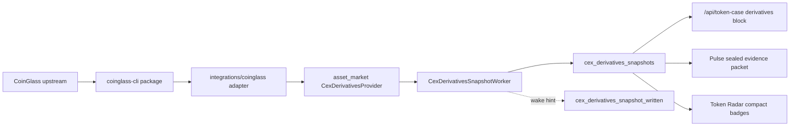

# CoinGlass CEX Derivatives Integration Spec

> 2026-05-27 hard-cut update: the CEX OI board current lifecycle no longer has
> `cex_oi_radar_runs`. Treat any run-table references below as retired; use
> stable current rows plus publication state only.

日期：2026-05-21
状态：active spec
范围：把 `AnalyThothAI/coinglass-cli` 作为 Docker 内可安装依赖接入，并设计 CEX 页面、Token Radar、Signal Pulse agent 的衍生品数据链路。

> CEX venue 方向以 `docs/superpowers/specs/active/2026-05-21-cex-binance-hard-cut-cn.md` 为准：CEX 不再保留 OKX 兼容层，CoinGlass enrichment 默认服务 Binance USDT perpetual top-K。

## 背景

本项目已经有 CEX 价格与 OI 的第一层接入：`MarketTick` 支持 `open_interest_usd`，OKX CEX poll 可以把同一交易对的价格、24h volume、OI 写入 `market_ticks`，Token Radar / Token Case / Pulse 可以从持久化 tick 读取这些标量事实。

`coinglass-cli` 提供的是另一类数据：

- `oi-history`：历史 OI 序列，包含 native OI 和可选 `open_interest_usd`。
- `funding-rate-history`：资金费率历史。
- `cvd-history`：买卖量差与累计 CVD。
- `long-short-ratio-history` / `top-trader-position-history`：多空比例与大户持仓比例。
- `liquidation-levels`：按价格带聚合的清算 level 与相关 OHLCV。
- `canary` / `protocol-replay`：上游协议漂移检查。

这些不是简单价格 tick。尤其 liquidation levels 是一个价格带数组和窗口化快照，不能塞进 `market_ticks` 的标量字段。正确接法是新增 Asset Market 里的衍生品事实链路，再由产品读模型消费。

## 结论

CoinGlass 数据有价值，但它应该先做成“CEX 衍生品上下文”，不要直接改成交易信号主引擎。

推荐路径：

1. Docker 内通过 pinned Git dependency 安装 `coinglass-cli`。
2. Asset Market 新增 `CoinglassDerivativesProvider` adapter 和一个受预算约束的刷新 worker / job。
3. 新增 append-only `cex_derivatives_snapshots` 事实表，存 OI/funding/清算区摘要和原始 payload。
4. CEX Token Case 先展示，Signal Pulse evidence packet 再引用，Token Radar 最后只加小型 badge / risk modifier。

这保留了现有 Kappa/CQRS 架构：provider raw frame 不是事实，PostgreSQL fact 才是产品真相；agent 只读封好的证据包，不自己获取数据。

## 当前事实

### 本地 `coinglass-cli`

本地 clone 路径：`/Users/qinghuan/Documents/code/coinglass-cli`
remote：`https://github.com/AnalyThothAI/coinglass-cli.git`
当前 commit：`592bf2f973411e4d516ca928f65aaabf40d707eb`

`pyproject.toml` 暴露：

```toml
[project]
name = "coinglass-cli"
requires-python = ">=3.12"
dependencies = [
  "curl_cffi>=0.13.0",
  "playwright>=1.58.0",
  "pycryptodome>=3.23.0",
  "quickjs>=1.19.4",
]

[project.scripts]
coinglass-cli = "coinglass_cli.__main__:main"
```

本机全局 `/opt/homebrew/bin/coinglass-cli` 当前不可用，会报 `ModuleNotFoundError: No module named 'coinglass_cli'`；但本地 venv 的 `/Users/qinghuan/Documents/code/coinglass-cli/.venv/bin/coinglass-cli` 可用。不要依赖宿主机 PATH。

`coinglass-cli canary` 当前返回 `ok: true`，说明 HTTP route bundle 和 liquidation-levels decrypt contract 在本机网络下仍可用。Browser history 类命令仍要单独在容器内验证 Playwright runtime。

### 目标项目 Docker 状态

`gmgn-twitter-intel` 已经有 GitHub dependency 的打包模式：

- `pyproject.toml` 已有 `marketlane-cli`，来源是 `tool.uv.sources` 里的 GitHub URL。
- `compose.yaml` 的 `migrate` 和 `app` build 都传入 `github_token` secret。
- `Dockerfile` 在 Python image 里读取 `/run/secrets/github_token`，临时配置 git URL rewrite，然后执行 `UV_HTTP_TIMEOUT=300 UV_CONCURRENT_DOWNLOADS=1 uv sync --frozen --no-dev`。
- `Makefile docker-up` 会优先使用环境变量 `GITHUB_TOKEN`，否则尝试 `gh auth token`。

因此 CoinGlass 依赖应复用这条路径。

## Docker 打包设计

### 依赖声明

在 `pyproject.toml` 加入依赖：

```toml
dependencies = [
  ...
  "coinglass-cli",
]

[tool.uv.sources]
marketlane-cli = { git = "https://github.com/AnalyThothAI/marketlane-cli.git" }
coinglass-cli = { git = "https://github.com/AnalyThothAI/coinglass-cli.git", rev = "592bf2f973411e4d516ca928f65aaabf40d707eb" }
```

必须 pin 到 commit，不用 branch。原因：

- Docker build 必须可复现。
- CoinGlass scraping/decrypt 合约变化频繁，分支漂移会让部署不可审计。
- agent evidence 需要知道当时的数据 adapter 版本。

执行：

```bash
uv lock
uv sync
docker compose build app
docker compose run --rm app coinglass-cli --help
```

如果 GitHub repo 是私有的，build 必须带 `GITHUB_TOKEN`。未鉴权访问该 GitHub URL 当前不可见，所以生产路径按私有依赖处理。

### Playwright runtime

`coinglass-cli` 的 history 命令使用 browser transport。Python package 依赖 `playwright` 不等于容器里已有浏览器二进制。Docker 有两种选择：

1. 最小接入：先只在容器验证 HTTP 类命令 `liquidation-levels` 和 `canary`。OI history 暂不启用 worker。
2. 完整接入：Dockerfile 安装 Playwright browser dependencies 和 Chromium，例如在 `uv sync` 后执行 `python -m playwright install --with-deps chromium`。

推荐完整接入，但把刷新 worker 默认关闭或只开 canary/hot-set 小预算。这样镜像具备能力，运行时由 `workers.yaml` 打开。

完整接入的影响：

- 镜像体积增加。
- build 时间增加。
- 容器需要 browser sandbox 兼容。若 slim image 出现依赖缺口，以 Playwright 官方依赖安装为准。

## 数据建模

### 不扩展 `market_ticks` 承载 levels

`market_ticks.open_interest_usd` 只适合“同一 instrument 同一 observation 的标量市场 tick”。Liquidation levels、funding history、CVD、多空比例都是窗口化衍生品上下文，不应拆进 tick 行或塞进 `raw_payload_json` 后让读侧解析。

### 新事实表：`cex_derivatives_snapshots`

新增 append-only fact table，由一个 worker 独占写入。建议字段：

| 字段 | 含义 |
|---|---|
| `snapshot_id` | deterministic id，基于 provider + target + exchange + instrument + family + window + observed_at_ms |
| `target_type` | `cex_symbol` |
| `target_id` | 例如 `okx:BTC-USDT-SWAP` 或系统已有 CEX market target |
| `cex_token_id` | 可选，指向 `cex_tokens` 的产品 identity |
| `source_provider` | `coinglass` |
| `exchange` | CoinGlass instrument exchange，默认 Binance 时必须明示 |
| `instrument` | 例如 `Binance_BTCUSDT` |
| `base_symbol` / `quote_symbol` | 标准化 symbol |
| `range` | levels 窗口，如 `3d` / `7d` / `14d` / `30d` |
| `time_type` | history interval，如 `1` / `2` / `3` / `4` |
| `observed_at_ms` | 该快照代表的最新 bar 或 levels 观测时间 |
| `received_at_ms` | 本服务接收时间 |
| `open_interest_usd` | 最新 OI USD，如果可得 |
| `open_interest_delta_4h_pct` | 从 OI history 计算 |
| `open_interest_delta_24h_pct` | 从 OI history 计算 |
| `funding_rate` | 最新 funding |
| `funding_z` | 可选，基于历史窗口归一 |
| `cvd_delta_24h_usd` | 可选，CVD 变化 |
| `long_short_ratio` | 最新全局多空比例 |
| `top_trader_long_short_ratio` | 最新大户持仓比例 |
| `nearest_liq_above_usd` | 当前价上方最近重要清算区 |
| `nearest_liq_below_usd` | 当前价下方最近重要清算区 |
| `largest_liq_cluster_usd` | 最大清算聚集区 |
| `levels_json` | 归一后的 level 列表，保留 side/price/size/level |
| `summary_json` | 供产品/agent 使用的 compact summary |
| `raw_payload_json` | 原始 envelope data/meta，用于审计 |
| `freshness` | `fresh` / `stale` / `unavailable` |
| `degraded` | bool |
| `upstream_status_json` | CoinGlass envelope 的错误分类 |
| `created_at_ms` | 插入时间 |

索引：

```sql
CREATE UNIQUE INDEX ux_cex_derivatives_snapshot_identity
ON cex_derivatives_snapshots(source_provider, target_type, target_id, exchange, instrument, range, time_type, observed_at_ms);

CREATE INDEX idx_cex_derivatives_snapshots_latest
ON cex_derivatives_snapshots(target_type, target_id, received_at_ms DESC);

CREATE INDEX idx_cex_derivatives_snapshots_cex_token_latest
ON cex_derivatives_snapshots(cex_token_id, received_at_ms DESC)
WHERE cex_token_id IS NOT NULL;
```

如果 UI 读取变多，可后续加 rebuildable `cex_derivatives_current` read model，单写者仍是同一个 derivatives worker，或用 repository latest query 先满足 V1。

### 数据量控制

不要把 CoinGlass worker 设计成“每轮扫完整 Binance universe 的全家桶”。但可以把“全 Binance USDT 永续 OI/radar board”做成独立 worker，前提是全量基础 OI 走 Binance 官方 futures-data endpoint，CoinGlass 只做 top-K 深度上下文。

V1 分层：

1. 基准/详情 derivatives：BTC/ETH/SOL、Hot CEX targets、on-demand targets，写 `cex_derivatives_snapshots`。
2. 全量 OI/radar board：默认覆盖 Binance active USDT perpetual，写独立 `cex_oi_radar_runs` / `cex_oi_radar_rows`，并把 OI series 写成 compact numeric points。
3. CoinGlass top-K enrichment：只对 board top 30-50 做 liquidation levels / CVD / long-short / top-trader。

建议 TTL / cooldown：

| 数据族 | 建议刷新间隔 | 覆盖 | 原因 |
|---|---:|---:|---|
| Binance universe | 6 小时 | USDT perpetual 全量 | exchangeInfo 低成本，主要用于路由 freshness |
| Binance OI board | 30 分钟 | USDT perpetual 全量 | 527 symbol 量级下 4-10 分钟可完成 |
| CoinGlass levels | 60 分钟 | top 30 | 上游重，数组大，用作风险区上下文 |
| CoinGlass CVD/long-short/top-trader | 60-120 分钟 | top 30 或 disabled | secondary confirmation，不应拖慢全量 board |
| canary | 30-60 分钟 | provider | 检查协议漂移，不进入产品事实 |

真正危险的是无 TTL 的详情页同步调用，因为用户刷新、前端重试、多个页面同时打开会把 provider 请求放大，而且失败不可统一退避。

### Binance USDT perpetual universe sync

Binance 合约 universe 应该低频写入 `cex_tokens` / `price_feeds`，但默认范围只取 USDT 永续：

```text
Binance USD-M exchangeInfo
  -> filter status=TRADING, contractType=PERPETUAL, quoteAsset=USDT
  -> upsert cex_tokens(base_symbol)
  -> upsert price_feeds(provider="binance", feed_type="cex_swap", native_market_id=symbol)
  -> mark absent Binance USDT swap feeds inactive
```

这一步是合理的，因为合约列表同步是低频、低成本、幂等的 registry 更新。它解决的是：

- CEX token universe 更完整，不局限 OKX。
- Token Radar resolver 遇到 `$SYMBOL` 时能找到 Binance-only 合约。
- CoinGlass 默认 Binance instrument 可以和内部 `price_feeds(provider='binance')` 对齐。
- 全 Binance OI/radar board 可以用 DB 中的 Binance route 作为 universe source。

但这一步有一个硬前置：当前 CEX runtime 必须 hard cut 到 Binance。不要做 OKX/Binance provider mux，也不要让 read path 在 Binance 缺数据时回退 OKX。执行层面以 `docs/superpowers/specs/active/2026-05-21-cex-binance-hard-cut-cn.md` 为准。

推荐拆成：

| 层 | 表/产物 | 覆盖范围 | 刷新频率 | 目的 |
|---|---|---:|---:|---|
| Universe sync | `cex_tokens`, `price_feeds` | Binance active USDT perpetual | 6 小时 | identity/routing |
| CEX hard cut | `market_ticks` | active capture tier | 现有 poll 频率 | 只按 Binance route 拉行情 |
| Binance OI board | `cex_derivative_series_points`, `cex_oi_radar_runs`, `cex_oi_radar_rows` | Binance active USDT perpetual | 30 分钟 | market-wide OI/radar |
| CoinGlass snapshots | `cex_derivatives_snapshots` | board top-K + on-demand | 60 分钟 | liquidation/crowding context |

更详细的 CEX 迁移 spec 见 `docs/superpowers/specs/active/2026-05-21-cex-binance-hard-cut-cn.md`；全量 board 容量估算见 `docs/superpowers/specs/active/2026-05-21-binance-usdt-perp-oi-radar-worker-cn.md`。

## Provider 与 Worker 链路

### Provider boundary

在 `domains/asset_market/providers.py` 增加窄接口：

```python
class CexDerivativesProvider(Protocol):
    def snapshot(
        self,
        *,
        symbol: str,
        exchange: str,
        quote: str,
        range: str,
        time_type: str,
        lookback: str,
    ) -> CexDerivativesSnapshotPayload: ...
```

不要把 `coinglass_cli.client.CoinglassClient` 泄漏到 domain。具体 adapter 放在：

```text
src/gmgn_twitter_intel/integrations/coinglass/
```

首版 adapter 可以用 Python API，而不是 subprocess：

- `CoinglassClient.fetch_liquidation_levels(...)`
- `CoinglassClient.fetch_oi_history(...)`
- `CoinglassClient.fetch_funding_rate_history(...)`
- 可选 `fetch_cvd_history(...)`
- 可选 `fetch_long_short_ratio_history(...)`
- 可选 `fetch_top_trader_position_history(...)`

如果 Python API 被认定为非稳定，可以退回 subprocess adapter，但仍要藏在 integration 层，并给超时、JSON envelope parsing、stderr redaction 和 exit-code handling。

### Runtime wiring

在 `app/runtime/provider_wiring/coinglass.py` 新增 composition：

- 读取 `settings.providers.coinglass.enabled`。
- 构造 `CoinglassDerivativesProvider`。
- 把 provider 放进 `AssetMarketProviders.cex_derivatives_market`。
- `ProviderHealth` 新增 capability，如 `DERIVATIVES_CEX`。

配置建议放在 `providers.coinglass`：

```yaml
providers:
  coinglass:
    enabled: false
    default_exchange: "Binance"
    default_quote: "USDT"
    timeout_seconds: 45
    stale_ttl_seconds: 3600
    protocol_cache_path:
    acquisition_cache_path:
```

worker runtime 放在 `workers.yaml`：

```yaml
cex_derivatives_snapshot:
  enabled: false
  interval_seconds: 300.0
  batch_size: 20
  concurrency: 2
  range: "7d"
  time_type: "2"
  lookback: "30d"
  target_rank_limit: 100
  advisory_lock_key: 2026052101
```

默认 `enabled: false`。先让 Docker 和 canary 就绪，再由 operator 在真实环境打开。

### Refresh worker / job

新增：

```text
src/gmgn_twitter_intel/domains/asset_market/runtime/cex_derivatives_snapshot_worker.py
```

职责：

1. 从 DB 选活跃 CEX targets：优先最近 ready Token Radar frontier 中的 `CexToken`，再补 BTC/ETH/SOL 等基准 symbol。
2. DB session 只用于读取 targets；provider IO 必须在 session 外执行。
3. 调用 provider 获取 OI/funding/levels，计算 compact summary。
4. 再开 worker session 写入 `cex_derivatives_snapshots`。
5. 发出 wake hint：`cex_derivatives_snapshot_written`。
6. 记录 skip reasons：provider unavailable、no coverage、stale cache、protocol drift、rate limited、invalid symbol。

这条 worker 是 fact writer，不是 read model writer。它和 `market_tick_poll` 平级，不应该写 `token_radar_rows` 或 `pulse_candidates`。

详情页可以触发刷新，但不应该同步调用 CoinGlass。推荐交互是：

1. `/api/token-case` 先返回 DB 中最新 snapshot，带 `freshness` / `age_ms` / `refresh_state`。
2. 如果没有 snapshot 或已过 TTL，API 只 enqueue 一个 refresh request，立刻返回 `refresh_state: queued`。
3. Worker claim request，调用 CoinGlass，写 facts。
4. 前端通过已有 query invalidation、短轮询或 WebSocket wake 看到新 snapshot。

这样用户体验仍然接近“打开详情时刷新”，但 provider call 不占用 HTTP 请求，不会让 agent 或页面拿到不可回放的临时事实，也能统一做 cooldown、rate limit、stale fallback 和审计。



## 产品接入

### CEX Token Case

CEX 页面是首发产品面。新增一个 “Derivatives” 区块：

- OI：最新 `open_interest_usd`、4h/24h delta。
- Funding：最新 funding、是否偏热或偏冷。
- Liquidation zones：当前价上方/下方最近清算区、最大 cluster。
- Crowding：long-short ratio / top-trader ratio。
- Freshness：fresh/stale/degraded 明示。

文案要克制，不给方向性结论：

- 好：`OI +18% over 24h, funding elevated, nearest liquidation cluster above at 68,900`
- 不好：`必涨`、`必砸`、`清算猎杀马上发生`

### Token Radar

Radar 不应立即把 CoinGlass 写进主 score。V1 只加 CEX-only badges：

- `OI +24h`
- `Funding hot`
- `Liq cluster above`
- `Stale derivatives`

排序和 admission 初期不变。等积累 1-2 周样本后，再评估是否加入 factor snapshot 的 CEX risk modifier。

### Signal Pulse agent

Pulse 只从 DB 读 `cex_derivatives_snapshots`，生成 sealed evidence packet：

```json
{
  "derivatives_evidence": {
    "status": "ready",
    "provider": "coinglass",
    "observed_at_ms": 1779310000000,
    "freshness": "fresh",
    "oi": {
      "open_interest_usd": 6025554626.0,
      "delta_4h_pct": 3.2,
      "delta_24h_pct": 18.4
    },
    "funding": {
      "latest": 0.0009,
      "z": 1.8
    },
    "liquidation_zones": {
      "nearest_above": 68900.0,
      "nearest_below": 65400.0,
      "largest_cluster": 69000.0
    },
    "evidence_refs": ["cex_derivatives_snapshot:<snapshot_id>"],
    "data_gaps": []
  }
}
```

Agent policy：

- 衍生品数据只能作为 leverage/crowding/risk context。
- 不允许单独凭 OI 或 liquidation level 给方向性建议。
- 若 `freshness != fresh` 或 `degraded = true`，必须降权并在理由中说明。
- 若 CoinGlass exchange 与系统 CEX route exchange 不一致，必须写清楚，例如 “Binance perp map used as market-wide proxy for OKX-routed token”。

### News

News 页面本身不直接消费 CoinGlass。更合理的产品组合是：新闻打开 Token Case 时能看到该事件后的 CEX leverage context。新闻 agent brief 未来可引用 derivatives evidence，但 V1 不让 news worker 触发 CoinGlass provider。

## 数据价值判断

CoinGlass 的价值不在“预测涨跌”，而在告诉我们社交热度背后有没有真实杠杆参与，以及风险在哪里。

高价值组合：

| 组合 | 解读 |
|---|---|
| 社交热度上升 + OI 上升 + price 上升 | 参与确认，热度不是纯嘴炮 |
| 社交热度上升 + OI 不动或下降 | 交易兴趣没有跟上，降低 conviction |
| OI 快速上升 + funding 极端 | 拥挤交易，适合作为风险提示 |
| price 接近大清算 cluster | 触发区/波动区，不是方向本身 |
| OI 大幅下降 + 新闻/社交仍热 | 可能是去杠杆后的叙事惯性 |
| CVD 与价格背离 | 可作为买卖压力质量提示 |

低价值或危险用法：

- 把 liquidation levels 当作必达价格。
- 把 funding 正负直接等同于涨跌方向。
- 把 Binance 的 level 图无标注地展示给 OKX route。
- 把 stale cached payload 当作实时交易依据。
- 让 agent 自己调用 CoinGlass 来补事实。

## Rollout

### Phase 0：依赖和容器

- `pyproject.toml` 加 pinned `coinglass-cli` Git source。
- `uv.lock` 更新。
- Docker 安装 Playwright Chromium runtime，或明确 V1 禁用 browser-history worker。
- `docker compose build app` 通过。
- `docker compose run --rm app coinglass-cli canary` 通过。
- `docker compose run --rm app coinglass-cli oi-history --symbol BTC --time-type 2 --lookback 1d` 通过，若启用 browser path。

### Phase 1：事实表和 worker

- 加 migration：`cex_derivatives_snapshots`。
- 可选加 control table：`cex_derivatives_refresh_requests`，用于详情页 on-demand refresh 去重和 cooldown。
- 加 domain value types 和 repository。
- 加 provider protocol、integration adapter、runtime wiring。
- 加 `CexDerivativesSnapshotWorker`，默认 disabled。
- 更新 `docs/ARCHITECTURE.md`、`src/gmgn_twitter_intel/domains/asset_market/ARCHITECTURE.md`、`docs/WORKERS.md`。

### Phase 2：CEX Token Case

- `/api/token-case` 对 `CexToken` 增加 `derivatives` block。
- Frontend Token Case 渲染 Derivatives 区块。
- 缺数据时显示 unsupported / stale / unavailable，不用假值填充。

### Phase 3：Pulse evidence

- Pulse evidence builder 加 `derivatives_evidence`。
- Agent instructions 加 leverage-context policy。
- Audit row 中保留 evidence refs 和 snapshot ids。

### Phase 4：Radar badge

- Token Radar row 增加 CEX-only derivatives badges。
- 不改变 rank score。
- 观察命中率和误报后再决定是否进入 scoring。

## 影响面

### 后端

- 新依赖：`coinglass-cli`、Playwright browser runtime。
- 新 integration：`integrations/coinglass`。
- 新 Asset Market protocol/capability/wiring。
- 新 worker：`cex_derivatives_snapshot`。
- 新事实表：`cex_derivatives_snapshots`。
- 新 wake channel：`cex_derivatives_snapshot_written`。
- API schema：`/api/token-case`、可能后续 `/api/token-radar`。
- Pulse evidence schema：新增 optional `derivatives_evidence`。

### 前端

- Token Case 增加 derivatives section。
- Token Radar 增加 CEX-only badges。
- 状态处理要覆盖 fresh/stale/degraded/unavailable。
- 不在前端从 levels 数组重算交易建议，只展示后端 summary。

### 运维

- Docker build 需要 GitHub token。
- 镜像更大，build 更慢。
- CoinGlass route drift 会成为可观测外部依赖，要加 canary。
- Worker 默认关闭，需要 operator 在 `~/.gmgn-twitter-intel/workers.yaml` 显式开启。

### 数据库

- 新 append-only 表会增长，需要 retention。
- 建议先保留 30 天 snapshot，后续按实际查询和审计需求调整。
- `levels_json` 和 `raw_payload_json` 可能较大，应限制每个 snapshot 存入的 levels 数量或保留 compact + raw 分层策略。

## 风险与缓解

| 风险 | 缓解 |
|---|---|
| GitHub 私有依赖导致 Docker build 失败 | 复用 `github_token` secret，CI/本地文档明确 `GITHUB_TOKEN` |
| 上游协议漂移 | 定时跑 `coinglass-cli canary`，worker 记录 `protocol_drift` 并降级 |
| Playwright 浏览器缺失 | Docker build 中安装 Chromium，容器 smoke 覆盖 `oi-history` |
| 请求慢或被限流 | worker batch/concurrency 小，调用 outside DB session，使用 CoinGlass cache/circuit breaker |
| 数据语义错配 | exchange/instrument 必须显示，Binance proxy 不能伪装成 OKX |
| agent 过度自信 | prompt 明确衍生品只能是 risk/context，stale/degraded 必须降权 |
| DB 膨胀 | retention job 或按时间分区后续补 |
| 与现有 OI tick 重复 | `market_ticks.open_interest_usd` 保留实时标量，CoinGlass snapshots 保留窗口化上下文 |

## 验收标准

- Clean checkout 上 `uv sync --frozen` 通过。
- `docker compose build app` 通过。
- `docker compose run --rm app coinglass-cli --help` 退出 0。
- 若启用 browser path，`docker compose run --rm app coinglass-cli oi-history --symbol BTC --time-type 2 --lookback 1d` 退出 0。
- `coinglass-cli canary` 在容器内返回 structured JSON，失败时 error class 可读。
- `cex_derivatives_snapshot` 默认 disabled，开启后只在 Asset Market worker 内调用 CoinGlass。
- CEX Token Case 可 enqueue on-demand refresh，但 HTTP handler 不同步调用 CoinGlass。
- Provider IO 不持有 DB session。
- `cex_derivatives_snapshots` append-only，重复 snapshot 幂等。
- `/api/token-case` 的 CEX dossier 只从 DB 读取 derivatives block。
- Pulse evidence packet 只引用 persisted snapshot，不直接调用 provider。
- Token Radar rank score 首版不因 CoinGlass 改变。
- 架构测试覆盖：HTTP routes、frontend、Pulse agent runtime 不能 import `coinglass_cli` 或 integration adapter。

## 需要的测试

- Unit：CoinGlass envelope parsing，fresh/stale/unavailable/degraded 分支。
- Unit：liquidation levels summary 计算，nearest above/below、largest cluster。
- Unit：OI delta 计算，缺 `open_interest_usd` 时降级。
- Unit：repository insert 幂等与 deterministic id。
- Unit：worker provider IO outside DB session。
- Integration：migration + insert + latest query。
- API contract：Token Case derivatives block。
- Pulse：evidence builder 生成 evidence refs，stale/degraded 降权字段存在。
- Architecture：禁止 surface/agent/frontend 直接依赖 CoinGlass adapter。
- Docker smoke：`coinglass-cli --help`、`canary`、可选 `oi-history`。

## 明确不做

- 不把 liquidation levels 存入 `market_ticks`。
- 不让 agent 或 HTTP handler request-time 调 CoinGlass。
- 不把 CoinGlass V1 直接放进 Token Radar score。
- 不给 DEX-only 资产强行展示 CEX derivatives。
- 不用宿主机 `/Users/qinghuan/Documents/code/coinglass-cli` 作为 Docker 依赖来源。

## 实施顺序建议

1. 先做 Docker dependency + canary，解决可部署性。
2. 再做 facts-only worker，跑 1-2 天数据，不改产品排序。
3. 上 CEX Token Case 展示，收集语义和 stale 问题。
4. 再接 Pulse evidence，让 agent 有更完整的 leverage context。
5. 最后才考虑 Radar badge 和 scoring modifier。

这条顺序的好处是每一步都能回放、能观测、能单独下线，而且不会破坏当前 Token Radar 和 Pulse 的事实边界。
