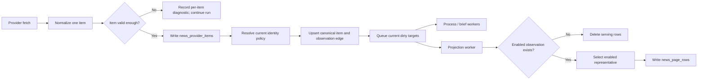

# Spec — News Intel hard cut residual root fix

Status: Completed

Date: 2026-06-03

Owner: Codex

Related:
- `docs/superpowers/specs/active/2026-05-28-news-intel-dedup-root-fix-cn.md`
- `docs/superpowers/specs/active/2026-06-01-news-intel-kiss-simplification-cn.md`
- `src/parallax/domains/news_intel/ARCHITECTURE.md`
- `docs/WORKERS.md`
- `docs/WORKFLOW.md`

## Background

News Intel 已经形成 Kappa/CQRS 风格的链路：provider 原始输入进入 `news_provider_items`，fetch worker 规范化并写入 canonical item / observation edge，process worker 产出 agent brief，projection worker 重建 serving read model。这个方向是对的：事实表和 serving 表分层清晰，projection 可重建，`NOTIFY` 只是 wake hint。

这次审计发现的风险不是“业务逻辑要重做”，而是旧兼容路径、半接通路径和身份语义残留叠在一起，导致 dedup / representative / projection 在边界场景下可能偏离当前产品语义：

- `provider_article_key` 对非 OpenNews provider 直接使用 `source_item_key`，但 `source_item_key` 不一定是 provider-global identity。两个 RSS/Atom 源如果碰巧有同一个 GUID / source item key，可能被全局合并成同一条 canonical news。
- URL identity 的文档、旧 migration、当前代码策略和测试期望不一致。旧路径曾把所有 public URL 都提升为 hard identity，当前 `news_url_identity.py` 已经收窄为 article/social status 等强 URL，测试和旧数据仍可能保留 aggregator/live/generic URL 的 legacy hard identity。
- invalid URL 规范化会抛出异常，单条坏 link 可能让整批 feed fetch 失败。
- disabled source 过滤只保证 enabled observation edge 进入页面投影，但 canonical item 的 headline/content/provider_signal 仍可能来自 disabled representative。
- context observations 在 type、worker、policy 中半接通，但 provider wiring 没有传入实际 context，process worker 也以空 context 评估 admission，形成维护成本和语义噪声。
- `content_hash` 当前包含 canonical URL，却被命名和使用为 strong same-content signal；同时 tracking query 规范化不完整，可能把同一正文拆成不同内容身份。
- API 未暴露的 repository filter 仍保留，增加链路理解成本。

## Problem

需要在不改变 News Intel 当前业务逻辑的基础上，把上述残留一次性根修：

1. 身份规则必须单一、可解释、和文档一致。
2. serving read model 必须只反映当前 enabled source 和当前身份策略。
3. 兼容旧 identity / 旧测试 / 旧数据形态的代码必须删除，不继续维护双路径。
4. 对已污染或无法可靠修复的旧数据，不做历史迁移和兼容 backfill；允许清理并按当前事实重新摄取或重建。

这里的“业务逻辑不变”指不改变产品判断本身：不调整 scoring 阈值、不调整 agent brief 业务语义、不改 UI 产品含义、不改变 worker 单写者模型、不引入新的 provider 产品能力。要改的是身份、清理、异常边界、残留兼容代码。

## First Principles

- Current policy wins. 代码、文档、测试和数据清理都以当前目标身份策略为准，旧 migration 和旧测试期望不再定义行为。
- Hard cut, no dual path. 不保留 legacy mode、compat flag、旧 identity fallback、旧 projection 修补分支。
- KISS over preservation. 能删除就删除，能重建就重建，能用一个明确规则表达就不维护多套语义。
- Facts before views. serving rows、dirty targets、agent brief 等派生数据可以直接清理重建；事实层只保留能被当前身份策略解释的记录。
- Provider identity must be scoped correctly. 只有 provider 明确保证全局唯一的 article id 才能成为 global provider article identity；source-local id 只能是 source-local identity。
- Fail one item, not one run. 单条 provider item 的坏 URL / 坏字段不能拖垮整次 fetch run。

## Goals

- 统一 News Intel canonical identity 策略：
  - hard URL identity 只接受当前 `news_url_identity.py` 认定为强身份的 URL 类型。
  - aggregator/live/generic/homepage/preview URL 不再作为 canonical-url hard identity。
  - source-local item key 不再冒充 provider-global `provider_article_key`。
- 删除 legacy public URL hard identity 的兼容测试、兼容注释和兼容分支。
- 修复 invalid URL 处理，使 feed 中单条坏 URL 被降级、跳过或记录诊断，不让整批 fetch 失败。
- 修复 disabled source representative 问题，使页面投影的 headline/content/source/provider_signal 都来自 enabled observation，或在无 enabled observation 时不出现在 serving read model。
- 简化 context observations 路径：
  - 如果当前 provider wiring 没有真实生产 context，则删除或关闭这条半接通路径。
  - 不保留“类型支持但运行时永远为空”的 admission 语义。
- 明确 `content_hash` 语义：
  - 要么变成真正 content-only hash，并用于 same-content dedup。
  - 要么重命名为 URL-scoped hash，并停止作为 same-content hard/strong signal。
  - 选择必须保持 dedup 产品语义稳定，不新增激进合并。
- 删除 API 不可达、产品不使用的 repository filter，或把它们提升为明确 public contract；本 spec 默认优先删除不可达兼容代码。
- 提供一条 hard-cut 数据清理/重建路径，允许清理旧 canonical identity 污染和派生 read model，不做保留旧行为的 migration/backfill。

## Non-goals

- 不重写 News Intel 的完整摄取架构。
- 不改变 source quality、agent brief、event scoring、UI ranking 的业务算法。
- 不新增 provider。
- 不做历史数据保真迁移。
- 不支持旧 public URL hard identity 行为。
- 不为旧测试夹具保留兼容分支。
- 不把 provider raw frame 当成业务事实。
- 不改变 Kappa/CQRS 的单写者和 projection 可重建原则。

## Target Architecture

### Identity Policy

News canonical identity 只保留三类清晰来源：

1. Strong URL identity

   仅当 URL 被当前策略判定为 article/social status 等强身份时，才生成 canonical-url identity。

2. Provider-global article identity

   仅当 provider 明确提供全局唯一 article id 时，才生成 `provider_article_key`。例如 OpenNews 的 provider article id 可以保留为 provider-global identity。RSS/Atom/JSON feed 的 `source_item_key` 默认不满足这个条件。

3. Content identity

   仅使用明确语义的 content identity。若用于 same-content dedup，则 hash 必须不包含 URL；若包含 URL，则它不是 same-content identity。

Source-local identity 只能用于同一 source 内的重摄取幂等，不参与跨 source 全局合并。

### Projection Policy

Page projection 只从 enabled observation edge 中选择代表内容。若 canonical item 只有 disabled observations：

- 不写入 `news_page_rows`。
- 清理该 item 对应的 stale serving rows。
- 不通过 canonical item 当前 representative 泄漏 disabled source 的 headline/content/source/provider_signal。

### Context Policy

当前 hard cut 优先删除半接通 context observation 路径。只有当后续有明确 provider 能生产 context，且有完整 ingest、link、admission、projection 验收时，才能重新作为新 feature 进入 spec。

### Data Policy

不做 legacy-preserving migration。允许执行 hard-cut cleanup：

- 清空并重建 `news_page_rows`、`news_projection_dirty_targets` 等派生 projection 状态。
- 对受 legacy public URL hard identity 污染的 canonical items / observation edges，允许删除后从 `news_provider_items` 以当前 identity policy 重新摄取。
- 对无法可靠归因的旧 canonical 合并，允许清除相关 canonical data，而不是写复杂拆分迁移。
- 清理由旧 identity 生成且不再可信的 agent brief / enrichment 派生结果。

若 schema 需要调整，只做 forward hard cut，不做“保留旧数据形态”的兼容迁移。

## Conceptual Data Flow

## Core Models

### Canonical Identity

- `canonical_url_key`: only for strong URL identity under current policy.
- `provider_article_key`: only for provider-global ids.
- `source_local_key`: source-scoped id for ingest idempotency, not cross-source dedup.
- `content_identity_key`: explicitly content-only if used for same-content dedup.

Implementation should avoid names that imply stronger semantics than the field actually has.

### Observation Edge

Observation edges remain necessary. They preserve source provenance and are the correct place to decide enabled/disabled source participation. They are not redundant with canonical item rows.

### Projection Row

Projection row content must be selected from enabled observations. `news_items` can remain canonical storage, but serving read models must not blindly trust a representative chosen before source-disable changes.

### Cleanup Target

Cleanup is operational, not compatibility migration. It can be a one-time command/script/checklist tied to this hard cut, with dry-run counts and explicit table scopes.

## Interface Contracts

### Public API

- Existing product-facing News API semantics remain stable.
- No new user-visible filters are introduced by this spec.
- Repository filters that are not reachable from API/CLI/operator UI are removed unless a later approved plan names a concrete product consumer.

### Workers

- Fetch worker must continue processing a run when a single item has an invalid URL.
- Process worker must not pretend empty context is meaningful market context.
- Projection worker remains the single runtime writer for page rows.

### Tests

- Tests must assert current identity policy, not legacy migration behavior.
- Legacy expectations that aggregator/live/generic URLs remain hard canonical identity must be deleted or rewritten.
- Disabled source tests must assert representative headline/content/source, not just enabled edge count.
- Invalid URL tests must cover bad port and out-of-range port.
- Provider identity tests must include two different feed sources with same source-local key and verify they do not merge.

## Acceptance Criteria

- Two RSS/Atom/JSON sources with the same `source_item_key` but unrelated URLs/titles produce separate canonical items unless another current strong identity merges them.
- OpenNews or another explicitly provider-global source can still dedup by provider article id.
- Aggregator/live/generic/homepage/preview URLs do not create canonical-url hard identity.
- Existing tests no longer encode legacy public URL hard identity behavior.
- A malformed URL such as `https://example.com:bad/news` or `https://example.com:99999/news` does not fail the entire fetch run.
- Disabling a source removes its rows from serving projections or replaces representative content with enabled-source content.
- No page row exposes headline/content/provider/source metadata from a disabled-only observation set.
- Context observations are either fully removed from the active runtime path or backed by a complete provider-to-policy contract; default target is removal.
- `content_hash` naming and dedup usage match its actual inputs.
- Repository/API filters have a single public contract; unreachable compatibility filters are gone.
- Hard-cut cleanup can be run locally against a dev database and leaves projection rows rebuildable from current facts.
- No legacy compatibility flag, dual writer, dual identity branch, or historical backfill migration is introduced.

## Risks

- Hard deletion can remove old canonical items that cannot be reconstructed if their provider raw input is absent. This is acceptable under this spec when the old item cannot be trusted under current identity policy.
- Tightening identity can reduce dedup rate for ambiguous RSS items. This is preferable to false merges.
- Making content hash content-only may increase merges if title/body normalization is too aggressive. The implementation plan must choose the lower-risk option and verify with fixtures.
- Removing context path may discard an intended future capability. Future context support should return as a complete new feature, not a dormant partial path.

## Evolution Path

1. Approve this spec.
2. Write a narrow implementation plan that maps each residual issue to exact files, tests, and cleanup steps.
3. Implement hard cut in small commits:
   - identity policy cleanup,
   - URL normalization fail-soft,
   - disabled representative projection,
   - context path removal,
   - API/repository filter simplification,
   - cleanup/rebuild command or checklist.
4. Update `src/parallax/domains/news_intel/ARCHITECTURE.md` and relevant generated docs only after behavior is implemented and verified.
5. Run focused integration tests, then broader News Intel worker/repository tests.

## Alternatives Considered

- Keep compatibility branches for old public URL identity.
  - Rejected. It preserves the exact ambiguity this hard cut is meant to remove.
- Write a data-preserving migration that splits old canonical merges.
  - Rejected. The merge source may be ambiguous, and preserving old shapes adds more complexity than clearing and rebuilding.
- Add feature flags for old/new identity policies.
  - Rejected. Identity policy should be singular in a Kappa/CQRS system.
- Keep context types as dormant future hooks.
  - Rejected. Dormant hooks already created confusion between provider wiring, admission policy, and process worker behavior.

## Boundaries

| Area | In scope | Out of scope |
|------|----------|--------------|
| Canonical identity | Remove ambiguous global ids and legacy URL identity | Redesign all dedup scoring |
| Data cleanup | Clear/rebuild polluted canonical/projection/brief data | Preserve every old row |
| Provider fetch | Per-item fail-soft invalid URL handling | New provider integrations |
| Projection | Enabled-source representative correctness | New UI ranking model |
| Context | Remove half-connected runtime path | Build full context feature |
| API/repository | Remove unreachable filters or define one contract | Add new user-facing filter set |
| Docs/tests | Align with current hard-cut behavior | Keep old migration expectations |
